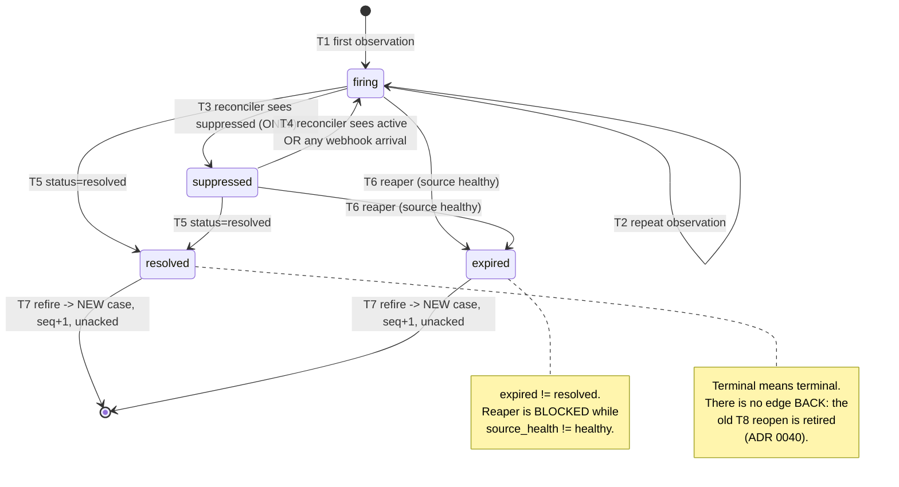
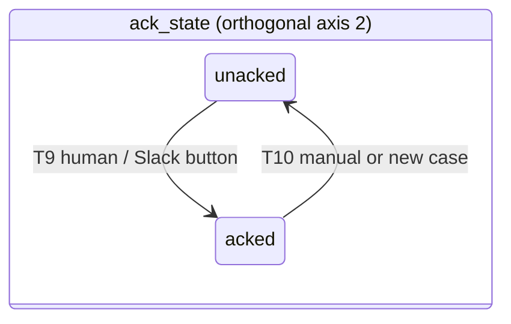
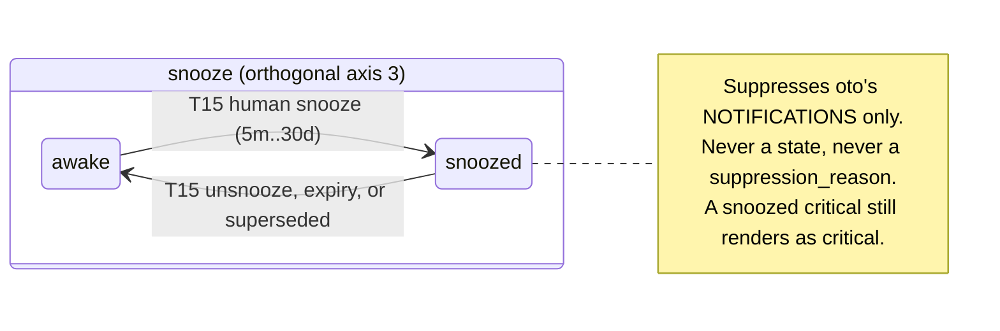

> **Status:** BINDING. This document supersedes `architect-proposal.md` wherever they differ.
> **Precedence:** `SPEC.md` > `domain-research.md` (ground truth for upstream facts) > `red-team-memo.md` > `architect-proposal.md`.
> **Audience:** implementation agents. Implement what is written here, literally. Where this document says MUST, it is not negotiable. Where it is silent, ask — do not invent.
> **Go module path:** `github.com/thulasiram/oto`
> **Go version:** 1.24. **PostgreSQL:** 16+.

---

## 0. Binding preamble

### 0.1 What oto is

> The alert history layer your Prometheus stack does not have — self-hosted, with a UI, without adopting an AIOps platform or a paid SaaS.

For every alert that has ever fired, oto can show: when it first appeared, every episode since, **what the rule said at that moment**, who was told, on which channel, in which thread, who acknowledged it, and how it ended — as one continuous timeline.

### 0.2 Owner constraints (cannot be overruled)

1. Go backend, SolidJS frontend, PostgreSQL as system of record.
2. API-first. The UI consumes only public HTTP APIs. A second UI must be boltable.
3. Domain-first layout, API → Service → Repository layering, three distinct model sets (DTO / domain / row).
4. Slack behind a generic `Channel` interface. Block Kit. Threads and replies required.
5. UI shows alerts, groups by name/namespace/fingerprint, and a Sentry-style lifecycle timeline.
6. Fetching the alert's rule definition is a product requirement.
7. Minimum **Lovable** Product, architecturally sound. Not a rushed MVP.
8. Core platform modules vs peripheral modules are distinguished.

### 0.3 Standing rulings (binding, do not re-litigate)

| # | Ruling |
|---|---|
| R1 | Layout is `internal/<domain>/{api,service,repository,domain}`. Deviation from the literal `src/` is deliberate: `internal/` is compiler-enforced encapsulation. The innermost package is named `domain`, not `model`. |
| R2 | `org_id` is on every tenant table from day one. **No RBAC, no roles, no SSO/OIDC in v1.** Auth is a session cookie (local password) or a bearer PAT. Every authenticated principal has full access to its own org. |
| R3 | **Silences are a READ-ONLY mirror of Alertmanager silences in v1.** oto has NO write path into the cluster. The Slack "Silence" affordance is a **deep-link URL button** into the Alertmanager UI (zero API calls, zero state). Rationale: a silence write path is safety-critical — a bug suppresses a real incident. **R3 is an H-3 (safety) refusal, NOT an FR-1 (scope) refusal: it is *earnable*.** A future write path is "create upstream, then mirror" — never "create locally and reconcile"; the `silences` table is already keyed by `source_silence_id` to keep that door open. Do not confuse R3 with the permanent refusals in §I.1.1. |
| R4 | **No AI/LLM features in v1.** Determinism and auditability are a positioning stance. |
| R5 | Exactly **two** channel providers ship in v1: `slack` (full) and `webhook` (trivial, generic JSON POST). The webhook provider exists to prove the abstraction holds and MUST NOT be given Slack-specific affordances. |
| R6 | Rule definitions MUST be **snapshotted and versioned at fire time**. This is the defensible differentiator. |
| R7 | No second datastore. No Redis, no Kafka, no ClickHouse, no Loki, no TimescaleDB. Postgres only. One `helm install`. |
| R8 | No per-person response-time metrics, leaderboards, or per-individual aggregates — not in the API, not in the DB rollups. Acknowledgement identity IS stored (operationally necessary). Aggregates are team- or alert-scoped only. |
| R9 | **Validation is a seven-layer concern, fully specified in §L.** Trusted user input and untrusted upstream payloads MUST NOT share rules. Every layer validates; no layer is skipped because another one "already did it". Bounds declared in a DTO `validate` tag, a domain constructor and a DDL `CHECK` MUST be identical, and CI asserts it. |
| R10 | **Brand: `oto` (音) = a chime. The UI is a light pastel foundation, calm by default.** Saturated colour is reserved *exclusively* for alert state (§M). The Slack Block Kit state palette (§H.2) is a **separate, unchanged system** and MUST NOT be harmonised with the UI tokens. |
| R11 | **oto is alert-first PERMANENTLY, and the boundary is the Flight Recorder Test.** `docs/design/SCOPE-BOUNDARY.md` and ADR 0013 are BINDING. **FR-1: complete "this row is a fact about ___". A signal → IN. A person, team, rota, responsibility, response effort, ticket or customer-facing statement → OUT.** In one line: **actor, never subject.** Human actions are IN only as timestamped annotations on a signal's timeline carrying an actor as *metadata*. The permanent exclusions are enumerated in §I.1.1; the column ban is §D.4.0; the one-stage clause is §G.9.1; the no-human-state rule is §E.1.1. |
| R12 | **`snooze` ships in v1** (§B.8). Suppressing *oto's own* notifications for an `alert_key` until T is a fact about a signal's notification, stored only in oto, changing nothing in the cluster, auto-expiring, attributed and visible as a state. It passes FR-1, H-1, H-2 and H-3 cleanly and is nearer to `channels.verbosity` than to a silence. **A product whose ethic is "default to quiet" that ships no quiet button is inconsistent with itself.** Snooze is NOT a silence and MUST NOT be presented as one (§B.8.4). |

### 0.4 Conflict rulings (research overrides architect)

| # | Conflict | Ruling |
|---|---|---|
| C1 | Architect enters `suppressed` from webhook ingest. Research: suppressed alerts are dropped by `MuteStage` and **never reach a webhook**; `alerts[].status` is only `firing\|resolved`. | `suppressed` is set **only** by the API v2 reconciler (`status.state == "suppressed"`) or by an oto-observed silence match. Ingest MUST NOT produce `suppressed`. The reconciler is CORE, not optional. |
| C2 | Architect treats absence-from-Alertmanager as resolution. | Absence produces `expired`, never `resolved`. `resolved` requires an explicit per-alert `status="resolved"` observation. |
| C3 | Architect derives group identity from an oto "grouping rule" engine. Research: `groupKey` embeds route config and changes on `alertmanager.yml` reload. | Durable `group_key`, computed by oto and never parsed out of AM's. AM's `groupKey` is stored as `source_group_key` for observability only and MUST NOT be parsed. The configurable grouping-rule engine is CUT. **⚠️ AMENDED — [ADR 0038](/adr/0038-the-group-key-is-derived-from-the-alerts-own-labels/):** the key was `H(org_id, source_id, receiver, sorted groupLabels)` and is now `H(org_id, cluster_key, alertname, namespace-or-∅)` — the alert's own labels. The C3 ruling *survives* the amendment and is what forced it: a key built from `receiver` and `groupLabels` still embedded route config, so `continue: true` gave one alert two threads. Still fixed, still not a rule engine. See §C.4. |
| C4 | Architect returns 202 but never specifies failure codes. Research: 4xx/429 = permanent, silent loss; only 5xx is retried. | Ingest returns **202** on durable accept, **503 + `Retry-After`** for any transient condition (overload, pool exhaustion, Postgres slow). **NEVER 429. NEVER 4xx for anything transient.** 401 (bad token) and 413 (oversize) are the only permitted 4xx and both are genuinely permanent. |
| C5 | Architect never mentions `notification_reason`. | `notification_reason` is persisted on every batch and drives the post-vs-update decision table (§H.6). Empty (AM < 0.32.0) falls back to fingerprint-set diffing. |
| C6 | Architect uses a Block Kit `header` block for the title. Research: `header` is `plain_text` only — no bold, no links. | Title is a **`section`** with a bold mrkdwn link. `header` MUST NOT be used. The `alert` block MUST NOT be used (modals only). |
| C7 | Architect implies colour without specifying the mechanism. Research: colour has no Block Kit equivalent. | Exactly **one** attachment wraps **all** blocks, carrying `color`. **Colour encodes STATE, severity encodes as a leading emoji.** |
| C8 | Architect: new thread per case, root amend on state change, reply per lifecycle fact. Research: `chat.postMessage` ≈ 1/s/channel; `chat.update` is Tier 3 (50/min) and not per-channel limited. | **`chat.update` in place is the primary mechanism. Thread replies are the exception**, governed by §H.6 and per-channel verbosity. **⚠️ AMENDED — git-bug `7570090` (migration `00069`):** the ruling read *"the Slack root message belongs to an **AlertGroup generation**, not to a case"*, and it now says the opposite. `alert_groups` is deleted, a conversation holds exactly ONE Case, so the root belongs to the Case. The `chat.update`-primary half of C8 is untouched and is what still governs §H.6. |
| C9 | Architect recovers from crash-after-send by calling `conversations.history`. Research: never depend on reading Slack back; distributed apps are throttled to 1 req/min / 15 objects. | **DROP.** oto never reads Slack to reconstruct its own state. Ambiguous sends are handled by §G.5. |
| C10 | Architect justifies its own dedup key by 64-bit collision risk (overstated). | Keep the oto-owned key, but the justification is **tenant/cluster scoping and identity policy**, not collisions. oto additionally **recomputes** AM's FNV-1a fingerprint locally and records a mismatch rather than trusting the wire value. |
| C11 | Architect persists `RenderedMessage` at enqueue time. Red team: queued notifications must be re-evaluated at send time. | Render at **claim** time. If `attempts == 0`, render fresh from current state and persist. If `attempts > 0`, re-send the persisted bytes (transport retry). Both properties satisfied. |
| C12 | Architect has one timestamp per event. Red team: upstream clock vs ours. | Every event carries **`occurred_at`** (upstream claim) and **`recorded_at`** (oto clock). Timelines ORDER BY `(recorded_at, id)`. UI DISPLAYS `occurred_at`. Skew is measured and surfaced. |
| C13 | Architect assumes an HTTP endpoint for Slack interactivity. Research: Slack recommends HTTP for production but Socket Mode removes the public-ingress requirement. | Ship **both** transports behind one handler. **Socket Mode is the default** for self-hosted. HTTP mode is a config flag. |
| C14 | Architect proposes unique indexes for idempotency on partitioned tables (`alert_events`, `ingest_batches`). Postgres requires a unique index on a partitioned table to include the partition key — so these do not actually dedupe. | Idempotency moves to two small **unpartitioned** side tables: `alert_event_keys` and `ingest_dedup`. |
| C15 | Architect ignores `send_resolved: false`. | On source registration and on every reconcile, oto reads `GET /api/v2/status`, and raises a persistent `source_health` warning if the receiver has `send_resolved: false`. |
| C16 | Red team proposes a normalised `label_sets` table. | **REJECTED.** Label sets are stored once per `Alert` identity, never per event. The de-duplication win does not exist in this schema. |
| C17 | Red team proposes an on-disk spool ahead of Postgres. | **REJECTED for v1.** Alertmanager retries for `max(group_interval,10s) + peer_wait` (~5 min default). Returning 503 is a designed, sufficient backpressure channel. |
| C18 | Red team proposes cutting the pull path entirely. | **PARTIALLY REJECTED.** The pull path ships, but strictly as a **reconciler** (§F.4), never as a second ingestion mode. There is exactly one write path into `alerts`. |
| C19 | Architect uses sqlc + squirrel. | **sqlc is CUT.** Repositories use hand-written SQL over `pgx/v5` (+ `squirrel` for the alert-list filter builder only). Removes a codegen coordination dependency between independent agents. |
| C20 | Architect: OpenAPI spec-first with `oapi-codegen` for Go. | Go DTOs are **hand-written** exactly as specified in §E. The OpenAPI 3.1 document is hand-maintained and is the published contract; the **TypeScript** client is generated from it. A CI contract test asserts the running server matches the spec. |

---

## A. Ubiquitous language

These names are binding on Go types, table names, JSON fields, API paths and UI copy. Do not introduce synonyms.

| Term | Go type | Table | Definition |
|---|---|---|---|
| **Org** | `identity.Org` | `orgs` | Tenant boundary. Every domain row carries `org_id`. |
| **User** | `identity.User` | `users` | A human principal. Global; bound to an Org by `orgs`-scoped membership implicit in v1 (one org per user). |
| **ApiToken** | `identity.ApiToken` | `api_tokens` | A hashed bearer credential. Two namespaces: `oto_pat_*` (read/write API) and `oto_ingest_*` (scoped to exactly one AlertSource's ingest endpoint; can never read an alert). |
| **Cluster** | `sources.Cluster` | `clusters` | A logical identity/failure domain. Owns `cluster_key`, which participates in alert identity. |
| **AlertSource** | `sources.AlertSource` | `alert_sources` | One configured upstream: an Alertmanager base URL, optionally its paired Prometheus URL. All replicas of an HA Alertmanager MUST be registered against the same Cluster. |
| **SourceHealth** | `sources.SourceHealth` | `source_health` | Liveness, lag, error rate and warnings for one AlertSource. Gates the reaper (§B.4). |
| **IngestBatch** | `ingestion.Batch` | `ingest_batches` | One durably persisted raw webhook body plus its metadata. The replay artefact. |
| **Observation** | `ingestion.Observation` | *(none — transient)* | One normalised `alerts[]` element from one batch, or one `gettableAlert` from the reconciler. The unit fed to the lifecycle machine. |
| **Alert** | `alerts.Alert` | `alerts` | **The identity of a label set** within `(org, cluster)`. Created on first sight, survives resolution forever. oto's answer to Sentry's *Issue*. Keyed by `alert_key`. |
| **AlertCase** | `alerts.Case` | `alert_cases` | **One contiguous firing episode** of an Alert. `(alert_id, seq)`. Carries state, ack, timings and the rule snapshot. This is what you acknowledge and whose **firing duration** is measured — never "MTTR" (a banned acronym: §A.1). |
| **AlertEvent** | `alerts.Event` | `alert_events` | **An immutable record of one thing that happened at one instant.** Never updated, never deleted (aged out by partition). This is the timeline. |
| **RuleSnapshot** | `rules.Snapshot` | `rule_snapshots` | A content-addressed capture of a Prometheus alerting rule (`expr`, `for`, `keep_firing_for`, labels, annotations) at a point in time. |
| **RuleKey** | `rules.Key` | *(column)* | `(source_id, rule_file, rule_group, rule_name)` — the identity across which drift is detected. |
| **Enricher** | `enrichment.Enricher` | *(registry)* | A named, versioned producer of derived context. |
| **Enrichment** | `enrichment.Enrichment` | `enrichments` | One typed, provenanced result from one Enricher about one subject. |
| **Channel** | `channels.Channel` | `channels` | A **configured destination instance** ("Slack workspace T123, channel #sre-alerts"). Not a channel *type*. |
| **Provider** | `channels.Provider` | *(registry)* | The code that mints Channels of one type from stored config. |
| **Renderer** | `channels.Renderer` | *(registry)* | A pure function `NotificationView -> RenderedMessage`. |
| **NotificationPolicy** | `notification.Policy` | `notification_policies` | matchers → channels → reasons. Decides *whether* and *where*. |
| **Notification** | `notification.Notification` | `notifications` | **The channel-agnostic intent to communicate one fact about one subject.** Idempotent. |
| **NotificationDelivery** | `notification.Delivery` | `notification_deliveries` | **One materialisation of a Notification on one Channel.** Owns retry state, provider ids, thread sequence, rendered bytes. |
| **Conversation** | `notification.ConversationKind` + id | *(the pair `(conversation_kind, conversation_id)` on `notifications`)* | What a `channel_threads` row is *about*: a **Case** or a **digest**. A conversation holds exactly **one Case** — a new Case always means a new thread — and a digest's conversation is keyed by the **policy** that asked for it, one per policy per channel. It is what **decides which facts share a message**, and that decision belongs to the `notification` layer, not to a stored grouping row (git-bug `7570090`, migration `00069`). It is **not** a `correlation` (deferred) and **not** an incident (permanently out). |
| **ChannelThread** | `notification.Thread` | `channel_threads` | Persisted binding of a **Conversation** to a provider conversation anchor (Slack `channel_id` + root `ts`). |
| **Silence** | `silences.Silence` | `silences` | A **read-only mirror** of an Alertmanager silence. |
| **UIEvent** | `streaming.UIEvent` | `ui_events` | A monotonic, replayable envelope for the SSE stream. |
| **Reason** | `notification.Reason` | *(column)* | Why a Notification exists. Enum in §H.6. |
| **NotificationReason** | `ingestion.NotificationReason` | *(column)* | Alertmanager's `notification_reason` wire string. Distinct from `Reason`. |

### A.1 Words that are BANNED

**Ambiguity bans.** `event` (unqualified — always `AlertEvent` or `UIEvent`), `issue`, `notification`
used to mean a Slack message (that is a `NotificationDelivery`), `group` used to mean a UI grouping
(that is a *view*), `alert` used to mean a case or a Slack message.

⛔ **`AlertGroup` IS A RETIRED NOUN AND MUST NOT COME BACK** (git-bug `7570090`, migration `00069`).
It named one *generation of a notification grouping*, keyed by `(org, cluster, alertname,
namespace-or-∅)` from the alert's own labels (ADR 0038), and its glossary row said what it was
*for* in the same breath as it named the object: it decided which facts share a message and *"owns
exactly one Slack thread"*. Deciding which facts share a message is the definition of a
**NotificationPolicy**, and the row held no fact an operator supplied and none upstream sent — it
held a decision oto made, identically for every org forever. `alert_groups` is deleted,
`alert_cases.group_id` and `notifications.group_id` with it, `grouping.Group` and `grouping.Member`
with them, and **the conversation is the Case**. Three consequences worth stating because each is a
place the noun tries to return: the axes are no longer any entity's identity (§C.4); `alert_group` is
gone from the `subject_kind` and `conversation_kind` vocabularies; and the plurality Reasons
`new_alerts` and `some_resolved` left with it, because arithmetic over a set of one has no answer to
give. `AlertGroupMember` goes with it — the `alert_group_members` table was already dropped in
migration 00051.

**Scope bans** (SCOPE-BOUNDARY §3 — vocabulary is enforcement). These words MUST NOT appear in a Go
identifier, a table or column name, a JSON field, an API path, or UI copy:

`incident` · `escalation` · `escalation policy` · `on-call` / `oncall` · `rota` · `schedule` ·
`assignee` / `assign` / `assigned_to` · `owner` / `owner_id` · `responder` · `triage` · `postmortem` ·
`war room` · `SLA` · `MTTA` · `MTTR` · `severity override` · `close` (of an alert) · `merge` ·
`dismiss` · `watcher` / `subscriber`

A pull request introducing one of these is **presumed over the line until argued otherwise against
FR-1 by name** (SCOPE-BOUNDARY §1). AC-49 enforces this with a lint rule, because a vocabulary ban
that is not mechanically enforced decays in a quarter.

*Permitted uses:* `docs/`, this list, SCOPE-BOUNDARY cross-references, and `river.JobSnooze`
(a third-party API name, unrelated to §B.8 snooze).

---

## B. Alert lifecycle state machine

The authoritative machine runs on **AlertCase**. `Alert.state` is a projection.

### B.1 Two orthogonal axes

- `case.state` — *what the world is doing.* Owned by ingestion and the reconciler. The **column** holds `open | closed` and nothing else; the four-way word `firing | suppressed | resolved | expired` is the **Alert's**, and a Case's reading of it is derived (§B.2, ADR 0040). Where this document says a surface "follows `case.state`", it means that derived reading — the axis, not the column.
- `case.ack_state` — *what humans have done.* Owned by the API. `unacked | acked`. An acked alert is still firing.
- **snooze** (§B.8) — *whether oto is notifying.* Owned by the API and stored in `alert_snoozes`, which every suppression decision reads DIRECTLY. There is no projection: `alerts.snoozed_until` was dropped by 00048, because a projection is a second copy that can disagree with the row it copies. **A snoozed alert is still firing and is still rendered as firing.** Snooze is never a `state` and never a `suppression_reason`.
- `alert.flap_score` — a derived signal, **never** a state. **RETIRED IN PLACE** (§B.6.2): still readable, never written again.

**All three axes are independent.** An alert can be `firing` + `acked` + snoozed simultaneously, and
each fact is displayed. Collapsing any two of them into one enum is the most common modelling error
in this domain.

### B.2 States

⭐⭐ **These four values describe the ALERT.** They live on `alerts.state` and on every alert-shaped
object in the API. **`alert_cases.state` is `open | closed` and nothing else** (`case_state_ck`,
migration 00054, ADR 0040). An AlertCase is one ephemeral firing episode of an Alert, and the only
question an episode can answer about itself is whether it is still running; `suppressed` is a fact
about a label set rather than about one firing of it, and `resolved`/`expired` is a claim about WHY
an episode ended, which `resolve_reason` has recorded since 00007.

Nothing is lost, because the four-way reading of a Case is **derived**, and the derivation is total:

```
state='open'   AND suppression_reason IS NULL      ->  firing
state='open'   AND suppression_reason IS NOT NULL  ->  suppressed
state='closed' AND resolve_reason = 'upstream'     ->  resolved
state='closed' AND resolve_reason = 'timeout'      ->  expired
```

`case_resolve_ck` makes `resolve_reason` present exactly when closed and `case_resreason_ck` bounds
it to those two values, so the closed half is exhaustive; `case_suppress_ck` keeps
`suppression_reason` off a closed row, so the open half is. `Case.AlertState()` is that table in Go
and `Case.check()` is what makes it total.

⛔ **In SQL, the OPEN half asks the ALERT rather than the Case, and the asymmetry is deliberate.**
After 00054 nothing CHECKS `suppression_reason` against a state — the biconditional had a
`state = 'suppressed'` side and that side no longer exists — so a query reading the column as *"this
is suppressed"* would be trusting an invariant the schema stopped enforcing. `alerts.state` is a
first-class CHECKed enum, so every aggregate that needs `firing` apart from `suppressed` joins the
Alert and reads it there, guarded by `o.state = 'open'`: `case_one_open_idx` is
`UNIQUE (alert_id) WHERE ended_at IS NULL`, so an **open** case *is* its Alert's current one and
`alerts.state` *is* that episode's state — while over a CLOSED row the same read would report a
re-fired alert's ended episodes as firing. It costs nothing: the reader that needs the four-way word
has joined `alerts` already, for `max(a.severity)`, so the derivation reads one more column off a row
the plan has fetched anyway. ⚠️ **The cost argument USED TO CITE the group rollup that renders "12
alerts, 3 firing, 9 resolved", on the same `case_group_idx`.** That rollup and that index are deleted
with `alert_groups` (git-bug `7570090`, migration `00069`); the conclusion is unchanged and the
witness for it is now the Case list, but nobody has re-measured the plan on the surviving readers.

| State | Terminal | Meaning | Set by |
|---|---|---|---|
| `firing` | no | Alertmanager reports this label set active and not suppressed. | Ingest (webhook), Reconciler |
| `suppressed` | no | Active but suppressed **upstream**. `suppression_reason ∈ {silence, inhibition, mute_time_interval, active_time_interval}` — Alertmanager's four reasons and no others. **Never observable via webhook (C1); `snoozed` is NOT one of these (§B.8.2).** | **Entered:** reconciler only. **Left:** reconciler *or* ingest (§B.3.1) |
| `resolved` | yes | An explicit per-alert `status="resolved"` observation was received. | Ingest only |
| `expired` | yes | oto stopped hearing about it: `now > source_ends_at + resolve_grace` **and** the AlertSource is healthy. Means *"Prometheus or Alertmanager went away"*, not *"the problem went away"*. | Reaper job |

`alert.state` = the four-way reading of the current open case; if none is open, the reading of the most recent case.
⛔ **`alert_group.state` WAS DEFINED HERE AND THERE IS NO SUCH STATE** (git-bug `7570090`,
migration `00069`): `alert_groups` is deleted, so nothing aggregates the four-way reading over a set
of cases, and `group_close_delay_s` — the delay this line named — is deleted with it (git-bug
`7287b28`, migration `00071`). A conversation now holds exactly one Case, so the Case's own reading is
the only reading there is.

### B.3 Transition table

**`From` and `To` are the §B.2 four-way words — the ALERT's reading of the episode either side of the
edge.** What the edge WRITES to `alert_cases.state` is `open` or `closed` (§B.2), and the two are the
same fact: `State.CaseState()` is the write half of the derivation, `Case.AlertState()` the read half.
Naming the edges in the four-way vocabulary is what keeps `suppressed` and `expired` nameable at all —
they are edges, not columns.

| # | From | To | Trigger | Actor | Side effects (all in ONE transaction) |
|---|---|---|---|---|---|
| T1 | *(none)* | `firing` | First observation of an `alert_key`, or a `firing` observation with no open case | Ingest, Reconciler | Upsert `Alert` (emit `alert.created` if inserted); open case `seq = prev+1`; emit `case.opened`; enqueue `enrich.run`; enqueue `notify.evaluate(reason=fired)` |
| T2 | `firing` | `firing` | Repeat observation | Ingest, Reconciler | Update `last_observed_at`, `annotations`, `value`, `source_ends_at`. **Emit NO event** unless a *material* field changed (`severity`, any annotation, `generator_url`, `rule_fingerprint`) → then emit `alert.mutated` |
| T3 | `firing` | `suppressed` | Reconciler observes `status.state == "suppressed"` | Reconciler | Set `suppression_reason` from `silencedBy`/`inhibitedBy`/`mutedBy`; emit `case.suppressed`; enqueue `notify.evaluate(reason=suppressed)` |
| T4 | `suppressed` | `firing` | **(a)** Reconciler observes `status.state == "active"`, **OR** **(b)** ANY ingest observation with `status == "firing"` arrives for this case | **Reconciler AND Ingest** | Clear `suppression_reason` and `suppressed_by`; emit `case.unsuppressed` with `detected_by ∈ {reconciler, webhook}`; enqueue `notify.evaluate(reason=unsuppressed)` |
| T5 | `firing`\|`suppressed` | `resolved` | Per-alert `status == "resolved"` | Ingest | Set `ended_at = max(occurred_at, started_at)` **(clamped — see B.3.2)**, `resolve_reason='upstream'`; emit `case.resolved`; enqueue `notify.evaluate(reason=all_resolved\|some_resolved)` |
| T6 | `firing`\|`suppressed` | `expired` | `now > source_ends_at + resolve_grace` AND `source_health.status = 'healthy'` | Reaper | Set `ended_at = now`, `resolve_reason='timeout'`; emit `case.expired`; enqueue `notify.evaluate(reason=expired)` |
| T7 | `resolved`\|`expired` | *(new case `firing`)* | Same `alert_key` fires again — **always, whatever the clock says** | Ingest | The closed case is left exactly as it is; new case `seq+1`, **`unacked`** → **a new Case is a new conversation, so a new Slack root message, always** (git-bug `7570090`); emit `case.opened`; `alerts.total_cases += 1` |
| T9 | any | `ack_state = acked` | Human via `POST /cases/{id}/ack`, or Slack `oto.ack` button (the `/alert-groups/{id}/ack` fan-out is deleted with the entity — git-bug `7570090`) | Human | Set `acked_by`, `acked_at`, `ack_note`; emit `case.acknowledged`; enqueue `notify.evaluate(reason=acked)` |
| T10 | `acked` | `unacked` | Human unack via `POST /cases/{id}/unack` (the `/alert-groups/{id}/unack` fan-out is deleted with the entity), **or** a new case opens (T7) | Human, Ingest | Emit `case.unacknowledged` with `reason ∈ {manual, new_case}`; enqueue `notify.evaluate(reason=unacked)` |
| T11 | any | *(no state change)* | An Enricher completes | Enrichment worker | Emit `enrichment.completed` \| `enrichment.failed`; enqueue `notify.evaluate(reason=enriched)` (debounced 10s) |
| T12 | any | *(no state change)* | `rule_fingerprint` for this case differs from the previous case's for the same `RuleKey` | Rules service | Emit `rule.definition_changed` with a structured diff; enqueue `notify.evaluate(reason=rule_changed)` |
| T13 | any | *(no state change)* | Notification / delivery progresses | Notify, Deliver workers | Emit `notification.created`, `delivery.sent`, `delivery.failed`, `delivery.skipped`, `delivery.dead` |
| T14 | any | *(no state change)* | Human comment | Human | Emit `comment.added`; enqueue `notify.evaluate(reason=comment)` |
| T15 | any | *(no state change)* | Human snooze / unsnooze, or snooze expiry (§B.8.3) | Human, Reaper | Write/close `alert_snoozes` (no projection to update since 00048); emit `alert.snoozed` \| `alert.unsnoozed`; enqueue `notify.evaluate(reason=snoozed\|unsnoozed)` |

⛔ **There is no T8, the numbering hole is deliberate, and a future reader must not fill it.** T8 was
a second row out of each terminal state, taken when the re-fire landed inside `refire_grace`: it
cleared `ended_at` on the closed episode, let it run again, and **kept the acknowledgement that had
been taken on it**. ADR 0040 deleted it. Every re-fire is T7. The argument is the one 00049 made when
it dropped `alerts.ack_state` — **an acknowledgement is a receipt for one firing, and the second
firing is not the one that was signed for.** A gap in the firing is exactly the event a receipt should
not cross; T8 made *"how long was the gap?"* decide whether a human's attention was still assumed,
which put a clock in charge of a claim about a person. It also made a Case non-terminal, which is a
larger cost than it looks: `ended_at` could return to NULL, so `case_one_open_idx` could be re-entered
by a row that had left it, the reaper and ingest could race over an episode closed a moment ago, and
every query treating `closed` as final was quietly wrong for one window's width. **A Case is strictly
terminal: `open → closed`, once.** `T9`/`T10` keep their numbers because the labels are referenced
across the tree; renumbering them to close the gap would rewrite every reference to buy nothing.

⛔ **`refire_grace` DECIDED NO TRANSITION AND IS NOW DELETED OUTRIGHT, WHICH REVERSES THE RULING
THIS PARAGRAPH USED TO CARRY** (git-bug `7287b28`, migration `00071`). It read: *"ADR 0040 §6 decides
its fate: the key STAYS — under its own name, in `orgs.settings`, with its bounds unchanged.
Renaming, re-homing and removal are all REFUSED … it is inert at the lifecycle layer and still
constrains two numbers outside it."* Both of those two numbers have since gone:

- `group_close_delay_s`, which was *pinned at or above it*, timed the close of an `alert_groups`
  generation. `00069` deleted the entity, so the delay had nothing left to close and left with it.
  ⚠️ The "pin" was never enforced anyway: it was two independent `1200 * time.Second` literals in
  `platform/tuning`, and the only check compared the two DEFAULTS — so two operator-written settings
  could contradict each other freely. Deleting **both** is what makes that moot; deleting one would
  have left the trap armed with its tripwire removed.
- `MinRefireGraceSeconds = 2 × DedupTTL`, the FLOOR derived from the §C.5 replay window. The
  derivation was a comment and a test name, never a runtime read, and the bound it justified is
  restated at the replay window itself rather than through a constant that no longer exists.

⭐ **AND THE DROP CHANGES NO OBSERVABLE SLACK BEHAVIOUR, WHICH IS THE STRONGEST ARGUMENT THAT NO
REPLACEMENT IS OWED.** `platform/tuning/defaults.go` had written it down before anybody noticed:
*"every re-fire opened a new episode, a new generation and a new Slack root card, **with a setting on
the screen that looked like it should have stopped it**."* A card per re-fire is the shipped
behaviour. The thing a rollover rule would have had to preserve was never working. **The standing
rule that deleting a settings key is a contract change of its own is unchanged**; oto is unreleased,
`git tag` lists nothing, and the owner's ruling is *delete, do not retire* — a knob that clamps,
validates and reports an origin while changing no outcome is a vocabulary entry the next person has
to rule out. No ghosts at launch.

⚠️ The question this setting used to answer — *how much of a gap should be tolerated before a re-fire
counts as a separate episode* — is unchanged and still belongs at **case formation** rather than at
the lifecycle boundary. If it is ever asked again it is a NEW key with new semantics, not this one
wearing a new label.

⚠️ **The three flap keys — `flap_threshold`, `flap_window_s`, `flap_digest_interval_s` — take the
same ruling, and ADR 0042 Amendment 3 records it: they STAY, permanently inert, under their own
names, in `orgs.settings`, with their bounds unchanged.** The flap detector they sized is retired in
place (§B.6.2, ADR 0041 Amendment 1): nothing recomputes `flap_score` or `is_flapping`, and the
writer refuses `flapping` as a suppression reason, so no value in these three changes what oto
delivers. Flap noise is absorbed one layer earlier, at case formation, by the case-retention window
W.

⛔ **THE COMPARISON THIS PARAGRAPH DREW AGAINST `refire_grace` NO LONGER HOLDS, AND THE DIRECTION IT
NOW POINTS IS THE OPPOSITE ONE.** It read: *"`refire_grace` is inert at its own layer but still PINS
two numbers, and these three pin nothing at all — the argument for keeping them is therefore
weaker."* `refire_grace` pinned two numbers and has since been **deleted** (above), so "pins
nothing" is no longer the weaker case; it is the same case. What still separates the three flap keys
from it is only that the operator-facing cost has been paid down rather than that the key survives. What tipped it is that the
operator-facing cost has already been paid down: the settings screen states the retirement at every
value, at level `inert`, and offers **no** `suggest` on any of the three, so the row now tells an
operator the truth instead of coaching them through a dead damper (git-bug `235f347`). A key that
announces its own inertness is a much smaller tax than one that pretends to work.

⭐ **The counter-argument is real and is written down so it can be acted on rather than
rediscovered.** oto has no installs, so a settings-contract change is cheaper today than it will
ever be again, and a key that pins nothing and does nothing is the clearest possible candidate for
deletion. If that trade is taken, the four surfaces move together — `AllSettingKeys`, the settings
DTOs, `orgs.settings` (with a migration), and `tuningCopy.ts` — and the declarative layer's boot
refusal must be handled explicitly for a deployment whose values file still names them, so an
upgrade is not a crash loop. git-bug `27a1860` is where that decision was taken.

#### B.3.1 ⭐ T4 is triggered by ingest as well as the reconciler — and why

A webhook observation is **positive proof of non-suppression.** Alertmanager's `MuteStage` runs
*before* `RetryStage` and **drops** suppressed alerts from the slice that continues down the
pipeline (research A6). Therefore an alert that reaches oto's webhook **cannot** be suppressed at
that instant — if it were, it would never have been sent.

Specifying T4 as reconciler-only left a case stuck in `suppressed` for up to a full
reconcile interval after a silence expired, even though a webhook had already proved it was firing
again. Worse, in the common case where the group's `group_interval` is shorter than the reconcile
interval, oto would render a live firing alert as "silenced by @ram" — a visible lie of exactly the
kind §B.4 exists to prevent.

**T3 remains reconciler-only.** The asymmetry is real and correct: ingest can *never* observe
suppression (suppressed alerts do not arrive), but it *can* observe its end (arrival is the proof).

#### B.3.2 ⭐ `ended_at` is clamped to `started_at`

Upstream clocks skew, sometimes backwards. A `resolved` observation whose `occurred_at` precedes
the case's `started_at` would violate `case_order_ck` and abort the ingest transaction —
turning a customer's NTP problem into oto dropping a batch.

**Binding:** `ended_at = max(occurred_at, started_at)`. The unmodified upstream value is preserved
on the `case.resolved` event's `occurred_at` and in `payload.source_ends_at`, the clamp is
recorded as `payload.clamped = true`, and the skew is accumulated into
`source_health.clock_skew_ms` and exported as `oto_clock_skew_seconds`. **The skew is measured and
surfaced, never rejected** (C12). The same clamp applies to T6 (`expired`).

### B.4 Reaper guard (highest-value correctness rule in the system)

> **Losing sight of an alert is NOT the same as the alert resolving.**

`case.reap` MUST, for each candidate case, load `source_health` for the owning AlertSource. If `status != 'healthy'`, the case is **held in its current state** and a single `source.unreachable` banner is raised for the source. It MUST NOT be expired. A `source_degraded_holds` counter is exported.

### B.5 Re-fire policy (stated plainly)

> A re-fire after resolve is a **NEW `AlertCase` on the SAME `Alert`** — always, at `seq + 1`, and
> **`unacked`**. There is no window in which it is anything else (ADR 0040). The closed episode is not
> touched: a Case opens once, closes once, and nothing reopens it.
>
> ⛔ **A NEW SLACK ROOT MESSAGE IS POSTED FOR EVERY NEW CASE, AND THE CLAUSE THIS REPLACES SAID THE
> OPPOSITE.** It read: *"a NEW Slack root message is posted only when a new AlertGroup generation
> opens; a new case joining a still-open group generation produces a `chat.update` (+ optional thread
> reply), never a new"* root. There is no generation and no group to join (§C.4, migration `00069`):
> **a conversation holds exactly one Case**, so a new Case is always a new conversation and therefore
> always a new root. ⚠️ This is the operator-visible consequence of the deletion and it is not a
> tuning question — 500 alerts open 500 threads, and the only collapse mechanism left is the opt-in
> digest. The truncated clause below is retained so the shape of what changed is legible:
>
> ~~… so whether a re-fire is loud is decided by `group_close_delay`, which is a fact about the
> notification grouping, and never by a fact about the episode.~~ `group_close_delay_s` is itself
> deleted (git-bug `7287b28`, migration `00071`), so nothing decides it: a re-fire is loud, always.

### B.6 Damping — and why oto no longer does it

> **THE RULE THIS SECTION NOW STATES: oto never decides not to speak.** A suppressed
> notification and a signal that never fired look identical to the person who was not
> told, so oto may only be quiet for a reason that is *outside its own judgement* — there
> is nowhere to send, a human asked for less, a provider is rate-limiting, or nothing
> changed. Every one of those is a row with a reason and a place in the UI. **Silence
> destroys trust, and oto's own opinion is not an excuse for it.**

- The ALERT-scoped damper was flap detection — `flap_score`, `is_flapping` and the `flap.score` job. It is **RETIRED**: §B.6.2.
- The GROUP-scoped damper was storm collapse. It is **REMOVED**: §B.6.1.
- What is left is not damping at all: nowhere to send, a human asking for less, a provider's rate limit, or nothing changed (§B.8.2).

#### B.6.1 Storm collapse is REMOVED, and its home is the incident

**What it was.** If more than `storm_threshold` (default 25) distinct alerts joined one
AlertGroup generation within `storm_window` (default 60s), the generation entered
`storm_mode`: it posted and updated exactly ONE root message with a count and a link, it
suppressed every per-alert thread reply, and it told the channel once — behind a latch on
`channels.storm_notice_at` — that oto had started withholding. Storm mode ended after
`storm_cooldown` (default 10m) without a new member.

**Why every part of that is gone rather than merely switched off.** The collapse
announced *itself* and called that visibility, but the thirty-nine replies it withheld
left no trace an operator could read — which is exactly the failure the rule above
forbids. The deeper fault is that **the defence had no object.** A storm is many
*different* alerts arriving together; the thing that owns many different alerts is an
**Incident**, and correlation is DEFERRED-POST-V1. With no such object, storm detection
had nowhere to put its verdict, so it put it in the notification layer — and a detector
with nowhere to report becomes a damper. Flooding a channel with two hundred real
firings is a *truthful* report that something is badly wrong.

**Storm's notification home is the Incident, once Incidents exist**, and it does not
exist until they do. Reintroducing it beside them is cheaper than carrying a half-feature
that pretends the object is already there. Nothing withholds, downgrades or broadcasts
because a group is busy: a burst of arrivals produces one notification per triggering
change.

**What is DELETED.** Migration `00059_no_column_remembers_a_storm.sql` drops
`alert_groups.storm_mode`, `alert_groups.storm_since`, `groups_storm_ck` and
`channels.storm_notice_at`, and narrows `notifications_suppmap_ck` from EIGHT admitted values
to SIX: `channel_disabled`, `no_policy`, `snoozed`, `throttled`, `verbosity`,
`duplicate_render`. `storm` and `flapping` leave it together. What the six have in common is
the argument: two mean there was nowhere to send, two are a human asking for less, one is the
world's rate limit and one is that nothing changed. **Not one of them is oto's own judgement
that a real signal was not worth mentioning, and the two removed were the only two that
were.** The three settings keys `storm_threshold`, `storm_window_s` and `storm_cooldown_s` are
deleted from `orgs.settings`, from the declarative config layer, from the Helm values file and
from the settings API. The `storm_mode` and `storm_since` response fields and the `?storm=`
group filter go with them.

**⛔ `notifications.reason` LOSES `storm` AS WELL, and the asymmetry that spared it is gone.**
Migration `00060_no_enum_remembers_a_damper.sql` narrows `notifications_reason_ck` from the
NINETEEN values 00058 left to **EIGHTEEN** by dropping `storm`, and follows the enum down with
`policies_reasons_ck`, whose cardinality ceiling moves from 19 to 18 because that number has never
been a judgement about request size — it is `len(AllReasons())`. `00059` had kept the value on a
RETIREMENT argument: a stored row still has to say what it was about, and a card still has to
render it. **A retirement only buys something when a row spelling the value can still exist.** The
owner authorised `just reset` on the only database in the world, so no such row survives and no
binary that could have written one survives either. What the retirement protected is a reader that
cannot be constructed, and its cost was a vocabulary entry in `notification/domain`, in
`components.schemas.NotificationReason`, in four verbosity sets, in the Slack reply headings and in
the trail glyphs. `notification/domain.retiredReasons` is deleted with the value, and so are
`reasonStorm`, `replyLead`'s storm heading and `reasonPhrase`'s *storm damping* words;
`render/slack/reply.go:33` is the tombstone that names what was there. `suppressed_reason` narrows
in `00059` because it is the same argument applied to a column whose values are all oto's reading of
*why nothing was sent*. `alert_groups.storm_mode` goes for a third reason again: it is not evidence about a past
delivery, it is LIVE STATE, and a live-state column no writer can ever set again is not
history — it is a lie with a `NOT NULL DEFAULT false`.

**Both migrations are destructive in one release rather than expand/contract**, which every
other narrowing in this schema obeys (§P). `00060` spends `00059`'s exemption a second time on the
same facts rather than claiming a new one. The authorisation is a fact, not a preference: no
oto database and no Helm release exists outside one laptop, so there is no row spelling
`storm`, no running reader of the columns and no operator whose values file would CrashLoop
on an unknown key at BOOT. Expand/contract protects a deployed population; there is none.
When there is one — the moment a tagged release exists — the rule returns unchanged and neither
migration is a precedent for the next narrowing.

**The two `alert_events.type` values are DELETED, not retired.** `group.storm_started` and
`group.storm_ended` leave the closed enum (§D.4.1), leave `AllEventTypes()` — which is thirty-two
values, not thirty-six — and leave `components.schemas.AlertEventType`. Migration `00060` narrows
`ev_type_ck` with a `NOT IN` clause naming exactly the four damper spellings, and performs no
`UPDATE`: a database that has ever recorded one refuses the migration with a `23514` naming the
constraint, and the authorised reset is the answer to it.

⭐ **The line between RETIRED and DELETED is the CHECK, and nothing else.** A value is **retired**
when the constraint that governs its column **still admits it** — it stays in the closed set, stays
parseable, stays on the contract, and every writer refuses it, because a row on disk may still spell
it and `NewEventType` rejecting history is a timeline that errors instead of rendering. A value is
**deleted** when the constraint **was narrowed** to refuse it, at which point there is no row left to
decode and a vocabulary entry with no reader is one more thing the next person has to rule out.
`retiredEventTypes` therefore holds exactly **three**: `group.member_joined` and `group.member_left`
(migration 00051) and `case.reopened` (migration 00054), whose CHECKs were never narrowed. The four
damper types are not among them. See **ADR 0042**.

#### B.6.2 Flap detection is RETIRED IN PLACE, because the score went BLIND

**What it was.** `flap_score` was an EWMA of lifecycle transitions per hour, recomputed by
the per-tenant `flap.score` job every 300s from the count of `case.opened`, `case.resolved`,
`case.expired`, `case.suppressed` and `case.unsuppressed` inside `flap_window` (default
7200s). Above `flap_threshold` (default 5 — ADR 0026) the Alert was MARKED flapping,
`alerts.is_flapping` went true, and the crossing was minted on the timeline as
`alert.flapping_started` / `alert.flapping_ended`. The delivery-side half of it — update-only
mode and one coalesced digest reply per `flap_digest_interval` — is gone with ADR 0041's
amendment and ADR 0042: nothing switches to update-only and no notification is withheld
because an alert is noisy.

**Why it is retired rather than tuned: it did not go dead, it went BLIND, and the blindness
is anti-correlated with the phenomenon.** The **case retention window W** (§B.3, migration
`00057`) damps a flap at CASE FORMATION: a re-fire inside W lands in the still-open Case, so
the resolve is HELD and no new episode opens — and the damped episode therefore appends
NEITHER of the two events the score counted. Six flaps in ten minutes used to append twelve
counted events; damped into one Case they append about **two**, against a threshold of five.
So `is_flapping` read **false exactly when the alert was flapping hardest**, and
`alert.flapping_ended` would have been minted *because* the flapping got worse. A detector
that lies is worse than no detector. **W is how oto handles flap noise now**, and it removes
the noise at its cause rather than reporting on it.

**The fix that was REFUSED.** Feeding the deferred resolve back into the score needs a new
`alert_events.type` for an edge that records a resolve without performing it — an
API-contract change and a codegen run, minted to keep a second-order detector alive behind
the damper that already works. One damper is the point.

**What is DELETED**: the `flap.score` job kind, its periodic tick, its handler, the
`ScoreFlaps` service method, the `EventCounter` port and `AlertRepository.SetFlap` — which was
the only statement in the tree that wrote either column. The two timeline types
`alert.flapping_started` and `alert.flapping_ended` are **DELETED, not retired**: migration
`00060` narrows `ev_type_ck` to refuse their spellings alongside the two storm types, so they
leave the closed enum (§D.4.1), leave `AllEventTypes()` and leave
`components.schemas.AlertEventType`. Retirement is what a value gets while its CHECK still admits
it (§B.6.1); once the CHECK was narrowed there is no row left for a decoder to meet.

**What is KEPT, and this is the difference from storm.** `alerts.flap_score` and
`alerts.is_flapping` are **RETIRED IN PLACE — readable, unwritable.** They stay in the schema
with their last value: the server-side list filter `?flapping=` (`alerts/api.query`), the alert
rollup, the `alert.history` enrichment, the notification snapshot and the Slack card all still read
them, and a value
already on a row is HISTORY rather than a live judgement.

⚠️ **The WEB filter is gone even though the server one is not, and the split is deliberate.**
`web/src/features/alerts/filters.ts` no longer offers a `flapping` facet: a facet over a blind
column returns a confidently empty list, which is a lie told to somebody looking for work to do.
`GET /api/v1/alerts?flapping=` still parses and still answers, because a client asking about a
column oto still stores must get the column's value rather than a `400 unknown_parameter` — that is
the treatment `?ack=` got, and `?ack=` was removed because its column was removed. Storm's `alert_groups.storm_mode`
was dropped instead because it was live state no writer could set again — "a lie with a
`NOT NULL DEFAULT false`" — whereas these two are a *measurement taken at a time*, and the
row that carries one stays interpretable. A future migration restates their
`COMMENT ON COLUMN` (the text is in **ADR 0041**, Amendment 1) so the schema stops
advertising a live standard; nothing else about them changes. The three settings keys
`flap_threshold`, `flap_window_s` and `flap_digest_interval_s` now configure NOTHING. Deleting
them from `orgs.settings`, the declarative layer and the settings API is the identity-side half
and has **not** landed — storm's three keys went on the "there is no operator to CrashLoop"
argument (§B.6.1) and the same argument is available here. See **ADR 0041**, Amendment 1.

### B.7 Mermaid diagram







---

### B.8 Snooze — oto's quiet button (R12)

> **Snooze suppresses *oto's own notifications* for one `alert_key` until a fixed time T.**
> It changes nothing in the cluster, nothing upstream, and nothing about the signal's state.

**Snooze is the only lever that makes oto quieter at all**, and it is a human's, not oto's.
Storm collapse is removed (§B.6.1, ADR 0042) and flap detection is retired (§B.6.2); the case
retention window W is not damping but *not making the noise* — it decides how many episodes a
flapping signal has, never how many of them are mentioned. Without snooze the only quiet
button a user has is muting the Slack channel — which also hides the real incident, the
failure mode the red team calls fatal.

#### B.8.1 What snooze is, and is NOT

| Snooze **IS** | Snooze **IS NOT** |
|---|---|
| A fact about **oto's notification behaviour** for one signal | A fact about a person |
| Stored only in oto's database | A write into Alertmanager |
| Auto-expiring, always, with a hard maximum | An indefinite mute |
| Attributed and visible in the UI and in Slack | A silent suppression |
| Nearer to `channels.verbosity` than to a silence | An Alertmanager silence, an inhibition, or a mute time interval |
| Scoped to an `alert_key` | Scoped to a case (too narrow — a re-fire restores the noise) or to a group (too broad — it mutes alerts nobody has seen) |

**Snooze is NOT a `state`.** It is a third orthogonal axis alongside `case.state` and
`case.ack_state`. A snoozed critical alert is **still critical and still firing**, and every
surface MUST continue to render it that way (§B.8.6). Colouring a snoozed alert calm would be the
same lie §E.1.1 exists to prevent.

#### B.8.2 Composition with the reconciler-owned `suppressed` state — exactly how, and which wins

These are two different facts about two different systems. **Neither overrides the other; both are
recorded and both are displayed.**

| | the `suppressed` reading of a case (§B.2) | snooze |
|---|---|---|
| Owner | **Reconciler only** (C1) | A human, via oto's API or the Slack button |
| Means | *Alertmanager is not delivering this* | *oto is not notifying about this* |
| Source of truth | `GET /api/v2/alerts` → `status.state` | `alert_snoozes` |
| Reason vocabulary | `alert_cases.suppression_reason ∈ {silence, inhibition, mute_time_interval, active_time_interval}` | — |
| Ends when | Alertmanager says `active` again | `snoozed_until` passes, or a human unsnoozes |
| Affects observation? | Yes — suppressed alerts stop arriving at the webhook entirely | **No.** Ingestion, the state machine, events and the timeline are untouched |

> #### ⛔ BINDING: `snoozed` is NOT a `suppression_reason`
>
> `alert_cases.suppression_reason` mirrors **Alertmanager's four suppression reasons** and
> nothing else. **`snoozed` MUST NEVER be added to that enum**, and no state column — neither
> `alerts.state` nor `alert_cases.state` — may ever take the value `snoozed`. Conflating them would mean oto reports *"Alertmanager is suppressing
> this"* when the truth is *"a human asked oto to be quiet"* — a lie about the world, in the one
> table whose job is to mirror the world.
>
> Snooze records itself as **`notifications.suppressed_reason = 'snoozed'`** — oto's own
> notification-suppression enum, alongside `throttled` and `verbosity`, which is exactly the
> company it keeps. `storm` and `flapping` left that enum with ADR 0042; the **six** values beside
> `snoozed` are `no_policy`, `throttled`, `below_threshold`, `verbosity`, `channel_disabled` and
> `duplicate_render`. `below_threshold` is the newest and arrived with the policy count condition
> (git-bug `7570090`, migrations `00072`/`00073`, ADR 0044).

**Which wins, per concern:**

| Concern | Winner | Rule |
|---|---|---|
| Observation and timeline | **Neither** | Both proceed unchanged. Snooze never suppresses an `AlertEvent`. |
| Whether a notification is created | **Snooze** | `notify.evaluate` records the intent with `status='suppressed'`, `suppressed_reason='snoozed'`, and creates **no deliveries**. The audit trail is complete. |
| The recorded `suppressed_reason` when several apply | **First match, in this order** | `channel_disabled` → `no_policy` → **`snoozed`** → `throttled` → `below_threshold` → `verbosity` → `duplicate_render`. **Seven values**, not eight: `storm` and `flapping` left the chain with ADR 0042, and `below_threshold` joined it with the policy count condition (git-bug `7570090`, migrations `00072`/`00073`, ADR 0044). Snooze outranks the rest because it is a deliberate human act and therefore the most actionable explanation. |
| What the Slack card shows | **Both** | Colour and status field follow `case.state` (the world). A separate `*Notifications*` field shows the snooze. |
| What the UI shows | **Both** | State chip from `case.state`; a `:zzz:` badge with a countdown from the snooze. |

✅ **`below_threshold`'S POSITION IN THE CHAIN IS RATIFIED (owner, 2026-08-20, ADR 0044 §5).** It was
NOT a ruling this document had already made, and the distinction is kept because it is what a future
reader needs: the rank was proposed by the change that shipped the axis and was recorded as a proposal
in four places until the owner ruled on it. The authority is ADR 0044 §5; this clause records it. The
value itself is
ticket-authorised: git-bug `7570090` names a policy count condition as the replacement for hardcoded
flap detection, migrations `00072`/`00073` land it, and ADR 0044 records why a floor whose threshold
the operator wrote is admissible where `flapping`'s — a constant welded into Go — was not. **Where it
ranked was decided by ADR 0044 §5 and by nothing before it.** No clause of this document, no earlier
ADR and no ticket ranked a ceiling against a floor; the question did not exist before this axis did.
The rank shipped because `suppressorOrder` has to be *some* order, and the reasoning below was
produced by that change (git-bug `7570090`) rather than recovered from the design record — then
ratified on its own merits.

The reasoning, now ruled rather than merely offered: `throttled` and `below_threshold` are **the
same two policy columns read with opposite senses** (`count_min` over `count_window_s`), so they
belong adjacent, and both belong above `verbosity`, which is a property of a **destination** rather
than of the policy. The **ceiling** is placed first of the two because a spent cap is the **active**
fact — oto has been speaking about this conversation and stopped, against a number the operator has
already been hit by — whereas an unmet floor is the ordinary **resting** state of every policy that
carries one: for most of its window a count condition is unmet by design, and a resting state that
outranked an active damper would mask it on every policy carrying both.

⭐ **OVERTURNING IT IS DELIBERATELY CHEAP, WHICH IS THE POINT OF SAYING SO HERE.** It moves one slice
literal (`suppressorOrder`, `internal/notification/domain/suppression.go`), this line, and one
description in `api/openapi/openapi.yaml`. **Nothing stored depends on the order** — the chain decides
*which* reason a suppressed row records at write time, and a row already written keeps the reason it
was written with. Ratification does not change that: overturning the rank is a new ADR superseding
0044 §5, never a migration.

#### B.8.3 Operations

| Operation | Effect |
|---|---|
| `snooze(alert_id, until, note)` | Closes any active snooze on that alert as `superseded`; inserts a new `alert_snoozes` row; emits **`alert.snoozed`**; enqueues `notify.evaluate(reason=snoozed)` so the channel is **told it is going quiet**. |
| `unsnooze(alert_id)` | Sets `ended_at`, `ended_reason='manual'`; clears the projection; emits **`alert.unsnoozed`**; enqueues `notify.evaluate(reason=unsnoozed)`. |
| ⛔ `snooze` on an AlertGroup | **THE ROW IS DELETED WITH THE ENTITY** (git-bug `7570090`, migration `00069`). It described a fan-out over *currently-joined members*, one snooze per member `alert_id`, never predictive. There is no member set to fan out over: a conversation holds one Case, so a snooze is taken on the Alert and nowhere else. |
| Expiry (`snooze.expire`, every 60 s) | Sets `ended_at = now`, `ended_reason='expired'`; clears the projection; emits `alert.unsnoozed` with `reason='expired'`; if the alert's case is still open, enqueues `notify.evaluate(reason=unsnoozed)`. |

**Bounds (binding).** `snoozed_until` is **NOT NULL**. Minimum **5 minutes**, maximum **30 days**.
**There is no indefinite snooze** — an unexpiring snooze is a mute, and mutes are how channels die.
Slack and UI presets: 30 m · 1 h · 4 h · 24 h · 7 d.

**Exactly one active snooze per alert**, enforced by a partial unique index, not by application code.

#### B.8.4 What snooze suppresses

Snooze suppresses **every** notification `Reason` for that `alert_key` — including `rule_changed`,
which is otherwise never gated. A partial mute is a confusing mute.

**The two exceptions, and they are necessary:** `Reason='snoozed'` and `Reason='unsnoozed'` are
themselves exempt. Snooze must be able to announce its own beginning and end, or it becomes the
silent suppression that §B.6 forbids.

Because deliveries are rendered at **claim** time (C11), the wake-up notification reflects the
alert's state *now*, not a replay of what was suppressed. An alert that fired and resolved entirely
inside a snooze window produces no stale card.

#### B.8.5 Events

Two new `alert_events.type` values, added to the closed enum in §D.4.1:

| Type | `payload` | Actor |
|---|---|---|
| `alert.snoozed` | `{snooze_id, until, note, duration_seconds}` | `user` |
| `alert.unsnoozed` | `{snooze_id, reason: "manual"\|"expired"\|"superseded"}` | `user` (manual/superseded) or `system` (expired) |

#### B.8.6 What the surfaces show

**Slack root card, while snoozed:**
- **Colour and leading emoji are UNCHANGED.** They follow `case.state`. A snoozed firing
  critical stays `#a30200` / `:rotating_light:`.
- A field is added: `*Notifications*\n:zzz: Snoozed by <@UA8RXUSPL> until <!date^1786468800^{time}|17:00 UTC>`
- The `Snooze` action becomes `:bell: Unsnooze` (`oto.unsnooze`). Buttons are never no-ops (S10/§H.1).
- A `snoozed` thread reply is posted once (§H.5), and an `unsnoozed` reply when it ends.

**UI:**
- A `:zzz:` badge with a live countdown on the row and in the header.
- **Snoozed alerts are NOT hidden from the default list.** Hiding them is how an incident is lost.
  `?snoozed=true|false` is an explicit filter; the default includes both.
- A persistent, dismissible banner enumerates every active snooze in the org with its expiry, so a
  snooze cannot be forgotten. This is the counterweight that makes the feature safe.

#### B.8.7 Scope justification (FR-1)

*"This row is a fact about ______."* → **a signal's notification behaviour.** Subject = the Alert.
The human is the actor, recorded as attribution on a separate `alert_snoozes` row, never as a
present-tense column on a signal row (§D.4.0). Passes **H-1** (no obligation on anyone), **H-2**
(dies with the alert), **H-3** (no write outside oto's DB). SCOPE-BOUNDARY §4.19, §8.

---

## C. Deduplication and identity rules

> **⭐ RULING (kernel finding C.9): the identity functions live in `internal/alerts/domain`, and
> `pkg/alertkey` is DELETED.**
>
> An earlier draft split them: §C.1 said `pkg/alertkey`, §L.4 said `alerts/domain`. It shipped in
> `alerts/domain` and that is now binding.
>
> **`internal/alerts/domain` is the SHARED DOMAIN KERNEL** — the single sanctioned cross-domain
> `domain` import. `grouping/domain`, `rules/domain`, `notification/domain` and `ingestion/domain`
> MAY import it for `LabelSet`, `AlertKey`, `GroupKey`, `RuleFingerprint`, `IdempotencyKey`,
> `ClusterKey`, `SlackTS`, `Severity`, `State` and `AckState`. **No other cross-domain `domain`
> import is permitted**, and `alerts/domain` MUST NOT import any other domain package (that would
> be a cycle). `depguard` encodes exactly this allowance and nothing wider.
>
> `pkg/alertkey` is removed from the tree. An importable package is a **public API surface with
> compatibility obligations**, and oto has no external Go importer: the handoff contract
> (SCOPE-BOUNDARY §7, H-1) publishes `alert_key` and `group_key` over the **HTTP API**, not by
> importing Go. Reintroduce `pkg/` only when a real external Go consumer exists, as a thin
> re-export. `pkg/otoclient` (the generated Go API client) is the one thing `pkg/` is reserved for.

All hashing helpers are pure functions with no I/O.

### C.0 `field()` — how every identity pre-image is framed

Every pre-image in §C is a sequence of **length-prefixed** fields:

```
field(x) := uint32be(len(x)) || x        -- len() counts BYTES, not runes
```

Four bytes, big-endian, fixed width. Nothing is escaped and **no byte is reserved.**

> **⛔ THIS REPLACED NUL TERMINATION, AND IT MUST NOT BE "SIMPLIFIED" BACK.**
>
> Every §C key used to separate its fields with `0x00`. That is injective **only if no
> field can contain a `0x00`** — and three of them can. `receiver` comes from the
> operator's `alertmanager.yml`, `expr` is arbitrary PromQL, and Alertmanager's own
> `groupKey` is documented in §C.4 as unescaped and unbounded. A field carrying the
> separator forged the framing, so **two different field splits produced one digest**:
> two unrelated alerts became one Alert with one timeline and one Slack thread, and in
> §C.5 a genuine notification was suppressed as a replay.
>
> Length prefixing is injective because the encoding is **uniquely decodable** — read
> four bytes as `n`, take exactly `n` bytes, repeat — which gives it an explicit left
> inverse. Escaping the separators would work too, and was rejected: escaping means oto
> **editing an operator's bytes** in order to store them, and oto is a flight recorder.
>
> The cost is 8 bytes per label instead of 2, at most 384 bytes against the 16 KiB cap.

**The tail rule.** Each key writes N framed fields and then **one final field raw**,
because it is the remainder and needs no prefix to be found. Decoding is still total:
take the N prefixed fields, and everything left is the tail. Where the tail is itself a
§C.1 serialisation it is self-delimiting in turn, so the two layers never interact.
**Do not "fix" this asymmetry** — making the tail prefixed re-keys everything for nothing.

A canonical blob that is *not* last must be framed like any other field. §C.6 is the one
place that happens.

### C.1 Canonical label serialisation

```
canon(labels, ignore) :=
    for each (name, value) in labels, where name NOT IN ignore, sorted by name ASC (byte order):
        write(field(name)); write(field(value))
```

Label names and values are used verbatim (UTF-8, no case folding). `ignore` is `alert_sources.ignore_labels` (default `["prometheus_replica","__replica__","monitor","replica","pod_template_hash"]`).

A label **value** may not contain `0x00`. That is a storability bound, not sanitisation:
Postgres `text` cannot hold U+0000 at all, so such a value fails at INSERT however it is
serialised. It is rejected at the boundary with `invalid_label_value`. A `0x00` in a
label *name* is already impossible under the name charset. Nothing else is stripped,
replaced or normalised.

**Two doors, one function.** `alerts/domain.Labels.Canonical(ignore)` takes a label set
oto accepted at its own boundary and is what §C.2 and §C.4 hash.
`alerts/domain.CanonMap(map[string]string)` takes labels oto did NOT accept — a rule
definition recovered from Prometheus (§C.6), whose names are Prometheus's business and
need not satisfy oto's charset — and returns the same bytes for every input the first
one accepts, because it *is* the first one, reached without the constructor.

`CanonMap` returns bytes, never a `Labels`. A lenient `Labels` constructor would let an
unbounded, uncharsetted label set become an `alert_key`; a `[]byte` cannot be mistaken
for a validated value object. There is **no third spelling of `canon`** anywhere in the
tree, and a new one is a defect however locally convenient — that is what §C.6's ruling
is about.

### C.2 `alert_key` — the identity of an Alert (PRIMARY dedup key)

```
alert_key := "ak_" || base32hexLower( sha256(
      field(org_id_bytes(16))
   || field(cluster_key)
   || canon(labels, source.ignore_labels)     -- tail, raw
)[0:16] )
```

- 128 bits, 26 lowercase base32hex characters after the prefix. URL-safe, human-copyable.
- Scoped by `(org, cluster_key)`: identical `KubePodCrashLooping{namespace="prod",pod="api-0"}` in `prod-eu` and `prod-us` are **different Alerts**. This is correct — different blast radii.
- Ignored labels are **still stored** in `alerts.labels`; they are merely not hashed.
- **UNIQUE `(org_id, alert_key)`** in the DB. Dedup is enforced by the constraint, never by a read-then-write check.
- Changing `ignore_labels` on a source does **not** re-key existing alerts in v1. New identities are created. This is documented behaviour.

### C.3 `source_fingerprint` — Alertmanager's fingerprint, recomputed not trusted

```go
// internal/alerts/domain  (the shared kernel — §C.1)
// Exactly reproduces prometheus/common/model.LabelSet.Fingerprint().String():
// FNV-1a 64 over sorted labels, name||0xFF||value||0xFF, rendered "%016x".
func ComputeSourceFingerprint(ls LabelSet) SourceFingerprint
```

- Computed over the **FULL** label set (nothing ignored).
- If the wire payload carries `fingerprint` and it differs from ours, we store **ours**, and emit an `ingest.fingerprint_mismatch` metric plus a `fingerprint_mismatch` entry on the batch. We never fail the ingest on this.
- Purpose: the join key for `/api/v2/alerts` reconciliation and for debugging against upstream. **Never** the product identity.

### C.4 `group_key` — the split key, which identifies nothing

⛔ **AMENDED BY git-bug `7570090` (migration `00069`): THE AXES NO LONGER IDENTIFY A STORED ENTITY.**
This section described a *durable group identity* — the primary key of an `alert_groups` row that
owned a Slack thread, carried a generation, and that `alert_cases.group_id` pointed at.
`alert_groups` is **deleted, root and branch**, `alert_cases.group_id` with it, and **the
conversation is the Case** (CONTEXT.md's glossary; §H's `conversation_kind` is `case | digest`).
So the formula below still computes, and what it computes is no longer anybody's identity.

⭐ **THIS RECORDS A DELETION AND IT ARGUES AGAINST NOTHING.** In particular it does **not** reopen
§C.3's cut of the configurable grouping-rule engine — *"Still fixed, still not a rule engine"* — and
no ADR supersedes 0038. Deleting the entity **strengthens** the cut: there is no longer a key that
could be made configurable. A configurable delivery-time collapse key was designed, built and
**reverted** (migration `00065`) under the owner's ruling that a conversation holds exactly one Case,
which leaves nothing for an operator to choose about which facts share a message. `notification_policies`
gained `group_by` for one release and lost it again; the column is gone and is not coming back.

⚠️ **WHAT THE KEY IS FOR NOW: MEASUREMENT, AND NOTHING ELSE.** `ComputeGroupKey` and `SplitLabels`
survive in `internal/alerts/domain/keys.go`. `SplitLabels` is read by `alerts/repository`'s case-policy
lookup, which is a genuine live consumer; `ComputeGroupKey`'s only caller is `tools/groupreplay`, the
harness that answers "would these axes have over-split or over-merged this org's real payloads" —
carried as an explicit `//oto:reachable-ok` rather than as an accident. It writes no row and keys no
thread.

⛔ **`receiver` AND `source_group_key` NO LONGER SURVIVE ANYWHERE**, because the table that carried
them is gone. AM's `groupKey` is still never parsed and is still the least-constrained input oto
takes (§C.5 depends on that fact and is unaffected), but it is no longer stored for observability:
`alert_groups.source_group_key` was the column, and dropping it also removed the only join from a
card's subject to `alert_sources`, which is why the Alertmanager Silence deep link is **retired** and
its restoration spec — a `source_id` on `alert_cases` plus a `kind == alertmanager` check — is
recorded in `GroupFacts.AlertmanagerURL` rather than here.

⛔ **AND ONE CONSEQUENCE IS OPERATOR-VISIBLE AND NOT YET RULED ON: 500 alerts now open 500 Slack
threads, by construction.** The group was the only mechanism that collapsed many firing alerts into
one conversation. The surviving collapse mechanism is the **digest** — policy-keyed, needs no group
row, §H — and it is opt-in. `test/load`'s `O(groups)` bound, its *"chatter ≤ alerts/10"* ratio and its
`SlackRoots != 1` assertion are deleted with tombstones. This needs a product ruling and is recorded
here because this is the section a reader comes to for it.

**Also amended by ADR 0038**, which is what made the key **derived from the alert's own labels**
rather than a function of anything Alertmanager chose. That amendment stands; it is the entity above
it that went.

```
group_key := "gk_" || base32hexLower( sha256(
      field(org_id_bytes(16))
   || field(cluster_key)
   || canon(split_labels, {})                 -- tail, raw
)[0:16] )

split_labels := { alertname }  ∪  { namespace } when the alert has a non-empty one
```

- **The axes are `(org, cluster, alertname, namespace-or-∅)` and they are FIXED, not configurable** —
  and since the entity is deleted there is nothing left for them to be the identity *of*.
  A tunable split key reinvents `group_by` inside oto and re-inherits the problem it was built to
  escape; the `correlation` charter already words the requirement as "machine-derived groupings…
  with a **stated** algorithm".
- **Computed identically on both ingest paths.** Every axis is present on every alert on the webhook
  path and the reconciler path alike, which is what the old key's `receiver` and `groupLabels` were
  not: `GET /api/v2/alerts` returns no grouping, so reconciler-sourced groups had neither.
- **An absent `namespace` is its own partition, not an error** — it is the *absence* of the entry,
  which `canon`'s length prefixes make injective. An **empty** namespace folds onto absent, matching
  Prometheus's own equivalence and the NULL `alerts.namespace` stores for both.
- `severity` and `pod`/`instance` are deliberately **not** axes: an escalation is the same problem
  getting worse and a group's severity is an aggregate; `pod` is the thing being grouped. `service`
  is omitted until evidence says otherwise.
- **Dropping `receiver` from the key merges routes that `continue: true` deliberately separated**;
  `cluster_key` is what must distinguish them. AM's `groupKey` **MUST NOT be parsed** (it is
  unescaped and unbounded) and this has not changed — but it is no longer *stored*, because
  `alert_groups.source_group_key` was where it lived. See the ⛔ block above.
- ⛔ **`(org_id, group_key, generation)` WAS A UNIQUE TUPLE AND THERE IS NO SUCH TUPLE.** `generation`
  is deleted with the table (git-bug `7287b28` records the audit: nothing else advanced it, and
  `group_close_delay_s` — its only timer — left with it). ⚠️ Two claims about `generation` that were
  in circulation are both **false** and are corrected here so they are not re-derived: it was never
  packed into `notifications.subject_id`, which held plain row identity (`00008:15,46` · `00011:155`),
  and `channel_threads` never carried one.
- ⚠️ **The axes are as-yet unvalidated against production payloads.** `tools/groupreplay` replays
  `ingest_batches.payload` and reports the resulting group-size distribution and over-split /
  over-merge counts; it has so far been run only against synthetic fixtures.

### C.5 `batch_dedup_key` — webhook replay suppression

```
batch_dedup_key := hex( sha256(
      field(source_id_bytes(16))
   || field(groupKey)
   || field(receiver)
   || field(notification_reason)
   || join(sorted("<fingerprint>:<status>" for each alert), 0x1F)   -- tail, raw
) )
```

- Inserted into the unpartitioned `ingest_dedup` table with `UNIQUE (source_id, dedup_key)`. On conflict, the handler returns **202 with the original `batch_id`** and does nothing else.
- Rows are pruned after **10 minutes** (≥ `n_peers × cluster.peer-timeout`; 45s for a 3-node cluster, with generous margin for retries within the ~5m budget).
- Rationale: Alertmanager HA is at-least-once by design; a partition guarantees duplicates.
- **`groupKey` is why §C.0 exists.** §C.4 says AM's own key is unescaped and unbounded, so it is
  the least constrained input oto takes — and here a collision is not a merged alert but a **LOST
  BATCH**: a genuine notification suppressed as a replay. Framing is load-bearing on this key.

### C.6 `rule_fingerprint` — content address of a rule definition

```
rule_fingerprint := hex( sha256(
      field(expr) || field(for_seconds) || field(keep_firing_for_seconds)
   || field(canon(rule_labels, {}))           -- FRAMED: it is not last
   || canon(rule_annotations, {})             -- tail, raw
) )
```

`for_seconds` and `keep_firing_for_seconds` are SECONDS as a float, rendered
`strconv.FormatFloat(f, 'f', -1, 64)` — the shortest form that round-trips. `600` and
`600.0` are therefore one rule, and `for: 1s500ms` is a different rule from `for: 1s`.
This rendering is **not free to choose**: it is what every stored `rule_fingerprint`
was computed with, and Prometheus's `/api/v1/rules` reports `duration` as exactly this
number. Truncating to whole seconds re-keys every snapshot.

`rule_key := (source_id, rule_file, rule_group, rule_name)`. Drift is *"the newest snapshot for this `rule_key` has a different `rule_fingerprint` than the one bound to the previous case."*

> **⭐ RULING (issue 0988640): ONE IMPLEMENTATION, IN THE KERNEL, TAKING RAW MAPS.**
>
> `internal/alerts/domain.ComputeRuleFingerprint` is the only implementation.
> `internal/rules/domain.Fingerprint` calls it and adds nothing;
> `internal/rules/domain.Canon` calls `alerts/domain.CanonMap` and adds nothing.
>
> There used to be two, and the constraint that produced them is REAL and has not
> gone away: a recovered rule's labels are a raw `map[string]string` that has never
> passed `NewLabels` and need not satisfy oto's label-name charset, because they are
> Prometheus's data and not oto's. What was wrong was the conclusion. The constraint
> argues for **the kernel accepting the lenient input**, not for a second copy of the
> format outside it — so §C.1 now has a raw-map door, `alerts/domain.CanonMap`, which
> is `Labels.Canonical` reached without the constructor.
>
> `CanonMap` returns BYTES and not a `Labels` on purpose. An unchecked `Labels`
> constructor would be a hole straight through validation layer 3: `Labels` is the
> substrate of `alert_key` and `group_key`, and an unbounded, uncharsetted label set
> must never be able to become an Alert identity. Bytes cannot be mistaken for a
> validated value object, and bytes are all §C.6 needs.
>
> **The two copies did not merely risk disagreeing — they DID disagree.** The kernel's
> took a `time.Duration` and truncated to whole seconds; the live one took float
> seconds and rendered the shortest round-trip. `for: 1s500ms` had two content
> addresses. `TestFingerprintAgreesWithTheKernel` could not see it, because its corpus
> was whole seconds — the only inputs both spellings could express. That is the
> general lesson: a cross-check over the INTERSECTION of two domains proves agreement
> only on the intersection.
>
> No stored value moved. Every `rule_fingerprint` in the database was computed by
> `NewSnapshot` → `rules/domain.Fingerprint`, which is byte-for-byte what the surviving
> implementation computes. The kernel's spelling was the one that changed, and it had
> no production caller to change anything for.
>
> `TestFingerprintAgreesWithTheKernel` survives, now over fractional seconds and
> NUL-carrying labels too. It reads as a tautology and stays anyway: what it guards is
> somebody re-inlining the digest in `rules/domain` "to avoid the import", which is
> how the pair arose the first time.

### C.7 `notification.idempotency_key`

```
idempotency_key := hex( sha256(
      field(org_id_bytes(16))
   || field(subject_kind) || field(subject_id_bytes(16))
   || field(reason)
   || itoa(state_version)                     -- tail, raw
) )
```

`UNIQUE (org_id, idempotency_key)`. The `state_version` hashed in is `alert_cases.state_version`, the episode's optimistic lock (migration `00052`), which advances on every state transition. "all_resolved at state_version 7" can therefore exist exactly once. ⛔ **It WAS `alert_groups.state_version`, "incremented on every material group change"** — the table is deleted (git-bug `7570090`, migration `00069`) and the Case's own lock is the only version left; `all_resolved` survives the deletion because a Case resolving is a fact about the Case, while the plurality Reasons `new_alerts` and `some_resolved` did not.

> **⭐ RULING (issue 0988640): ONE IMPLEMENTATION, IN THE KERNEL.**
>
> `internal/alerts/domain.ComputeIdempotencyKey` is the only implementation.
> `internal/notification/domain.IdempotencyKey` is a three-line adapter over it and is
> still what `notify.go` calls — its signature and its call site are unchanged.
>
> The adapter is not redundancy. `SubjectKind` and `Reason` are `notification`'s closed
> enums, and the kernel may import no other domain package (§C.9), so the TYPES stop at
> the adapter and the BYTES are the kernel's. That is the whole of the division.
>
> This one collapsed for free: the two were already byte-identical, so **no stored
> `idempotency_key` moved**, and `UNIQUE (org_id, idempotency_key)` keeps meaning
> exactly what it meant. What changed is that the copy a reader assumes canonical is no
> longer the dead one.
>
> `TestIdempotencyKeyAgreesWithTheKernel` survives, for the same reason as §C.6's.

### C.8 `alert_events` idempotency

Every event write MAY carry a `dedupe_key` (e.g. `case:{case_id}:opened`, `case:{id}:suppressed:{n}`, where `{n}` is the episode's `suppress_count` — an ordinal, never a clock). The writer inserts into the unpartitioned `alert_event_keys` first:

```sql
INSERT INTO alert_event_keys (org_id, dedupe_key, event_id, created_at)
VALUES ($1,$2,$3,now()) ON CONFLICT DO NOTHING;
```

Zero rows affected ⇒ the event already exists ⇒ skip the `alert_events` insert. Both statements are in the same transaction.

### C.9 Cardinality defences (applied in this order at normalisation)

1. **Hard caps.** `> 64` labels, any label value `> 4 KiB`, or total serialised label set `> 16 KiB` ⇒ the observation is written to `ingest_rejections` with a reason and the raw element, and `oto_ingest_rejected_total{reason}` increments. **We never silently drop.**
2. **Redaction.** `alert_sources.redact_labels` and `redact_annotations` (glob patterns) are applied **before** the raw batch is persisted, so sensitive values never land.
3. **Promoted columns.** `alertname`, `severity`, `namespace`, `service`, `cluster_key` are extracted into btree-indexed columns. Everything else lives in `labels JSONB` behind a `jsonb_path_ops` GIN index.
4. Series budget / quarantine is **DEFERRED-POST-V1**.

---

## D. PostgreSQL schema (complete, literal DDL)

**Conventions.**
- Primary keys are UUIDv7 generated in Go (`platform/id.New()`). Never `gen_random_uuid()` — we need time-ordered index locality.
- All timestamps are `TIMESTAMPTZ`. There are no naive timestamps anywhere.
- **Writers own time; timestamp columns carry no `DEFAULT now()`.** The repository names every
  timestamp from the injected Go clock (CONTEXT.md §6, `internal/platform/clock`), so all of a row's
  instants come from one clock instead of splitting between the pod and Postgres. A default on a
  column the repository always supplies is not a safety net: it lets a future writer omit the column,
  succeed, and plant a row stamped from the database's clock, which surfaces later as somebody
  else's `<table>_time_ck` failure. Advancing `updated_at` monotonically —
  `GREATEST(updated_at, $n)` — is likewise a **writer obligation**, not something the schema can
  enforce; without it a lagging pod pushes `updated_at` back past `created_at` and trips that CHECK.
  **Named exceptions**, which keep the default and must:
  `alerts.created_at/updated_at`, `alert_cases.created_at/updated_at`,
  `alert_event_keys.created_at`, `alert_snoozes.created_at`,
  `ui_events.at`. (`alert_groups.created_at/updated_at` was a sixth until git-bug `7570090`,
  migration `00069`, dropped the table.) On each of these a live writer omits the column today, so dropping the default
  would break a production path immediately rather than protect a future one; the alerts family is
  internally consistent on the database's clock, which is the property that matters, and moving it
  is a separate change that has to move the INSERTs and the UPDATEs together
  (`db/migrations/00034_app_clock_remaining.sql`).
- Enums are `TEXT` + `CHECK`. No Postgres `ENUM` types (migration friction).
- Every composite index starts with `org_id`.
- Migrations are goose `.sql` files under `db/migrations/`, embedded via `embed.FS`.
- **Expand/contract only.** Never a destructive migration in one release.
- **⭐ Constraint and index names in this document are BINDING IDENTIFIERS, not suggestions**
  (kernel finding C.10). §L.9 returns the constraint name as `errs.Error.Code` on SQLSTATE 23505 and
  23503, so the name is a **runtime contract** consumed by the API and by the UI. Renaming
  `alerts_key_uniq` to `uq_alerts_key` would be a breaking API change.
  **Naming rule:** `<table>_<purpose>_ck` for CHECK, `<table>_<purpose>_uniq` for UNIQUE,
  `<table>_<purpose>_idx` or the historical short form (`alerts_list_idx`, `case_one_open_idx`) for
  indexes, `<table>_<column>_fk` for foreign keys. **A `ck_` / `ix_` / `uq_` *prefix* convention is
  explicitly rejected** and MUST NOT be introduced. **Every constraint is named**; no inline
  anonymous `CHECK` may ship, because Postgres would generate a name the API contract cannot rely on.

### D.0 Extensions and helpers

```sql
-- db/migrations/00002_extensions.sql
--   ⭐ Numbered 00002, not 00001: River owns 00001 (`river migrate-up`), and `citext` must exist
--   before 00003 creates the first CITEXT column. Extensions are created in their own migration so
--   a restricted-privilege deploy can run them separately.
CREATE EXTENSION IF NOT EXISTS citext;
CREATE EXTENSION IF NOT EXISTS pgcrypto;
```

> Migration numbering as realised: `00001` River · `00002` extensions · `00003` identity ·
> `00004` sources · `00005` ingestion · `00006` alerts · `00007` grouping · `00008` rules ·
> `00009` enrichment · `00010` notification · `00011` silences · `00012` platform ·
> `00013` snooze (§D.8b, pending — §P-1). The `-- db/migrations/000NN_*.sql` comments in the DDL
> blocks below retain their original ordinal for readability; **the file names in the repository are
> authoritative.**

### D.1 Tenancy and identity

```sql
-- db/migrations/00002_identity.sql

CREATE TABLE orgs (
  id           UUID        PRIMARY KEY,
  slug         CITEXT      NOT NULL UNIQUE,
  name         TEXT        NOT NULL,
  settings     JSONB       NOT NULL DEFAULT '{}'::jsonb,
    -- The SEVEN keys `settingsJSON` actually reads:
    -- keys: resolve_grace_s(300),                                                 -- ADR 0026
    --       flap_threshold(5), flap_window_s(7200), flap_digest_interval_s(900),  -- ADR 0026
    --       raw_retention_days(30), event_retention_months(13),  -- ADR 0024
    --       default_verbosity
    --       [storm_threshold, storm_window_s and storm_cooldown_s were DELETED by ADR 0042;
    --        the four unacked_reminder_* keys by git-bug bd0fb1d (00068);
    --        broadcast_on_resolved by 00069; and refire_grace_s and group_close_delay_s by
    --        git-bug 7287b28 (00071) — refire_grace_s decided no transition after ADR 0040
    --        retired T8, and group_close_delay_s timed the close of an alert_groups generation
    --        that 00069 deleted. NARROWING THIS LIST IS THE MIGRATION'S JOB: this comment was
    --        wrong for three releases because 00059 deleted three keys and left it naming them.]
  -- no DEFAULT now() (§D conventions); `app.Bootstrap` and `OrgRepository.UpdateSettings` stamp them.
  created_at   TIMESTAMPTZ NOT NULL,
  updated_at   TIMESTAMPTZ NOT NULL,
  deleted_at   TIMESTAMPTZ,
  CONSTRAINT orgs_slug_ck     CHECK (slug ~ '^[a-z0-9][a-z0-9-]{1,62}$'),
  CONSTRAINT orgs_name_ck     CHECK (length(btrim(name)) BETWEEN 1 AND 200),
  CONSTRAINT orgs_settings_ck CHECK (jsonb_typeof(settings) = 'object'),
  CONSTRAINT orgs_time_ck     CHECK (updated_at >= created_at)
);

CREATE TABLE users (
  id             UUID        PRIMARY KEY,
  org_id         UUID        NOT NULL REFERENCES orgs(id) ON DELETE CASCADE,
  email          CITEXT      NOT NULL,
  display_name   TEXT        NOT NULL,
  password_hash  TEXT,                            -- argon2id; NULL disables password login
  -- no DEFAULT now() (§D conventions); `app.Bootstrap`, the only writer, stamps both.
  created_at     TIMESTAMPTZ NOT NULL,
  updated_at     TIMESTAMPTZ NOT NULL,
  disabled_at    TIMESTAMPTZ,
  CONSTRAINT users_email_uniq UNIQUE (org_id, email),
  CONSTRAINT users_email_ck   CHECK (email ~ '^[^@[:space:]]+@[^@[:space:]]+\.[^@[:space:]]+$' AND length(email) <= 254),
  CONSTRAINT users_name_ck    CHECK (length(btrim(display_name)) BETWEEN 1 AND 120),
  CONSTRAINT users_pw_ck      CHECK (password_hash IS NULL OR password_hash LIKE '$argon2id$%'),
  CONSTRAINT users_time_ck    CHECK (updated_at >= created_at)
);
CREATE INDEX users_org_idx ON users (org_id) WHERE disabled_at IS NULL;

CREATE TABLE api_tokens (
  id           UUID        PRIMARY KEY,
  org_id       UUID        NOT NULL REFERENCES orgs(id) ON DELETE CASCADE,
  user_id      UUID        REFERENCES users(id) ON DELETE CASCADE,  -- NULL for ingest tokens
  kind         TEXT        NOT NULL CHECK (kind IN ('pat','ingest')),
  name         TEXT        NOT NULL,
  token_hash   BYTEA       NOT NULL,               -- sha256 of the presented secret
  prefix       TEXT        NOT NULL,               -- first 12 chars, for display: "oto_pat_AbCd"
  source_id    UUID,                               -- REQUIRED for kind='ingest'; FK added in 00003
  last_used_at TIMESTAMPTZ,
  expires_at   TIMESTAMPTZ,
  -- no DEFAULT now() (§D conventions); `APITokenRepository.Insert` stamps it.
  created_at   TIMESTAMPTZ NOT NULL,
  revoked_at   TIMESTAMPTZ,
  CONSTRAINT api_tokens_ingest_scope CHECK (kind <> 'ingest' OR source_id IS NOT NULL),
  CONSTRAINT api_tokens_pat_user     CHECK (kind <> 'pat'    OR user_id  IS NOT NULL),
  CONSTRAINT api_tokens_name_ck      CHECK (length(btrim(name)) BETWEEN 1 AND 120),
  CONSTRAINT api_tokens_hash_ck      CHECK (octet_length(token_hash) = 32),
  CONSTRAINT api_tokens_prefix_ck    CHECK (prefix ~ '^oto_(pat|ingest)_[A-Za-z0-9]{4}$'),
  CONSTRAINT api_tokens_expiry_ck    CHECK (expires_at IS NULL OR expires_at > created_at),
  CONSTRAINT api_tokens_revoke_ck    CHECK (revoked_at IS NULL OR revoked_at >= created_at)
);
CREATE UNIQUE INDEX api_tokens_hash_idx ON api_tokens (token_hash);
CREATE INDEX api_tokens_org_idx ON api_tokens (org_id, kind) WHERE revoked_at IS NULL;

CREATE TABLE sessions (
  id          UUID        PRIMARY KEY,
  org_id      UUID        NOT NULL REFERENCES orgs(id) ON DELETE CASCADE,
  user_id     UUID        NOT NULL REFERENCES users(id) ON DELETE CASCADE,
  token_hash  BYTEA       NOT NULL,
  user_agent  TEXT,
  -- no DEFAULT now() (§D conventions); `SessionRepository.Insert` stamps it.
  created_at  TIMESTAMPTZ NOT NULL,
  expires_at  TIMESTAMPTZ NOT NULL,
  revoked_at  TIMESTAMPTZ,
  CONSTRAINT sessions_hash_ck   CHECK (octet_length(token_hash) = 32),
  CONSTRAINT sessions_expiry_ck CHECK (expires_at > created_at),
  CONSTRAINT sessions_revoke_ck CHECK (revoked_at IS NULL OR revoked_at >= created_at)
);
CREATE UNIQUE INDEX sessions_hash_idx ON sessions (token_hash);
CREATE INDEX sessions_expiry_idx ON sessions (expires_at) WHERE revoked_at IS NULL;

CREATE TABLE slack_identities (
  id           UUID        PRIMARY KEY,
  org_id       UUID        NOT NULL REFERENCES orgs(id) ON DELETE CASCADE,
  team_id      TEXT        NOT NULL,               -- Slack workspace T…
  slack_user_id TEXT       NOT NULL,               -- U…
  slack_handle TEXT,
  user_id      UUID        REFERENCES users(id) ON DELETE SET NULL,  -- NULL = unlinked
  linked_at    TIMESTAMPTZ,
  -- no DEFAULT now() (§D conventions); `SlackIdentityRepository.Upsert` stamps it.
  created_at   TIMESTAMPTZ NOT NULL,
  CONSTRAINT slack_identities_uniq UNIQUE (org_id, team_id, slack_user_id),
  CONSTRAINT slack_identities_team_ck CHECK (team_id ~ '^T[A-Z0-9]{2,}$'),
  CONSTRAINT slack_identities_user_ck CHECK (slack_user_id ~ '^[UW][A-Z0-9]{2,}$'),
  CONSTRAINT slack_identities_link_ck CHECK ((user_id IS NULL) = (linked_at IS NULL))
);
```

### D.2 Clusters and sources

```sql
-- db/migrations/00003_sources.sql

CREATE TABLE clusters (
  id           UUID        PRIMARY KEY,
  org_id       UUID        NOT NULL REFERENCES orgs(id) ON DELETE CASCADE,
  cluster_key  TEXT        NOT NULL,               -- participates in alert identity (C.2)
  display_name TEXT        NOT NULL,
  -- no DEFAULT now() (§D conventions); `ClusterRepository.Create`/`UpdateDisplayName` stamp them.
  created_at   TIMESTAMPTZ NOT NULL,
  updated_at   TIMESTAMPTZ NOT NULL,
  deleted_at   TIMESTAMPTZ,
  CONSTRAINT clusters_key_uniq UNIQUE (org_id, cluster_key),
  CONSTRAINT clusters_key_ck   CHECK (cluster_key ~ '^[a-z0-9][a-z0-9._-]{0,62}$'),
  CONSTRAINT clusters_name_ck  CHECK (length(btrim(display_name)) BETWEEN 1 AND 120),
  CONSTRAINT clusters_time_ck  CHECK (updated_at >= created_at)
);

CREATE TABLE alert_sources (
  id                 UUID        PRIMARY KEY,
  org_id             UUID        NOT NULL REFERENCES orgs(id) ON DELETE CASCADE,
  cluster_id         UUID        NOT NULL REFERENCES clusters(id),
  name               CITEXT      NOT NULL,
  kind               TEXT        NOT NULL CHECK (kind IN ('alertmanager','grafana')),
  base_url           TEXT        NOT NULL,         -- Alertmanager root, no trailing slash
  prometheus_url     TEXT,                          -- optional; enables rule snapshots
  auth_credential_id UUID,                          -- FK added in 00007 (channel_credentials reused)
  tls_skip_verify    BOOLEAN     NOT NULL DEFAULT false,
  inject_labels      JSONB       NOT NULL DEFAULT '{}'::jsonb,
  ignore_labels      TEXT[]      NOT NULL DEFAULT ARRAY['prometheus_replica','__replica__','monitor','replica','pod_template_hash'],
  redact_labels      TEXT[]      NOT NULL DEFAULT '{}',
  redact_annotations TEXT[]      NOT NULL DEFAULT '{}',
  push_enabled       BOOLEAN     NOT NULL DEFAULT true,
  -- ⛔ There is NO reconcile_enabled. 00004 had one and 00038 dropped it: the
  -- reconciler runs for every source (ADR 0006 + its second amendment). The
  -- interval below is the whole of the reconciliation tuning surface.
  reconcile_interval_s INT       NOT NULL DEFAULT 30 CHECK (reconcile_interval_s >= 10),
  -- no DEFAULT now() (§D conventions); `SourceRepository.Create`/`Update`/`SoftDelete` stamp them.
  created_at         TIMESTAMPTZ NOT NULL,
  updated_at         TIMESTAMPTZ NOT NULL,
  deleted_at         TIMESTAMPTZ,
  CONSTRAINT alert_sources_name_uniq UNIQUE (org_id, name),
  CONSTRAINT alert_sources_name_ck    CHECK (length(btrim(name::text)) BETWEEN 1 AND 120),
  CONSTRAINT alert_sources_base_ck    CHECK (base_url ~ '^https?://[^[:space:]]+$' AND base_url NOT LIKE '%/'),
  CONSTRAINT alert_sources_prom_ck    CHECK (prometheus_url IS NULL OR
                                             (prometheus_url ~ '^https?://[^[:space:]]+$' AND prometheus_url NOT LIKE '%/')),
  CONSTRAINT alert_sources_inject_ck  CHECK (jsonb_typeof(inject_labels) = 'object'),
  CONSTRAINT alert_sources_ignore_ck  CHECK (array_position(ignore_labels, NULL) IS NULL
                                             AND coalesce(array_length(ignore_labels, 1), 0) <= 64),
  CONSTRAINT alert_sources_redactl_ck CHECK (coalesce(array_length(redact_labels, 1), 0) <= 64),
  CONSTRAINT alert_sources_redacta_ck CHECK (coalesce(array_length(redact_annotations, 1), 0) <= 64),
  CONSTRAINT alert_sources_ivl_ck     CHECK (reconcile_interval_s <= 3600),
  CONSTRAINT alert_sources_time_ck    CHECK (updated_at >= created_at)
);
CREATE INDEX alert_sources_cluster_idx ON alert_sources (org_id, cluster_id) WHERE deleted_at IS NULL;

ALTER TABLE api_tokens
  ADD CONSTRAINT api_tokens_source_fk FOREIGN KEY (source_id) REFERENCES alert_sources(id) ON DELETE CASCADE;

CREATE TABLE source_health (
  source_id             UUID        PRIMARY KEY REFERENCES alert_sources(id) ON DELETE CASCADE,
  org_id                UUID        NOT NULL,
  status                TEXT        NOT NULL DEFAULT 'unknown'
                                    CHECK (status IN ('healthy','degraded','unreachable','unknown')),
  last_push_at          TIMESTAMPTZ,
  last_reconcile_at     TIMESTAMPTZ,
  last_reconcile_status TEXT,
  last_error            TEXT,
  consecutive_failures  INT         NOT NULL DEFAULT 0,
  am_version            TEXT,
  send_resolved         BOOLEAN,                    -- from GET /api/v2/status; NULL = unknown
  clock_skew_ms         BIGINT      NOT NULL DEFAULT 0,   -- observed_at - source_ts, EWMA
  divergence_count      INT         NOT NULL DEFAULT 0,   -- reconciler disagreements last run
  warnings              JSONB       NOT NULL DEFAULT '[]'::jsonb,
  -- no DEFAULT now() (§D conventions); `SourceRepository.SaveHealth`/`TouchPush` stamp it.
  updated_at            TIMESTAMPTZ NOT NULL,
  CONSTRAINT source_health_fail_ck  CHECK (consecutive_failures >= 0),
  CONSTRAINT source_health_div_ck   CHECK (divergence_count >= 0),
  CONSTRAINT source_health_warn_ck  CHECK (jsonb_typeof(warnings) = 'array'),
  CONSTRAINT source_health_error_ck CHECK (status <> 'unreachable' OR last_error IS NOT NULL)
);
CREATE INDEX source_health_status_idx ON source_health (org_id, status);
```

### D.3 Ingestion (raw, partitioned, short retention)

```sql
-- db/migrations/00004_ingestion.sql

CREATE TABLE ingest_batches (
  id                  UUID        NOT NULL,
  org_id              UUID        NOT NULL,
  source_id           UUID        NOT NULL,
  mode                TEXT        NOT NULL CHECK (mode IN ('push','reconcile')),
  received_at         TIMESTAMPTZ NOT NULL,
  body_bytes          INT         NOT NULL,
  checksum            BYTEA       NOT NULL,        -- sha256 of the raw body
  dedup_key           TEXT        NOT NULL,        -- C.5
  am_version          TEXT,                        -- payload "version" field, literal "4"
  group_key           TEXT,                        -- AM's raw groupKey, opaque
  receiver            TEXT,
  notification_reason TEXT,                        -- AM >= 0.32.0; "" when absent
  status_top          TEXT,                        -- firing | resolved
  alert_count         INT         NOT NULL,
  truncated_alerts    INT         NOT NULL DEFAULT 0,
  payload             JSONB       NOT NULL,        -- REDACTED per source config
  status              TEXT        NOT NULL DEFAULT 'pending'
                                  CHECK (status IN ('pending','processed','partial','failed')),
  processed_at        TIMESTAMPTZ,
  error               TEXT,
  PRIMARY KEY (id, received_at),
  CONSTRAINT ingest_batches_bytes_ck    CHECK (body_bytes > 0 AND body_bytes <= 8388608),
  CONSTRAINT ingest_batches_checksum_ck CHECK (octet_length(checksum) = 32),
  CONSTRAINT ingest_batches_dedup_ck    CHECK (dedup_key ~ '^[0-9a-f]{64}$'),
  CONSTRAINT ingest_batches_count_ck    CHECK (alert_count >= 0 AND alert_count <= 10000),
  CONSTRAINT ingest_batches_trunc_ck    CHECK (truncated_alerts >= 0),
  CONSTRAINT ingest_batches_status_ck   CHECK (status_top IS NULL OR status_top IN ('firing','resolved')),
  CONSTRAINT ingest_batches_payload_ck  CHECK (jsonb_typeof(payload) = 'object'),
  CONSTRAINT ingest_batches_proc_ck     CHECK ((status IN ('processed','partial','failed')) = (processed_at IS NOT NULL)),
  CONSTRAINT ingest_batches_procts_ck   CHECK (processed_at IS NULL OR processed_at >= received_at),
  CONSTRAINT ingest_batches_err_ck      CHECK (status <> 'failed' OR error IS NOT NULL)
) PARTITION BY RANGE (received_at);

CREATE INDEX ingest_batches_status_idx ON ingest_batches (status, received_at)
  WHERE status IN ('pending','failed','partial');
CREATE INDEX ingest_batches_source_idx ON ingest_batches (org_id, source_id, received_at DESC);

CREATE TABLE ingest_rejections (
  id           UUID        NOT NULL,
  org_id       UUID        NOT NULL,
  source_id    UUID        NOT NULL,
  batch_id     UUID,
  received_at  TIMESTAMPTZ NOT NULL,
  reason       TEXT        NOT NULL,               -- too_many_labels | label_value_too_large |
                                                   -- labelset_too_large | missing_alertname |
                                                   -- invalid_label_value | annotation_unstorable |
                                                   -- undecodable | unknown_source
  detail       TEXT,
  raw          JSONB       NOT NULL,
  PRIMARY KEY (id, received_at),
  -- 00035 widened this with the two STORABILITY reasons. The member order matches
  -- ingestion/domain's const block; nothing generates one from the other.
  CONSTRAINT ingest_rejections_reason_ck CHECK (reason IN
    ('too_many_labels','label_value_too_large','label_name_too_large','labelset_too_large',
     'too_many_annotations','annotation_too_large','annotation_unstorable','missing_alertname',
     'invalid_label_name','invalid_label_value','timestamp_out_of_window','too_many_alerts',
     'body_too_large','undecodable','unknown_source'))
) PARTITION BY RANGE (received_at);
CREATE INDEX ingest_rejections_source_idx ON ingest_rejections (org_id, source_id, received_at DESC);

-- UNPARTITIONED. This is where webhook replay suppression actually works (C14).
CREATE TABLE ingest_dedup (
  source_id  UUID        NOT NULL,
  dedup_key  TEXT        NOT NULL,
  batch_id   UUID        NOT NULL,
  -- no DEFAULT now() (§D conventions); `DedupRepository.Claim` stamps it, from the same
  -- clock `DedupRepository.Prune` computes its cutoff from.
  seen_at    TIMESTAMPTZ NOT NULL,
  PRIMARY KEY (source_id, dedup_key),
  CONSTRAINT ingest_dedup_key_ck CHECK (dedup_key ~ '^[0-9a-f]{64}$')
);
CREATE INDEX ingest_dedup_prune_idx ON ingest_dedup (seen_at);
```

Partitions: **DAILY** on `received_at` for `ingest_batches` and `ingest_rejections`. `partitions.manage` pre-creates 7 days ahead and detaches+drops beyond `orgs.settings.raw_retention_days` (default **30**, ADR 0024 — **chosen, not derived.** It was derived from the `alert_event_keys` idempotency horizon below until `oto replay` moved its gate from age to supersession (`internal/ingestion/service/replay.go`, `supersededBy`); nothing derives it now. It is the window in which the bytes stay readable, which is the only window in which criterion 36's replay can run at all, and the coupling with the key horizon runs the OTHER way: the key sweep window is this number plus one day of partition grain, floored at 30 days). `ingest_dedup` is pruned at `seen_at < now() - interval '10 minutes'`.

Retention is a **floor, never a ceiling** (ADR 0024). A partition holds every tenant's rows, so `partitions.manage` drops at the MAXIMUM of the deployment's configured window and every org's `orgs.settings` value. "Shortest wins" is forbidden: it would delete data an org configured itself to keep.

### D.4 Alerts, cases, events

> ## ⛔ D.4.0 THE COLUMN BAN (BINDING, PERMANENT)
>
> **`alerts` and `alert_cases` MUST NEVER gain `assigned_to`, `assignee_id`,
> `owner_id`, `owner_team_id`, `watchers`, `subscriber_ids`, `incident_id`, `ticket_id`,
> `status_page_id`, human-set `priority`, `sla_due_at`, or ANY nullable person-reference with a
> present-tense meaning.**
>
> **`acked_by` is past-tense attribution and is the ONLY person reference permitted on a signal row.**
>
> This single clause is worth more than the rest of the scope doctrine combined, because it is the
> door that every slippery-slope feature must walk through. `case.acked_by = alice` is a fact
> about the case — *it was acknowledged, by whom*. `case.assigned_to = alice` is a fact
> about Alice — *she owes work*. **Identical columns; opposite products** (SCOPE-BOUNDARY §1, FR-1).
>
> The temptation is precise and will recur: a person is already stored on this row, so adding
> "assign" looks like one nullable column. What it drags in is an assignee lifecycle → notification
> *to the assignee* → a "my alerts" view → workload balancing → a rota to pick the default assignee.
> That is Opsgenie, arrived at in five reasonable pull requests (SCOPE-BOUNDARY §6 SS-1).
>
> The sanctioned answer to *"who is looking at this?"* is **ephemeral presence** — derived live from
> open SSE connections, never persisted, gone when the tab closes. It is a `streaming` feature.
>
> **This comment MUST be reproduced verbatim in `db/migrations/00005_alerts.sql` and
> `00006_grouping.sql`** so it is read by whoever is about to add the column, not only by whoever
> reads the spec. See §P-9.

```sql
-- db/migrations/00005_alerts.sql

CREATE TABLE alerts (
  id                    UUID        PRIMARY KEY,
  org_id                UUID        NOT NULL REFERENCES orgs(id) ON DELETE CASCADE,
  cluster_id            UUID        NOT NULL REFERENCES clusters(id),
  alert_key             TEXT        NOT NULL,      -- C.2, the identity
  source_fingerprint    TEXT        NOT NULL,      -- C.3, recomputed FNV-1a, 16 hex chars

  -- promoted labels (hot filters)
  alertname             TEXT        NOT NULL,
  severity              TEXT,
  namespace             TEXT,
  service               TEXT,
  cluster_key           TEXT        NOT NULL,

  -- full data
  labels                JSONB       NOT NULL,
  annotations           JSONB       NOT NULL DEFAULT '{}'::jsonb,
  generator_url         TEXT,

  -- projection of the current/latest case
  --
  -- ⚠️ AMENDED — 00048 and 00049. `ack_state` and `snoozed_until` USED TO SIT
  -- HERE and DO NOT EXIST. Ack is Case-scoped: `alert_cases.ack_state` is the
  -- only ack, because a claim projected onto the identity row outlives the
  -- firing it was about. Suppression reads `alert_snoozes` directly — the
  -- authoritative row — rather than a timestamp projected off it. Both drops
  -- are gated against reintroduction by `test/arch/alertackcolumn_test.go` and
  -- `test/arch/snoozecolumn_test.go`, which replay the migrations against the
  -- LIVE schema; the snooze one also walks every SQL literal in `internal` and
  -- `cmd`. Both carry a planted-violation test, so the gate has teeth.
  --
  -- ⚠️ AMENDED — 00055 / ADR 0041. SUPPRESSION IS AN AXIS, NOT A STATE. `state`
  -- admits `firing | resolved | expired` and nothing else; whether ALERTMANAGER
  -- is delivering the signal is `suppression_reason` / `suppressed_by` BESIDE it.
  -- `suppressed` used to occupy the slot `firing` needed, so every reader asking
  -- `state = 'firing'` silently missed every alert somebody had silenced — and a
  -- silence is the most common thing an operator does to a firing alert. The
  -- four-value §B.2 word survives as a DISPLAY reading, recomposed at the DTO
  -- boundary from the two axes, so no API contract moved.
  state                 TEXT        NOT NULL CHECK (state IN ('firing','resolved','expired')),
  suppression_reason    TEXT,       -- silence | inhibition | mute_time_interval | active_time_interval
  suppressed_by         JSONB       NOT NULL DEFAULT '{}'::jsonb,  -- {silencedBy:[],inhibitedBy:[],mutedBy:[]}
  current_case_id UUID,

  -- history
  first_seen_at         TIMESTAMPTZ NOT NULL,
  last_seen_at          TIMESTAMPTZ NOT NULL,
  last_state_change_at  TIMESTAMPTZ NOT NULL,
  total_cases     INT         NOT NULL DEFAULT 0,
  flap_score            REAL        NOT NULL DEFAULT 0,   -- RETIRED IN PLACE (B.6.2): read, never written
  is_flapping           BOOLEAN     NOT NULL DEFAULT false, -- RETIRED IN PLACE (B.6.2): read, never written

  created_at            TIMESTAMPTZ NOT NULL DEFAULT now(),
  updated_at            TIMESTAMPTZ NOT NULL DEFAULT now(),
  CONSTRAINT alerts_key_uniq    UNIQUE (org_id, alert_key),
  CONSTRAINT alerts_key_ck      CHECK (alert_key ~ '^ak_[0-9a-v]{26}$'),
  CONSTRAINT alerts_srcfp_ck    CHECK (source_fingerprint ~ '^[0-9a-f]{16}$'),
  CONSTRAINT alerts_name_ck     CHECK (length(alertname) BETWEEN 1 AND 1024),
  -- severity stores the RAW label value (users filter on their own vocabulary: sev1, P1, page).
  -- It is deliberately NOT an enum here; normalisation happens in the domain (C7 / L.4.1).
  CONSTRAINT alerts_sev_ck      CHECK (severity IS NULL OR length(severity) BETWEEN 1 AND 256),
  CONSTRAINT alerts_clusterk_ck CHECK (length(btrim(cluster_key)) > 0),
  CONSTRAINT alerts_labels_ck   CHECK (jsonb_typeof(labels) = 'object'),
  CONSTRAINT alerts_annot_ck    CHECK (jsonb_typeof(annotations) = 'object'),
  -- ADR 0041. The reason mirrors ALERTMANAGER'S FOUR and nothing else -- a snooze
  -- is oto being quiet about itself and lives in alert_snoozes, so putting it
  -- here would report another system saying something it never said. The third is
  -- the one place the two axes touch: a terminal alert is not being delivered
  -- because there is nothing to deliver, and a witness left on it makes oto go on
  -- saying "silenced by <id>" about a signal that has ended.
  CONSTRAINT alerts_supreason_ck CHECK (suppression_reason IS NULL OR suppression_reason IN
                                  ('silence','inhibition','mute_time_interval','active_time_interval')),
  CONSTRAINT alerts_suppby_ck   CHECK (jsonb_typeof(suppressed_by) = 'object'),
  CONSTRAINT alerts_suppress_ck CHECK (suppression_reason IS NULL OR state = 'firing'),
  CONSTRAINT alerts_case_ck      CHECK (total_cases >= 0),
  CONSTRAINT alerts_flap_ck     CHECK (flap_score >= 0),
  CONSTRAINT alerts_seen_ck     CHECK (last_seen_at >= first_seen_at),
  CONSTRAINT alerts_change_ck   CHECK (last_state_change_at >= first_seen_at),
  CONSTRAINT alerts_time_ck     CHECK (updated_at >= created_at)
);

CREATE INDEX alerts_list_idx   ON alerts (org_id, state, last_seen_at DESC, id DESC);
-- ⚠️ AMENDED — 00055 / ADR 0041. The disjunction is GONE. It was 00007's
-- workaround for `suppressed` occupying the slot `firing` needed: liveness could
-- not be spelled `state = 'firing'`, so the index spelled it as a set. It is now
-- a single equality, and removing it is the observable point of the ADR.
CREATE INDEX alerts_open_idx   ON alerts (org_id, last_seen_at DESC, id DESC)
                                WHERE state = 'firing';
CREATE INDEX alerts_name_idx   ON alerts (org_id, alertname, last_seen_at DESC);
CREATE INDEX alerts_ns_idx     ON alerts (org_id, cluster_key, namespace, state);
CREATE INDEX alerts_sev_idx    ON alerts (org_id, severity, state, last_seen_at DESC);
CREATE INDEX alerts_srcfp_idx  ON alerts (org_id, cluster_key, source_fingerprint);
-- ⚠️ alerts_snooze_idx was dropped with the column (00048). The Quiet tab and the
-- main list's anti-join both ride alert_snoozes_active_org_idx
-- (org_id, snoozed_until) WHERE ended_at IS NULL, on the authoritative table
-- (00022). test/arch/snoozecolumn_test.go refuses this index's return.
CREATE INDEX alerts_labels_gin ON alerts USING GIN (labels jsonb_path_ops);
CREATE INDEX alerts_text_idx   ON alerts USING GIN (
    to_tsvector('simple', alertname || ' ' || coalesce(annotations->>'summary','')
                                    || ' ' || coalesce(annotations->>'description','')));

CREATE TABLE alert_cases (
  id                 UUID        PRIMARY KEY,
  org_id             UUID        NOT NULL,
  alert_id           UUID        NOT NULL REFERENCES alerts(id) ON DELETE CASCADE,
  -- ⛔ `group_id UUID` (FK `case_group_fk` added in 00006/00008) WAS HERE AND IS DROPPED
  -- (git-bug 7570090, migration 00069). It was the WHOLE membership record -- `alert_group_members`
  -- had already gone in 00051 -- so there is no membership left to spell. A Case's conversation is
  -- the Case (§D.8, §H).
  seq                INT         NOT NULL,          -- 1,2,3… per alert

  -- open | closed, and nothing else (ADR 0040 / 00054). The four §B.2 words describe the ALERT:
  -- firing-vs-suppressed is alerts.state, resolved-vs-expired is this row's own resolve_reason.
  state              TEXT        NOT NULL CHECK (state IN ('open','closed')),
  suppression_reason TEXT        CHECK (suppression_reason IS NULL OR suppression_reason IN
                                  ('silence','inhibition','mute_time_interval','active_time_interval')),
  suppressed_by      JSONB       NOT NULL DEFAULT '{}'::jsonb,  -- {silencedBy:[],inhibitedBy:[],mutedBy:[]}

  -- oto clock
  started_at         TIMESTAMPTZ NOT NULL,
  -- NULL exactly while the episode is open (case_terminal_ended), which since 00054 makes it the
  -- SAME fact as `state` — and the only spelling of it a partial index can be proved against (§E.3b).
  ended_at           TIMESTAMPTZ,
  last_observed_at   TIMESTAMPTZ NOT NULL,
  -- upstream clock
  source_starts_at   TIMESTAMPTZ NOT NULL,
  source_ends_at     TIMESTAMPTZ,
  source_updated_at  TIMESTAMPTZ,

  -- Since 00054 this is the SOLE record of resolved-vs-expired on a Case, so case_resolve_ck
  -- below is load-bearing rather than redundant: a closed episode MUST say how it ended.
  resolve_reason     TEXT        CHECK (resolve_reason IS NULL OR resolve_reason IN ('upstream','timeout')),
  -- ⛔ NO reopen_count, NO reopen_of (dropped by 00054). A Case is strictly terminal, so there is
  -- nothing to count; and `seq` is 1-based and gapless, so the episode this one succeeds is the
  -- row at `seq - 1` and a column repeating that was a second spelling of the same edge.

  ack_state          TEXT        NOT NULL DEFAULT 'unacked' CHECK (ack_state IN ('unacked','acked')),
  acked_by           UUID        REFERENCES users(id) ON DELETE SET NULL,
  acked_by_label     TEXT,                          -- denormalised, immutable display name
  acked_at           TIMESTAMPTZ,
  ack_note           TEXT,

  rule_snapshot_id   UUID,                          -- FK added in 00007
  value              DOUBLE PRECISION,
  observed_skew_ms   BIGINT      NOT NULL DEFAULT 0,

  created_at         TIMESTAMPTZ NOT NULL DEFAULT now(),
  updated_at         TIMESTAMPTZ NOT NULL DEFAULT now(),
  CONSTRAINT case_seq_uniq       UNIQUE (alert_id, seq),
  CONSTRAINT case_terminal_ended CHECK ((state = 'closed') = (ended_at IS NOT NULL)),
  CONSTRAINT case_seq_ck         CHECK (seq >= 1),
  CONSTRAINT case_order_ck       CHECK (ended_at IS NULL OR ended_at >= started_at),
  CONSTRAINT case_obs_ck         CHECK (last_observed_at >= started_at),
  CONSTRAINT case_src_order_ck   CHECK (source_ends_at IS NULL OR source_ends_at >= source_starts_at),
  -- ⚠️ The SURVIVING HALF of the old biconditional: a CLOSED case cannot be suppressed. The other
  -- half — that a suppressed episode HAS a reason — became a TAUTOLOGY at 00054, because
  -- "suppressed" is now the READING OF having one (§B.2). Case.check() re-proves this direction on
  -- every construction; nothing in SQL relies on the direction that went.
  CONSTRAINT case_suppress_ck    CHECK (suppression_reason IS NULL OR state = 'open'),
  CONSTRAINT case_suppby_ck      CHECK (jsonb_typeof(suppressed_by) = 'object'),
  -- resolve_reason exists exactly when the episode is closed
  CONSTRAINT case_resolve_ck     CHECK ((state = 'closed') = (resolve_reason IS NOT NULL)),
  -- ⛔ NO case_resolve_map_ck. It locked `state` to `resolve_reason` because the two carried the
  -- SAME fact; 00054 left only one of them carrying it, so there is nothing left to lock together.
  -- The column CHECK above (`case_resreason_ck`) needs no widening: `upstream` IS resolved and
  -- `timeout` IS expired, which is precisely why the map constraint could exist in the first place.
  -- ack fields are all-or-nothing
  CONSTRAINT case_ack_ck         CHECK ((ack_state = 'acked') = (acked_at IS NOT NULL)),
  CONSTRAINT case_acklabel_ck    CHECK ((acked_at IS NULL) = (acked_by_label IS NULL)),
  CONSTRAINT case_ackorder_ck    CHECK (acked_at IS NULL OR acked_at >= started_at),
  CONSTRAINT case_acknote_ck     CHECK (ack_note IS NULL OR length(ack_note) <= 2000),
  CONSTRAINT case_time_ck        CHECK (updated_at >= created_at)
);

-- INVARIANT: at most one open case per alert. Enforced in the DB, not in Go.
CREATE UNIQUE INDEX case_one_open_idx ON alert_cases (alert_id) WHERE ended_at IS NULL;
CREATE INDEX case_alert_idx  ON alert_cases (org_id, alert_id, seq DESC);
-- ⛔ `case_group_idx ON (org_id, group_id, started_at DESC)` and
-- `case_group_live_idx ON (org_id, group_id, started_at DESC, id DESC) WHERE ended_at IS NULL` were
-- here and are dropped BY NAME by migration 00069, with the column they indexed.
CREATE INDEX case_reap_idx   ON alert_cases (source_ends_at)
                             WHERE ended_at IS NULL AND source_ends_at IS NOT NULL;
-- ⭐ THE LAST COLUMN OF EACH IS THE KEYSET TIEBREAK (00053), AND IT IS NOT
-- DECORATION. One Alertmanager batch opens every episode in it at the SAME
-- INSTANT, so `started_at` alone is not a total order and a page boundary inside
-- a batch is not reproducible. Both indexes stopped one column short and paid an
-- Incremental Sort for the tiebreak; widened, the LIMIT stops the scan.
CREATE INDEX case_ack_idx    ON alert_cases (org_id, ack_state, started_at DESC, id DESC)
                             WHERE ended_at IS NULL;
-- Serves the `occ` CTE of stats.rollup, the `candidates` CTE of relatedAlertsSQL,
-- and — since ADR 0040 removed the `?open=` boolean — every page of
-- `GET /api/v1/cases` that is not restricted to live episodes (§E.3b), read
-- backwards for `ORDER BY started_at DESC, id DESC`.
CREATE INDEX case_started_idx ON alert_cases (org_id, started_at, id);

ALTER TABLE alerts ADD CONSTRAINT alerts_current_case_fk
  FOREIGN KEY (current_case_id) REFERENCES alert_cases(id) ON DELETE SET NULL;

CREATE TABLE alert_events (
  id            UUID        NOT NULL,               -- uuidv7 => time-sortable tiebreak
  org_id        UUID        NOT NULL,
  alert_id      UUID,
  case_id UUID,
  group_id      UUID,
  type          TEXT        NOT NULL,               -- §D.4.1
  occurred_at   TIMESTAMPTZ NOT NULL,               -- UPSTREAM clock (display)
  recorded_at   TIMESTAMPTZ NOT NULL,               -- OTO clock (ordering)  -- PARTITION KEY
  actor_kind    TEXT        NOT NULL CHECK (actor_kind IN
                            ('system','ingest','reconciler','reaper','enricher','notifier','user','slack')),
  actor_id      TEXT,
  actor_label   TEXT,                               -- denormalised, immutable
  summary       TEXT        NOT NULL,               -- pre-rendered one-liner for the timeline
  payload       JSONB       NOT NULL DEFAULT '{}'::jsonb,
  dedupe_key    TEXT,
  PRIMARY KEY (id, recorded_at),
  CONSTRAINT ev_type_ck    CHECK (type ~ '^[a-z_]+\.[a-z_]+$'),
  CONSTRAINT ev_summary_ck CHECK (length(btrim(summary)) BETWEEN 1 AND 500),
  CONSTRAINT ev_payload_ck CHECK (jsonb_typeof(payload) = 'object'),
  CONSTRAINT ev_actor_ck   CHECK (actor_kind <> 'user' OR (actor_id IS NOT NULL AND actor_label IS NOT NULL)),
  CONSTRAINT ev_subject_ck CHECK (alert_id IS NOT NULL OR case_id IS NOT NULL OR group_id IS NOT NULL),
  -- NOTE: there is deliberately NO (recorded_at >= occurred_at) check. Upstream clock skew is
  -- real and is measured, not rejected (C12). Ordering uses recorded_at; display uses occurred_at.
  CONSTRAINT ev_dedupe_ck  CHECK (dedupe_key IS NULL OR length(dedupe_key) BETWEEN 1 AND 200)
) PARTITION BY RANGE (recorded_at);

CREATE INDEX ev_alert_idx ON alert_events (org_id, alert_id,      recorded_at DESC, id DESC);
CREATE INDEX ev_case_idx   ON alert_events (org_id, case_id, recorded_at DESC, id DESC);
CREATE INDEX ev_group_idx ON alert_events (org_id, group_id,      recorded_at DESC, id DESC);
CREATE INDEX ev_type_idx  ON alert_events (org_id, type,          recorded_at DESC);

-- UNPARTITIONED. This is where event idempotency actually works (C14).
CREATE TABLE alert_event_keys (
  org_id     UUID        NOT NULL,
  dedupe_key TEXT        NOT NULL,
  event_id   UUID        NOT NULL,
  created_at TIMESTAMPTZ NOT NULL DEFAULT now(),
  PRIMARY KEY (org_id, dedupe_key),
  CONSTRAINT alert_event_keys_ck CHECK (length(dedupe_key) BETWEEN 1 AND 200)
);
CREATE INDEX alert_event_keys_prune_idx ON alert_event_keys (created_at);
```

Partitions: **MONTHLY** on `recorded_at`. Pre-create 3 months ahead; detach + drop beyond `event_retention_months` (default 13 — the longest default that keeps one org inside ADR 0014's scale envelope, ADR 0024). `alert_event_keys` is pruned by row, by `retention.prune`, at `created_at` older than **the wider of 30 days and the longest `raw_retention_days` any tenant has configured** — the same window `partitions.manage` drops raw partitions on (ADR 0024 Amendment 1). The 30 is the FLOOR, and it is NOT what `raw_retention_days` is derived from — the derivation runs the other way: the sweep window is `raw_retention_days` plus one day of partition grain (`internal/app/workers.go`, `dedupeKeyHorizonOf`), floored at 30 days. The widening is what stops the two disagreeing when an org keeps payloads for longer than the floor. The floor is what stops an org that keeps them for a day unclaiming the keys of cases that are still open, whose transitions the reconciler re-applies — and that, not replay safety, is the whole of what the floor holds. **A batch does not stop being replayable at the key horizon:** `oto replay` refuses a batch when an alert it would touch has been overtaken by a later write or has had its case closed since the batch was received, not when the batch reaches an age (`internal/ingestion/service/replay.go`, `supersededBy`).

⚠️ **Dropping an `alert_events` partition destroys `comment.added` and the note on `case.unacknowledged`, which exist nowhere else in the schema.** Everything else the README promises — the alert, every case with its ack and outcome, the rule snapshot, the notification and delivery record, the thread handle — lives in tables with no reaper and survives indefinitely. Retention deletes the narrative, never the record (ADR 0024). There is no cold-storage export; it is scoped and unbuilt.

#### D.4.1 `alert_events.type` — the closed enum

```
alert.created                 alert.mutated
case.opened             case.reopened †         case.suppressed
case.unsuppressed       case.resolved           case.expired
case.acknowledged       case.unacknowledged
alert.snoozed                 alert.unsnoozed
group.opened                  group.closed                  group.member_joined †
group.member_left †
rule.snapshot_captured        rule.definition_changed       rule.lookup_failed
enrichment.completed          enrichment.failed
notification.created          notification.suppressed
delivery.sent                 delivery.updated              delivery.failed
delivery.skipped              delivery.dead
comment.added
source.unreachable            source.recovered              source.clock_skew
```

**THIRTY-TWO values.** Adding a type requires a SPEC amendment. Implementers MUST NOT invent types.
`AllEventTypes()` is this list and `components.schemas.AlertEventType` is its only other
enumeration; `TestContractEnumsMatchTheirDomainEnum` is what fails when the two drift.

⚠️ **`ev_type_ck` IS NOT A SECOND COPY OF THIS LIST.** It is a SHAPE —
`type ~ '^[a-z_]+\.[a-z_]+$'` — plus the `NOT IN` clause migration `00060` added, naming exactly the
four deleted damper spellings. It can refuse a value that LEFT this list; it still cannot notice one
that joined it, so a type added here and nowhere else reaches the column, the timeline and the wire
with no constraint objecting.

**† RETIRED: MAY BE READ, MUST NOT BE WRITTEN.** ⭐ **Retired is not deleted, and the CHECK is the
whole of the difference.** A value is retired when `ev_type_ck` **still admits it**: it stays in the
closed set, stays parseable, stays on the contract, and every writer refuses it, because thirteen
months of `alert_events` may still spell it and a value `NewEventType` rejects on read is a timeline
that errors instead of rendering. A value is deleted when the CHECK **was narrowed** to refuse it,
after which no row can carry it and a vocabulary entry with no reader is one more thing to rule out.
**Exactly three values are retired** — `group.member_joined`, `group.member_left` and
`case.reopened` — and `retiredEventTypes` holds those three and nothing else.

`case.reopened` was retired by **migration 00054 / ADR 0040**, on the same terms and for the same
reason. It was T8's event, and T8 no longer exists: a re-fire opens the next episode and appends
`case.opened`. Thirteen months of `alert_events` rows spell it — and, before ADR 0036, spell it
`occurrence.reopened` — so it stays in the closed enum, stays parseable, stays canonicalising from the
legacy spelling, stays in `AllEventTypes()` and therefore in `components.schemas.AlertEventType`, and
stays in all three hand-written `type IN (…)` predicates in **both** spellings.

⚠️ **It needed a SECOND refusal, and that is the one difference from 00051.** The two membership events
were emitted from another module, so `alerts/service.AppendTimelineEvent` was the only door and one
check there closed it. `case.reopened` was minted by `alerts`' own transition table and reached the
column through `alerts/service.appendEvents`, which that seam explicitly does not cover — so the
refusal is made at **both** writers, and the transition rows that constructed the value are gone as
well.

⛔ **FOUR VALUES WERE HERE, PASSED THROUGH THE † TREATMENT, AND ARE NOW DELETED.**
`group.storm_started` and `group.storm_ended` named a damper oto no longer has (**ADR 0042**);
`alert.flapping_started` and `alert.flapping_ended` recorded an Alert crossing `flap_threshold`,
counted over the lifecycle events a flap damped inside the case retention window W no longer
appends, so `alert.flapping_ended` would have been minted *because* the flapping got worse
(**ADR 0041, Amendment 1**, §B.6.2). Both pairs were briefly kept as parseable history, on the
argument above and at no schema cost, because `ev_type_ck` was a pure shape and admitted them.
Migration `00060` narrows it to refuse exactly these four spellings and performs no `UPDATE`, so a
database holding one refuses the migration with a `23514`; the owner authorised the database reset
that answers it. With no row left to read back, the bargain buys nothing, and `NewEventType` now
refuses the four exactly as the column does. `AllEventTypes()` went from thirty-six values to
thirty-two.

Membership stopped being an event at **migration 00051**, when the group key became derived (ADR 0038): `group.member_joined` is implied by `case.opened` and `group.member_left` by `case.resolved`/`case.expired`, and both were facts about the **episode** phrased as if the group were the actor. `group.member_left` was never emitted at all — `Leave` existed at three layers with no production caller. They stay in the closed enum, and therefore in `components.schemas.AlertEventType`, because `alert_events` is retained thirteen months and rows carrying `group.member_joined` already exist: a value removed from the enum is a value `NewEventType` rejects on read and a timeline that errors instead of rendering. `alerts/service.AppendTimelineEvent` refuses a retired type, which is where "never again" is enforced rather than asserted. They leave the enum when the last partition holding them is dropped.

### D.5 Groups — ⛔ THE TABLE IS DELETED, ROOT AND BRANCH

⛔ **THIS SECTION CARRIED THE LITERAL DDL FOR `alert_groups` AND THERE IS NO SUCH TABLE**
(git-bug `7570090`, migration `00069_a_conversation_is_a_case.sql`). §D is a catalogue that mirrors
the live schema, so the DDL is **removed rather than annotated**: a `CREATE TABLE` a reader can copy
is not made safe by a note above it. The heading is retained so §D.6 onwards keep their numbers.

**What migration `00069` dropped, so that nobody re-derives it from the git history and assumes it
merely moved:**

- `DROP TABLE alert_groups` — twenty-six columns: the derived `group_key`, `generation`,
  `source_group_key`, `receiver`, the split axes in `group_labels`, the rendered `title`, `state`,
  `severity`, `state_version`, the six counts, `last_notification_reason`, and the timestamps. With
  the table go every constraint named `groups_*` and the indexes `grp_list_idx`, `grp_open_idx`,
  `grp_close_idx` and `alert_groups_synthetic_idx`.
- `alert_cases.group_id`, and `case_group_fk` with it. Membership was never a table —
  `alert_group_members` had already been dropped by migration `00051` — so `group_id` *was* the whole
  record, and there is now no record. `case_group_idx` and `case_group_live_idx` are dropped by name.
- `notifications.group_id` and `notifications_group_id_fkey`. The delivery target is the pair
  `(conversation_kind, conversation_id)` (§D.8), and `notif_group_idx` is replaced column-for-column
  by `notif_conversation_idx ON notifications (org_id, conversation_id, created_at DESC)` — the
  policy throttle runs on every delivery decision and must not fall to a scan.

⚠️ **THE DOWN MIGRATION CANNOT BRING THE DATA BACK.** It recreates the shape and nothing else: the
`conversation_id` values are `alert_cases.id` and the recreated `conversation_kind = 'alert_group'`
promises an `alert_groups.id`, and no mapping between them exists that is not a guess about where a
message landed. This is recorded here because §D is where a reader looks for the shape and would
otherwise read the `+goose Down` block as a restore path.

**Where the replacements are specified:** the conversation and its thread in §D.8 and §H; why the
axes no longer identify anything in §C.4; why the noun cannot come back in §A.1.

### D.6 Rule snapshots (the differentiator)

```sql
-- db/migrations/00007_rules.sql

CREATE TABLE rule_snapshots (
  id                UUID        PRIMARY KEY,
  org_id            UUID        NOT NULL REFERENCES orgs(id) ON DELETE CASCADE,
  source_id         UUID        NOT NULL REFERENCES alert_sources(id) ON DELETE CASCADE,
  rule_fingerprint  TEXT        NOT NULL,          -- C.6, content address
  -- RuleKey
  rule_file         TEXT        NOT NULL DEFAULT '',
  rule_group        TEXT        NOT NULL DEFAULT '',
  rule_name         TEXT        NOT NULL,          -- == alertname
  -- definition
  expr              TEXT        NOT NULL,
  for_seconds       DOUBLE PRECISION NOT NULL DEFAULT 0,
  keep_firing_for_seconds DOUBLE PRECISION NOT NULL DEFAULT 0,
  rule_labels       JSONB       NOT NULL DEFAULT '{}'::jsonb,
  rule_annotations  JSONB       NOT NULL DEFAULT '{}'::jsonb,
  -- provenance
  origin            TEXT        NOT NULL CHECK (origin IN ('prometheus_api','generator_url','unavailable')),
  prometheus_url    TEXT,
  match_confidence  TEXT        NOT NULL DEFAULT 'exact'
                                CHECK (match_confidence IN ('exact','probable','ambiguous','none')),
  candidate_count   INT         NOT NULL DEFAULT 1,
  captured_at       TIMESTAMPTZ NOT NULL,
  CONSTRAINT rule_snapshots_content_uniq UNIQUE (org_id, source_id, rule_name, rule_group, rule_file, rule_fingerprint),
  CONSTRAINT rule_snapshots_fp_ck     CHECK (rule_fingerprint ~ '^[0-9a-f]{64}$'),
  CONSTRAINT rule_snapshots_name_ck   CHECK (length(btrim(rule_name)) BETWEEN 1 AND 1024),
  CONSTRAINT rule_snapshots_expr_ck   CHECK ((origin = 'unavailable') = (length(btrim(expr)) = 0)),
  CONSTRAINT rule_snapshots_exprlen_ck CHECK (length(expr) <= 65536),
  CONSTRAINT rule_snapshots_for_ck    CHECK (for_seconds >= 0 AND keep_firing_for_seconds >= 0),
  CONSTRAINT rule_snapshots_labels_ck CHECK (jsonb_typeof(rule_labels) = 'object'
                                             AND jsonb_typeof(rule_annotations) = 'object'),
  CONSTRAINT rule_snapshots_cand_ck   CHECK (candidate_count >= 0),
  -- match_confidence and candidate_count must agree
  CONSTRAINT rule_snapshots_conf_ck   CHECK (
      (match_confidence = 'none'      AND candidate_count = 0) OR
      (match_confidence = 'exact'     AND candidate_count = 1) OR
      (match_confidence = 'probable'  AND candidate_count >= 1) OR
      (match_confidence = 'ambiguous' AND candidate_count >= 2)),
  CONSTRAINT rule_snapshots_promurl_ck CHECK (origin <> 'prometheus_api' OR prometheus_url IS NOT NULL)
);
CREATE INDEX rule_snapshots_key_idx ON rule_snapshots
  (org_id, source_id, rule_name, rule_group, rule_file, captured_at DESC);

ALTER TABLE alert_cases ADD CONSTRAINT case_rule_fk
  FOREIGN KEY (rule_snapshot_id) REFERENCES rule_snapshots(id) ON DELETE SET NULL;
```

**Binding rule:** `origin='generator_url'` means the `expr` was recovered by decoding `g0.expr` from `generatorURL` with zero API calls (the robust primary path per research A7). `origin='prometheus_api'` adds `for`, `keep_firing_for`, raw labels and annotations. `match_confidence='ambiguous'` MUST be surfaced in the UI and in Slack, never hidden.

### D.7 Enrichment

```sql
-- db/migrations/00008_enrichment.sql

CREATE TABLE enrichments (
  id               UUID        PRIMARY KEY,
  org_id           UUID        NOT NULL REFERENCES orgs(id) ON DELETE CASCADE,
  subject_kind     TEXT        NOT NULL CHECK (subject_kind IN ('alert','case','group')),
  subject_id       UUID        NOT NULL,
  enricher         TEXT        NOT NULL,
  enricher_version INT         NOT NULL,
  phase            SMALLINT    NOT NULL CHECK (phase IN (1,2)),
  status           TEXT        NOT NULL CHECK (status IN ('ok','partial','skipped','failed','timeout')),
  payload          JSONB       NOT NULL DEFAULT '{}'::jsonb,
  warnings         TEXT[]      NOT NULL DEFAULT '{}',
  error            TEXT,
  duration_ms      INT         NOT NULL DEFAULT 0,
  from_cache       BOOLEAN     NOT NULL DEFAULT false,
  computed_at      TIMESTAMPTZ NOT NULL,
  expires_at       TIMESTAMPTZ,
  CONSTRAINT enrichments_subject_uniq UNIQUE (subject_kind, subject_id, enricher),
  CONSTRAINT enrichments_name_ck    CHECK (enricher ~ '^[a-z][a-z0-9]*(\.[a-z][a-z0-9]*)+$'),
  CONSTRAINT enrichments_ver_ck     CHECK (enricher_version >= 1),
  CONSTRAINT enrichments_dur_ck     CHECK (duration_ms >= 0),
  CONSTRAINT enrichments_payload_ck CHECK (jsonb_typeof(payload) = 'object'),
  CONSTRAINT enrichments_err_ck     CHECK (status NOT IN ('failed','timeout') OR error IS NOT NULL),
  CONSTRAINT enrichments_exp_ck     CHECK (expires_at IS NULL OR expires_at > computed_at)
);
CREATE INDEX enr_subject_idx ON enrichments (org_id, subject_kind, subject_id);

CREATE TABLE enrichment_cache (
  cache_key   TEXT        PRIMARY KEY,
  org_id      UUID        NOT NULL,
  payload     JSONB       NOT NULL,
  computed_at TIMESTAMPTZ NOT NULL,
  expires_at  TIMESTAMPTZ NOT NULL,
  CONSTRAINT enrichment_cache_key_ck CHECK (length(cache_key) BETWEEN 1 AND 512),
  CONSTRAINT enrichment_cache_exp_ck CHECK (expires_at > computed_at)
);
CREATE INDEX enr_cache_exp_idx ON enrichment_cache (expires_at);
```

### D.8 Channels, policies, notifications, deliveries, threads

```sql
-- db/migrations/00009_notification.sql

CREATE TABLE channel_credentials (
  id          UUID        PRIMARY KEY,
  org_id      UUID        NOT NULL REFERENCES orgs(id) ON DELETE CASCADE,
  kind        TEXT        NOT NULL,                -- slack_bot_token | slack_app_token |
                                                   -- slack_signing_secret | basic | bearer | none
  sealed      BYTEA       NOT NULL,                -- AES-256-GCM, key from platform/secrets keyring
  key_version INT         NOT NULL DEFAULT 1,
  -- no DEFAULT now() (§D conventions); `CredentialRepository.Create` stamps it, and `Rotate`
  -- advances `rotated_at` from the same clock, GREATEST(created_at, rotated_at, $n).
  created_at  TIMESTAMPTZ NOT NULL,
  rotated_at  TIMESTAMPTZ,
  CONSTRAINT channel_credentials_kind_ck CHECK (kind IN
    ('slack_bot_token','slack_app_token','slack_signing_secret','basic','bearer','none')),
  CONSTRAINT channel_credentials_seal_ck CHECK (octet_length(sealed) BETWEEN 29 AND 65536),
  CONSTRAINT channel_credentials_ver_ck  CHECK (key_version >= 1),
  CONSTRAINT channel_credentials_rot_ck  CHECK (rotated_at IS NULL OR rotated_at >= created_at)
);

ALTER TABLE alert_sources ADD CONSTRAINT alert_sources_cred_fk
  FOREIGN KEY (auth_credential_id) REFERENCES channel_credentials(id) ON DELETE SET NULL;

CREATE TABLE channels (
  id                UUID        PRIMARY KEY,
  org_id            UUID        NOT NULL REFERENCES orgs(id) ON DELETE CASCADE,
  type              TEXT        NOT NULL CHECK (type IN ('slack','webhook')),
  name              CITEXT      NOT NULL,
  config            JSONB       NOT NULL,          -- validated against Provider.ConfigSchema
  credential_id     UUID        REFERENCES channel_credentials(id) ON DELETE SET NULL,
  capabilities      BIGINT      NOT NULL DEFAULT 0,
  renderer          TEXT        NOT NULL DEFAULT 'default',
  verbosity         TEXT        NOT NULL DEFAULT 'status_changes'
                                CHECK (verbosity IN ('all','status_changes','firing_and_resolved','firing_only')),
  thread_updates    BOOLEAN     NOT NULL DEFAULT true,   -- false => update-in-place only
  show_field_emoji  BOOLEAN     NOT NULL DEFAULT true,
  enabled           BOOLEAN     NOT NULL DEFAULT true,
  health_status     TEXT        NOT NULL DEFAULT 'unknown'
                                CHECK (health_status IN ('healthy','degraded','auth_failed','config_invalid','unknown')),
  health_error      TEXT,
  health_checked_at TIMESTAMPTZ,
  -- no DEFAULT now() (§D conventions). 00032 dropped it here first, and this table is why
  -- the rule exists. `created_at` came from the database's clock while every writer of
  -- `updated_at` stamped it from the Go process's, so on an app server running behind
  -- Postgres the first health write on a freshly created channel produced an `updated_at`
  -- earlier than `created_at` and failed `channels_time_ck` — surfacing as
  -- `internal_error/channels_time_ck` on the first delivery with nothing actually wrong.
  -- `ChannelRepository.Create` now stamps both from the injected Go clock, and `Update`
  -- and `SetHealth` advance `updated_at` monotonically, GREATEST(updated_at, $n).
  created_at        TIMESTAMPTZ NOT NULL,
  updated_at        TIMESTAMPTZ NOT NULL,
  deleted_at        TIMESTAMPTZ,
  CONSTRAINT channels_name_uniq UNIQUE (org_id, name),
  CONSTRAINT channels_name_ck   CHECK (length(btrim(name::text)) BETWEEN 1 AND 120),
  CONSTRAINT channels_config_ck CHECK (jsonb_typeof(config) = 'object'),
  CONSTRAINT channels_caps_ck   CHECK (capabilities >= 0),
  CONSTRAINT channels_rend_ck   CHECK (renderer IN ('default','slack.default','webhook.json')),
  -- a slack channel MUST carry a credential; the webhook provider may not
  CONSTRAINT channels_cred_ck   CHECK (type <> 'slack' OR credential_id IS NOT NULL),
  CONSTRAINT channels_health_ck CHECK (health_status IN ('healthy','unknown') OR health_error IS NOT NULL),
  CONSTRAINT channels_time_ck   CHECK (updated_at >= created_at)
);
CREATE INDEX channels_enabled_idx ON channels (org_id, type) WHERE enabled AND deleted_at IS NULL;

-- ⛔ BINDING (SCOPE-BOUNDARY §5.3): `channel_ids` references `channels` and NOTHING ELSE.
-- `notification_policies` MUST NEVER gain `user_ids`, `team_ids`, `schedule_id`, `rotation`,
-- `time_of_day`, `days_of_week`, `timezone`, or ANY reminder stage (§G.9.1 — there is no
-- longer a first one for a second to follow).
-- A policy routes a fact to a DESTINATION. A policy that routes to a PERSON is a rota.
CREATE TABLE notification_policies (
  id            UUID        PRIMARY KEY,
  org_id        UUID        NOT NULL REFERENCES orgs(id) ON DELETE CASCADE,
  name          CITEXT      NOT NULL,
  priority      INT         NOT NULL DEFAULT 100,  -- lower = evaluated first
  enabled       BOOLEAN     NOT NULL DEFAULT true,
  matchers      JSONB       NOT NULL DEFAULT '[]'::jsonb,
                -- [{"name":"severity","op":"=","value":"critical"}, …]  op ∈ = != =~ !~
  reasons       TEXT[]      NOT NULL,              -- a SET drawn from §H.6 Reason values
  channel_ids   UUID[]      NOT NULL,
  throttle      JSONB       NOT NULL DEFAULT '{}'::jsonb,   -- {"max":N,"window_s":S} per subject
  -- 00072. WHICH ALTITUDE OF FACT THIS POLICY IS ABOUT: a set over the `notifications.subject_kind`
  -- vocabulary. EMPTY IS THE DEFAULT AND MEANS EVERY KIND — what every row written before 00072
  -- says, and today's behaviour exactly. The direction matters, because the failure mode on this
  -- path is a `no_policy` SUPPRESSION rather than an error anybody sees. Read by `Policy.Handles`,
  -- the gate `PolicyService.Evaluate` already calls on every lifecycle transition, so it is a
  -- further axis on that gate and not a second one. ⛔ NOT A SCHEDULE, ever (SCOPE-BOUNDARY §4.8).
  subject_kinds  TEXT[]     NOT NULL DEFAULT '{}'::text[],
  -- 00072. THE COUNT CONDITION: "stay silent until at least `count_min` of these have happened
  -- inside `count_window_s`". NULL for both is "no condition", which is what every existing row
  -- says. A short count records the Notification with `suppressed_reason = 'below_threshold'`
  -- (00073, §B.8.2, ADR 0044) and sends nothing.
  count_min      INT,
  count_window_s INT,
  -- no DEFAULT now() (§D conventions); `ConfigRepository.CreatePolicy`/`UpdatePolicy`/
  -- `SoftDeletePolicy` stamp them.
  created_at    TIMESTAMPTZ NOT NULL,
  updated_at    TIMESTAMPTZ NOT NULL,
  deleted_at    TIMESTAMPTZ,
  CONSTRAINT policies_name_uniq UNIQUE (org_id, name),
  CONSTRAINT policies_name_ck     CHECK (length(btrim(name::text)) BETWEEN 1 AND 120),
  CONSTRAINT policies_prio_ck     CHECK (priority BETWEEN 0 AND 10000),
  CONSTRAINT policies_matchers_ck CHECK (jsonb_typeof(matchers) = 'array' AND jsonb_array_length(matchers) <= 32),
  -- 00046: a SET, and bounded by the enum rather than by a round number. 18 is the
  -- size of the §H.6 Reason enum, so it is the most a set drawn from it can hold,
  -- and it is the same number the DTO tag and domain.MaxPolicyReasons carry.
  -- `oto_array_is_set` is the uniqueness half: the contract publishes uniqueItems
  -- on the RESPONSE, so a duplicate reaching this column comes back on a read as a
  -- row the generated frontend client refuses.
  CONSTRAINT policies_reasons_ck  CHECK (cardinality(reasons) BETWEEN 1 AND 18
                                         AND array_position(reasons, NULL) IS NULL
                                         AND oto_array_is_set(reasons)),
  CONSTRAINT policies_chan_ck     CHECK (array_length(channel_ids, 1) BETWEEN 1 AND 16
                                         AND array_position(channel_ids, NULL) IS NULL),
  CONSTRAINT policies_throttle_ck CHECK (jsonb_typeof(throttle) = 'object'),
  -- 00072: CONTAINMENT AND SET-NESS, AND NO CARDINALITY ARM. A set drawn from a three-value
  -- vocabulary cannot exceed three by construction, so `cardinality(…) <= 3` would be a number no
  -- row could ever test — the defect 00046 removed from `policies_reasons_ck`. The Go ceiling
  -- `MaxPolicySubjectKinds` exists for the DTO's `maxItems`, not because the DDL needs it.
  -- ⚠️ THE NULL-ELEMENT ARM IS NOT REDUNDANT WITH `<@`: `ARRAY[NULL]::text[] <@ ARRAY['alert']`
  -- evaluates to NULL, not FALSE, and a CHECK admits NULL — so containment alone would let
  -- `subject_kinds = '{NULL}'` through. ⚠️ The vocabulary is a LITERAL here and that is the cost of a
  -- closed set in DDL: it is the third copy (with `subjectKinds` in `internal/notification/domain`
  -- and the contract's enum), so narrowing or widening SubjectKind means editing this constraint,
  -- exactly as 00069 had to edit `notifications_subjkind_ck` and `threads_subjkind_ck`.
  CONSTRAINT policies_subjkinds_ck CHECK (subject_kinds <@ ARRAY['alert','case','digest']::text[]
                                         AND array_position(subject_kinds, NULL) IS NULL
                                         AND oto_array_is_set(subject_kinds)),
  -- 2..10000. TWO, because the fact being evaluated is itself inside the window, so a threshold of
  -- one clears unconditionally and states no condition — the same argument that keeps zero out of
  -- `policies_digest_floor_ck`. The ceiling is `digest_floor`'s, because it counts the same objects
  -- over the same kind of span and two different ceilings on one arithmetic would be a number to
  -- reconcile rather than a bound to honour.
  CONSTRAINT policies_count_min_ck    CHECK (count_min IS NULL OR count_min BETWEEN 2 AND 10000),
  -- 60..86400, the THROTTLE's window bound and not the digest's, and with no divisor rule: this
  -- window is a sliding one and is not tiled against the UTC day.
  CONSTRAINT policies_count_window_ck CHECK (count_window_s IS NULL OR
                                             count_window_s BETWEEN 60 AND 86400),
  -- ⭐ SYMMETRIC, UNLIKE `policies_digest_pair_ck`, AND THE ASYMMETRY IS THE POINT. A digest's floor
  -- is optional because its WINDOW alone is a complete instruction. Neither half of a count
  -- condition means anything alone: a threshold over unbounded history is not evaluable, and a
  -- window with no threshold counts facts and compares the number against nothing. Both are
  -- configuration mistakes that would silently mute or silently un-mute a channel.
  CONSTRAINT policies_count_pair_ck   CHECK ((count_min IS NULL) = (count_window_s IS NULL)),
  -- ⭐⭐ THE UNIT RULE, AND IT IS WHY THE TWO AXES ARRIVE IN ONE MIGRATION. A count is a number of
  -- somethings; the something is the policy's bound subject kind. A count on an UNRESTRICTED binding
  -- has no unit and a count on a two-kind binding has two — and summing an alert-subject fact (an
  -- identity, true across every firing it ever had) with a case-subject fact (one firing episode)
  -- produces a number that is about nothing. It applies to the COUNT only: a policy carrying no
  -- condition keeps every binding `policies_subjkinds_ck` admits, including the empty one.
  CONSTRAINT policies_count_subject_ck CHECK (count_min IS NULL OR cardinality(subject_kinds) = 1),
  CONSTRAINT policies_time_ck     CHECK (updated_at >= created_at)
);
CREATE INDEX policies_eval_idx ON notification_policies (org_id, priority)
  WHERE enabled AND deleted_at IS NULL;

CREATE TABLE channel_threads (
  id                       UUID        PRIMARY KEY,
  org_id                   UUID        NOT NULL REFERENCES orgs(id) ON DELETE CASCADE,
  channel_id               UUID        NOT NULL REFERENCES channels(id) ON DELETE CASCADE,
  subject_kind             TEXT        NOT NULL CHECK (subject_kind IN ('alert','case','digest')),
  subject_id               UUID        NOT NULL,   -- alerts.id | alert_cases.id | notification_policies.id, per
                                                   -- subject_kind. ⛔ `alert_group` LEFT THIS SET with the entity
                                                   -- (git-bug 7570090, migration 00069, narrowing threads_subjkind_ck).
                                                   -- v1 keyed EVERY thread by the alert_groups GENERATION, so forty
                                                   -- alerts produced one thread; a conversation now holds exactly one
                                                   -- Case, so forty alerts produce forty threads (§C.4 records the
                                                   -- operator-visible consequence). Thread identity is still a policy
                                                   -- decision, not something a CHECK gets to weld shut.
  provider_conversation_id TEXT,                   -- Slack channel id C…, from the API RESPONSE
  provider_thread_id       TEXT,                   -- Slack root ts. STRING. NEVER A FLOAT.
  root_delivery_id         UUID,
  reply_count              INT         NOT NULL DEFAULT 0,
  last_sent_seq            INT         NOT NULL DEFAULT 0,   -- ordering gate
  next_seq                 INT         NOT NULL DEFAULT 1,   -- allocator
  state                    TEXT        NOT NULL DEFAULT 'opening'
                                       CHECK (state IN ('opening','open','dead')),
  dead_reason              TEXT,                   -- channel_not_found | is_archived | message_not_found |
                                                   -- not_in_channel | token_revoked | account_inactive |
                                                   -- edit_window_closed | cannot_reply_to_message
  -- no DEFAULT now() (§D conventions); `ThreadRepository.Ensure` stamps both, and every
  -- later writer advances `updated_at` monotonically, GREATEST(updated_at, $n).
  created_at               TIMESTAMPTZ NOT NULL,
  updated_at               TIMESTAMPTZ NOT NULL,
  CONSTRAINT threads_subject_uniq UNIQUE (channel_id, subject_kind, subject_id),
  CONSTRAINT threads_seq_ck    CHECK (next_seq >= 1 AND last_sent_seq >= 0 AND last_sent_seq < next_seq),
  CONSTRAINT threads_reply_ck  CHECK (reply_count >= 0),
  -- an OPEN thread must have both halves of the provider handle; ts is TEXT, never a float (S7)
  CONSTRAINT threads_open_ck   CHECK (state <> 'open' OR
                                      (provider_conversation_id IS NOT NULL AND provider_thread_id IS NOT NULL)),
  CONSTRAINT threads_ts_ck     CHECK (provider_thread_id IS NULL OR provider_thread_id ~ '^[0-9]{10}\.[0-9]{6}$'),
  CONSTRAINT threads_dead_ck   CHECK ((state = 'dead') = (dead_reason IS NOT NULL)),
  CONSTRAINT threads_deadmap_ck CHECK (dead_reason IS NULL OR dead_reason IN
    ('channel_not_found','is_archived','message_not_found','not_in_channel','token_revoked',
     'account_inactive','edit_window_closed','cannot_reply_to_message','restricted_action_thread_locked')),
  CONSTRAINT threads_time_ck   CHECK (updated_at >= created_at)
);
CREATE INDEX threads_open_idx ON channel_threads (org_id, state) WHERE state IN ('opening','open');

CREATE TABLE notifications (
  id              UUID        PRIMARY KEY,
  org_id          UUID        NOT NULL REFERENCES orgs(id) ON DELETE CASCADE,
  subject_kind    TEXT        NOT NULL,            -- notifications_subjkind_ck, below. THREE kinds since 00069:
                                                   -- 'alert','case','digest'. It was four from 00058 until git-bug
                                                   -- 7570090 dropped the `alert_group` arm with the table it named.
                                                   -- WHAT the fact is about. Which Reason declares which subject is the
                                                   -- domain allocation (`notification/domain/reason.go`, proven total by
                                                   -- a test), deliberately NOT a reason → subject CHECK: release N
                                                   -- wrote 'alert_group' for every reason and both releases ran at once.
  subject_id      UUID        NOT NULL,            -- alerts.id | alert_cases.id, or — for a digest —
                                                   -- notification_policies.id, the POLICY half of the (policy, window)
                                                   -- pair. No FK: one column cannot reference three tables — the tie is
                                                   -- notifications_subject_ck, which has three arms since 00069.
  -- ⛔ `group_id UUID REFERENCES alert_groups(id) ON DELETE CASCADE` WAS HERE AND IS DROPPED
  -- (git-bug 7570090, migration 00069), along with notifications_group_id_fkey. The delivery target
  -- is the pair (conversation_kind, conversation_id) and nothing else; `conversation_id` holds an
  -- alert_cases.id for `case` and a notification_policies.id for `digest`.
  -- 00064 added the pair, EXPAND-style — nullable, backfilled from `group_id` via `threadSubjectOf`
  -- in SQL, then tightened — because the table is written on the ingest hot path and a NOT NULL with
  -- no default would have failed every in-flight insert from a release-N pod during the rollout.
  -- 00069 then REPLACED the `alert_group` arm of the kind with `case`, which is a value change and
  -- not a rename: a generation held MANY Cases and a conversation holds exactly ONE, so there is no
  -- UPDATE that maps the old ids onto the new promise and the migration refuses rather than guessing
  -- where a message landed.
  conversation_kind TEXT      NOT NULL,            -- WHERE this fact lands: which kind of conversation
                                                   -- owns the thread. Bounded by
                                                   -- notifications_convkind_ck, below.
  conversation_id   UUID      NOT NULL,            -- the conversation itself, in the table
                                                   -- conversation_kind names: alert_cases.id for
                                                   -- `case`, notification_policies.id for `digest`. No
                                                   -- FK — one column cannot reference two tables, the
                                                   -- same reason subject_id has none.
  alert_id        UUID,                            -- set when the fact is about one alert
  case_id   UUID,
  digest_window_start TIMESTAMPTZ,                 -- 00058. The WINDOW half of a digest's subject: the inclusive start,
                                                   -- aligned to floor(unix / policy.digest_window_s) in UTC.
  digest_count        INT,                         -- 00058. How many Cases OPENED inside the window — STORED, not
                                                   -- recomputed at claim time (a deliberate C11 exception: the window is
                                                   -- closed, but `alert_cases` is reapable, so a recomputed count would
                                                   -- shrink and the row would say a different thing every read).
  -- 00070. THE SPAN THIS DIGEST ACTUALLY COVERED, so a card can state its own span instead of
  -- multiplying `digest_window_start` by the policy's CURRENT `digest_window_s` — the inference
  -- git-bug 342e071 is about, where an operator who narrows a window retroactively changes the span
  -- every card oto has ever drawn claims to cover.
  -- `from` is INCLUSIVE and is at or BEFORE `digest_window_start`: it reaches back when the digest
  -- swept up a Case whose transaction committed too late for the previous window's read
  -- (`notification/domain.DigestLookback`, git-bug a8a4010), so the honest sentence is "since the
  -- last digest, plus stragglers". `to` is EXCLUSIVE and is the window's end.
  -- ⛔ NULL on every digest written before 00070 and it STAYS NULL; there is nothing to backfill it
  -- from. ⚠️ `to` IS NOT THE TICK'S CURSOR — that is `notification_digest_coverage.covered_to`,
  -- which advances for every window EXAMINED and not only for every window SENT. One is evidence,
  -- the other is a position (git-bug 893cee4).
  digest_covered_from TIMESTAMPTZ,
  digest_covered_to   TIMESTAMPTZ,
  reason          TEXT        NOT NULL,            -- §H.6 Reason enum
  policy_id       UUID        REFERENCES notification_policies(id) ON DELETE SET NULL,
  state_version   INT         NOT NULL,
  idempotency_key TEXT        NOT NULL,            -- C.7
  status          TEXT        NOT NULL DEFAULT 'pending'
                              CHECK (status IN ('pending','dispatched','partial','delivered','failed','suppressed')),
  suppressed_reason TEXT,                          -- channel_disabled | no_policy | snoozed |
                                                   -- throttled | below_threshold | verbosity |
                                                   -- duplicate_render
                                                   -- SEVEN values. `storm` (ADR 0042) and `flapping`
                                                   -- (ADR 0041 Amendment 1) were removed together by
                                                   -- 00059; oto never withholds for either.
                                                   -- `below_threshold` was ADDED by 00073 (git-bug
                                                   -- 7570090, ADR 0044): the policy's count condition
                                                   -- (`count_min` over `count_window_s`, 00072) is not
                                                   -- met YET. It is `throttled`'s dual — the same two
                                                   -- columns read as a floor instead of a ceiling —
                                                   -- and it is NOT `flapping` returning: that compared
                                                   -- against constants welded into Go, this compares
                                                   -- against a number the operator wrote and can
                                                   -- clear. That listing IS the fixed precedence
                                                   -- order: B.8.2. ✅ `below_threshold`'s POSITION in
                                                   -- it is ruled by ADR 0044 §5 (owner-ratified
                                                   -- 2026-08-20); it shipped as that change's own
                                                   -- proposal, and §B.8.2 records the history.
  -- no DEFAULT now() (§D conventions); `NotificationRepository.Insert` and `SetStatus` stamp them.
  created_at      TIMESTAMPTZ NOT NULL,
  updated_at      TIMESTAMPTZ NOT NULL,
  CONSTRAINT notifications_idem_uniq UNIQUE (org_id, idempotency_key),
  CONSTRAINT notifications_subjkind_ck CHECK (subject_kind IN ('alert','case','digest')),
  CONSTRAINT notifications_reason_ck CHECK (reason IN
    ('fired','new_alerts','some_resolved','all_resolved','repeat','suppressed','unsuppressed',
     'expired','refired','acked','unacked','snoozed','unsnoozed','enriched','rule_changed',
     'comment','digest')),
                                                   -- SEVENTEEN reasons: 00018's order, `digest`
                                                   -- appended by 00058, `storm` DELETED by 00060,
                                                   -- `unacked_reminder` DELETED by 00067.
                                                   -- `refired` is RETIRED — nothing writes it since
                                                   -- ADR 0040, the CHECK still admits it, and rows
                                                   -- carrying it still render.
  CONSTRAINT notifications_sver_ck   CHECK (state_version >= 1),
  CONSTRAINT notifications_idem_ck   CHECK (idempotency_key ~ '^[0-9a-f]{64}$'),
  CONSTRAINT notifications_supp_ck   CHECK ((status = 'suppressed') = (suppressed_reason IS NOT NULL)),
  -- SEVEN values since 00073. `below_threshold` was added by a widening `ADD CONSTRAINT`, which
  -- cannot fail on existing data; the Down REFUSES if any row records it, because deleting a
  -- recorded suppression deletes the only evidence oto chose silence (ADR 0044 §6).
  CONSTRAINT notifications_suppmap_ck CHECK (suppressed_reason IS NULL OR suppressed_reason IN
    ('channel_disabled','no_policy','snoozed','throttled','below_threshold','verbosity',
     'duplicate_render')),
  -- everything except a digest must name its delivery target. It is the half of the old
  -- `group_id NOT NULL` that is true of every Notification, kept as a constraint when 00058
  -- relaxed the column so that relaxing it could not quietly let an ordinary fact lose its
  -- destination. ⛔ IT READ `CHECK (subject_kind = 'digest' OR group_id IS NOT NULL)` and the
  -- column it named is dropped (git-bug 7570090, migration 00069); the delivery target is the pair
  -- (conversation_kind, conversation_id) and `notifications_convkind_ck` bounds the kind to
  -- `case | digest`.
  -- ⭐ THE CONVERSATION VOCABULARY IS ITS OWN CHECK AND DELIBERATELY NOT `subject_kind`'s. A subject
  -- is what a fact is ABOUT; a conversation is where it is DELIVERED, and the two sets are not the
  -- same: `alert` is a subject no conversation is ever keyed by. Sharing one CHECK would tie two
  -- vocabularies that have different reasons to change. TWO values since 00069 — `alert_group` left
  -- the set in git-bug 7570090 and `case` replaced it. There is no `notifications_target_ck` beside
  -- it any more: every row names a conversation unconditionally, so the digest is no longer the one
  -- exception carved into a CHECK.
  CONSTRAINT notifications_convkind_ck CHECK (conversation_kind IN ('case','digest')),
  -- the two digest columns are present exactly for a digest, and a stored count is at least 1.
  -- The range test is a SEPARATE conjunct: folding it into the equality would make the whole
  -- predicate NULL for a digest row with a missing count, and a CHECK passes on NULL.
  CONSTRAINT notifications_digest_ck CHECK (
    (subject_kind = 'digest') = (digest_window_start IS NOT NULL AND digest_count IS NOT NULL)
    AND (digest_count IS NULL OR digest_count >= 1)),
  -- 00070, and FOUR SEPARATE CLAUSES rather than one conjunction, for the reason
  -- `notifications_digest_ck` above spells out: a CHECK passes on NULL, so folding a range test into
  -- an equality makes the whole predicate NULL — and therefore true — for exactly the half-written
  -- row the constraint exists to refuse.
  --   1. BOTH OR NEITHER. A `from` with no `to` is a span that never ends; a `to` with no `from` is a
  --      length nothing can compute. Neither is renderable, and a renderer that has to guess is back
  --      to reading the policy's current window.
  --   2. ONLY A DIGEST HAS ONE. Nothing else in `notifications` is about a span of time.
  --   3. ORDERED, STRICTLY. A zero-length span would assert that a digest covered no time at all
  --      while carrying a count of episodes that happened inside it.
  --   4. IT CONTAINS THE WINDOW'S START — the clause that makes the pair MEAN something rather than
  --      merely be present. A row that satisfies this cannot claim a span that misses its own window.
  CONSTRAINT notifications_digcover_ck CHECK (
        (digest_covered_from IS NULL) = (digest_covered_to IS NULL)
    AND (digest_covered_from IS NULL OR subject_kind = 'digest')
    AND (digest_covered_from IS NULL OR digest_covered_to > digest_covered_from)
    AND (digest_covered_from IS NULL OR digest_window_start IS NULL
         OR (digest_covered_from <= digest_window_start
             AND digest_covered_to  >  digest_window_start))),
  -- alert-scoped reasons must name the alert they are about
  CONSTRAINT notifications_focus_ck  CHECK (reason NOT IN ('acked','unacked','refired','rule_changed')
                                            OR alert_id IS NOT NULL),
  -- the subject is a (kind, id) PAIR: subject_id agrees with the id column its kind NAMES, and
  -- that column is present. It stands in for the foreign key a four-table reference cannot
  -- have, and it is what makes subject_id a usable join key instead of a convention.
  -- Each arm carries its own IS NOT NULL because `subject_id = alert_id` over a NULL alert_id
  -- evaluates to NULL and a CHECK passes on NULL — the group arm gained its guard in 00058, when
  -- `group_id` stopped being NOT NULL, and left with the entity in 00069. THREE arms now, one per
  -- surviving subject kind. The digest arm tolerates a NULL policy_id because policy_id is
  -- ON DELETE SET NULL, and enforcing the tie unconditionally would make the first digest ever sent
  -- turn its own policy undeletable.
  CONSTRAINT notifications_subject_ck CHECK (
       (subject_kind = 'alert'       AND alert_id IS NOT NULL AND subject_id = alert_id)
    OR (subject_kind = 'case'        AND case_id  IS NOT NULL AND subject_id = case_id)
    OR (subject_kind = 'digest'      AND digest_window_start IS NOT NULL
                                     AND (policy_id IS NULL OR subject_id = policy_id))),
  CONSTRAINT notifications_time_ck   CHECK (updated_at >= created_at)
);
CREATE INDEX notif_subject_idx ON notifications (org_id, subject_kind, subject_id, created_at DESC);
CREATE INDEX notif_alert_idx   ON notifications (org_id, alert_id, created_at DESC);
CREATE INDEX notif_case_idx    ON notifications (org_id, case_id) WHERE case_id IS NOT NULL;
-- the DELIVERY TARGET, not the subject. It serves the policy throttle (windowed) and the
-- per-conversation notification receipt (unbounded in time); both were subject-keyed until
-- `subject_kind` admitted more than one value. ⛔ IT WAS `notif_group_idx ON (org_id, group_id,
-- created_at DESC)`; migration 00069 replaces it column-for-column, because `countRecentSQL` now
-- keys on `conversation_id` and the throttle runs on every delivery decision.
CREATE INDEX notif_conversation_idx ON notifications (org_id, conversation_id, created_at DESC);
-- one digest per (tenant, policy, window). The readable spelling of the key `notifications_idem_uniq`
-- also enforces through the §C.7 hash, and the index the "last window covered" cursor reads backwards.
CREATE UNIQUE INDEX notif_digest_uniq ON notifications (org_id, policy_id, digest_window_start)
  WHERE subject_kind = 'digest';
-- 00073. Serves the policy COUNT CONDITION's windowed count of distinct subjects (`count_min` over
-- `count_window_s`), which runs on the evaluation path once per fact for every policy carrying a
-- condition. Two equalities — org_id, policy_id — then the whole range on `created_at DESC`, so the
-- window stops the scan instead of the org day being read and filtered; the same shape
-- `notif_conversation_idx` has for the throttle. `notifications.policy_id` has carried an FK since
-- 00011 and no index: a foreign key creates none on the referencing side. `subject_kind` is
-- deliberately ABSENT — `policies_count_subject_ck` makes it a constant for every row this index
-- returns, and a column that narrows nothing is dead weight.
CREATE INDEX notif_policy_idx ON notifications (org_id, policy_id, created_at DESC);

-- ⭐⭐ THE DIGEST'S TWO STATE TABLES (migration `00070`, git-bug `a8a4010`/`893cee4`). A digest for
-- `[T, T+W)` reads `[T - DigestLookback, T+W)` so that a Case whose transaction committed after the
-- previous tick read its window is still counted (§G.3, `notification/domain.DigestLookback`). That
-- makes two things necessary that a single cursor column could not hold: WHAT HAS BEEN ACCOUNTED FOR,
-- so the lookback tail is not re-reported in every message; and HOW FAR EXAMINATION HAS REACHED,
-- which is a fact about the READER and not about the messages it sent.
--
-- ⚠️ `updated_at`/`marked_at` BELOW CARRY `DEFAULT now()`, WHICH THE §D CONVENTION ABOVE OTHERWISE
-- FORBIDS AND WHOSE "named exceptions" LIST DOES NOT YET NAME THEM. This is the literal DDL as
-- migration `00070` writes it; whether the exception is ratified or the migration is corrected is an
-- open question and is recorded here rather than silently normalised in either direction.

-- THE TICK'S CURSOR: how far each policy has been EXAMINED, as an instant. One row per policy,
-- upserted with GREATEST so it can only move forward.
-- ⛔ IT IS DELIBERATELY NOT `max(notifications.digest_covered_to)`. That would be a fact about
-- MESSAGES, and a policy whose namespace has been quiet for a week sends none — which is the whole of
-- git-bug 893cee4: because the old cursor only advanced as a side effect of SENDING, a quiet policy
-- re-derived a span that grew by one window every window, ran `MaxDigestBackfill` aggregate queries
-- every sixty seconds forever, and logged a data-loss warning about a backlog nothing was ever owed.
-- ⚠️ It starts EMPTY at migration time and is NOT backfilled: deriving it from `digest_window_start`
-- would need the window length in force when each digest was sent, which is the fact nothing stored
-- (git-bug 342e071). An empty row set reads as "never examined", which covers exactly one window.
CREATE TABLE notification_digest_coverage (
  org_id     UUID        NOT NULL REFERENCES orgs(id) ON DELETE CASCADE,
  policy_id  UUID        NOT NULL REFERENCES notification_policies(id) ON DELETE CASCADE,
  -- The INSTANT examination reached, EXCLUSIVE. An instant and not a window start, which is the fix
  -- for git-bug 342e071: a start only means a span in combination with the length in force when it
  -- was written, so re-flooring it under a NEW `digest_window_s` re-tiled a span an earlier digest had
  -- already summarised. Read through `Digest.WindowStart` so an instant strictly inside a window —
  -- what a re-tiling leaves behind — names the window that is not yet fully covered rather than the
  -- one after it. It advances for every window EXAMINED (sent, below the floor, or already covered by
  -- another pod) and NOT for a window that could not be examined to a conclusion, which is why a
  -- policy whose channels are all disabled keeps owing its windows instead of losing them.
  covered_to TIMESTAMPTZ NOT NULL,
  updated_at TIMESTAMPTZ NOT NULL DEFAULT now(),
  CONSTRAINT digest_coverage_pk PRIMARY KEY (org_id, policy_id)
);

-- WHICH EPISODES EACH POLICY HAS ACCOUNTED FOR: one narrow row per (policy, Case) the policy MATCHED.
-- ⭐⭐ IT IS THE DEDUPE STATE THE LOOKBACK NEEDS AND ALSO THE §B.6 RECEIPT IN ITS STRONG FORM. Two
-- readings of one row: `reported_in` NOT NULL is "this episode is in that digest" — without it a
-- digest reading a `DigestLookback` tail would re-report the whole tail in every message; `reported_in`
-- NULL is "oto examined this episode and the window it fell in did not clear your floor" — the
-- sentence 00058's below-floor `continue` could never write down, whose absence made "quiet" and
-- "never looked at" the same absence. And the ABSENCE OF A ROW for a Case a policy matched that is
-- older than `DigestLookback` is the unrecoverable gap `DigestService.ReconcileOrg` counts (§G.3).
-- ⛔ MATCHED EPISODES ONLY, WHICH IS WHY THE DETECTOR CANNOT BE A QUERY. Marking an episode a policy
-- does not select would make a missed report indistinguishable from an episode no policy was ever
-- interested in — and whether a policy selects an episode is decided in Go, by a compiled
-- Alertmanager-anchored regular expression whose missing-label rule Postgres's `~` does not share.
-- Write-once (`ON CONFLICT DO NOTHING`) and bounded by `domain.DigestMarkRetention`.
CREATE TABLE notification_digest_cases (
  org_id      UUID        NOT NULL REFERENCES orgs(id) ON DELETE CASCADE,
  policy_id   UUID        NOT NULL REFERENCES notification_policies(id) ON DELETE CASCADE,
  -- ⚠️ NO FK, ON THE SAME TERMS `notifications.alert_id` AND `case_id` HAVE NONE. `alert_cases` is
  -- reapable (ADR 0024, `case.reap`), and a mark whose Case has aged out is still the truthful
  -- statement that oto accounted for it. A CASCADE would delete the receipt and make the reconciler
  -- report a reaped episode as one nobody was ever told about; the retention sweep bounds this table,
  -- not the parent's lifetime.
  case_id     UUID        NOT NULL,
  -- The Case's `started_at`, COPIED. It is what both readers range on — the tail subtraction and the
  -- retention sweep — and copying it is what lets them do that without joining a reapable table.
  started_at  TIMESTAMPTZ NOT NULL,
  -- The digest that reported this episode, or NULL for "examined and found quiet". BOTH ARE MARKS AND
  -- ONLY ONE IS A REPORT. Write-once: a later, wider window must not upgrade a NULL into a report,
  -- because that would make whether an episode was reported depend on when somebody edited
  -- `digest_window_s`. ⛔ NO FK HERE EITHER, AND NEITHER ACTION IS HONEST: ON DELETE SET NULL would
  -- rewrite "reported in digest X" into "examined and found quiet", a different claim, and CASCADE
  -- would delete the receipt and manufacture a phantom gap. The Down's integrity check compensates.
  reported_in UUID,
  marked_at   TIMESTAMPTZ NOT NULL DEFAULT now(),
  CONSTRAINT digest_case_pk PRIMARY KEY (org_id, policy_id, case_id)
);
-- ⭐ ONE INDEX FOR BOTH READERS, AND THE COLUMN ORDER IS THE TRADE. The tail subtraction asks
-- (org_id, policy_id, started_at range) and the retention sweep asks (org_id, started_at) across every
-- policy at once. Leading with `policy_id` would serve the first marginally better and would need a
-- SECOND index for the second; this order serves the sweep on its two-column prefix and serves the
-- subtraction as an index-only scan with `policy_id` filtered inside the index, no heap page touched.
-- A tenant has a handful of digest policies, not thousands, so the filter is cheaper than a second
-- index is to maintain on every mark written. `org_id` leads, as on every composite index here.
CREATE INDEX digest_case_span_idx
  ON notification_digest_cases (org_id, started_at, policy_id);

CREATE TABLE notification_deliveries (
  id                  UUID        PRIMARY KEY,
  org_id              UUID        NOT NULL REFERENCES orgs(id) ON DELETE CASCADE,
  notification_id     UUID        NOT NULL REFERENCES notifications(id) ON DELETE CASCADE,
  channel_id          UUID        NOT NULL REFERENCES channels(id) ON DELETE CASCADE,
  thread_id           UUID        REFERENCES channel_threads(id) ON DELETE SET NULL,
  thread_seq          INT,                         -- FIFO position within the thread
  mode                TEXT        NOT NULL CHECK (mode IN ('post_root','update_root','thread_reply')),
  status              TEXT        NOT NULL DEFAULT 'pending'
                                  CHECK (status IN ('pending','sending','sent','failed','dead','skipped')),
  attempts            INT         NOT NULL DEFAULT 0,
  next_attempt_at     TIMESTAMPTZ,
  rendered            JSONB,                       -- persisted at CLAIM time, attempts==0 (C11)
  rendered_hash       TEXT,                        -- sha256 of rendered; skips no-op updates
  rendered_fallback   TEXT,                        -- top-level `text`
  provider_message_id TEXT,                        -- Slack ts of THIS message
  provider_conversation_id TEXT,                   -- Slack channel id from the RESPONSE
  provider_response   JSONB,
  error               TEXT,
  error_class         TEXT        CHECK (error_class IS NULL OR error_class IN
                                  ('retryable','rate_limited','permanent','config_invalid','auth_expired')),
  ambiguous           BOOLEAN     NOT NULL DEFAULT false,   -- §G.5
  sent_at             TIMESTAMPTZ,
  -- no DEFAULT now() (§D conventions); `DeliveryRepository.Create` stamps them. `updated_at` is
  -- also the claim lease the dispatcher reads, so the monotonic advance matters twice here.
  created_at          TIMESTAMPTZ NOT NULL,
  updated_at          TIMESTAMPTZ NOT NULL,
  CONSTRAINT deliveries_fanout_uniq UNIQUE (notification_id, channel_id),
  CONSTRAINT deliveries_attempts_ck CHECK (attempts >= 0 AND attempts <= 32),
  CONSTRAINT deliveries_seq_ck      CHECK (thread_seq IS NULL OR thread_seq >= 1),
  -- every mode except post_root needs a thread to attach to
  CONSTRAINT deliveries_thread_ck   CHECK (mode = 'post_root' OR thread_id IS NOT NULL),
  CONSTRAINT deliveries_render_ck   CHECK ((rendered IS NULL) = (rendered_hash IS NULL)),
  CONSTRAINT deliveries_hash_ck     CHECK (rendered_hash IS NULL OR rendered_hash ~ '^[0-9a-f]{64}$'),
  CONSTRAINT deliveries_fb_ck       CHECK (rendered IS NULL OR length(coalesce(rendered_fallback,'')) > 0),
  -- a SENT delivery must carry the provider handle and a timestamp
  CONSTRAINT deliveries_sent_ck     CHECK (status <> 'sent' OR
                                           (provider_message_id IS NOT NULL AND sent_at IS NOT NULL)),
  CONSTRAINT deliveries_err_ck      CHECK (status NOT IN ('failed','dead') OR
                                           (error IS NOT NULL AND error_class IS NOT NULL)),
  CONSTRAINT deliveries_retry_ck    CHECK (status <> 'pending' OR attempts = 0 OR next_attempt_at IS NOT NULL),
  CONSTRAINT deliveries_time_ck     CHECK (updated_at >= created_at)
);
CREATE INDEX del_thread_seq_idx ON notification_deliveries (thread_id, thread_seq)
  WHERE status IN ('pending','sending');
CREATE INDEX del_retry_idx  ON notification_deliveries (next_attempt_at)
  WHERE status IN ('pending','failed');
CREATE INDEX del_dead_idx   ON notification_deliveries (org_id, created_at DESC) WHERE status = 'dead';
CREATE INDEX del_notif_idx  ON notification_deliveries (notification_id);
```

### D.8b Snooze (§B.8) — NEW, migration `00013_snooze.sql`

> **A separate table, deliberately.** Putting `snoozed_by` / `snooze_note` on `alerts` would place a
> second person reference on a signal row and weaken §D.4.0, which is the strongest clause in this
> spec. A side table keeps the column ban absolute **and** gives snooze history for free.
> ⚠️ **AMENDED — 00048.** This paragraph used to end "`alerts.snoozed_until` is a bare timestamp
> projection and is not a person reference", exempting that column from §D.4.0. The column is now
> GONE and the exemption is moot: reads go to `alert_snoozes` itself. The ruling above is
> unchanged and is now unconditional — no snooze field of any kind sits on a signal row.

```sql
-- db/migrations/00013_snooze.sql   (see §P-1)

CREATE TABLE alert_snoozes (
  id               UUID        PRIMARY KEY,
  org_id           UUID        NOT NULL REFERENCES orgs(id) ON DELETE CASCADE,
  alert_id         UUID        NOT NULL REFERENCES alerts(id) ON DELETE CASCADE,
  alert_key        TEXT        NOT NULL,           -- denormalised; survives for audit
  snoozed_at       TIMESTAMPTZ NOT NULL,
  snoozed_until    TIMESTAMPTZ NOT NULL,           -- NOT NULL: there is no indefinite snooze
  snoozed_by       UUID        REFERENCES users(id) ON DELETE SET NULL,
  snoozed_by_label TEXT        NOT NULL,           -- denormalised, immutable attribution
  note             TEXT,
  ended_at         TIMESTAMPTZ,
  ended_reason     TEXT,                           -- expired | manual | superseded
  ended_by         UUID        REFERENCES users(id) ON DELETE SET NULL,
  ended_by_label   TEXT,
  created_at       TIMESTAMPTZ NOT NULL DEFAULT now(),
  CONSTRAINT alert_snoozes_key_ck      CHECK (alert_key ~ '^ak_[0-9a-v]{26}$'),
  CONSTRAINT alert_snoozes_order_ck    CHECK (snoozed_until > snoozed_at),
  CONSTRAINT alert_snoozes_min_ck      CHECK (snoozed_until >= snoozed_at + interval '5 minutes'),
  CONSTRAINT alert_snoozes_max_ck      CHECK (snoozed_until <= snoozed_at + interval '30 days'),
  CONSTRAINT alert_snoozes_label_ck    CHECK (length(btrim(snoozed_by_label)) BETWEEN 1 AND 120),
  CONSTRAINT alert_snoozes_note_ck     CHECK (note IS NULL OR length(note) <= 2000),
  CONSTRAINT alert_snoozes_end_ck      CHECK ((ended_at IS NULL) = (ended_reason IS NULL)),
  CONSTRAINT alert_snoozes_endmap_ck   CHECK (ended_reason IS NULL OR
                                              ended_reason IN ('expired','manual','superseded')),
  CONSTRAINT alert_snoozes_endorder_ck CHECK (ended_at IS NULL OR ended_at >= snoozed_at),
  CONSTRAINT alert_snoozes_endby_ck    CHECK ((ended_by IS NULL) OR (ended_by_label IS NOT NULL))
);

-- INVARIANT: at most one ACTIVE snooze per alert. Enforced in the DB, not in Go.
CREATE UNIQUE INDEX alert_snoozes_active_idx ON alert_snoozes (alert_id) WHERE ended_at IS NULL;
CREATE INDEX alert_snoozes_expiry_idx ON alert_snoozes (snoozed_until) WHERE ended_at IS NULL;
CREATE INDEX alert_snoozes_org_idx    ON alert_snoozes (org_id, alert_id, snoozed_at DESC);
```

> ⛔ **`alert_snoozes` MUST NEVER gain `assigned_to`, a recurrence rule, `days_of_week`,
> `time_of_day`, or a NULL `snoozed_until`.** A recurring snooze is a maintenance calendar; an
> unexpiring snooze is a mute. Both are how a channel dies. Maintenance windows, if ever built, are
> a separate feature with their own scope review (SCOPE-BOUNDARY §4.40).

### D.9 Silences (read-only mirror)

```sql
-- db/migrations/00010_silences.sql

CREATE TABLE silences (
  id            UUID        PRIMARY KEY,
  org_id        UUID        NOT NULL REFERENCES orgs(id) ON DELETE CASCADE,
  source_id     UUID        NOT NULL REFERENCES alert_sources(id) ON DELETE CASCADE,
  source_silence_id TEXT    NOT NULL,              -- Alertmanager's silence UUID
  matchers      JSONB       NOT NULL,              -- [{name,value,isRegex,isEqual}]
  starts_at     TIMESTAMPTZ NOT NULL,
  ends_at       TIMESTAMPTZ NOT NULL,
  created_by    TEXT        NOT NULL,
  comment       TEXT        NOT NULL,
  annotations   JSONB       NOT NULL DEFAULT '{}'::jsonb,   -- AM >= 0.32.0
  state         TEXT        NOT NULL CHECK (state IN ('active','pending','expired')),
  source_updated_at TIMESTAMPTZ,
  -- no DEFAULT now() (§D conventions); `SilenceRepository.UpsertBatch` stamps it.
  mirrored_at   TIMESTAMPTZ NOT NULL,
  CONSTRAINT silences_source_uniq UNIQUE (source_id, source_silence_id),
  CONSTRAINT silences_srcid_ck    CHECK (length(btrim(source_silence_id)) BETWEEN 1 AND 128),
  CONSTRAINT silences_match_ck    CHECK (jsonb_typeof(matchers) = 'array' AND jsonb_array_length(matchers) >= 1),
  CONSTRAINT silences_annot_ck    CHECK (jsonb_typeof(annotations) = 'object'),
  CONSTRAINT silences_order_ck    CHECK (ends_at > starts_at),
  CONSTRAINT silences_by_ck       CHECK (length(btrim(created_by)) > 0)
);
CREATE INDEX silences_active_idx ON silences (org_id, state, ends_at) WHERE state IN ('active','pending');
```

### D.10 Streaming, rate limiting, stats

```sql
-- db/migrations/00011_platform.sql

CREATE TABLE ui_events (
  seq         BIGSERIAL   NOT NULL,                -- monotonic; the SSE Last-Event-ID
  org_id      UUID        NOT NULL,
  kind        TEXT        NOT NULL,                -- §E.4
  resource    TEXT        NOT NULL,
  resource_id UUID        NOT NULL,
  payload     JSONB       NOT NULL,                -- SMALL envelope; client re-reads for detail
  at          TIMESTAMPTZ NOT NULL DEFAULT now(),  -- PARTITION KEY
  PRIMARY KEY (seq, at),
  CONSTRAINT ui_events_kind_ck    CHECK (kind IN
    ('alert.upserted','case.upserted','group.upserted','event.appended',
     'delivery.updated','source.health')),
  CONSTRAINT ui_events_res_ck     CHECK (resource IN
    ('alert','case','group','alert_event','delivery','source')),
  CONSTRAINT ui_events_payload_ck CHECK (jsonb_typeof(payload) = 'object'
                                         AND pg_column_size(payload) <= 4096)
) PARTITION BY RANGE (at);
CREATE INDEX ui_ev_org_idx ON ui_events (org_id, seq);

-- There was a `rate_limit_buckets` table here. It was created by 00014_ops.sql,
-- described in §G.6 as the pre-call gate on Slack sends, and read or written by
-- no code at any point. It is dropped in 00030_drop_rate_limit_buckets.sql; see
-- §G.6 for why the reactive Retry-After path is the answer instead.

-- Alert-hygiene accounting. TEAM/ALERT SCOPED ONLY. NEVER PER-PERSON (R8).
CREATE TABLE alert_quality_daily (
  org_id            UUID        NOT NULL,
  day               DATE        NOT NULL,
  cluster_key       TEXT        NOT NULL,
  alertname         TEXT        NOT NULL,
  cases       INT         NOT NULL DEFAULT 0,
  notifications     INT         NOT NULL DEFAULT 0,
  deliveries        INT         NOT NULL DEFAULT 0,
  acked_cases INT         NOT NULL DEFAULT 0,
  -- ⭐ BOTH COME FROM `resolve_reason`, NOT FROM A STATE LITERAL: `stats.rollup` counts
  -- `resolve_reason = 'upstream'` as auto_resolved and `'timeout'` as expired. Since ADR 0040 a
  -- Case's state says only that the episode closed, and `resolve_reason` is the sole record of
  -- WHICH — which is exactly why `case_resolve_ck` guarantees a closed episode has one.
  auto_resolved     INT         NOT NULL DEFAULT 0,
  expired           INT         NOT NULL DEFAULT 0,
  total_firing_seconds BIGINT   NOT NULL DEFAULT 0,
  flap_transitions  INT         NOT NULL DEFAULT 0,
  PRIMARY KEY (org_id, day, cluster_key, alertname),
  CONSTRAINT alert_quality_nonneg_ck CHECK (
      cases >= 0 AND notifications >= 0 AND deliveries >= 0 AND acked_cases >= 0
      AND auto_resolved >= 0 AND expired >= 0 AND total_firing_seconds >= 0 AND flap_transitions >= 0),
  CONSTRAINT alert_quality_acked_ck  CHECK (acked_cases <= cases),
  CONSTRAINT alert_quality_name_ck   CHECK (length(alertname) BETWEEN 1 AND 1024)
);

-- NOTE: `alert_quality_daily` is deliberately keyed by (day, cluster, alertname) and carries NO
-- user column. Per-person response metrics are unrepresentable in this schema by construction (R8).
--
-- ⛔ BINDING: `alert_quality_daily` MUST NEVER gain `time_to_ack_seconds`, `acked_seconds`,
-- `ack_latency_p50`, `mtta_seconds`, or ANY column measuring the interval between a machine event
-- and a human action. That interval is a measure of PEOPLE (SCOPE-BOUNDARY §4.14, R8).
--
-- `acked_cases` is permitted and is NOT a human metric: the ack RATE per alertname answers
-- "did anyone ever care about this rule?" — a fact about the alert. `total_firing_seconds` is the
-- only legitimate duration metric and is called FIRING DURATION, never MTTR.
```

Partitions: **HOURLY** on `ui_events.at`, 24-hour retention.
River creates and owns `river_job`, `river_leader`, `river_queue`, `river_client*`. Do not hand-write them; run `river migrate-up` as part of `oto migrate up`.

### D.11 Partition management (binding)

`partitions.manage` runs hourly and MUST:
- Ensure `ui_events` partitions exist for the current hour and the next 6 hours.
- Ensure `ingest_batches`/`ingest_rejections` partitions exist for today and the next 7 days.
- Ensure `alert_events` partitions exist for this month and the next 3 months.
- `DETACH` + `DROP` partitions older than the configured retention.
- Never `DELETE FROM` a partitioned event table. Retention is `DROP TABLE`, always.

Naming: `<parent>_p<YYYYMMDDHH|YYYYMMDD|YYYYMM>`. Example: `alert_events_p202608`.

### D.12 Hot query patterns (the planner contract)

```sql
-- (a) Alert list — the single hottest query. KEYSET, never OFFSET.
SELECT a.* FROM alerts a
WHERE a.org_id = $1
  AND ($2::text[]  IS NULL OR a.state     = ANY($2))
  AND ($3::text[]  IS NULL OR a.severity  = ANY($3))
  AND ($4::text[]  IS NULL OR a.namespace = ANY($4))
  AND ($5::text[]  IS NULL OR a.cluster_key = ANY($5))
  AND ($6::text    IS NULL OR a.alertname = $6)
  AND ($7::jsonb   = '{}'::jsonb OR a.labels @> $7)
  AND ($8::timestamptz IS NULL OR (a.last_seen_at, a.id) < ($8, $9))
ORDER BY a.last_seen_at DESC, a.id DESC
LIMIT $10;

-- (b) Group timeline — the signature UI view. ALWAYS time-bounded (partition pruning).
SELECT e.* FROM alert_events e
WHERE e.org_id = $1 AND e.group_id = $2
  AND e.recorded_at >= $3
  AND ($4::timestamptz IS NULL OR (e.recorded_at, e.id) < ($4, $5))
ORDER BY e.recorded_at DESC, e.id DESC
LIMIT $6;

-- (c) Dedupe upsert on ingest — the hottest write-path read. No read-then-write race.
INSERT INTO alerts (id, org_id, cluster_id, alert_key, source_fingerprint, alertname, severity,
                    namespace, service, cluster_key, labels, annotations, generator_url,
                    state, first_seen_at, last_seen_at, last_state_change_at)
SELECT * FROM unnest($1::uuid[], …)                -- batched: one webhook = one round trip
ON CONFLICT (org_id, alert_key) DO UPDATE SET
    last_seen_at = GREATEST(alerts.last_seen_at, EXCLUDED.last_seen_at),
    annotations  = EXCLUDED.annotations,
    labels       = EXCLUDED.labels,
    severity     = EXCLUDED.severity,
    generator_url= EXCLUDED.generator_url,
    updated_at   = now()
RETURNING *, (xmax = 0) AS was_inserted;
```

`(b)` MUST always receive a lower time bound; the API defaults it to `group.first_seen_at`. Totals are served from `alert_quality_daily`, **never** `COUNT(*)` on `alerts` or `alert_events`.

---

## E. Public HTTP API

### E.1 Principles (binding)

- Prefix `/api/v1`. Additive-only evolution. Nothing outside `/api/v1` and the ops surface is public.
- **The UI has ZERO private endpoints.** If the UI needs it, it is in this table.
- Every collection response is enveloped:
  ```jsonc
  { "data": [ … ],
    "page": { "next_cursor": "eyJ0IjoiMjAyNi0…", "has_more": true, "limit": 50 },
    "meta": { "request_id": "01JD…", "elapsed_ms": 14 } }
  ```
  Single-resource responses are `{ "data": {…}, "meta": {…} }`.
- Errors are RFC 9457 `application/problem+json`:
  ```jsonc
  { "type": "https://oto.dev/errors/validation_failed", "title": "Validation failed",
    "status": 422, "detail": "severity must be one of …", "instance": "/api/v1/alerts",
    "request_id": "01JD…", "errors": [ { "field": "severity", "code": "enum" } ] }
  ```
- **Pagination is keyset only.** Cursor = base64url of `{"k":<sort key>,"id":"<uuid>","h":"<filter hash>"}`. A cursor whose `h` does not match the current filter set is rejected `400 cursor_filter_mismatch`. `limit` default 50, max 200. There is **no `total`** on unbounded collections.
- Every mutating endpoint accepts `Idempotency-Key`.

#### E.1.1 ⛔ No human writes a signal's state (BINDING, PERMANENT)

> **There is no endpoint by which a human sets a signal's `state`.** `state` is owned by Alertmanager
> and mirrored by oto (C2). **`ack_state` is the only state axis a human may write.**
>
> **There is no `POST /api/v1/alerts/{id}/resolve`, ever.** Nor `/close`, `/merge`, `/dismiss`,
> `/reopen`, `/ignore`, or any other triage verb. This was previously true by omission, and omission
> is not enforcement.
>
> A human declaring a signal resolved is the exact lie §B.2 and C2 exist to prevent: oto would be
> reporting a human's *belief* about the world instead of the world, and the system-of-record claim —
> the entire product — would be dead. The same rule binds inbound integrations: an incident tool
> marking its own incident resolved MUST NOT resolve oto's alert (SCOPE-BOUNDARY §7).
>
> **Exactly two inbound human verbs exist: `ack`/`unack` (a receipt) and `comment` (an annotation).**
> Both are actor-metadata on a signal, never a state change to it. §B.8 `snooze` is a third verb but
> it writes *notification* state, not signal state — see §B.8.4.
>
> **Ack is a receipt, not a claim.** UI copy, API docs and Slack labels MUST NOT present ack as
> "take ownership", "I'm on it", or "assign to me". It says *a human has seen this*, not *this is
> mine* and not *this is over*.
- All timestamps in JSON are RFC 3339 UTC with milliseconds: `2026-08-07T09:14:22.114Z`.
- Auth column values: `session|pat` = either a session cookie `oto_session` or `Authorization: Bearer oto_pat_…`; `ingest` = `Authorization: Bearer oto_ingest_…` scoped to that exact `source_id`; `slack_sig` = Slack HMAC signature verification (§H.8); `none` = unauthenticated ops surface.

### E.2 Endpoint table

| Method | Path | Purpose | Request DTO | Response DTO | Auth |
|---|---|---|---|---|---|
| **Ingest** | | | | | |
| POST | `/api/v1/ingest/alertmanager/{source_id}` | Alertmanager/Grafana webhook receiver. Durably persists + enqueues. **202 or 503 only** (C4). | *(raw AM v4 body)* | `IngestAcceptedDTO` | `ingest` |
| **Alerts** | | | | | |
| GET | `/api/v1/alerts` | List/filter/search alerts | `AlertListQuery` | `[]AlertDTO` | `session\|pat` |
| GET | `/api/v1/alerts/{id}` | One alert + current case + enrichment summary | — | `AlertDetailDTO` | `session\|pat` |
| GET | `/api/v1/alerts/{id}/cases` | Episode history | `PageQuery` | `[]CaseDTO` | `session\|pat` |
| GET | `/api/v1/alerts/{id}/events` | Alert-scoped timeline | `TimelineQuery` | `[]AlertEventDTO` | `session\|pat` |
| GET | `/api/v1/alerts/{id}/enrichments` | All enrichment results with provenance | — | `[]EnrichmentDTO` | `session\|pat` |
| GET | `/api/v1/alerts/{id}/rule` | **Rule snapshot bound to the current case + full version history** | `RuleHistoryQuery` | `RuleHistoryDTO` | `session\|pat` |
| GET | `/api/v1/alerts/{id}/notifications` | Notifications + deliveries for this alert | `PageQuery` | `[]NotificationDTO` | `session\|pat` |
| POST | `/api/v1/alerts/{id}/comments` | Add a human note to the timeline (T14) | `CommentRequest` | `AlertEventDTO` | `session\|pat` |
| POST | `/api/v1/alerts/{id}/snooze` | **Suppress oto's own notifications for this alert until T** (§B.8). Does not touch the cluster. | `SnoozeRequest` | `AlertDetailDTO` | `session\|pat` |
| POST | `/api/v1/alerts/{id}/unsnooze` | End an active snooze early | — | `AlertDetailDTO` | `session\|pat` |
| **Cases** | | | | | |
| GET | `/api/v1/cases` | **The ORG-WIDE episode list — the triage surface.** The only list filterable by acknowledgement, because `alerts` has no ack column (§E.3b) | `CaseListQuery` | `[]CaseListItemDTO` | `session\|pat` |
| GET | `/api/v1/cases/{id}` | Episode detail | — | `CaseDetailDTO` | `session\|pat` |
| GET | `/api/v1/cases/{id}/events` | Episode timeline | `TimelineQuery` | `[]AlertEventDTO` | `session\|pat` |
| GET | `/api/v1/cases/{id}/rule` | Rule snapshot as of this episode's fire time | — | `RuleSnapshotDTO` | `session\|pat` |
| POST | `/api/v1/cases/{id}/ack` | Ack THIS episode (T9). Addressed by case id because the receipt is stored on `alert_cases` and is cleared when the next episode opens | `AckRequest` | `CaseDTO` | `session\|pat` |
| POST | `/api/v1/cases/{id}/unack` | Unack (T10, `reason=manual`) | `UnackRequest` | `CaseDTO` | `session\|pat` |
| **Groups** — ⛔ **NINE `/api/v1/alert-groups*` PATHS WERE LISTED HERE AND ARE DELETED** (git-bug `7570090`): the list, the detail, `/alerts`, `/timeline`, and the `ack` · `unack` · `comments` · `snooze` · `unsnooze` fan-outs. The `grouping` router is gone from the container with them. The Case surface answers each: `/api/v1/cases/{id}`, its `/events` timeline, and `/ack` · `/unack` — the four routes `alerts/api` registers under `/cases/{id}` — with `/comments` and snooze on the Alert (§B.8.3). | | | | | |
| **Rules** | | | | | |
| GET | `/api/v1/rule-snapshots/{id}` | One captured rule definition | — | `RuleSnapshotDTO` | `session\|pat` |
| GET | `/api/v1/rule-snapshots` | Version history for a RuleKey | `RuleHistoryQuery` | `[]RuleSnapshotDTO` | `session\|pat` |
| GET | `/api/v1/rule-snapshots/batch` | Resolve many snapshot ids at once — the second half of `include=rule`, so the alert list can show `expr` without a request per row. Unknown ids are **absent**, never a 404; no page object. ADR 0025 | `id` (≤100 uuids, duplicates allowed) | `[]RuleSnapshotDTO` | `session\|pat` |
| **Sources** | | | | | |
| GET | `/api/v1/sources` | List sources | `PageQuery` | `[]SourceDTO` | `session\|pat` |
| POST | `/api/v1/sources` | Create a source (returns the ingest token ONCE) | `CreateSourceRequest` | `SourceCreatedDTO` | `session\|pat` |
| GET | `/api/v1/sources/{id}` | Source detail | — | `SourceDTO` | `session\|pat` |
| PATCH | `/api/v1/sources/{id}` | Update | `UpdateSourceRequest` | `SourceDTO` | `session\|pat` |
| DELETE | `/api/v1/sources/{id}` | Soft delete | — | *(204)* | `session\|pat` |
| POST | `/api/v1/sources/{id}/test` | Probe `/api/v2/status`, report version + `send_resolved` | — | `SourceTestDTO` | `session\|pat` |
| POST | `/api/v1/sources/{id}/rotate-token` | Rotate the ingest token | — | `SourceCreatedDTO` | `session\|pat` |
| POST | `/api/v1/sources/{id}/reconcile` | Force one reconcile pass now | — | `ReconcileResultDTO` | `session\|pat` |
| GET | `/api/v1/sources/{id}/health` | Health, lag, skew, divergence, warnings | — | `SourceHealthDTO` | `session\|pat` |
| GET | `/api/v1/clusters` | List clusters | `PageQuery` | `[]ClusterDTO` | `session\|pat` |
| POST | `/api/v1/clusters` | Create a cluster | `CreateClusterRequest` | `ClusterDTO` | `session\|pat` |
| PATCH | `/api/v1/clusters/{id}` | Update | `UpdateClusterRequest` | `ClusterDTO` | `session\|pat` |
| **Channels** | | | | | |
| GET | `/api/v1/channel-types` | Provider descriptors: capabilities + config JSON Schema (drives dynamic forms) | — | `[]ChannelTypeDTO` | `session\|pat` |
| GET | `/api/v1/channels` | List channels | `PageQuery` | `[]ChannelDTO` | `session\|pat` |
| POST | `/api/v1/channels` | Create | `CreateChannelRequest` | `ChannelDTO` | `session\|pat` |
| GET | `/api/v1/channels/{id}` | Detail | — | `ChannelDTO` | `session\|pat` |
| PATCH | `/api/v1/channels/{id}` | Update | `UpdateChannelRequest` | `ChannelDTO` | `session\|pat` |
| DELETE | `/api/v1/channels/{id}` | Soft delete | — | *(204)* | `session\|pat` |
| POST | `/api/v1/channels/{id}/test` | Send a synthetic alert card | — | `ChannelTestDTO` | `session\|pat` |
| **Notification** | | | | | |
| GET | `/api/v1/notification-policies` | List | `PageQuery` | `[]PolicyDTO` | `session\|pat` |
| POST | `/api/v1/notification-policies` | Create | `CreatePolicyRequest` | `PolicyDTO` | `session\|pat` |
| PATCH | `/api/v1/notification-policies/{id}` | Update | `UpdatePolicyRequest` | `PolicyDTO` | `session\|pat` |
| DELETE | `/api/v1/notification-policies/{id}` | Soft delete | — | *(204)* | `session\|pat` |
| POST | `/api/v1/notification-policies/preview` | **Dry run.** "Given this alert, who is told, where, rendered how." NO SEND. | `PolicyPreviewRequest` | `PolicyPreviewDTO` | `session\|pat` |
| GET | `/api/v1/notifications` | Audit of intents | `NotificationListQuery` | `[]NotificationDTO` | `session\|pat` |
| GET | `/api/v1/notifications/{id}` | Intent + its deliveries | — | `NotificationDetailDTO` | `session\|pat` |
| GET | `/api/v1/deliveries` | Delivery attempts, errors, provider responses | `DeliveryListQuery` | `[]DeliveryDTO` | `session\|pat` |
| GET | `/api/v1/deliveries/{id}` | One delivery incl. rendered payload | — | `DeliveryDetailDTO` | `session\|pat` |
| POST | `/api/v1/deliveries/{id}/retry` | Manual retry of a dead delivery | — | `DeliveryDTO` | `session\|pat` |
| **Silences (READ ONLY — R3)** | | | | | |
| GET | `/api/v1/silences` | Mirrored Alertmanager silences | `SilenceListQuery` | `[]SilenceDTO` | `session\|pat` |
| GET | `/api/v1/silences/{id}` | One silence + the alerts it matches | — | `SilenceDetailDTO` | `session\|pat` |
| **Discovery / stats** | | | | | |
| GET | `/api/v1/labels` | Distinct label names, for the filter bar | `LabelQuery` | `[]LabelNameDTO` | `session\|pat` |
| GET | `/api/v1/labels/{name}/values` | Typeahead values | `LabelValueQuery` | `[]LabelValueDTO` | `session\|pat` |
| GET | `/api/v1/enrichers` | Registered enrichers: phase, version, health, hit rate | — | `[]EnricherDTO` | `session\|pat` |
| GET | `/api/v1/stats/overview` | Open/firing/acked counts, delivery health, source health | `StatsQuery` | `StatsOverviewDTO` | `session\|pat` |
| GET | `/api/v1/stats/alert-quality` | **Alert hygiene.** Per alertname: cases, notifications, ack rate, flap score. **No per-person data (R8).** | `StatsQuery` | `[]AlertQualityDTO` | `session\|pat` |
| **Real-time** | | | | | |
| GET | `/api/v1/stream` | SSE live event stream (§E.4) | `StreamQuery` | *(text/event-stream)* | `session\|pat` |
| **Identity** | | | | | |
| POST | `/api/v1/auth/login` | Local password login, sets `oto_session` | `LoginRequest` | `MeDTO` | `none` |
| POST | `/api/v1/auth/logout` | Revoke the session | — | *(204)* | `session` |
| GET | `/api/v1/me` | Current principal + org + settings | — | `MeDTO` | `session\|pat` |
| GET | `/api/v1/api-tokens` | List PATs (never the secret) | `PageQuery` | `[]ApiTokenDTO` | `session` |
| POST | `/api/v1/api-tokens` | Create a PAT (returns the secret ONCE) | `CreateTokenRequest` | `ApiTokenCreatedDTO` | `session` |
| DELETE | `/api/v1/api-tokens/{id}` | Revoke | — | *(204)* | `session` |
| **Inbound Slack (HTTP transport only; unused in Socket Mode)** | | | | | |
| POST | `/api/v1/integrations/slack/interactions` | Block actions from the alert card | *(form-encoded `payload`)* | *(200, empty)* | `slack_sig` |
| **Ops (unversioned)** | | | | | |
| GET | `/healthz` | Liveness | — | `{"status":"ok"}` | `none` |
| GET | `/readyz` | Readiness (DB reachable, migrations applied) | — | `ReadyDTO` | `none` |
| GET | `/metrics` | Prometheus exposition | — | *(text)* | `none` |
| GET | `/openapi.json` | The published contract | — | *(OpenAPI 3.1)* | `none` |
| GET | `/api/v1/version` | Build version, commit, schema version | — | `VersionDTO` | `none` |

### E.3 Filtering contract for `GET /api/v1/alerts`

```
?state=firing,suppressed
&severity=critical,warning
&cluster=prod-eu
&namespace=payments,checkout
&alertname=KubePodCrashLooping
&label[team]=core            -> labels @> '{"team":"core"}'
&label[team]=core,platform   -> labels @> '{"team":"core"}' OR labels @> '{"team":"platform"}'
&label[!tier]=canary         -> NOT (labels @> '{"tier":"canary"}')
                             -- ⛔ THERE IS NO `&ack=`. It read `alerts.ack_state`, dropped by 00049;
                             --    an ack is a statement about one FIRING and the Alert outlives it.
                             --    `?ack=…` is now 400 unknown_parameter. The ack facet is served on
                             --    the case surface. (The group list served one too, until
                             --    git-bug 7570090 deleted the list with the entity.)
&flapping=true
&snoozed=true                -- explicit filter over alert_snoozes; ABSENT still means INCLUDE BOTH
                             --    (B.8.6) at the API. The UI never relies on that default: the
                             --    Active and Quiet tabs each send the parameter explicitly.
&since=2026-08-01T00:00:00Z  -> last_seen_at >= since
&q=oom                       -> alerts_text_idx
&sort=-last_seen_at          -> only -last_seen_at (default) and -first_seen_at are accepted
&include=current_case,enrichments,rule    -> bounded whitelist, avoids N+1
&limit=50&cursor=…
```

Repeated `label[k]=v` across distinct `k` ANDs. Unknown query parameters are **rejected** `400 unknown_parameter` (this is how the UI and API stay honest).

### E.3b Filtering contract for `GET /api/v1/cases`

The org-wide episode list. It is a **sibling of the alert list, not a mode of it**: the row shape is a
Case, the keyset is over `started_at`, and the acknowledgement facet exists only here — `alerts` has
carried no ack column since migration 00049, because a receipt belongs to the firing it was given for
and the Alert outlives that firing.

```
?state=open                  -> ended_at IS NULL         -- ⭐ THE LIVE QUEUE. maxItems 2
&ack=unacked                 -> alert_cases.ack_state     -- the facet the endpoint exists for
&group_id=<uuid>             -> the notification grouping an episode joined
&severity=critical,warning   -\
&cluster=prod-eu              |  the four IDENTITY facets, reached through `alerts`
&namespace=payments           |  by a correlated EXISTS (never a JOIN: the two tables
&alertname=KubePodCrashLooping/  share id, org_id, state, created_at, updated_at)
&synthetic=true              -- ABSENT means EXCLUDE, exactly as on the alert list
&since=2026-08-01T00:00:00Z  -> started_at >= since, the same column the keyset walks
&limit=50&cursor=…
```

**`state` is `open|closed`, `maxItems 2`, and it is the ONE liveness axis this endpoint has.** There
is no `?open=` — `?open=true` is now a `400 unknown_parameter`. While `state` held four values the two
were genuinely different questions: `open` asked about liveness, `state` narrowed within it, and only
`open` produced a predicate the planner could match a partial index against. Since ADR 0040 narrowed
the column to two values they are one question asked twice, so the boolean is gone and `state`
inherited its spelling. Naming both values, or neither, is no constraint at all — the column has
exactly two.

⚠️ **The planner still cannot read `state`, and the repository therefore emits the axis as the literal
`ended_at IS NULL` / `IS NOT NULL`.** This was measured rather than assumed: a partial index is matched
against the query's own restriction clauses and **never** against the table's CHECK constraints, so
`case_terminal_ended` does not help it, and `state = 'open'` alone falls off `case_ack_idx` onto the
full `case_started_idx` with both equalities demoted to heap filters. Emitting both spellings is worse
than emitting one — it adds a filter that can never fail and multiplies one restriction's selectivity
estimate twice, which is a worse input to every later join decision for no rows saved. **ADR 0040 §5
carries the measured plans**; `alerts/repository.ListCases` carries the same table beside the SQL. A
bound parameter cannot do this at all — `$n IS NULL OR state = ANY($n)` is opaque at plan time — which
is exactly why `?open=` had to exist as a separate boolean while `state` still held four values.

`?state=closed` reaches none of the partial indexes, and that is correct rather than a gap:
`ended_at IS NOT NULL` is the complement of both partial predicates, so the full
`case_started_idx (org_id, started_at, id)` — which carries the whole sort key — is the right access
path for a page of ended episodes.

**The four-way word is not asked for here.** An episode's `firing|suppressed|resolved|expired` reading
is derived (§B.2), and the two halves of that derivation live on two different tables; a filter over it
would be a filter the planner has to reconstruct per row. `GET /api/v1/alerts?state=…` is where the
four-way question is asked, because it is a question about the Alert.

**Ordering is fixed at `-started_at`, tiebroken on the case id, and there is no `sort` parameter.** A
keyset cursor is sound only over an indexed total order and this list has exactly one; an enum with a
single legal value would be a parameter that cannot change the answer.

**Every row carries its `alert`** — a required `AlertRefDTO`, batch-loaded for the whole page in one
further query. An episode has no `alertname` and no `severity` of its own, so a row without the
reference could not be rendered without a request per row.

**What this endpoint deliberately does NOT accept**, each a `400 unknown_parameter`: the `label[…]`
selector, `matcher`, free-text `q`, `flapping` and `snoozed`. The first three are answered by GIN
indexes on `alerts` and reaching them once per case row turns a keyset page into a scan of the
identity table; the last two are properties of the identity that say nothing about which of its
episodes you are looking at. `GET /api/v1/alerts` is where those questions are asked, and
`GET /api/v1/alerts/{id}/cases` is how one identity's history is opened.

### E.4 SSE stream contract (`GET /api/v1/stream`)

**Request**

```
GET /api/v1/stream?resources=alerts,groups,events&group_id=<uuid>&alert_id=<uuid>
Accept: text/event-stream
Last-Event-ID: 918273          (sent automatically by EventSource on reconnect)
```

`resources` is a comma list from `alerts|groups|cases|events|deliveries|sources`. Omitted = all. `group_id`/`alert_id` narrow the interest set. Everything is additionally scoped to the principal's `org_id` server-side; a client cannot widen it.

**Response headers**

```
Content-Type: text/event-stream; charset=utf-8
Cache-Control: no-cache, no-transform
Connection: keep-alive
X-Accel-Buffering: no
```

**Frame format**

```
id: 918274
event: alert.upserted
data: {"seq":918274,"kind":"alert.upserted","resource":"alert","id":"01J9…","org_id":"01J8…","at":"2026-08-07T09:20:12.443Z","data":{"state":"firing","severity":"critical","last_seen_at":"2026-08-07T09:20:12.443Z"}}

```

**`kind` enum (closed)**

| kind | resource | `data` payload |
|---|---|---|
| `alert.upserted` | `alert` | `{state, severity, alertname, namespace, cluster_key, last_seen_at, total_cases, is_flapping}` — **no `ack_state`**: ack is Case-scoped (00049), so it rides `case.upserted` |
| `case.upserted` | `case` | `{alert_id, group_id, seq, state, ack_state, started_at, ended_at}` |
| `group.upserted` | `group` | `{state, severity, firing_count, total_count, acked_count, last_activity_at}` — **no `storm_mode`**: the column was dropped by ADR 0042 |
| `event.appended` | `alert_event` | `{alert_id, case_id, group_id, type, occurred_at, recorded_at, actor_kind, actor_label, summary}` |
| `delivery.updated` | `delivery` | `{notification_id, channel_id, mode, status, error_class}` |
| `source.health` | `source` | `{status, last_reconcile_at, divergence_count, warnings}` |
| `resync` | *(none)* | `{"reason":"buffer_overflow"\|"replay_window_exceeded"}` — the client MUST refetch |
| `heartbeat` | *(none)* | sent as a bare comment line `: ping` every **15 seconds** |

**Resume semantics (binding)**

1. On connect with `Last-Event-ID: N`, the server replays `ui_events WHERE org_id = $1 AND seq > N AND at >= now() - interval '24 hours'` in `seq` ASC order, then attaches to the live feed.
2. If `now() - 24h` would have pruned events at or below the gap, or the gap exceeds **10 000** rows, the server sends a single `resync` frame instead of a replay and then attaches live.
3. `seq` is strictly monotonic per Postgres sequence. Clients MUST NOT assume contiguity.

**Fan-out mechanics (binding)**

- Each API pod holds ONE dedicated `pgx` connection issuing `LISTEN oto_events`.
- Writers, **in the same transaction** that inserted `ui_events`, issue `NOTIFY oto_events, '<org_id>:<seq>'`. The payload is deliberately tiny — the 8 kB `NOTIFY` limit is a trap.
- The in-process hub re-reads `ui_events` for the seq range and fans out, filtered by org and by each subscriber's declared interest.
- **Coalescing:** at most one frame per connection per 250 ms per `(kind, resource_id)`. The latest wins.
- **Backpressure:** each connection has a bounded ring buffer (1 024 frames). On overflow, drop the buffer and send `resync`. **Never block a writer for a reader.**
- **Polling fallback:** every stream-fed list endpoint accepts `?since_seq=<N>` for environments where a proxy kills SSE.

### E.5 DTO naming convention (binding)

- Request bodies: `<Verb><Noun>Request` (e.g. `CreateChannelRequest`) or `<Noun>Request` for actions (`AckRequest`).
- Query parameter structs: `<Noun>Query` (e.g. `AlertListQuery`).
- Response bodies: `<Noun>DTO`, `<Noun>DetailDTO` for expanded single-resource shapes, `<Noun>CreatedDTO` when a secret is returned once.
- Every DTO lives in `internal/<domain>/api/dto.go`. Every DTO has `json` tags and `validate` tags. **No DTO may embed a domain type or a row type.**
- Every DTO has a mapper in `internal/<domain>/api/mapper.go` with the signature `func toXxxDTO(domain.Xxx) XxxDTO` / `func (r XxxRequest) toDomain() (domain.Xxx, error)`.

---

## F. Ports — literal Go

Every interface below is a **port**. Implementations are injected by `internal/app/container.go`. No package may depend on a concrete implementation of another domain.

### F.1 Channel / Provider / Renderer — `internal/channels/domain`

```go
package domain

import (
	"context"
	"encoding/json"
	"time"

	"github.com/google/uuid"
)

// Type is the provider discriminator. v1 ships exactly two (R5).
type Type string

const (
	TypeSlack   Type = "slack"
	TypeWebhook Type = "webhook"
)

// Capability is a bitset negotiated centrally by DispatchService, never by a provider.
type Capability uint32

const (
	CapThreading   Capability = 1 << iota // replies attach to a parent message
	CapAmend                              // an already-sent message can be edited in place
	CapRichLayout                         // structured blocks, not just text
	CapInteractive                        // buttons that call back into oto
	CapBroadcast                          // a thread reply can be surfaced in-channel
	CapDedupeKey                          // provider does its own dedupe
)

// RendererID names a Renderer in the registry.
type RendererID string

const (
	RendererSlackDefault RendererID = "slack.default"
	RendererWebhookJSON  RendererID = "webhook.json"
)

// Descriptor is static per provider and is served by GET /api/v1/channel-types.
type Descriptor struct {
	Type            Type
	DisplayName     string
	ConfigSchema    json.RawMessage // JSON Schema draft 2020-12; drives the dynamic settings UI
	CredentialKinds []string
	Capabilities    Capability
	Renderers       []RendererID
	RateLimitClass  string // "slack" | "none"
}

// ChannelConfig is the validated, non-secret configuration of one Channel instance.
type ChannelConfig struct {
	ChannelID uuid.UUID
	OrgID     uuid.UUID
	Name      string
	Raw       json.RawMessage
	Renderer  RendererID
	Verbosity Verbosity
	ThreadUpdates  bool
	ShowFieldEmoji bool
}

type Verbosity string

const (
	VerbosityAll               Verbosity = "all"
	VerbosityStatusChanges     Verbosity = "status_changes" // default
	VerbosityFiringAndResolved Verbosity = "firing_and_resolved"
	VerbosityFiringOnly        Verbosity = "firing_only"
)

// Credential is an already-unsealed secret. It never crosses an API boundary.
type Credential struct {
	Kind   string
	Values map[string]string
}

// Provider is registered once at boot and mints Channels from stored config.
type Provider interface {
	Descriptor() Descriptor
	ValidateConfig(ctx context.Context, raw json.RawMessage) error
	Open(ctx context.Context, cfg ChannelConfig, cred Credential) (Channel, error)
}

// Channel is the delivery port. It knows NOTHING about alerts.
type Channel interface {
	Capabilities() Capability
	Deliver(ctx context.Context, req DeliverRequest) (DeliverResult, error)
	Amend(ctx context.Context, ref MessageRef, msg RenderedMessage) (DeliverResult, error)
	Probe(ctx context.Context) error
	Close() error
}

// Mode is the decision produced by the §H.6 table.
type Mode string

const (
	ModePostRoot       Mode = "post_root"
	ModeUpdateRoot     Mode = "update_root"
	ModeThreadReply    Mode = "thread_reply"
)

// ⛔ `ModeBroadcastReply` ("broadcast_reply") WAS HERE AND IS DELETED (git-bug
// `7570090`, migration `00069`). Slack thread-broadcast was removed outright by
// ruling, so a reply lands in the conversation and nowhere else. `all_resolved`
// — the one Reason broadcast could still have been reached by — survives as an
// ordinary reply in the Case's conversation. The mirror of this in Go is
// `internal/notification/domain/mode.go:26`.

type DeliverRequest struct {
	Message    RenderedMessage
	Mode       Mode
	ReplyTo    *MessageRef // required for thread_reply
	Target     *MessageRef // required for update_root
	DeliveryID uuid.UUID
	DedupeKey  string // used only if CapDedupeKey
}

// MessageRef is a FOREIGN SYSTEM'S PRIMARY KEY. It is immutable and never reshaped.
type MessageRef struct {
	ConversationID string // Slack channel id, taken from the API RESPONSE, not the request
	MessageID      string // Slack ts. ALWAYS A STRING. NEVER A FLOAT.
	ThreadID       string // Slack root ts
	ProviderKey    string // opaque, provider-defined
}

type DeliverResult struct {
	Ref         MessageRef
	DeliveredAt time.Time
	Raw         json.RawMessage
}

// RenderedMessage is provider-native bytes plus the two strings every provider needs.
type RenderedMessage struct {
	Fallback string            // top-level plain text. Push notification + screen reader content.
	Summary  string            // short preview
	Payload  json.RawMessage   // channel-native (Slack: {text,attachments,unfurl_*})
	Hash     string            // sha256 of Payload; skips no-op updates
	Metadata map[string]string // provider metadata (Slack message metadata)
}

// ErrorClass drives retry policy. The CLASSIFICATION drives retry, never the provider.
type ErrorClass string

const (
	ClassRetryable     ErrorClass = "retryable"
	ClassRateLimited   ErrorClass = "rate_limited"
	ClassPermanent     ErrorClass = "permanent"
	ClassConfigInvalid ErrorClass = "config_invalid"
	ClassAuthExpired   ErrorClass = "auth_expired"
)

type Error struct {
	Class      ErrorClass
	RetryAfter time.Duration
	Provider   string
	Code       string // provider error code, verbatim ("ratelimited", "channel_not_found", …)
	Cause      error
}

func (e *Error) Error() string { return e.Provider + ": " + e.Code }
func (e *Error) Unwrap() error { return e.Cause }

// Renderer is a PURE FUNCTION. No I/O. Golden-file tested.
type Renderer interface {
	ID() RendererID
	Supports(Capability) bool
	Render(ctx context.Context, v *NotificationView, o RenderOptions) (RenderedMessage, error)
}

type RenderOptions struct {
	Mode           Mode
	Verbosity      Verbosity
	ShowFieldEmoji bool
	BaseURL        string // oto's public URL, for deep links
	MaxInstances   int    // default 10
}
```

### F.2 NotificationView — the channel-agnostic read model

Built **once per delivery, at claim time** (C11) by `notification/service.ViewService`. It is denormalised on purpose: renderers must never query.

```go
package domain // internal/channels/domain

import "time"

type NotificationView struct {
	Org        OrgRef
	Reason     string // notification.Reason, §H.6
	Group      GroupView
	Alerts     []AlertView  // members, newest first, already capped by RenderOptions.MaxInstances
	Focus      *AlertView   // set when the fact is about ONE alert (ack, refire, rule change)
	Case *CaseView
	Rule       *RuleView
	RuleChange *RuleChangeView
	Enrichments map[string]EnrichmentView // keyed by enricher name
	Actor      *ActorView    // who did it, for human-caused reasons
	Comment    string
	Actions    []Action
	Links      Links
	Previous   *PreviousState // for the strikethrough trick (§H.4)
	// ⛔ `StormCount int` WAS HERE AND IS DELETED (ADR 0042 Amendment 1). Its only
	// writer was `notification/service/view.go`, which set it from
	// `snap.Group.StormMode`; the snapshot no longer carries that field and
	// migration 00059 dropped the column behind it. Its only reader selected
	// `CardStorm`, which is deleted too — so the field could only ever have been
	// read as 0 (§H.2, §H.4).
	RenderedAt time.Time
}

type OrgRef struct{ ID, Slug, Name string }

type GroupView struct {
	ID, GroupKey    string
	Generation      int
	Title           string
	Receiver        string
	GroupLabels     map[string]string
	State           string // open | closed
	Severity        string
	FiringCount     int
	SuppressedCount int
	ResolvedCount   int
	ExpiredCount    int
	TotalCount      int
	AckedCount      int
	// ⛔ `StormMode bool` WAS HERE AND IS DELETED (ADR 0042 Amendment 1).
	// `alert_groups.storm_mode` is a dropped column (migration 00059), so no
	// repository read could set it and no card state could turn on it.
	FirstSeenAt     time.Time
	LastActivityAt  time.Time
	SourceGroupKey  string // display only, NEVER parsed
	ClusterKey      string
}

type AlertView struct {
	ID, AlertKey, SourceFingerprint string
	AlertName, Severity, Namespace, Service, ClusterKey string
	Labels, Annotations map[string]string
	GeneratorURL string
	State, AckState string
	FirstSeenAt, LastSeenAt time.Time
	TotalCases int
	IsFlapping bool
	Value      *float64
}

type CaseView struct {
	ID string
	Seq int
	// State is `open` | `closed`. The four-way word is composed from
	// SuppressionReason and ResolveReason exactly as the server composes it (§B.2).
	// ⛔ THERE IS NO ReopenCount: a Case is strictly terminal, so `Seq > 1` is the
	// surviving witness that this episode succeeded one that had ended.
	State, AckState, SuppressionReason, ResolveReason string
	StartedAt time.Time
	EndedAt   *time.Time
	Duration  time.Duration
	AckedByLabel string
	AckedAt   *time.Time
	AckNote   string
}

type RuleView struct {
	SnapshotID, Fingerprint      string
	File, Group, Name            string
	Expr                         string
	For, KeepFiringFor           time.Duration
	Labels, Annotations          map[string]string
	Origin, MatchConfidence      string
	CapturedAt                   time.Time
}

// RuleChangeView is the headline differentiator's payload.
type RuleChangeView struct {
	PreviousSnapshotID   string
	PreviousFingerprint  string
	PreviousCapturedAt   time.Time
	ExprChanged          bool
	PreviousExpr, NewExpr string
	ForChanged           bool
	PreviousFor, NewFor  time.Duration
	LabelDiff            map[string][2]string // name -> [old,new]; "" means absent
	AnnotationDiff       map[string][2]string
}

type EnrichmentView struct {
	Enricher string
	Status   string
	Payload  map[string]any
	Warnings []string
	Error    string
	ComputedAt time.Time
}

type ActorView struct{ Kind, ID, Label string }

type PreviousState struct{ State, AckState string }

type Action struct {
	ID      string // "oto.ack" | "oto.unack" | "oto.noop.runbook" | "oto.noop.silence" | …
	Label   string
	Style   string // "" | "primary" | "danger"
	URL     string // set => link action; the handler still MUST ack it (§H.8)
	Value   string // OPAQUE ID ONLY. Never a payload. Never trusted.
	Confirm bool
}

type Links struct {
	Group, Alert, Timeline    string // oto deep links
	Prometheus, Alertmanager  string
	AlertmanagerSilenceNew    string // deep link, §H.3 — v1's ONLY silence affordance (R3)
	Runbook                   string
	GrafanaDashboard, GrafanaPanel, GrafanaImage string // Grafana-sourced only
}
```

### F.3 Enricher — `internal/enrichment/domain`

```go
package domain

import (
	"context"
	"time"
)

type Phase int

const (
	PhaseInline Phase = 1 // runs inside the pre-notification budget
	PhaseAsync  Phase = 2 // runs after the first notification; result triggers an update
)

type Status string

const (
	StatusOK      Status = "ok"
	StatusPartial Status = "partial"
	StatusSkipped Status = "skipped"
	StatusFailed  Status = "failed"
	StatusTimeout Status = "timeout"
)

// Enricher produces derived context. Registered once at boot in internal/app/enrichers.go.
type Enricher interface {
	Name() string        // stable id: "prom.rule", "alert.history", "silence.match", "runbook"
	Version() int        // bump => cache invalidation + re-run on next case
	Phase() Phase
	Timeout() time.Duration
	Applicable(s *Subject) bool
	Enrich(ctx context.Context, s *Subject) (Result, error)
}

type Subject struct {
	OrgID       string
	SubjectKind string // "alert" | "case" | "group"
	SubjectID   string
	Alert       AlertSnapshot
	Case  CaseSnapshot
	Source      SourceRef
	Prior       map[string]Result // results from already-completed enrichers in this run
}

type AlertSnapshot struct {
	ID, AlertKey, SourceFingerprint  string
	AlertName, Severity, Namespace, Service, ClusterKey string
	Labels, Annotations map[string]string
	GeneratorURL string
}

type CaseSnapshot struct {
	ID       string
	Seq      int
	State    string
	StartedAt time.Time
	SourceStartsAt time.Time
}

type SourceRef struct {
	ID, ClusterID, ClusterKey string
	BaseURL, PrometheusURL    string
	Kind                      string
}

type Result struct {
	Status   Status
	Payload  any           // typed struct, marshalled to JSONB
	CacheKey string        // "" => not cacheable
	TTL      time.Duration
	Warnings []string
}
```

**v1 enricher set (exactly four).**

| Enricher | Phase | Timeout | Produces |
|---|---|---|---|
| `prom.rule` | inline | 800 ms | Binds a `RuleSnapshot` to the case. Primary path: decode `g0.expr` from `generatorURL`. Enrichment path: `GET /api/v1/rules?type=alert&rule_name[]=<alertname>&exclude_alerts=true`. Emits `rule.definition_changed` on drift. |
| `runbook` | inline | 5 ms | Runbook URL from the `runbook_url` annotation, else an org-level `alertname → url` template. Pure. |
| `alert.history` | inline | 200 ms | Case counts 24h/7d/30d, flap score, previous resolve duration. One indexed query. |
| `silence.match` | inline | 100 ms | Matching mirrored Alertmanager silences with creator, comment and expiry. |

Phase budget: **2 000 ms total for all inline enrichers**, run concurrently. When the budget expires, stragglers are recorded `StatusTimeout` and **notification proceeds anyway** — the budget is a ceiling, never a wait. A timed-out inline enricher is re-enqueued as `enrich.run(phase=2)`, and its completion produces a `Reason=enriched` notification (an update, not a reply).

No DAG in v1. `DependsOn` is deliberately absent — no v1 enricher depends on another. Do not add one without a SPEC amendment.

### F.4 AlertSource clients — `internal/sources/domain`

```go
package domain

import (
	"context"
	"time"
)

// AlertmanagerClient targets API v2 ONLY. v1 returns HTTP 410 since AM 0.27.0. There is no v3.
type AlertmanagerClient interface {
	// Status reads GET /api/v2/status. Used to learn the version and whether the
	// receiver has send_resolved:false (C15).
	Status(ctx context.Context) (AMStatus, error)

	// Alerts reads GET /api/v2/alerts with active/silenced/inhibited/unprocessed=true.
	// THIS IS THE ONLY WAY TO OBSERVE SUPPRESSION (C1).
	Alerts(ctx context.Context, f AlertFilter) ([]GettableAlert, error)

	// Silences reads GET /api/v2/silences. READ ONLY (R3).
	Silences(ctx context.Context, f SilenceFilter) ([]GettableSilence, error)
}

type AMStatus struct {
	Version         string
	Uptime          time.Time
	ClusterStatus   string
	ClusterPeers    int
	ResolveTimeout  time.Duration
	SendResolved    map[string]bool // receiver name -> effective send_resolved
	ServerTime      time.Time       // for clock-skew measurement
}

type AlertFilter struct {
	Active, Silenced, Inhibited, Unprocessed bool // all default TRUE in the AM API
	Filter                                   []string
	Receiver                                 string
}

type GettableAlert struct {
	Fingerprint  string
	Labels       map[string]string
	Annotations  map[string]string
	StartsAt     time.Time
	EndsAt       time.Time
	UpdatedAt    time.Time
	GeneratorURL string
	Receivers    []string
	Status       AlertStatus
}

// AlertStatus.State is the ONLY source of suppression truth.
type AlertStatus struct {
	State       string   // "unprocessed" | "active" | "suppressed"
	SilencedBy  []string
	InhibitedBy []string
	MutedBy     []string
}

type SilenceFilter struct {
	Active, Expired, Pending bool
	Filter                   []string
}

type GettableSilence struct {
	ID          string
	Matchers    []Matcher
	StartsAt    time.Time
	EndsAt      time.Time
	UpdatedAt   time.Time
	CreatedBy   string
	Comment     string
	Annotations map[string]string
	State       string // "active" | "pending" | "expired"
}

// Matcher encodes all four operators via (IsRegex, IsEqual):
// "=" (false,true)  "!=" (false,false)  "=~" (true,true)  "!~" (true,false)
type Matcher struct {
	Name    string
	Value   string
	IsRegex bool
	IsEqual bool
}

// PrometheusClient targets the v1 HTTP API.
type PrometheusClient interface {
	// Rules reads GET /api/v1/rules?type=alert&rule_name[]=…&exclude_alerts=true.
	Rules(ctx context.Context, names []string) ([]RuleGroup, error)
}

type RuleGroup struct {
	Name     string
	File     string
	Interval float64
	Rules    []AlertingRule
}

// AlertingRule mirrors Prometheus's wire shape. Duration fields are FLOAT SECONDS
// (600 means for: 10m) — not milliseconds, not Go duration strings.
type AlertingRule struct {
	Name                    string
	Query                   string
	Duration                float64 // the `for:` clause, SECONDS
	KeepFiringFor           float64 // the `keep_firing_for:` clause, SECONDS
	Labels, Annotations     map[string]string
	State, Health, LastError string
}
```

### F.5 Repository shapes

Every repository interface is declared by its **consumer** in `internal/<domain>/service/ports.go` and implemented in `internal/<domain>/repository`. Every method's first parameter after `ctx` is a `db.TenantScope`, which can only be constructed from an authenticated principal — an arch test enforces this.

```go
package service // internal/alerts/service/ports.go

import (
	"context"
	"time"

	"github.com/google/uuid"
	"github.com/thulasiram/oto/internal/alerts/domain"
	"github.com/thulasiram/oto/internal/platform/db"
)

// AlertRepository owns alerts. All writes are ON CONFLICT upserts (C.2).
type AlertRepository interface {
	UpsertBatch(ctx context.Context, s db.TenantScope, in []domain.AlertUpsert) ([]domain.AlertUpsertResult, error)
	GetByID(ctx context.Context, s db.TenantScope, id uuid.UUID) (domain.Alert, error)
	GetByAlertKey(ctx context.Context, s db.TenantScope, alertKey string) (domain.Alert, error)
	List(ctx context.Context, s db.TenantScope, f domain.AlertFilter, p db.Keyset) ([]domain.Alert, db.Cursor, error)
	SetProjection(ctx context.Context, s db.TenantScope, alertID uuid.UUID, p domain.AlertProjection) error
	// ⛔ NO SetFlap: it was the only writer of flap_score/is_flapping, and both are
	// RETIRED IN PLACE (B.6.2) — every read above still returns them.
	DistinctLabelNames(ctx context.Context, s db.TenantScope, prefix string, limit int) ([]string, error)
	DistinctLabelValues(ctx context.Context, s db.TenantScope, name, prefix string, limit int) ([]string, error)
}

type CaseRepository interface {
	OpenCase(ctx context.Context, s db.TenantScope, in domain.OpenCase) (domain.Case, error)
	GetOpenByAlert(ctx context.Context, s db.TenantScope, alertID uuid.UUID) (domain.Case, bool, error)
	GetByID(ctx context.Context, s db.TenantScope, id uuid.UUID) (domain.Case, error)
	GetLatestByAlert(ctx context.Context, s db.TenantScope, alertID uuid.UUID) (domain.Case, bool, error)
	ListByAlert(ctx context.Context, s db.TenantScope, alertID uuid.UUID, p db.Keyset) ([]domain.Case, db.Cursor, error)
	Observe(ctx context.Context, s db.TenantScope, id uuid.UUID, o domain.Observation) error
	Transition(ctx context.Context, s db.TenantScope, id uuid.UUID, t domain.Transition) error
	SetAck(ctx context.Context, s db.TenantScope, id uuid.UUID, a domain.AckChange) error
	BindRuleSnapshot(ctx context.Context, s db.TenantScope, id, snapshotID uuid.UUID) error
	ReapCandidates(ctx context.Context, s db.TenantScope, before time.Time, limit int) ([]domain.Case, error)
}

// EventRepository is APPEND ONLY. There is no Update and there is no Delete.
type EventRepository interface {
	Append(ctx context.Context, s db.TenantScope, e domain.Event) (domain.Event, bool, error) // bool = written (false = deduped, C.8)
	AppendBatch(ctx context.Context, s db.TenantScope, e []domain.Event) (int, error)
	ListByAlert(ctx context.Context, s db.TenantScope, alertID uuid.UUID, w db.TimeWindow, p db.Keyset) ([]domain.Event, db.Cursor, error)
	ListByCase(ctx context.Context, s db.TenantScope, caseID uuid.UUID, w db.TimeWindow, p db.Keyset) ([]domain.Event, db.Cursor, error)
	ListByGroup(ctx context.Context, s db.TenantScope, groupID uuid.UUID, w db.TimeWindow, p db.Keyset) ([]domain.Event, db.Cursor, error)
}
```

The same shape applies to every other repository. The binding rules are:

1. `ctx` first, `db.TenantScope` second, always.
2. Return domain types, never row types, never `pgx` types.
3. List methods take a `db.Keyset` and return a `db.Cursor`. There is no `OFFSET` anywhere in the codebase.
4. No repository method calls another domain's repository. Cross-domain access is service → service, through an interface declared by the consumer.
5. Any method that must participate in a caller's transaction takes the transaction from `ctx` via `db.FromContext(ctx)`. There are no `WithTx(tx)` variants.

```go
package db // internal/platform/db

// TenantScope is unforgeable outside platform/authn: the field is unexported and the
// only constructor takes an authenticated principal (or the system principal, for workers).
type TenantScope struct{ orgID uuid.UUID }

func (s TenantScope) OrgID() uuid.UUID { return s.orgID }

type Keyset struct {
	Limit  int
	Cursor Cursor
}

type Cursor struct {
	SortKey time.Time
	ID      uuid.UUID
	Hash    string // filter hash; a mismatched cursor is rejected
	HasMore bool
}

type TimeWindow struct {
	From time.Time // REQUIRED for every event query — this is what prunes partitions
	To   time.Time // zero = now
}
```

#### F.5.1 The job port — `internal/platform/jobs` (kernel finding C.4)

> `Enqueuer` lives in `platform/jobs`, **not** `platform/db`. An earlier draft placed it in `db` and
> referenced undefined `JobArgs`/`JobOption`. Corrected and defined literally.

```go
package jobs // internal/platform/jobs

import (
	"context"
	"time"
)

// JobArgs is what every job payload implements. River's own args interface is satisfied
// by the same method, so the concrete queue stays an implementation detail.
//
// EVERY payload struct MUST embed Version and set it (§G.3). A worker meeting a version it
// does not understand parks the job; it never guesses.
type JobArgs interface {
	Kind() string // stable job type, e.g. "ingest.process_batch"
}

// Envelope is embedded in every payload struct.
type Envelope struct {
	Version int `json:"v"` // payload schema version. Required. Unknown => park.
	OrgID   string `json:"org_id"`
}

type JobOption func(*JobConfig)

type JobConfig struct {
	Queue       string
	Priority    int           // 1 (highest) .. 4 (lowest); default 2
	ScheduledAt time.Time     // zero = now
	MaxAttempts int           // 0 = queue default
	UniqueKey   string        // "" = no uniqueness; else dedupes pending+running jobs
	UniqueTTL   time.Duration
}

func Queue(name string) JobOption          { return func(c *JobConfig) { c.Queue = name } }
func Priority(p int) JobOption             { return func(c *JobConfig) { c.Priority = p } }
func ScheduledAt(t time.Time) JobOption    { return func(c *JobConfig) { c.ScheduledAt = t } }
func MaxAttempts(n int) JobOption          { return func(c *JobConfig) { c.MaxAttempts = n } }
func Unique(key string, ttl time.Duration) JobOption {
	return func(c *JobConfig) { c.UniqueKey, c.UniqueTTL = key, ttl }
}

// Enqueuer is the job port. Workers and services never know the queue implementation.
// Enqueue MUST participate in the caller's transaction when one is present in ctx
// (db.FromContext) — that is what makes the transactional outbox work (ADR 0001).
type Enqueuer interface {
	Enqueue(ctx context.Context, args JobArgs, opts ...JobOption) error
}
```

#### F.5.2 Repository parameter and result types (kernel finding C.4)

These were referenced by the repository interfaces in §F.5 but never defined, blocking every
implementation agent. Defined literally, in `internal/alerts/domain`.

```go
package domain // internal/alerts/domain

import (
	"time"

	"github.com/google/uuid"
)

// ---------------------------------------------------------------- observations

// ObservationSource distinguishes the two producers. It is load-bearing:
// only Reconciler may ENTER `suppressed` (T3); either may LEAVE it (T4, §B.3.1).
type ObservationSource string

const (
	ObservedByIngest     ObservationSource = "ingest"
	ObservedByReconciler ObservationSource = "reconciler"
)

// Observation is one normalised alert from one batch or one reconcile pass.
// It is the ONLY input to the state machine. It is transient — never persisted as itself.
type Observation struct {
	Source            ObservationSource
	BatchID           uuid.UUID
	SourceID          uuid.UUID
	ClusterID         uuid.UUID
	ClusterKey        ClusterKey

	AlertKey          AlertKey
	SourceFingerprint SourceFingerprint
	Labels            LabelSet
	Annotations       map[string]string
	GeneratorURL      string

	// Upstream status. Webhook: firing|resolved only. Reconciler: adds active|suppressed.
	Status            string
	SuppressionReason string   // reconciler only; "" otherwise
	SuppressedBy      SuppressedBy

	SourceStartsAt    time.Time
	SourceEndsAt      time.Time // zero time is legal and means "unknown" (B10/B13)
	SourceUpdatedAt   time.Time
	Value             *float64

	ObservedAt        time.Time // oto's clock, at normalisation
	SkewMS            int64     // ObservedAt - SourceStartsAt
}

type SuppressedBy struct {
	SilencedBy  []string `json:"silencedBy"`
	InhibitedBy []string `json:"inhibitedBy"`
	MutedBy     []string `json:"mutedBy"`
}

// ---------------------------------------------------------------- alerts

// AlertUpsert is one row of the batched ON CONFLICT upsert (§D.12c).
type AlertUpsert struct {
	ID           uuid.UUID // pre-generated uuidv7; used only if this is an INSERT
	ClusterID    uuid.UUID
	AlertKey     AlertKey
	Fingerprint  SourceFingerprint
	AlertName    string
	Severity     *string // RAW upstream label value, not normalised (§L.4.2)
	Namespace    *string
	Service      *string
	ClusterKey   ClusterKey
	Labels       LabelSet
	Annotations  map[string]string
	GeneratorURL *string
	State        State
	SeenAt       time.Time
}

type AlertUpsertResult struct {
	Alert       Alert
	WasInserted bool // from (xmax = 0); drives whether `alert.created` is emitted
}

// AlertProjection is the denormalised current-state summary written onto `alerts`
// in the SAME transaction as the case transition that caused it.
type AlertProjection struct {
	State               State
	CurrentCaseID *uuid.UUID
	AckState            AckState
	SnoozedUntil        *time.Time // §B.8 projection of the active alert_snoozes row
	LastSeenAt          time.Time
	LastStateChangeAt   time.Time
	TotalCases    int
}

// AlertFilter is the compiled, validated form of the §E.3 query string.
// Nil/empty slices mean "no constraint on this dimension".
type AlertFilter struct {
	States      []State
	Severities  []string  // raw label values
	Namespaces  []string
	ClusterKeys []string
	Services    []string
	AlertNames  []string
	// ⛔ NO AckState. It read alerts.ack_state, dropped by 00049 (§D.4).
	Flapping    *bool
	Snoozed     *bool     // nil = INCLUDE BOTH (B.8.6). Compiled to an EXISTS / NOT EXISTS
	                      // anti-join over alert_snoozes, never a column on alerts.
	LabelsAll   map[string]string   // AND:  labels @> …
	LabelsAny   map[string][]string // IN:   labels @> {k:v1} OR labels @> {k:v2}
	LabelsNone  map[string]string   // NOT:  NOT (labels @> …)
	Since       *time.Time
	Query       string // full-text over alerts_text_idx
	FilterHash  string // must equal Cursor.Hash or the cursor is rejected (§E.1)
}

// ---------------------------------------------------------------- cases

type OpenCase struct {
	ID              uuid.UUID
	AlertID         uuid.UUID
	GroupID         *uuid.UUID
	Seq             int
	StartedAt       time.Time
	SourceStartsAt  time.Time
	SourceEndsAt    *time.Time
	SourceUpdatedAt *time.Time
	// ⛔ THERE IS NO ReopenOf. `seq` is 1-based and gapless, so the episode this
	// one succeeds is the row at `seq - 1` (ADR 0040).
	Value           *float64
	SkewMS          int64
}

// TransitionKind names an edge in §B.3. It is NOT a state.
type TransitionKind string

const (
	TransitionObserve     TransitionKind = "observe"      // T2
	TransitionSuppress    TransitionKind = "suppress"     // T3  (reconciler only)
	TransitionUnsuppress  TransitionKind = "unsuppress"   // T4  (reconciler OR ingest, §B.3.1)
	TransitionResolve     TransitionKind = "resolve"      // T5
	TransitionExpire      TransitionKind = "expire"       // T6
	// ⛔ THERE IS NO `reopen`. T8 is retired (ADR 0040) and T7 moves no case at
	// all — it leaves the closed episode untouched and opens the next one, which
	// is `OpenCase`'s job rather than an edge's.
)

// Transition is the persisted effect of one edge. Produced by Case.Transition,
// never assembled by hand in a repository or a handler.
type Transition struct {
	Kind              TransitionKind
	ToState           CaseState // the CASE's post-image, `open` | `closed` — the value written to
	                            // alert_cases.state. The §B.2 name of the edge is Kind, and the
	                            // ALERT's post-image is projected separately (ADR 0040).
	SuppressionReason *string
	SuppressedBy      *SuppressedBy
	ResolveReason     *string
	EndedAt           *time.Time // ALREADY CLAMPED to >= started_at (§B.3.2)
	LastObservedAt    time.Time
	SourceEndsAt      *time.Time
	SourceUpdatedAt   *time.Time
	SuppressCount     *int // T3 increments; every other edge leaves it alone
	Value             *float64
	DetectedBy        ObservationSource
	Clamped           bool // true when EndedAt was clamped; surfaced on the event payload
}

// AckChange carries both directions. Ack fields are all-or-nothing (case_ack_ck).
type AckChange struct {
	To      AckState
	By      *uuid.UUID // nil for actor_kind='system' (T10 new-case auto-unack)
	ByLabel *string
	At      time.Time
	Note    *string
	Reason  string // "manual" | "new_case"
}

// ---------------------------------------------------------------- snooze (§B.8)

type SnoozeRequest struct {
	AlertID uuid.UUID
	Until   time.Time // ALREADY validated to be within [now+5m, now+30d]
	By      *uuid.UUID
	ByLabel string
	Note    *string
}

type SnoozeEnd struct {
	SnoozeID uuid.UUID
	Reason   string // "expired" | "manual" | "superseded"
	By       *uuid.UUID
	ByLabel  *string
	At       time.Time
}

// SnoozeRepository — declared by alerts/service, implemented in alerts/repository.
type SnoozeRepository interface {
	Create(ctx context.Context, s db.TenantScope, in SnoozeRequest) (Snooze, error)
	GetActive(ctx context.Context, s db.TenantScope, alertID uuid.UUID) (Snooze, bool, error)
	End(ctx context.Context, s db.TenantScope, in SnoozeEnd) (Snooze, error)
	ExpiredCandidates(ctx context.Context, s db.TenantScope, before time.Time, limit int) ([]Snooze, error)
}
```

---

## G. Async / job model

### G.1 Prime directive

> **Ingestion completes in ONE short Postgres transaction that touches only `ingest_dedup`, `ingest_batches` and the job queue. Nothing on the ingest path makes an outbound network call.**

```
POST /api/v1/ingest/alertmanager/{source_id}
  ├─ authenticate ingest token   (one indexed lookup on api_tokens.token_hash, LRU-cached 60s)
  ├─ read body with io.LimitReader, cap 8 MiB   -> over cap: 413 + ingest_rejections row
  ├─ decode leniently (unknown fields ignored; Grafana extras optional)
  ├─ redact per source config
  ├─ compute checksum + batch_dedup_key (C.5)
  └─ BEGIN  (ingest pool, 2s statement_timeout)
       INSERT INTO ingest_dedup … ON CONFLICT DO NOTHING RETURNING batch_id
         -> 0 rows: SELECT the original batch_id, COMMIT, return 202 {batch_id, duplicate:true}
       INSERT INTO ingest_batches (status='pending')
       river.InsertTx(ctx, tx, IngestProcessBatchArgs{BatchID})   -- transactional outbox
     COMMIT
  └─ 202 Accepted {"batch_id": "…", "alert_count": N, "duplicate": false}
```

**Target p99 < 250 ms. Hard ceiling 5 s** (Alertmanager's retry budget floor is `max(group_interval,10s)`).

### G.2 Response codes (BINDING — C4)

| Condition | Status | Body / headers | Rationale |
|---|---|---|---|
| Durably persisted (or a duplicate) | **202** | `IngestAcceptedDTO` | 2xx is a promise; the payload is on disk. |
| Overloaded, pool exhausted, statement timeout, Postgres slow | **503** | `Retry-After: 5` | 5xx is the ONLY retried class. This is the backpressure channel. |
| Worker/queue insert failed | **503** | `Retry-After: 5` | Same. |
| Missing/invalid/revoked ingest token, or token not scoped to this `source_id` | **401** | problem+json | Genuinely permanent. |
| Body over 8 MiB | **413** | problem+json | Genuinely permanent; recorded in `ingest_rejections`. |
| Undecodable body | **400** | problem+json | Genuinely permanent; recorded in `ingest_rejections`. |
| **Anything transient** | **NEVER 4xx. NEVER 429.** | | 4xx and 429 are not retried by Alertmanager — the notification is silently and permanently lost. |

The response **body is ignored by Alertmanager on 2xx**. There is no back-channel. Never return 2xx for a payload we failed to persist.

### G.3 Queues and workers

| Queue | Workers | Job type | Payload | Trigger |
|---|---|---|---|---|
| `ingest` | 16 | `ingest.process_batch` | `{batch_id, received_at}` | Enqueued in the ingest tx |
| `enrich` | 8 | `enrich.run` | `{case_id, phase, enrichers[]}` | T1; re-enqueued on inline timeout |
| `notify` | 8 | `notify.evaluate` | `{group_id, reason, state_version, alert_id?, case_id?, actor?}` | Every lifecycle transition |
| `deliver_slack` | 4 | `deliver.dispatch` | `{delivery_id}` | Created by `notify.evaluate` |
| `deliver_webhook` | 8 | `deliver.dispatch` | `{delivery_id}` | Created by `notify.evaluate` |
| `reconcile` | 8 | `source.reconcile` | `{source_id}` | Periodic, `reconcile_interval_s` (default 30 s) |
| `reconcile` | 8 | `silences.sync` | `{source_id}` | Periodic, 60 s |
| `lifecycle` | 4 | `case.reap` | `{}` | Periodic, 60 s |
| `lifecycle` | 4 | `group.close` | `{}` | Periodic, 60 s |
| `lifecycle` | 4 | `snooze.expire` | `{}` | Periodic, 60 s |
| `lifecycle` | 4 | `notify.digest` | `{}` | Periodic, 60 s, `RunOnStart` — the tick only; the WINDOW is `notification_policies.digest_window_s`, aligned to the UTC day. **Added latency: none.** A digest for `[T, T+W)` goes out on the first tick at or after `T+W`, so at most **60 s** late, and the bounded lookback `DigestLookback` = **2 min** widens the READ to `[T − 2 min, T+W)` rather than delaying the send (git-bug `a8a4010`) |
| `lifecycle` | 4 | `notify.digest.reconcile` | `{}` | Periodic, 3600 s, `RunOnStart` — the digest **DETECTOR** (git-bug `893cee4`), `PriorityBackground`. Folds `Policy.Matches` over a day-wide candidate span per policy and counts matched Cases no digest ever reported. **It is forbidden from delivering anything** (`notification/service.ReconcileOrg`) |
| `maintenance` | 1 | `partitions.manage` | `{}` | Periodic, 3600 s |
| `maintenance` | 1 | `retention.prune` | `{}` | Periodic, 3600 s |
| `maintenance` | 1 | `stats.rollup` | `{day}` | Periodic, 900 s |
| `maintenance` | 1 | `cache.expire` | `{}` | Periodic, 600 s |

Queue implementation: **River** (`riverqueue.com`), Postgres-backed, `SELECT … FOR UPDATE SKIP LOCKED`, `river.InsertTx` inside the domain transaction. Workers reach it only through `db.Enqueuer` (F.5).

⭐ **THE DIGEST'S BOUNDED LOOKBACK ADDS NO LATENCY, AND STATING THAT IS THE POINT** (git-bug
`a8a4010`, migration `00070`). `alert_cases.started_at` is oto's clock read at the START of a batch's
processing, so the instant on the row precedes the transaction that inserted it. A tick reading
`[T, T+W)` a fraction of a second after `T+W` therefore could not see a Case whose `started_at` fell
inside the window but whose transaction had not committed, and no later window looked at that instant
again. The fix is a **re-scan, not a lag**: a digest for `[T, T+W)` reads
`[T − DigestLookback, T+W)` — `DigestLookback = 2 min`, `internal/notification/domain/digest.go` —
and subtracts what `notification_digest_cases` says it has already reported. **A digest still goes out
at the first `notify.digest` tick at or after its window closes, so the only latency on the path is
the 60 s tick.** ⛔ The alternative shape — never digest a window that closed less than `G` ago — was
refused: it converts one unmeasurable number into permanent silent loss, because a Case is lost
exactly when `commit_delay > G` and inter-pod clock skew eats the margin invisibly. Under a re-scan,
exceeding `L` produces a **duplicate** rather than a hole, and a visible duplicate beats an invisible
omission. Two minutes is **chosen, not derived** — twice the 60 s tick, 40% of `MinDigestWindow`, and
three orders of magnitude above the plan-to-commit gap — and nothing in the schema can measure commit
lateness to derive it from. `notify.digest.reconcile` is what counts the Cases the lookback still
missed; it detects and never delivers, which is why it is a separate kind with its own hourly cadence,
timeout and retry budget rather than extra work on the tick's minute.

#### G.3.1 `reconcile`'s width is the supported tenant count (BINDING)

Every other worker count in the table above trades latency against contention. **`reconcile`'s does not: it is a declared capacity ceiling on the whole deployment**, so the number is published here with the arithmetic that produces it rather than being discovered by whoever first runs out of it.

The fan-out tick (`reconcileFanOutInterval`, `internal/app/workers.go`) offers a fresh round of work every **30 s**. `W` workers therefore have `30·W` worker-seconds of drain per tick. Two things spend it:

- **The tenant walk** — one page of up to 500 tenants (`jobs.TenantFanOutLimit`) at roughly **3 ms** a row. About 1.5 s at 500 tenants, some 2.5% of the budget at `W=8`. Negligible, and that is the point: it is not the constraint.
- **The per-source passes the walk schedules** — up to **two per due source per tenant** (`source.reconcile` plus the `silences.sync` that rides the same fan-out), each one an HTTP call to somebody else's Alertmanager.

A tick drains inside its own period only while

> `2·N·S·t + 0.003·N ≤ 30·W`

for `N` tenants, `S` due sources each, `t` seconds per pass and `W` workers. **`t = 1 s` is the declared budget** for a healthy in-cluster Alertmanager — two round trips (status probe, then alerts) well inside the 10 s per-attempt HTTP timeout (`internal/sources/service/factory.go`) and the 60 s job execution timeout (`internal/platform/jobs/registry.go`). It is a budget, not a measurement: a deployment whose upstreams routinely exceed it has less headroom than the table promises, and that is the number to re-derive against.

At `S = 1` and `t = 1 s`:

| Workers | Supported tenants |
|---|---|
| 2 (the previous value) | **~30** |
| **8 (the default)** | **~120** |
| 16 | ~240 |
| 34 | ~500 (the fan-out page) |

**8 is the default because ~30 tenants is below any multi-tenant install**, and because 8 is already the width of the other network-bound queues (`enrich`, `notify`, `deliver_webhook`). The steady state is slightly kinder than the formula — `silences.sync`'s uniqueness period is 60 s against the tick's 30 s, so only one silences pass lands per two ticks, making the sustained coefficient 1.5 rather than 2 (~160 tenants at `W=8`) — but **2 is the binding form**, because it is what a single tick can ask for.

Falling below the required width does not merely make reconcile slower. The tick is periodic, so an undrained tick is followed by another: the backlog grows every 30 s, sources are discovered as due later and later, and `suppressed` (§B.3, ADR 0006) becomes progressively stale. Above the ceiling there is no equilibrium to settle into.

**The knob is `jobs.queue_reconcile`** (`OTO_JOBS_QUEUE_RECONCILE`, default 8). It names this one queue rather than riding `jobs.queue_default`, because widening it answers a capacity question and must not require widening `enrich`, `notify` and `lifecycle` too.

⚠️ **The connection pool is the other side of the trade.** River's queue traffic and every non-ingest worker's domain queries share the general pool, which is `db.max_conns` minus the ingest reservation — **15 connections at the defaults** (20 conns, `db.ingest_share_percent` 25). That pool is deliberately oversubscribed already: the table's non-ingest queues declare **41 workers** against 15 connections — 35 before this row moved from 2 to 8 — because a worker holds a connection only for the duration of a query, not for the duration of a job. A `reconcile` pass is the extreme case of that: its wall time is dominated by HTTP calls made with no connection held, and its writes are discrete chunked statements rather than one transaction spanning the network (§G.8). Six more workers on a pool already oversubscribed 2.3:1 take it to 2.7:1, and the demand they add is a fraction of that. An operator raising `jobs.queue_reconcile` **past ~16 should raise `db.max_conns` with it**; past that point the queue is wide enough that its passes can collide on the pool, and the symptom is acquisition latency across every other queue, not on `reconcile`.

**Every job payload carries `"v": <int>`.** A worker that meets a payload version it does not understand MUST park the job (`river.JobCancel` + a `job.unknown_version` metric), never guess.

### G.4 What `ingest.process_batch` does (the only write path into `alerts`)

One transaction per batch:

1. Load the batch; if `status != 'pending'`, exit (replay-safe).
2. Normalise each `alerts[]` element to an `Observation`: apply hard caps (C.9.1) → rejects go to `ingest_rejections`; inject `inject_labels`; compute `alert_key` (C.2) and `source_fingerprint` (C.3); record `observed_skew_ms = received_at - startsAt`.
3. `UpsertBatch` into `alerts` with `unnest(...)` — **one round trip for a 200-alert webhook**.
4. ⛔ **STEP 4 WAS "RESOLVE/CREATE THE ALERTGROUP GENERATION FROM `group_key`" AND THERE IS NO SUCH
   STEP** (git-bug `7570090`, migration `00069`). It partitioned the batch by
   `(cluster, alertname, namespace-or-∅)` and ran once per partition. `alert_groups` is deleted and
   `alert_cases.group_id` with it, so a batch is no longer partitioned on the way in: the conversation
   is resolved per Case at `notify.evaluate` (§H), not per group at ingest. `ComputeGroupKey` survives
   for measurement only (§C.4), and the numbering below is left alone so the step references in §G
   still resolve.
5. Run the state machine per observation (§B.3). Collect events.
6. `AppendBatch` events (deduped via `alert_event_keys`).
7. Insert `ui_events` + `NOTIFY oto_events`.
8. `river.InsertTx` for `enrich.run` and `notify.evaluate`.
9. `UPDATE ingest_batches SET status='processed', processed_at=now()`.

Transaction size guard: a batch is split into chunks of 500, each its own transaction, **unconditionally** — 500 is a cap on how much work one transaction may hold, not a target to grow into. A batch of more than 2 000 alerts is additionally marked `partial` until the last chunk commits, so `ChunkThreshold` governs the marking and never the number of transactions. The chunk is one statement against the ingest pool's 2 s `statement_timeout` (§G.10), and crossing that ceiling rolls back the whole transaction and retries it at the same size; at 500 a slow database loses one chunk of four, and the committed ones stay committed because every write beneath is idempotent (§G.5).

### G.5 Idempotency and the ambiguous send

Every job is at-least-once. Every handler is idempotent by construction:

| Layer | Mechanism |
|---|---|
| Webhook | `ingest_dedup` UNIQUE `(source_id, dedup_key)` (C.5) |
| Alert upsert | `ON CONFLICT (org_id, alert_key) DO UPDATE` |
| Event append | `alert_event_keys` UNIQUE `(org_id, dedupe_key)` (C.8) |
| Notification | `notifications` UNIQUE `(org_id, idempotency_key)` (C.7) |
| Delivery fan-out | `notification_deliveries` UNIQUE `(notification_id, channel_id)` |
| Delivery claim | `UPDATE notification_deliveries SET status='sending', attempts=attempts+1 WHERE id=$1 AND status IN ('pending','failed') RETURNING *` — an optimistic-lock claim. A duplicate worker gets zero rows and exits. |

**The genuinely hard case: crash after Slack accepted, before we recorded the `ts`.** Slack has no idempotency key, and oto **never reads Slack back** (C9).

The binding resolution:

1. `ModeUpdateRoot` and `ModeThreadReply` on an existing thread are naturally safe — an update is idempotent, and a duplicate reply is a cosmetic cost.
2. `ModePostRoot` is the only genuinely at-risk operation. On recovery, a delivery in `status='sending'` with no `provider_message_id` and `updated_at` older than the claim lease (120 s) is **ambiguous**.
3. For an ambiguous `ModePostRoot`, oto **re-sends** and sets `ambiguous = true`. The rendered card carries a `context` line: `_possible duplicate after oto recovery_`. Under-delivering a firing alert is worse than a visible, labelled duplicate.
4. For an ambiguous `ModeThreadReply` or `ModeUpdateRoot`, oto **re-sends silently** (an update is idempotent; a duplicate informational reply is harmless).
5. `ambiguous` deliveries are listed in the UI under Deliveries with a filter. Distributed systems do not permit exactly-once and the honest design says so.

### G.6 Retry policy

| `ErrorClass` | Retry | Backoff | Terminal after |
|---|---|---|---|
| `retryable` | yes | exponential, base 2 s, factor 2, jitter ±50 %, cap 300 s | 12 attempts → `dead` |
| `rate_limited` | yes | **`Retry-After` header, honoured exactly**; if absent, 60 s | 20 attempts → `dead` |
| `permanent` | **no** | — | immediately `dead`, unless it is a thread-pointer error (§H.9) |
| `config_invalid` | **no** | — | `dead`; sets `channels.health_status='config_invalid'` and raises a UI banner |
| `auth_expired` | **no** | — | `dead`; sets `channels.health_status='auth_failed'` and raises a UI banner |

`config_invalid` and `auth_expired` never retry. They are the difference between "Slack is flaky" and "your token was revoked three days ago and nobody noticed" — the second is a product feature.

Slack rate limiting is handled **reactively**, by the `rate_limited` row above: Slack's `Retry-After` is honoured exactly, and 20 attempts is the ceiling before `dead`.

> ⛔ There is **no pre-emptive token bucket**. This paragraph used to specify one — a Postgres bucket in `rate_limit_buckets`, keyed `slack:{team_id}:{channel_id}`, capacity 3, refill 1/s — and the table existed, fully commented, in `00014_ops.sql`. No code ever read or wrote it, so the shared-across-pods budget it described did not exist and the only limiter in oto (`platform/ratelimit`) is in-process and per-pod. The table is dropped in `00030_drop_rate_limit_buckets.sql`; the reactive path is the one that is real, and it is distributed for free because Slack is the thing counting. A pre-emptive shared budget, if it is ever wanted, needs a dedicated store rather than a write on the delivery path into the database the alert pipeline depends on.

### G.7 Ordering guarantees

**Guaranteed:** within one `ChannelThread`, the root message lands first and replies appear in lifecycle order.
**Not guaranteed and not desired:** ordering across threads. Parallelism across threads is the point.

> ⚠️ **AMENDED — [ADR 0023](/adr/0023-terminal-states-first-and-the-three-phase-send/).** This section used to print an ordering switch that tested *"the root has not landed"* **before** *"the thread is dead"*, and a send whose provider call sat in the same transaction as the sequence advance. Both were wrong in the way that costs a destination its voice for a week. The first wedges the exact case §G.7.3 exists to rescue: a root delivery that dies terminally leaves the thread with no `provider_thread_id`, so every delivery behind it matched case 1 and snoozed at 0.5 Hz — forever, consuming no attempt, reaching no dead-letter, raising nothing. The second re-posted the message whenever the COMMIT after `chat.postMessage` failed. What follows is what the code does; ADR 0023 records why.

Mechanism — per-thread sequence gating with a Postgres advisory lock. No global serialisation, no per-thread queue:

**§G.7.1 Sequence allocation.** When a delivery is created, it takes `thread_seq = channel_threads.next_seq++` **inside the creating transaction**. Sequence assignment is therefore totally ordered by the causal order of domain events, and the sequence is contiguous from 1. `last_sent_seq` advances by exactly one per **resolved** slot, where resolved means `sent`, `dead` or `skipped`.

**§G.7.2 The `deliver.dispatch` worker.** Three phases, with the provider call deliberately **between two transactions**, and an ordering switch that tests **the terminal states first**. Two rules it depends on, both binding:

- **The mode the gate is asked about is the mode the sender uses.** It is re-derived against the thread as it actually stands (§H.6) exactly once, before the decision. A gate fed the mode stored on the row blocks on the very condition the sender already knows how to repair.
- **A snooze consumes no attempt**, by design: an item waiting its turn has not failed, and eroding its retry budget while it queues would kill exactly the messages a busy thread is trying hardest to deliver. The consequence is that **no retry ceiling can ever end a wait.** `MaxWait` is the only thing that can, and every `recover_thread` path must reach a terminal outcome rather than snoozing again.

```go
// ── TX 1 — decide, claim, render. THE PROVIDER IS NOT CALLED IN HERE. ────────
// serialise all sends for this thread across all worker pods; COMMIT releases it
if err := db.AdvisoryXactLock(ctx, tx, hashThread(d.ThreadID)); err != nil { return err }

th := threads.Get(ctx, scope, d.ThreadID)          // read UNDER the lock
mode := effectiveMode(d, th, channel)              // RE-DERIVED (§H.6); the only mode there is

switch {
case th.State == "dead":                           // ── TERMINAL STATES FIRST ──
    return recoverThread(ctx, d, th)               // §G.7.3 / §H.9 — never a snooze
case d.ThreadSeq <= 0:
    return abandon(ctx, d, "unsequenced")          // it never joined the thread's order
case d.ThreadSeq <= th.LastSentSeq:
    return nil                                     // already_resolved: duplicate worker; exit quietly

case mode.NeedsRoot() && !th.RootLanded() && d.ThreadSeq == th.LastSentSeq+1:
    // THIS ITEM IS THE HEAD AND THERE IS NO ROOT. Every earlier slot is resolved,
    // so nothing left in this thread will ever post one. Recover NOW, not in
    // fifteen minutes: waiting here is waiting for a message nobody will send.
    return recoverThread(ctx, d, th)               // reason root_never_landed
case mode.NeedsRoot() && !th.RootLanded():
    if now.Sub(d.CreatedAt) > MaxWait { return recoverThread(ctx, d, th) }
    return river.JobSnooze(2 * time.Second)        // awaiting_root
case d.ThreadSeq != th.LastSentSeq+1:
    if now.Sub(d.CreatedAt) > MaxWait { return recoverThread(ctx, d, th) }
    if gapRecover(ctx, gate, d.ThreadID) > 0 { return redecide(ctx, d) }  // eager sweep
    return river.JobSnooze(1 * time.Second)        // awaiting_predecessor
}

d = claim(ctx, d)                                  // status='sending', attempts+1 (§G.5)
if !channel.Live() {                               // disabled between fan-out and now
    return abandon(ctx, d, "channel_disabled")
}
view := views.Build(ctx, scope, d)                 // C11: render at CLAIM time
msg := renderer.Render(ctx, view, opts)
if mode == domain.ModeUpdateRoot && msg.Hash == lastRootHash(ctx, d.ThreadID) {
    return abandon(ctx, d, "duplicate_render")     // §G.7.4
}
persistRendered(ctx, d, msg)                       // BEFORE the network call, always
// COMMIT. THE CLAIM IS NOW DURABLE: a crash after this leaves a row saying
// "this may have been sent", which is what §G.5's lease and `ambiguous` key on.

// ── the provider call: no transaction, no pooled connection, no lock held ────
ref, sendErr := channel.Deliver(ctx, req)          // exactly one call, for exactly one mode

// ── TX 2 — record what the provider said. context.WithoutCancel, 30 s budget. ─
db.AdvisoryXactLock(ctx, tx, hashThread(d.ThreadID))
if sendErr != nil { return fail(ctx, d, sendErr) } // §G.6 classification, §H.9 transitions
if !markSent(ctx, d, ref) {                        // guard: WHERE status='sending'
    metrics.ClaimLost.Inc()                        // the claim was lost mid-call: record NOTHING
    return nil
}
threads.RecordRoot / RecordReply / AdvanceSent(ctx, d.ThreadID, d.ThreadSeq)
// last_sent_seq = GREATEST(last_sent_seq, d.ThreadSeq) — the head moves HERE and nowhere else
```

The gate's verdicts, in evaluation order. The vocabulary is closed; every verdict is a label on `oto_thread_order_decisions_total{action,reason}`:

| Condition | Verdict | Worker behaviour |
|---|---|---|
| `state='dead'` | `recover_thread` / `thread_dead` | §H.9 transition. **Never a snooze** |
| `thread_seq <= 0` | `abandon` / `unsequenced` | `skipped`; a bug in the creating transaction, not a wait |
| any other `state` | `abandon` / `unknown_state` | `skipped`; the gate cannot interpret the thread, so it records and stops rather than sending |
| `thread_seq <= last_sent_seq` | `out_of_order` / `already_resolved` | exit quietly — duplicate worker, or recovery already moved past |
| needs a root, none landed, **and this item is the head** | `recover_thread` / `root_never_landed` | recover immediately; `MaxWait` is not waited out |
| needs a root, none landed, behind the head | `wait_for_root` / `awaiting_root` | snooze **2 s**, until `MaxWait` |
| `thread_seq != last_sent_seq + 1` | `wait_for_predecessor` / `awaiting_predecessor` | eager gap sweep, then snooze **1 s**, until `MaxWait` |
| otherwise | `proceed` / `in_order` | claim, render, send |

**`MaxWait` is 15 minutes**, measured from `notification_deliveries.created_at` and observed on `oto_thread_head_wait_seconds`. Past it the two waiting verdicts become `recover_thread` with reason `root_never_landed` or `head_of_line_stalled`. Fifteen minutes is chosen against Alertmanager's `repeat_interval` floor: an item still stuck after that will be superseded by a fresher notification anyway, so continuing to wait preserves nothing and delays everything behind it. A delivery with an unknown `created_at` counts as having waited zero — unknown must never be read as "forever", which would recover a healthy thread.

**Why the call is between the transactions, not inside one.** A network call and a database write are not committable together, and pretending otherwise inverts the failure mode: a cancelled context or a failed COMMIT between `chat.postMessage` and the delivery update rolled the claim back to `pending`, un-incremented `attempts`, and let the job **re-post the message** — while erasing the `sending` status that is the only thing §G.5's ambiguity latch keys on. Ordering survives the shorter lock because ordering was never the lock's job: `last_sent_seq` does not move until TX 2, so every item behind this one still sees itself out of turn and waits. The lock serialises **deciding**, not sending.

| Phase fails | Outcome |
|---|---|
| TX 1 rolls back | nothing was claimed and nothing was sent. The job retries; no message exists |
| the provider call fails or times out | TX 2 records §G.6's classification and, for a thread-pointer error, §H.9's transition. The head has not moved |
| the process dies between the COMMIT and TX 2 | the row stays `sending` with no `provider_message_id`. §G.5's 120 s lease reclaims it, `ambiguous` latches on `post_root`, and the card carries the visible marker |
| TX 2's `markSent` guard matches zero rows | the lease expired while the provider was answering and another worker took the row. **Record nothing, advance nothing**: writing the root handle from a claim we no longer hold overwrites a newer truth, and erroring would re-send a message that landed. `oto_delivery_claim_lost_total` is the alert and the provider id is in the log |

**§G.7.3 Gap recovery, and the terminal outcome that bounds it.** Sequence gating alone deadlocks the moment one delivery can never complete. Recovery walks forward from `last_sent_seq + 1` under the same advisory lock and advances the head past every finished-but-unsent slot, appending a `delivery.skipped` event for each and counting it on `oto_thread_gap_recovered_total{reason}`:

| Slot | Reason | Advance? |
|---|---|---|
| the thread itself is `dead` | `thread_dead` | yes — every remaining slot, so the backlog becomes visibly skipped rather than invisibly pending |
| no delivery row holds the seq (the allocating tx rolled back after `next_seq++`) | `missing_delivery` | yes — nothing can ever fill it |
| `sent` | `already_sent` | yes, but this is **not a skip**: no `delivery.skipped` event and no `oto_thread_gap_recovered_total` increment. The head is catching up with a message the destination is currently displaying |
| `skipped` | `skipped_delivery` | yes |
| `dead` | `dead_delivery` | yes |
| `sending` within the 120 s claim lease | — | **no.** Somebody is working it |
| `pending`, `failed`, or a claim past its lease | — | **no.** A pending item will run; an expired claim is §G.5's ambiguous case, which is re-sent with `ambiguous = true` rather than skipped |

Recovery never skips a slot that is still in play — doing so would send a reply before the message it replies to — so it **names** the delivery that owns the head, and the worker re-enqueues that delivery. The commonest stall is a `pending` row whose job is simply gone: discarded past its ceiling, cancelled, or lost with the pod that held it.

`recover_thread` then resolves, in this order and with **no path that snoozes without having made progress**:

1. Read the thread first. If it is `dead`, run §H.9: a **recoverable** `dead_reason` (`message_not_found`, `cannot_reply_to_message`, `edit_window_closed`, `restricted_action_thread_locked`) clears `provider_thread_id`, re-points this delivery to `post_root` with `ambiguous = true`, and re-enqueues it. A **non-recoverable** one (`channel_not_found`, `is_archived`, `not_in_channel`, `token_revoked`, `account_inactive`) sweeps the whole backlog and marks this delivery `dead`/`permanent`. The thread is read **before** anything is swept, because a sweep on a dead thread would skip the very slot the fresh root is about to occupy.
2. Otherwise sweep, re-enqueue whatever owns the head, then re-decide against the state the sweep produced — including the re-derived mode, which turns a reply with no root into the fresh root that repairs the thread. `proceed` sends; `abandon` skips; `out_of_order` exits.
3. If the head moved, **or** a real delivery owns it and now has a job, snooze 2 s. Progress is bounded: the head can only advance as far as `next_seq`, and the slot ahead resolves or dies on its own attempt ceiling.
4. If **nothing moved and nothing owns the head**, there is no state left another pass could find, and another snooze would be the wedge wearing liveness as a costume. The delivery is **dead-lettered**: `status='dead'`, `error_class='permanent'`, error text *"the thread could not make progress and recovery had nothing to advance (`<reason>`)"*, the head is advanced past its slot, a `delivery.dead` event is appended and the notification's aggregate status is recomputed. An operator reading "oto gave up" on the alert page is the whole point of §H.9, and it is strictly better than a destination that has been silently quiet for a week.

**A poisoned message can never wedge a thread forever.** That sentence is binding, and §G.7.2's terminal-states-first order, `MaxWait`, and this dead-letter are jointly what make it true.

**§G.7.4 Coalescing.** A `ModeUpdateRoot` whose `rendered_hash` equals the thread's last root hash is skipped as a no-op — this is what turns a flapping alert's forty identical updates into one send and thirty-nine visible `skipped` rows.

Why not a per-thread FIFO queue: thread count is unbounded (one per Case conversation, and it was one per group generation before git-bug `7570090` — the bound got *looser*, never tighter) and no queue system handles millions of ephemeral ordered partitions well. Advisory locks make ordering a property of the write, cost one hash, and need no new infrastructure.

### G.8 The reconciler (`source.reconcile`) — mandatory, CORE

Runs every `reconcile_interval_s` per source. It is **not** an ingestion path (C18); it produces `Observation`s that feed the same state machine, and it is the **only** producer of `suppressed`.

1. `GET /api/v2/status` → record `am_version`, `send_resolved`, `clock_skew_ms` (`ServerTime` vs ours). Raise a `send_resolved_false` warning if any matching receiver has it disabled (C15).
2. `GET /api/v2/alerts?active=true&silenced=true&inhibited=true&unprocessed=true` → the authoritative current world.
3. For each returned alert: compute `alert_key`, feed an Observation. `status.state == "suppressed"` → T3 with `suppression_reason` from the first non-empty of `silencedBy` (→ `silence`), `inhibitedBy` (→ `inhibition`), `mutedBy` (→ `mute_time_interval`). `status.state == "active"` → T4 if currently suppressed, T2 otherwise.
4. **Divergence check.** Compare oto's set of open cases for this source against the returned set:
   - In oto, not in Alertmanager → candidate for T6 (`expired`), left to the reaper so the grace period applies.
   - In Alertmanager, not in oto → T1 (we missed a webhook). Emit `reconciler_recovered_total`.
   - Record `source_health.divergence_count`. **This metric is the canary for every correctness bug in the system** and MUST be on oto's own dashboard.
5. On failure: `consecutive_failures++`; at 3, `source_health.status='unreachable'`, which **blocks the reaper** (§B.4).

### G.9 Unacked reminder — ⛔ REMOVED (git-bug `bd0fb1d`, migrations `00067`/`00068`)

**oto sends nothing unprompted.** The owner withdrew the unacked reminder on 2026-08-20. There is no
`notify.unacked_reminder` job, no sweep, no `unacked_reminder_after_s` on a policy or an org, and no
mention audience. `Reason=unacked_reminder` is **deleted outright** — it is gone from the enum, from
`notifications_reason_ck`, from the verbosity tables, from the broadcast set and from the Slack
renderer. It was briefly retired-but-readable on the thirteen-month history argument; the owner
settled the premise instead, because oto is **unreleased and the database is being reset**. There is
no history to keep decodable, and a value kept for a reader that cannot exist is a ghost the next
person has to rule out.

**What it was.** For every policy with `unacked_reminder_after_s` set, an open group whose oldest
member case had been `firing` and `unacked` for longer than that produced one
`Reason=unacked_reminder` notification, delivered as a thread reply with `reply_broadcast: true`, at
most once per group generation. Alertmanager's `repeat_interval` default of 4 hours was the argument
for oto running its own clock.

> ### ⛔ G.9.1 The one-stage clause — SUPERSEDED BY A STRONGER ONE (BINDING, PERMANENT)
>
> The clause read: *there is exactly ONE stage, forever;* `unacked_reminder_after_s` is a scalar and
> must never become an array, a ladder, or a list of stages, and must never acquire a target other
> than the policy's existing `channel_ids`.
>
> **It is superseded by the stronger statement that there are now NO stages.** oto sends no
> unprompted reminder at all. This is not a relaxation and must never be read as one: the clause
> existed to stop a second stage, and there is no first stage left for a second to follow.
>
> ⛔ **Re-adding ANY unprompted reminder re-opens this and needs an ADR that argues against FR-1 by
> name.** The old clause described the shortest path from oto to PagerDuty in four small pull
> requests — `escalate_after_s[]` → per-stage targets → targets that are people → a rota to resolve
> the person → telephony. The first of those four is now "add a reminder at all", which is a larger
> and more visible step than it used to be. That is the whole benefit of the removal.
>
> `escalation` REMAINS a banned word (§A.1). It was banned because the vocabulary drags in rotas and
> ownership, which is true whether or not oto reminds anyone.

**Mentions.** ⛔ **Removed with the reminder.** `channels.config.mention_on_reminder`, the org-level
`unacked_reminder_mention*` keys and the render path are all gone.

> **The rota refusal survives its mechanism, and is stronger for it.** The mention list was bound
> never to acquire `time_of_day`, `days_of_week`, `timezone`, a rotation order, a "current" pointer
> or an override table — anything making *which* entry is mentioned depend on *when*. Individual
> mentions were permitted only because addressing a known audience is not *resolving* who is
> responsible. **With no mention surface at all, there is nowhere left for oto to name a responder**
> (SCOPE-BOUNDARY §4.8, H-1, FR-1). ⚠️ `2078a07` records that the mention half was never once
> observed working against a real workspace: it shipped on Slack's documentation alone.

### G.10 Two connection pools (binding)

`platform/db` exposes exactly two pools:

| Pool | Max conns | `statement_timeout` | Used by |
|---|---|---|---|
| `ingest` | 25 % of total, min 4 | 2 s | The webhook handler and `ingest` queue workers only |
| `general` | remainder | 15 s | API reads, all other workers |

Acquisition timeout on `ingest` is **500 ms**; exceeding it returns 503 (§G.2). **UI queries must never be able to starve ingestion.**

---

## H. Slack rendering rules

Implemented in `internal/channels/render/slack`. **Every renderer is a pure function with a checked-in `testdata/*.golden.json`.** A Block Kit structural validator runs in CI. We never discover a broken layout in production.

### H.1 Hard rules

| # | Rule | Source |
|---|---|---|
| S1 | The title is a **`section`** with a bold mrkdwn link. **`header` MUST NOT be used** — it is `plain_text` only, so it costs the deep link for no gain. | C6 |
| S2 | The **`alert` block MUST NOT be used.** Despite the name it is modals-only. It may be used in a confirm modal, never in a channel message. | Research B1 |
| S3 | **Exactly ONE attachment** wraps **all** blocks and carries `color`. Never more than one. | C7 |
| S4 | **`color` encodes STATE. Severity encodes as a leading emoji.** The colour must always answer "do I need to act?". | C7 |
| S5 | The top-level `text` is a **complete sentence**, written deliberately. It is the push notification, the sidebar preview, the search snippet, **and the only thing screen readers read**. | Research B8b |
| S6 | `unfurl_links: false`, `unfurl_media: false` on every message. | Research B9 |
| S7 | The Slack `ts` is stored as **TEXT**, never parsed as a float. The durable handle is the pair `(channel_id, ts)`, and `channel_id` is taken from the **API response**, not the request. | Research B2 |
| S8 | Button `value` carries an **opaque UUID only**. Never a payload, never trusted. State is looked up in oto's DB. | Research B5 |
| S9 | Every `url` button and every overflow option **still delivers an interaction payload that must be acked**. Handlers MUST have an explicit no-op branch for `oto.noop.*`, or users see "This app is not responding". | Research B9 |
| S10 | Exactly **one** button may carry `style: "primary"`. `danger` is not used inline; destructive actions live in the overflow behind a confirm. | Research B9 |
| S11 | Suppress zero-information fields. Do not render "1 instance", an empty team, or a count of 0. | Research B8c #9 |
| S12 | `block_id` is regenerated on every render (`oto_<block>_<render_nonce>`), because Slack advises a new `block_id` per message iteration. | Research B1 |
| S13 | All timestamps use `<!date^<epoch>^{time}|09:14 UTC>` so they render in each viewer's timezone. Durations are computed server-side and re-rendered on update. | Research B9 |
| S14 | Start a **fresh root card** when a thread exceeds **30 replies** (`channel_threads.reply_count`), linking back to the previous thread. | Research B8b/Knock |
| S15 | The title is the alert's **NAME**, never a serialised label map. `cluster` is the chip beside it, `namespace`/`service` are fields; only labels the card shows nowhere else are appended as `k=v`. A title reading `alertname=X, cluster=Y` spends the two words an operator actually reads on the string `alertname=`. | Live run |
| S16 | **`Started` is upstream's `startsAt`, and `Firing for` is measured from it, over the GROUP.** oto's own first sighting is a different fact — it lags by `group_wait` plus ingest latency, twenty-one minutes in the first live run — and belongs in the footer, if anywhere. A duration taken from the triggering alert's case describes that alert, not the whole grouping the card speaks for, and reads `under a second` on a group that has been firing for eighty. | Live run |
| S17 | Prose in the top-level `text` is cut at a **sentence or clause boundary**, and the terminator is never stacked on an ellipsis. `…no real service…. Severity critical` is what a naive rune cut plus a caller's own full stop produces, and it reads as software that ran out of something. | Live run |

### H.2 Palettes (binding)

**State → attachment `color`** (adopted from Grafana OnCall — the best-tested open palette):

| Group state | Hex | Emoji |
|---|---|---|
| `firing` | `#a30200` | `:fire:` |
| `acknowledged` (any member acked, none firing-unacked) | `#daa038` | `:eyes:` |
| `suppressed` | `#dddddd` | `:mute:` |
| `resolved` | `#2eb886` | `:white_check_mark:` |
| `expired` | `#6b6b6b` | `:grey_question:` |

> `expired` has no upstream precedent; that value is an oto original. Everything else is the verified OnCall palette.
>
> **There are FIVE card states, and `storm` / `#7b1fa2` are DELETED** (ADR 0042 Amendment 1). `CardStorm` and its hex are gone from `internal/channels/render/slack/palette.go`, and the branch that selected them is gone from `cardState` (`renderer.go:131`). A card state is a LIVE reading of a group's member counts, and the two inputs that could ever return this one — `channels/domain.GroupView.StormMode` and `NotificationView.StormCount` — are deleted with `alert_groups.storm_mode`, the column that fed them (migration 00059). An unreachable state is not a retired value; it is dead code.
>
> ⛔ **The STORED value went the same way one migration later, so there is no asymmetry left to explain.** `notifications.reason = 'storm'` was briefly retired in place; migration `00060` narrows `notifications_reason_ck` to eighteen values and drops it, the owner having authorised the database reset that answers a `23514`. `reasonStorm` is deleted from `render/slack/reply.go` — line 33 is the tombstone — and §H.5 has no `storm` reply. The card's COLOUR was never the same question: it was computed at render time from live state, and an unreachable render branch is dead code rather than a retired value.
>
> **This table is a gate.** `TestSlackPaletteUnchanged` (`render/slack/palette_test.go`) parses the rows above and fails unless their count, hexes and emoji match `palette.go` exactly — so a colour moves in this table first, and the OnCall provenance argument below has to be re-made.

**Severity → leading emoji** (never colour alone — Slack's accessibility guidance requires more than colour):

| `severity` label | Emoji |
|---|---|
| `critical` / `page` | `:rotating_light:` |
| `warning` | `:warning:` |
| `info` / `none` | `:large_blue_circle:` |
| anything else / absent | `:white_circle:` |

### H.3 Root message — exact structure

Posted once per **Case conversation** — one Case, one root, always (git-bug `7570090`, migration
`00069`; it was once per **AlertGroup generation**, and §C.4 records the operator-visible cost of the
change). Updated in place for its entire life.

```json
{
  "channel": "C0123456789",
  "text": ":rotating_light: [FIRING] HighErrorRate — 3 of 12 api instances in prod-eu above 5% errors. Severity critical, team payments, firing since 09:14 UTC. Runbook: https://runbooks.example.com/HighErrorRate",
  "unfurl_links": false,
  "unfurl_media": false,
  "metadata": {
    "event_type": "oto_alert_group",
    "event_payload": { "group_id": "01J9XQ2K7M3T", "generation": 1, "delivery_id": "01J9XQ2K8ZZZ" }
  },
  "attachments": [
    {
      "color": "#a30200",
      "fallback": "[FIRING] HighErrorRate on prod-eu",
      "blocks": [
        { "type": "section", "block_id": "oto_title_1",
          "text": { "type": "mrkdwn",
            "text": ":rotating_light: *<https://oto.example.com/groups/01J9XQ2K7M3T|HighErrorRate>*  ·  `prod-eu`\n_Error rate above 5% for 10m_" } },

        { "type": "section", "block_id": "oto_body_1",
          "text": { "type": "mrkdwn",
            "text": "3 of 12 `api` instances are returning >5% of requests as 5xx. Checkout and payment confirmation are affected." } },

        { "type": "section", "block_id": "oto_fields_1",
          "fields": [
            { "type": "mrkdwn", "text": "*Status*\n:fire: Firing" },
            { "type": "mrkdwn", "text": "*Severity*\n:rotating_light: critical" },
            { "type": "mrkdwn", "text": "*Service*\n`api`" },
            { "type": "mrkdwn", "text": "*Namespace*\n`payments`" },
            { "type": "mrkdwn", "text": "*Started*\n<!date^1786439662^{time}|09:14 UTC>" },
            { "type": "mrkdwn", "text": "*Firing for*\n21m" }
          ] },

        { "type": "section", "block_id": "oto_members_1",
          "text": { "type": "mrkdwn",
            "text": "*Affected instances*\n• `api-7f9c-2x4k` — 12.4%\n• `api-3b1d-9p2m` — 8.1%\n• `api-0c5e-7q1n` — 6.7%\n_… and 9 more_" } },

        { "type": "context", "block_id": "oto_rule_1",
          "elements": [ { "type": "mrkdwn",
            "text": ":mag: `sum(rate(http_requests_total{job=\"api\",code=~\"5..\"}[5m])) / sum(rate(http_requests_total{job=\"api\"}[5m])) > 0.05`   `for: 10m`" } ] },

        { "type": "actions", "block_id": "oto_actions_1",
          "elements": [
            { "type": "button", "style": "primary",
              "text": { "type": "plain_text", "text": ":eyes: Acknowledge", "emoji": true },
              "action_id": "oto.ack", "value": "01J9XQ2K7M3T" },
            { "type": "button",
              "text": { "type": "plain_text", "text": ":book: Runbook", "emoji": true },
              "action_id": "oto.noop.runbook", "url": "https://runbooks.example.com/HighErrorRate" },
            { "type": "button",
              "text": { "type": "plain_text", "text": ":mute: Silence", "emoji": true },
              "action_id": "oto.noop.silence",
              "url": "https://alertmanager.example.com/#/silences/new?filter=%7Balertname%3D%22HighErrorRate%22%2C%20cluster%3D%22prod-eu%22%7D" },
            { "type": "overflow", "action_id": "oto.more",
              "options": [
                { "text": { "type": "plain_text", "text": ":blue_book: Show timeline" }, "url": "https://oto.example.com/groups/01J9XQ2K7M3T/timeline" },
                { "text": { "type": "plain_text", "text": ":chart_with_upwards_trend: Open in Prometheus" }, "url": "https://prometheus.example.com/graph?g0.expr=…" },
                { "text": { "type": "plain_text", "text": ":bell: Open in Alertmanager" }, "url": "https://alertmanager.example.com/#/alerts?filter=…" },
                { "text": { "type": "plain_text", "text": ":scroll: Rule history" }, "url": "https://oto.example.com/rules/…" },
                { "text": { "type": "plain_text", "text": ":label: Show all labels" }, "value": "labels|01J9XQ2K7M3T" }
              ] }
          ] },

        { "type": "context", "block_id": "oto_footer_1",
          "elements": [ { "type": "mrkdwn",
            "text": "oto  ·  `3f8c1a2b9d4e5f60`  ·  receiver `oto-webhook`  ·  _new alerts added_  ·  updated <!date^1786440012^{time}|09:20 UTC>" } ] }
      ]
    }
  ]
}
```

**Block budget: 8 base blocks** (title, body, fields, members, **trail**, rule, actions, footer). Ceiling is 50. Render at most `MaxInstances` (default 10) member instances inline, then `_… and N more_`. The trail is a `context` block and is suppressed until there are at least two transitions to show (S11).

**The Silence button is a URL deep link into the Alertmanager UI (R3).** It performs no API call and creates no oto state. It is `oto.noop.silence` and MUST be acked (S9).

### H.4 State variants (all via `chat.update` on the same `ts`)

| State | `color` | Leading emoji | Status field | Actions | Other |
|---|---|---|---|---|---|
| **Acknowledged** | `#daa038` | `:eyes:` | `*Status*\n:eyes: ~Firing~ → Acked by <@U…>` | primary becomes `:arrow_uturn_left: Un-acknowledge` (`oto.unack`), **no** `style` | footer appends `· acked <!date^…^{time}\|…>` |
| **Suppressed** | `#dddddd` | `:mute:` | `*Status*\n:mute: ~Firing~ → Silenced by <@U…> until <!date^…>` | Silence link → "View silence" link | Only ever set by the reconciler (C1) |
| **Resolved** | `#2eb886` | `:white_check_mark:` | `*Status*\n:white_check_mark: ~Firing~ → Resolved`, plus `*Duration*`, `*Resolved*`, `*Instances affected*`, `*Notifications*`, `*Acknowledged*` | **buttons** collapse (Acknowledge is meaningless once it is over); the **overflow keeps every link** | **KEEP the members section and the rule context.** See "the terminal card is a receipt" below. |
| **Expired** | `#6b6b6b` | `:grey_question:` | `*Status*\n:grey_question: ~Firing~ → Expired — oto stopped hearing about this`, plus `*Last seen*` and the same receipt fields | buttons collapse; overflow keeps every link | Must read as *"we lost sight"*, **never** as *"resolved"* |
| **Flapping** | *(current state colour)* | *(current)* | adds field `*Flapping*\n:arrows_counterclockwise: 31 transitions in 1h` **from the last stored verdict** (§B.6.2 — nothing recomputes it) | unchanged | Nothing is withheld: replies follow the Case like any other alert's |

> ⛔ **THERE IS NO `Storm` VARIANT, AND THE TWO FIELDS THAT SELECTED IT ARE GONE** (ADR 0042 Amendment 1). `channels/domain.GroupView.StormMode` and `NotificationView.StormCount` are deleted from `internal/channels/domain/view.go`, `cardState` (`render/slack/renderer.go:131`) is `DeriveCardState(v.Group)` and nothing else, and `CardStorm` is deleted from `palette.go`. The variant was selected by live state — `StormCount > 0` — and migration 00059 dropped `alert_groups.storm_mode`, the only column that ever fed it, so the branch was unreachable BY CONSTRUCTION rather than merely unused; `just lint-reachability` is what forbids leaving one standing. This is the difference from `refired` (§H.5): a retired REASON is a stored value a card must still decode, and a card STATE is a reading taken at render time from state that no longer exists.

> ### ⛔ Snooze does NOT change the card's colour or emoji
> Snooze is orthogonal to state (§B.1). A snoozed firing critical stays `#a30200` /
> `:rotating_light:`. It gains one field —
> `*Notifications*\n:zzz: Snoozed by <@U…> until <!date^…^{time}|17:00 UTC>` — and the `Snooze`
> action flips to `:bell: Unsnooze`. **Colouring a snoozed critical calm would be the exact lie
> §E.1.1 exists to prevent.** The same rule binds the UI (§B.8.6).

**The strikethrough trick is binding.** On every state change the previous value is rendered struck through: `~Firing~ → Resolved`. A reader who saw the card an hour ago can tell what changed, at zero block cost.

> ### ⭐ THE TERMINAL CARD IS A RECEIPT, NOT A BLANK STATE
> **This supersedes the earlier guidance that a resolved card sheds its members and its rule
> context.** That guidance called them "zero information once resolved". It is wrong, and the first
> live run is where it showed:
>
> ADR 0008 says the root card is the CURRENT STATE and the thread is the HISTORY. That is right for a
> reader who is *in* the thread, and it describes almost nobody. **`chat.update` is completely
> silent** — no notification, no unread badge, no bump in the channel list — so a person scrolling
> the channel sees a calm green card and cannot tell that anything ever happened, when it fired, or
> for how long. The update is both silent *and* destructive. In the words of the owner watching a
> firing card mutate into a resolved one: *"it means something happened and we don't know."*
>
> Shedding content made it worse: the card became **least informative at exactly the moment it
> became the only remaining record.** A resolved card must read like a **closed ticket**, not an
> empty one.
>
> **Binding, for `resolved` and `expired` alike:**
>
> 1. **Keep the rule snapshot.** It is the record of *why this fired*, and "was that threshold
>    sensible?" is asked afterwards. Dropping it deleted oto's differentiator from the one message
>    that outlives the incident.
> 2. **Keep the affected instances**, or a faithful summary when the budget demands one (§H.7's
>    item limits are the only thing that may force a count-and-link form). "Which box was it?" is
>    the first question the next morning.
> 3. **State the episode** in the fields: `Started` (upstream `startsAt`), `Duration`, `Resolved` /
>    `Last seen`, `Instances affected`, `Notifications` sent, and `Acknowledged` — including
>    **"no — it resolved unacknowledged"**, which is a fact about the SIGNAL and one of the more
>    useful things a receipt can carry. Attribution is ACTOR, NEVER SUBJECT (ADR 0013).
> 4. **Render a state trail** — one `context` block, in every state, not only the terminal ones:
>    ```
>    :red_circle: 09:14 fired  →  :eyes: 09:17 acked by `ram@example.com`  →  :white_check_mark: 09:22 resolved  ·  total 8m
>    ```
>    It is built from the real `alert_events` transitions, including intermediate ones
>    (`acked`, `suppressed`, `refired`). Consecutive duplicates collapse — twelve instances firing in
>    one batch is one `fired`, not twelve. On a long-lived alert it **elides the MIDDLE and keeps
>    both ends**: the first entry says when this began and the last says what it is now, and
>    truncating the tail would throw the second one away.
> 5. **Buttons collapse; links do not.** Acknowledge goes, because it is meaningless on something
>    that is over. Every *place to look* — timeline, Prometheus, Alertmanager, rule history, all
>    labels — stays in the overflow, because the moment a reader most needs to look is afterwards.
>
> **`chat.update` remains the primary verb.** The goal is to stop the update erasing the story, not
> to start posting more messages; `broadcast_on_resolved` stays default-off (ADR 0020).
> `TestTheResolvedCardIsAReceiptAndNotABlankState` and `root_resolved.golden.json` pin it.

### H.5 Thread reply types — exact structure

Replies are posted with `thread_ts = channel_threads.provider_thread_id` (the **root** `ts`, never a reply's `ts`). All are 1–2 blocks. All carry a deliberate top-level `text`.

| Reply type | Reason | Blocks | Literal example |
|---|---|---|---|
| `ack` | `acked` | 1 × `section` | `":eyes: *Acknowledged* by <@UA8RXUSPL> — _\"looking at the pod restarts\"_"` |
| `unack` | `unacked` | 1 × `section` | `":arrow_uturn_left: *Un-acknowledged* by <@UA8RXUSPL>"` (or `— new case opened`) |
| `new_alerts` | `new_alerts` | 1 × `section` | `":heavy_plus_sign: *2 more instances now firing* — \`api-9x2f\`, \`api-4k1p\` (12 total)"` |
| `refired` † | `refired` | 1 × `section` | `":repeat: *Re-fired* after 3m 12s — case #4"` |
| `resolved` | `all_resolved` | 1 × `section` | `":white_check_mark: *All resolved* after 21m 10s — 12 of 12 instances"` |
| `expired` | `expired` | 1 × `section` | `":grey_question: *Expired* — oto has not heard about this since <!date^…^{time}\|09:41 UTC>. This is NOT a resolution."` |
| `suppressed` | `suppressed` | 1 × `section` | `":mute: *Silenced* by \`ram@example.com\` until <!date^…^{time}\|14:00 UTC> — _\"maintenance window\"_"` |
| `rule_changed` | `rule_changed` | 1 × `section` + 1 × `context` | `":scroll: *The rule changed since the last case.*\n\`\`\`- ... > 0.05\n+ ... > 0.03\`\`\`\n\`for:\` 10m → 5m"` + context `_captured 2026-08-07 07:02 UTC · <link\|rule history>_` |
| `enriched` | `enriched` | 1 × `context` | `":sparkles: +2 enrichments — rule definition, alert history"` (only when `verbosity = all`) |
| `comment` | `comment` | 1 × `section` | `":speech_balloon: <@UA8RXUSPL>: rolling back the 14:02 deploy"` |
| `snoozed` | `snoozed` | 1 × `section` | `":zzz: *Notifications snoozed* by <@UA8RXUSPL> until <!date^1786468800^{time}\|17:00 UTC> — _\"waiting on the node pool rollout\"_. The alert is still firing."` |
| `unsnoozed` | `unsnoozed` | 1 × `section` | `":bell: *Snooze ended* (expired) — notifications resume. Still firing since <!date^…^{time}\|09:14 UTC>."` |
| `degraded` | *(system)* | 1 × `context` | `":warning: oto could not deliver an update to this thread (\`channel_not_found\`). See Deliveries in oto."` |
| `continued` | *(system)* | 1 × `section` | `":arrow_right: *Continued in a new message* — this thread reached 30 replies. <link\|jump>"` |

**† `refired` is RETAINED BUT UNREACHABLE (ADR 0040), and the renderer still has to draw one.** It was
T8's reason — the edge that reopened a closed episode inside `refire_grace` — and every re-fire is now
a new episode, whose reason is `fired`. The value stays declared, stays in `notifications_reason_ck`
and keeps its row here, because rows already carry it, a customer's policy may already match on it, and
a card rendering an existing notification must not fail on one. **Nothing produces it.** The ordinal
came off `reopen_count` and now comes off `seq`, which says the same thing from a column that still
exists: an episode above the first succeeded one that had ended.

**⛔ THE `storm` REPLY WAS HERE AND IS DELETED (ADR 0042), which is NOT `refired`'s treatment.** `refired` keeps its row because `notifications_reason_ck` still admits the value: a stored row can spell it, a policy can match on it, and a card rendering one must not fail. `storm` had exactly that argument until migration `00060` narrowed the CHECK to eighteen values and the owner authorised the database reset, at which point no row can spell it and no reader can be constructed. `reasonStorm` is gone from `render/slack/reply.go` — line 33 is the tombstone — and so are `replyLead`'s `:zap: Storm damping on for:` heading and `reasonPhrase`'s *storm damping* words. **The test is whether a ROW can spell it, and after 00060 none can.**

`rule_changed` is the headline differentiator and is **always** delivered as a reply, regardless of verbosity. There is no exception: the storm-mode carve-out went with ADR 0042.

### H.6 `notification_reason` → Reason → mode decision table (BINDING)

Alertmanager's wire `notification_reason` (AM ≥ 0.32.0) maps to an oto `Reason`, and each `Reason` maps to a delivery mode. ⛔ **THE EMPTY-`notification_reason` FALLBACK NAMED A SET THAT NO LONGER EXISTS** (git-bug `7570090`, migration `00069`). It read: *"falls back to diffing the incoming fingerprint set against the generation's current members (`alert_cases` where `group_id` is the generation and `ended_at IS NULL`)."* There is no `group_id` and no member set; a Case's own transition is the whole diff, which is what an AM below 0.32.0 already produced correctly for every non-plurality Reason.

> ### Where the wire column is applied, and what it is allowed to decide
>
> The table below was unimplemented until the first live run exposed it: `ReasonFromWire` had **no
> callers**, every Reason was derived from a per-alert transition, and `new_alerts`, `all_resolved`
> and `repeat` were therefore CHECK-constraint values nothing could write. The consequence a human
> saw was a fully resolved card whose footer read *"some alerts resolved"*.
>
> The two vocabularies answer different questions and **both are needed**:
>
> - **oto's transitions** know WHAT CHANGED about one alert. They are the only source for `acked`,
>   `expired` and `suppressed` — facts Alertmanager cannot see or has no word for. (`refired` was a
>   fourth until ADR 0040 retired the edge behind it; see the † under §H.5.)
> - **`notification_reason`** knew WHY A BATCH WAS DELIVERED about a whole group.
>
> ⛔ **RULES 1 AND 2 ARE DELETED WITH THE ENTITY AND THE VOCABULARY THEY WIDENED INTO** (git-bug
> `7570090`, migration `00069`). They read: *"it may only widen a transition-derived Reason to the
> group-scoped sibling describing the same delivery (`fired → new_alerts`, `some_resolved →
> all_resolved`)"*, and *"`some_resolved → all_resolved` is decided by oto's own membership counts"*.
> Both siblings are gone: `new_alerts` and `some_resolved` left `notifications_reason_ck` with the
> container they counted, because each asserts a plurality inside one conversation and a conversation
> holds exactly one Case. There is no membership count and no `alert_groups.last_notification_reason`
> to read, so `domain.ReconcileWithWire` is a **passthrough with no caller** — retained as the
> tombstone that names what the widening was. `all_resolved` survives: a Case resolving is a fact
> about the Case. One rule is left standing, and it never depended on the group:
>
> 1. `repeat` has no transition behind it — nothing changed — so it is emitted from the ingest
>    orchestrator when the wire value maps to it, and nowhere else. An absent or unknown wire value
>    changes nothing at all: an Alertmanager below 0.32.0 sends no field, and must not lose its
>    notifications for it.

| AM `notification_reason` | oto `Reason` | Mode(s) | Verbosity gate |
|---|---|---|---|
| `first notification` | `fired` | **`post_root`** (or `update_root` if a live thread already exists for this Case's conversation) | always |
| `all alerts resolved` | `all_resolved` | `update_root` **+** `thread_reply` | reply at `all` \| `status_changes` \| `firing_and_resolved` |
| `repeat interval elapsed` | `repeat` | **`update_root` ONLY. NEVER post a new message.** | always |
| `none` | *(none)* | **suppress** — record `notification.suppressed` and stop | — |
| `unknown` / *(empty)* | *(diff fallback)* | derive from the fingerprint-set diff, then use the row above | — |

⛔ **TWO ROWS WERE HERE AND ARE DELETED** (git-bug `7570090`, migration `00069`): `new alerts added → new_alerts` (`update_root` + `thread_reply`) and `some alerts resolved → some_resolved` (`update_root` only). Both oto Reasons left `notifications_reason_ck` with `alert_groups`, so the wire strings now fall through to the `unknown` row and the diff fallback. The AM wire vocabulary is unchanged — it is Alertmanager's, not oto's — and what changed is that oto has no Reason to map these two onto.

**oto-internal reasons** (no AM equivalent):

| oto `Reason` | Mode(s) | Verbosity gate |
|---|---|---|
| `suppressed` | `update_root` + `thread_reply` | reply at `all` \| `status_changes` |
| `unsuppressed` | `update_root` + `thread_reply` | reply at `all` \| `status_changes` |
| `expired` | `update_root` + `thread_reply` | always (an expiry must never be silent) |
| `refired` † | `update_root` + `thread_reply` | reply at `all` \| `status_changes` |
| `acked` | `update_root` + `thread_reply` | reply at `all` \| `status_changes` |
| `unacked` | **`update_root` only** | always |
| `enriched` | **`update_root` only** (+ `thread_reply` at `all`) | always |
| `rule_changed` | `update_root` + `thread_reply` | **always — never gated** |
| `comment` | `thread_reply` only | always |
| `snoozed` | `update_root` + `thread_reply` | **always — exempt from snooze suppression (§B.8.4)** |
| `unsnoozed` | `update_root` + `thread_reply` | **always — exempt from snooze suppression (§B.8.4)** |
| `digest` ※ | `post_root` (or `update_root` if the policy's digest thread already exists) + `thread_reply` | reply at `all` |

**⛔ THE `storm` ROW WAS HERE AND IS DELETED.** ADR 0042 removed storm damping and migration `00060` removed the Reason: `notifications_reason_ck` admits eighteen values and `storm` is not one of them, so no row can spell it and nothing can render it. It does not keep `refired`'s treatment, because `refired`'s CHECK still admits it and `storm`'s no longer does.

**※ `digest` is the fifteenth Reason and the only one NO TRANSITION PRODUCES** (migration 00058; fifteen is `len(AllReasons())` and moves with the enum — nineteen at 00058, eighteen when 00060 dropped `storm`, seventeen at 00067, fifteen when 00069 dropped `new_alerts` and `some_resolved`). It is minted by the `notify.digest` tick: at the top of a policy's window the evaluator counts the Cases that OPENED inside it, and if the count clears the policy's floor it says so once. It has no Alertmanager equivalent because nothing happened — which is why it is in this table and not the one above. It is the one Reason whose conversation is **not a Case**: a digest spans many Cases, so it opens its own conversation keyed by its policy — `conversation_kind = 'digest'`, `conversation_id = notification_policies.id` (`notifications_convkind_ck`, §D.8). It was described here as *"the one Reason with no `group_id`"*, and `group_id` is dropped (git-bug `7570090`). It is **not a damper** — a policy carrying a window sends the digest IN ADDITION to everything else it routes, and suppresses nothing.

**† `refired` is retained but unreachable** — nothing has produced it since ADR 0040 retired T8, and a
re-fire is delivered as `fired`. The row stays because stored notifications carry the value and must
still render. See the † under §H.5.

> **`repeat interval elapsed → update-only` is the single biggest noise reduction available to oto**, and it is exactly what stock Alertmanager and Grafana Alerting get wrong (both repost). It is also the cheapest: `chat.update` is Tier 3 (50/min) while `chat.postMessage` is ~1/s/channel.

**Verbosity semantics** (`channels.verbosity`):

| Value | Replies delivered |
|---|---|
| `all` | every reply type |
| `status_changes` *(default)* | ack, unack, suppressed, unsuppressed, expired, refired, new_alerts, all_resolved, rule_changed, comment, snoozed, unsnoozed |
| `firing_and_resolved` | new_alerts, all_resolved, expired, rule_changed, snoozed, unsnoozed |
| `firing_only` | new_alerts, rule_changed, snoozed, unsnoozed |

⛔ **`storm` was in all four sets and is gone from all four**, with the Reason itself (migration 00060). It survived even `firing_only` on the argument that a channel which asked for less has not asked to be lied to about oto withholding things — oto withholds nothing now, so there is no such fact and no Reason naming one. `refired` stays listed: nothing produces it since ADR 0040, but `notifications_reason_ck` still admits it, so a stored row can reach the gate and a gate that had forgotten it would decide wrongly.

`digest` appears in none of the three named sets, which is `enriched`'s treatment and means the same thing: its reply is delivered at `all` and nowhere else. `internal/notification/domain/verbosity.go` is this table literally, and `all` is deliberately absent from it — "all means all" is the one rule that must never need maintenance.

`channels.thread_updates = false` reduces every mode to `update_root`. ⛔ There used to be one exception — `unacked_reminder`, always broadcast — and it went with the reminder (git-bug `bd0fb1d`); the field now means exactly what it says for every Reason. Root updates are **never** gated by verbosity.

### H.7 Character and item limits to respect (validated in the renderer, not discovered in production)

| Element | Limit | Renderer behaviour on overflow |
|---|---|---|
| blocks per message | **50** | cap member rows; move detail to a reply |
| `section.text` | **3 000 chars** | truncate at 2 900 + `"… <link\|see full detail in oto>"` |
| `section.fields` | **10 items, 2 000 chars each** | drop lowest-priority fields; order is Status, Severity, Service, Namespace, Started, Firing-for, Flapping, Team |
| `header.text` | 150 chars, `plain_text` only | **not used at all** (S1) |
| `context.elements` | **10 items** | merge into one mrkdwn element |
| `actions.elements` | **25 elements** | v1 renders at most **5**: up to 4 buttons, at most one snooze select, and the links overflow. §B.8.6 requires the snooze pair to be VISIBLE ("the `Snooze` action becomes `:bell: Unsnooze`"), so the budget moved rather than the requirement; the row is 4 buttons + overflow, or 3 buttons + the select + overflow. **This line read "at most 4" and was widened by [ADR 0043](/adr/0043-the-slack-action-row-renders-five-elements/)** (git-bug `78388fb`), which records the foreclosed alternatives — the overflow is at its five-option ceiling, and a modal needs a `trigger_id` on §H.8's 3-second path. Five is the SMALLEST number that satisfies §B.8.6; the next widening owes its own ADR |
| `button.text` | **75 chars** (visually truncates ~30) | labels are short and repetitive by design |
| `button.url` / `image.image_url` | 3 000 chars | truncate query params, keep the base URL |
| `button.value` | 2 000 chars | oto uses a 26-char UUID (S8) |
| `action_id` / `block_id` | **255 chars** | fixed short names |
| `markdown` block | 12 000 chars cumulative per payload | not used in v1 |
| attachments | 1 (oto) / 100 (Slack hard cap) | exactly one, always (S3) |
| top-level `text` | no documented cap; keep ≤ 300 chars | one sentence |
| thread replies before a fresh root | **30** (oto policy) | post `continued` reply + new root (S14) |

### H.8 Interactivity

**Transports.** Ship both behind one handler (C13):

```go
// internal/channels/providers/slack
func (h *InteractionHandler) Handle(ctx context.Context, cb slack.InteractionCallback) error
```

- **Socket Mode (default for self-hosted).** No public ingress, no signature verification (the socket is pre-authenticated), ack by `envelope_id`. Max 10 concurrent connections per app — ample, and it gives zero-downtime deploys.
- **HTTP mode (config flag).** `POST /api/v1/integrations/slack/interactions`. Required for Slack Marketplace listing.

**HTTP-mode signature verification (binding).** Read the raw body **once** into a buffer *before* `ParseForm`:

1. Read `X-Slack-Signature` and `X-Slack-Request-Timestamp`.
2. Reject if the timestamp is more than **5 minutes** old.
3. Basestring `v0:<timestamp>:<raw_body>`.
4. HMAC-SHA256 keyed by the signing secret, hex, prefixed `v0=`.
5. **Constant-time compare** (`hmac.Equal`).

Use `slack.NewSecretsVerifier`. **Do not hand-roll this.** Pin `github.com/slack-go/slack` to an exact version, floor **v0.23.1** — earlier versions accept an empty signing secret and therefore accept forged requests.

**The 3-second rule.** Verify → write 200 → hand off to a worker. `trigger_id` expires in 3 seconds and is single-use, so any `views.open` happens synchronously before the ack.

**Action routing.**

| `action_id` | Behaviour |
|---|---|
| `oto.ack` | Resolve the Slack user via `slack_identities` (by `slack_user_id`, falling back to email match, else an unlinked identity recording the handle). Call **`AlertService.Ack` — the same service the REST API calls. There is exactly one ack code path.** Respond via `response_url` with `replace_original: true` for the optimistic update, then let `notify.evaluate(reason=acked)` do the durable `chat.update`. |
| `oto.unack` | Same, inverse. |
| `oto.more` | Overflow. If the chosen option carries a `url`, ack with 200 and do nothing else. If it carries a `value`, open a modal via `views.open` synchronously. |
| `oto.noop.*` | **Explicit no-op branch. Ack 200. Do nothing.** Required for every URL button and every URL overflow option (S9). |
| *(unknown)* | Ack 200, log at warn, emit `slack_unknown_action_total`. Never 4xx — Slack disables event subscriptions when >95 % of deliveries fail in a 60-minute window. |

**`response_url` vs `chat.update`.** `response_url` lives **30 minutes and 5 uses** and bypasses channel posting permissions — use it *only* for the immediate optimistic response to a click. Every long-lived state change goes through `chat.update`. Never build the long-lived path on `response_url`.

### H.9 Terminal Slack errors are state transitions, not retries

| Slack error code | `ErrorClass` | oto behaviour |
|---|---|---|
| `ratelimited` (HTTP 429) | `rate_limited` | Honour `Retry-After` exactly. `river.JobSnooze`. |
| `channel_not_found`, `is_archived`, `not_in_channel` | `permanent` | `channel_threads.state='dead'` + `dead_reason`; `channels.health_status='degraded'`; surface in the UI. **Do not retry.** |
| `message_not_found`, `cannot_reply_to_message`, `restricted_action_thread_locked` | `permanent` | Thread pointer is gone. **Clear `provider_thread_id`, post a fresh root** with a `continued` marker, re-point the thread. |
| `edit_window_closed` | `permanent` | Same recovery as above — the workspace disallows the edit. |
| `token_revoked`, `token_expired`, `account_inactive`, `missing_scope`, `no_permission` | `auth_expired` | `channels.health_status='auth_failed'`; raise a UI banner. **Do not retry.** |
| `invalid_blocks`, `invalid_blocks_format`, `block_mismatch`, `msg_too_long`, `too_many_attachments`, `metadata_too_large` | `config_invalid` | `dead`. This is an oto bug — alert on it via `oto_jobs_dead_total`, then read `notification_deliveries.error_class='config_invalid'` for the offending deliveries. |
| HTTP 5xx, timeout, connection reset | `retryable` | Exponential backoff (§G.6). |
| anything else | `retryable` | Backoff, cap 12 attempts. |

**Head-of-line blocking is the real killer.** A `dead` delivery has its slot advanced past by `deliver.dispatch` itself — under the thread's advisory lock, in the same transaction that records the death, and by gap recovery on any later pass (§G.7.3) — and a `delivery.skipped` event is appended. **The UI must show delivery state per alert** — oto's silence must never be indistinguishable from "no alert".

### H.10 Generic webhook channel (the abstraction proof — R5)

`internal/channels/providers/webhook` + `internal/channels/render/webhookjson`. Config schema: `{url, method:"POST", headers:{}, timeout_ms}`. Capabilities: **`CapRichLayout` only** — no threading, no amend, no interactive. Renderer emits a stable JSON envelope:

```json
{ "schema": "oto.notification.v1", "reason": "all_resolved", "delivered_at": "…",
  "group": { … GroupView … }, "alerts": [ … ], "case": { … }, "rule": { … },
  "links": { … } }
```

Capability negotiation (in `DispatchService`, **never** in a provider):

| Situation | Capability | Behaviour |
|---|---|---|
| Reply on a threading channel | `CapThreading` | thread reply |
| Reply on a non-threading channel | — | **suppress by default**; the update carries the same facts |
| State change on an amendable channel | `CapAmend` | edit in place |
| State change on a non-amendable channel | — | send a fresh standalone message |
| Buttons on a non-interactive channel | — | render as links |

**The webhook provider MUST NOT be given Slack-specific affordances.** If it needs one, the abstraction is wrong and the SPEC changes first.

---

## I. Module map and directory tree

### I.1 v1 module list (BINDING)

| Module | Mark | One-line responsibility |
|---|---|---|
| `platform` | **CORE PLATFORM** | Cross-cutting machinery: config, logging, telemetry, two DB pools + tx, httpx, authn, jobs, secrets, ratelimit, errs, clock, id, validate. Not a domain. |
| `identity` | **CORE PLATFORM** | Orgs, users, sessions, PATs and ingest tokens; resolves every request to a `Principal` and a `TenantScope`. |
| `sources` | **CORE PLATFORM** | Registry, credentials and health of Alertmanager/Prometheus endpoints; owns the AM v2 and Prom v1 HTTP clients. |
| `ingestion` | **CORE PLATFORM** | Durably accept and persist raw webhook batches, normalise them into Observations, and run the API v2 reconciler. Nothing else. |
| `alerts` | **CORE PLATFORM** | Alert identity and dedup, the case lifecycle state machine, and the append-only event timeline. The heart. |
| `grouping` | **CORE PLATFORM** | Durable notification groups, generations, derived membership and group lifecycle. **No storm detection** (ADR 0042). |
| `rules` | **CORE PLATFORM** | Fetch, content-address, version and diff Prometheus alerting-rule definitions at fire time. The differentiator. |
| `enrichment` | **CORE PLATFORM** | The `Enricher` port, the budgeted pipeline, the two-layer cache, and provenanced results. |
| `notification` | **CORE PLATFORM** | Policy matching, idempotent intents, fan-out to deliveries, thread ordering and throttling. **No flap damping** (ADR 0041 Amendment 1) and **no storm damping** (ADR 0042): oto never decides not to speak. |
| `channels` | **CORE PLATFORM** | The `Channel`/`Provider`/`Renderer` ports, the registry, credential handling, and the Slack + generic-webhook implementations. |
| `streaming` | **CORE PLATFORM** | Durable UI event log, Postgres `LISTEN/NOTIFY` bridge, SSE hub with `Last-Event-ID` resume. |
| `silences` | **PERIPHERAL** | Read-only mirror of Alertmanager silences and suppression matching. **No write path (R3).** |
| `stats` | **PERIPHERAL** | Alert-hygiene accounting: per-alertname volume, notification cost, ack rate, flap leaderboard. **Never per-person (R8).** |
| `correlation` | **DEFERRED-POST-V1** | Machine-derived groupings over multiple signals, with a **stated algorithm**. No human create endpoint, no human-set severity, no status, no owner, no lifecycle beyond open/closed. Renamed from `incidents` (SCOPE-BOUNDARY §5.5). |
| `k8scontext` | **DEFERRED-POST-V1** | Pod/owner/node/event resolution via informers. Robusta's home turf; needs cluster RBAC; a 6-month sink. |
| `changefeed` | **DEFERRED-POST-V1** | Deploy/change-event ingestion for correlation. A deploy is a machine event; correlating it is enrichment. |
| `views` | **DEFERRED-POST-V1** | Saved filters and per-user UI preferences. Subject = a query. |
| `audit` | **DEFERRED-POST-V1** | **Scoped to configuration changes only** (sources, channels, policies, tokens) — facts about oto's own configuration. Human actions on alerts stay in `alert_events` as actor metadata, never in a person-centric log. |
| `authz` | **DEFERRED-POST-V1** | RBAC, roles, SSO/OIDC (R2). Access control is not incident management. |
| `analytics` | **DEFERRED-POST-V1** | Signal-duration and firing-frequency distributions beyond `stats`. **Per-person and time-to-human-action metrics are permanently out** (R8, SCOPE-BOUNDARY §4.14). |
| *(extra channel providers)* | **DEFERRED-POST-V1** | PagerDuty, MS Teams, email. A destination for a fact about a signal is IN by FR-1; R5 defers the impl, it does not exclude it. **oto pages nobody; oto tells the thing that pages.** |
| *(AI / LLM)* | **DEFERRED-POST-V1** | Explicitly out of scope (R4). Determinism is the positioning. |

### I.1.1 PERMANENTLY OUT OF SCOPE

These are **not deferred**. There is no version of oto that contains them. A request to add one
requires an ADR arguing **against FR-1 by name** (SCOPE-BOUNDARY §9); *"it's just one column"* is not
an argument, because it is always just one column.

| Module / feature | Why permanently out | Hand off to |
|---|---|---|
| `incidents` | Human-coordinated response objects with their own human-owned lifecycle, severity, status, roles and comms. Subject = a response effort, not a signal (FR-1). Survives the deletion of every alert (H-2). SCOPE-BOUNDARY §4.6. The legitimate part of this request is `correlation` above. | incident.io, keep, FireHydrant — SCOPE-BOUNDARY §7 |
| `oncall` | Rotas, escalation policies, paging. Subject = people and time; exists with zero alerts (H-2). Drags in telephony vendors, 24/7 reliability obligations and compliance oto cannot meet. SCOPE-BOUNDARY §4.8–4.9. | PagerDuty, incident.io — SCOPE-BOUNDARY §7 |
| Assignment / ownership | `assigned_to` is a fact about a person's workload, present tense (H-1). SCOPE-BOUNDARY §4.4, §6 SS-1. The sanctioned answer to "who's on it" is **ephemeral presence** derived from live SSE connections, never persisted — a `streaming` feature, not an `alerts` one. | — |
| Multi-stage escalation | §G.9.1. One stage, forever. SCOPE-BOUNDARY §6 SS-2. | PagerDuty |
| Paging / telephony (phone, SMS, push) | The transport of an obligation to a named human (H-1). | PagerDuty |
| Status pages, postmortems, war rooms | Subject = a customer-facing statement / organisational learning / a conversation between humans. | — |
| SLA targets, MTTA, per-person metrics | An obligation on humans expressed as a deadline, or a measure of human response speed, however aggregated (R8, H-1). SCOPE-BOUNDARY §4.13–4.14, §4.36. | — |
| Manual resolve, merge, close, dismiss | Triage verbs. They make the signal a work item with a human-owned lifecycle, and a human declaring a signal resolved is the exact lie C2/§B.2 exist to prevent. §E.1.1. | — |
| Watchers / subscriptions | A notification policy scoped to a person is a personal route to a human (H-1). The IN-shaped version is a **saved filter** (`views`) with no notification attached. SCOPE-BOUNDARY §4.32. | — |
| Reading Slack threads / ticket state back into oto | Subject = a conversation, and it violates C9 (oto never reads Slack back). The comment mirror is one-way, oto → Slack. SCOPE-BOUNDARY §4.22, §6 SS-5. | — |
| Auto-remediation, workflow engines | A general-purpose cluster write path; a second product; changes oto's safety class by an order of magnitude (H-3). | Robusta |

**Dependency direction (enforced by `depguard` + an arch test; no cycles):**

```
ingestion ──► alerts ──► grouping ──► notification ──► channels
                │           │              │
                ▼           ▼              ▼
           enrichment    streaming      silences
                │
              rules ──► sources
```

`alerts` never imports `notification`. It appends events and enqueues jobs; `notification` subscribes. This is what makes it possible to run oto with notifications entirely disabled — which is exactly how the first correctness tests run.

### I.2 Repository tree (to package level)

```
oto/
├── README.md  CONTEXT.md  CLAUDE.md  LICENSE
├── go.mod  go.sum  Makefile  .golangci.yml
├── .github/workflows/{ci.yml,release.yml,spec-drift.yml}
│
├── api/openapi/
│   ├── openapi.yaml                     # published contract, hand-maintained (C20)
│   ├── paths/{ingest,alerts,cases,groups,rules,sources,channels,policies,
│   │          notifications,silences,stats,stream,identity}.yaml
│   ├── components/{alert,case,event,group,rule,enrichment,notification,
│   │               delivery,channel,source,silence,common,errors}.yaml
│   └── examples/
│
├── cmd/oto/
│   ├── main.go  serve.go  worker.go  migrate.go  seed.go  replay.go  version.go
│
├── internal/
│   ├── app/
│   │   ├── container.go     # explicit constructor wiring — the dependency graph is READABLE
│   │   ├── routes.go        # mounts every domain's api.Router
│   │   ├── workers.go       # registers every river worker
│   │   ├── periodic.go      # the periodic schedule (§G.3)
│   │   ├── enrichers.go     # enricher registry
│   │   └── providers.go     # channel provider registry
│   │
│   ├── platform/
│   │   ├── config/          # koanf: defaults -> file -> env -> flags
│   │   ├── log/             # log/slog + redaction (NEVER log full payloads at info)
│   │   ├── telemetry/       # OTel traces + prometheus/client_golang metrics + health
│   │   ├── db/              # pool.go(two pools) tx.go scope.go keyset.go listen.go
│   │   │                    # advisory.go jsonb.go retry.go enqueuer.go
│   │   ├── migrate/         # goose runner + embed.FS
│   │   ├── httpx/           # server router problem render binding cursor filter sse
│   │   │   └── middleware/  # requestid logging recover cors auth tenant timeout metrics
│   │   ├── authn/           # principal session pat ingesttoken argon2
│   │   ├── jobs/            # river client, queues, worker base, payload versioning
│   │   ├── secrets/         # AES-256-GCM sealer + keyring
│   │   ├── ratelimit/       # pgbucket token bucket
│   │   ├── errs/            # typed codes -> problem+json, in exactly ONE place
│   │   ├── clock/           # Clock + FakeClock
│   │   ├── id/              # uuidv7, slug
│   │   └── validate/
│   │
│   ├── identity/{api,service,repository,domain}
│   ├── sources/
│   │   ├── {api,service,repository,domain}
│   │   └── client/{alertmanager,prometheus}        # AM v2 + Prom v1 HTTP clients
│   ├── ingestion/
│   │   ├── {api,service,repository,domain}
│   │   ├── decode/                                 # AM webhook v4 + Grafana superset, lenient
│   │   └── worker/{process_batch,reconcile_source}
│   ├── alerts/
│   │   ├── api/         # alert, case, event, action handlers + dto/mapper/filter/routes
│   │   ├── service/     # alert lifecycle timeline dedupe ports
│   │   ├── repository/  # alert case event mapper
│   │   ├── domain/      # THE SHARED KERNEL (§C.1): labelset canon alertkey fingerprint groupkey
│   │   │                #   rulekey severity state ackstate slackts clusterkey timewindow
│   │   │                #   alert case event eventtype transition snooze
│   │   └── worker/{reap_cases,expire_snoozes}
│   ├── grouping/{api,service,repository,domain,worker}
│   ├── rules/{api,service,repository,domain}       # snapshot, fingerprint, diff, generator_url
│   ├── enrichment/
│   │   ├── {api,service,repository,domain}
│   │   ├── enrichers/{promrule,runbook,alerthistory,silencematch}
│   │   └── worker/run_async.go
│   ├── notification/
│   │   ├── {api,service,repository,domain}         # policy matcher notification dispatch
│   │   │                                           # thread throttle view ports
│   │   └── worker/{evaluate,dispatch}               # the reminder worker went with §G.9 (bd0fb1d)
│   ├── channels/
│   │   ├── {api,service,repository,domain}
│   │   ├── providers/
│   │   │   ├── slack/{provider,channel,client,socketmode,http,interactions,errors,ratelimit}
│   │   │   └── webhook/{provider,channel}
│   │   └── render/
│   │       ├── slack/{renderer,blocks,root,reply,palette,limits,testdata/*.golden.json}
│   │       └── webhookjson/{renderer,testdata}
│   ├── streaming/{api,service,repository,domain}
│   ├── silences/{api,service,repository,domain,worker}
│   └── stats/{api,service,repository,domain,worker}
│
├── pkg/
│   └── otoclient/                                   # generated Go API client. ADDED ONLY WHEN AN
│                                                    # EXTERNAL GO CONSUMER EXISTS. `pkg/alertkey`
│                                                    # is deleted — identity lives in the kernel (§C.1).
│
├── db/
│   ├── migrations/00001_extensions.sql … 00011_platform.sql
│   └── seeds/{dev.sql,demo.sql}
│
├── web/                                            # SolidJS + Vite 6 + TS strict
│   ├── package.json  pnpm-lock.yaml  vite.config.ts  tailwind.config.ts
│   ├── src/
│   │   ├── main.tsx  App.tsx
│   │   ├── routes/{index,alerts/[id],groups/[id],groups/[id].timeline,
│   │   │           settings/{sources,channels,policies,tokens}}
│   │   ├── api/{client.ts,generated/schema.d.ts,sse.ts,queries/*}   # generated TS client (C20)
│   │   ├── features/{alert-list,alert-detail,timeline,rule-panel,channels,policies,live}
│   │   ├── components/  design/  lib/
│   └── e2e/{alerts.spec.ts,timeline.spec.ts,ack.spec.ts,rule-drift.spec.ts}
│
├── deploy/
│   ├── helm/oto/{Chart.yaml,values.yaml,templates/}
│   ├── compose/docker-compose.yml
│   └── prometheus/{oto-rules.yaml,oto-dashboard.json}   # we alert on ourselves
│
├── test/
│   ├── fixtures/{alertmanager,grafana,prometheus,slack}/   # REAL payloads, checked in
│   ├── integration/{ingest,lifecycle,dedupe,refire,reconcile,notify,thread_order}_test.go
│   ├── contract/openapi_test.go                            # schemathesis against the spec
│   ├── load/burst_test.go                                  # 5 000-alert batch — WRITE THIS FIRST
│   └── harness/{postgres.go,fakeslack.go,fakeam.go,fakeprom.go,builders.go}
│
├── tools/{tools.go,generate.go}
└── docs/
    ├── design/{SPEC.md,architect-proposal.md,domain-research.md,red-team-memo.md}
    ├── adr/0001-…md … 0010-…md
    └── runbooks/
```

### I.3 Technology (binding picks)

| Concern | Pick | Note |
|---|---|---|
| Router | `chi` v5 | `http.Handler` all the way down |
| DB driver | `pgx` v5 (native, not `database/sql`) | needs `LISTEN/NOTIFY`, `COPY`, JSONB, batch |
| Query layer | **hand-written SQL** (C19) + `squirrel` for the alert-list filter builder only | no sqlc |
| Migrations | `goose`, plain `.sql`, `embed.FS`, run via `oto migrate` | expand/contract only |
| Job queue | `river` | `InsertTx` = a free transactional outbox |
| Config | `koanf` | layered, no global state |
| Logging | `log/slog` + `slog-otel` | JSON in prod; redaction is mandatory |
| Validation | `go-playground/validator` at the DTO boundary; invariants hand-written in `domain` | |
| Errors | stdlib `errors` + `platform/errs` | mapped to problem+json in exactly one place |
| Observability | OpenTelemetry traces + `prometheus/client_golang` | we are an alerting product; be exemplary |
| Slack SDK | `slack-go/slack`, **pinned exactly, floor v0.23.1** | 10 minors in 4 months; read every changelog |
| DI | explicit constructor wiring in `internal/app/container.go` | no codegen, no runtime container |
| Testing | `testify` + `testcontainers-go` (real Postgres) + golden files + `httptest` | mocked DBs lie about SQL semantics |
| Lint | `golangci-lint` with `depguard` layering rules + an arch test | the layering rules must be mechanically enforced or they decay in a quarter |
| Frontend | Vite 6, `@solidjs/router`, `@tanstack/solid-query`, `@tanstack/solid-table`+`solid-virtual`, Tailwind v4, Kobalte, `uPlot`, native `EventSource` | data layer stays framework-agnostic so the UI is replaceable |

---

## J. v1 acceptance criteria

Numbered, user-observable. v1 is not done until every one of these is demonstrable against a real Alertmanager and a real Slack workspace.

**Ingestion and correctness**

1. Pointing a stock Alertmanager `webhook_config` at `/api/v1/ingest/alertmanager/{source_id}` with the ingest bearer token results in alerts appearing in oto within 5 seconds of the webhook, with **no Alertmanager configuration beyond the receiver block**.
2. The webhook returns **202 in under 250 ms at p99** for a 200-alert batch, and never performs a network call to Slack, Prometheus or Kubernetes on that path.
3. Under induced Postgres slowness, the webhook returns **503 with `Retry-After`** — never 429, never any other 4xx — and the alerts appear once Postgres recovers, delivered by Alertmanager's own retry.
4. Sending the identical webhook body twice (simulating an HA Alertmanager pair or a retry) produces **exactly one** Alert, one case, one Slack message, and the second call returns 202 with `duplicate: true`.
5. A 5 000-alert batch is accepted and fully processed without a timeout, without an OOM, and without emitting 5 000 Slack messages.
6. An alert with 100 labels, or a 5 KiB label value, is **rejected into `ingest_rejections` with a visible reason and a metric** — never silently dropped, and never able to take the process down.
7. Editing `alertmanager.yml` (adding a route, changing `group_by`) does **not** orphan an open Slack thread: the thread is keyed by the Case, which no Alertmanager route can touch. (Until git-bug `7570090` this read *"the group keeps its `group_key` and the same thread continues"* — the guarantee is stronger now, not weaker, because the key is no longer in the path at all.)

**Lifecycle**

8. The Alertmanager UI shows an alert as silenced; within one reconcile interval oto shows it as **`suppressed`** with the silence's creator, comment and expiry, and the Slack card turns grey. (This is impossible from webhooks alone.)
9. Killing Alertmanager does **not** cause oto to mark alerts resolved or expired. The source is shown `unreachable`, a banner appears, and cases are held.
10. An alert whose `endsAt` lapses while the source is healthy becomes **`expired`**, is visibly distinguished from `resolved` in the UI and in Slack, and the copy never claims it resolved.
11. An alert that resolves and re-fires — at 2 minutes or at 2 hours — creates **case #N+1**, `unacked`, and a **new root message**, because a new Case is a new conversation (git-bug `7570090`). ⛔ **THE CLOCK NO LONGER CHOOSES.** This criterion previously demanded a thread reply at 2 minutes (the group generation still open) and a new root at 2 hours (the generation having closed); `group_close_delay_s` was the timer and it is deleted. The episode was never clock-dependent and now the Slack message is not either.
12. Acking from the Slack button and acking from `POST /api/v1/cases/{id}/ack` produce byte-identical state and go through the **same service method**.
13. An alert flapping 30 times an hour produces **one Case and one root card** for as long as it keeps re-firing inside its retention window W (§B.3, §B.6.2) — the noise is not made rather than withheld, and nothing is damped at delivery. With W unset (the default, 0) it produces one Case per firing, all of them visible. `flap_score` / `is_flapping` are retired in place and no longer part of this claim.
14. ⛔ **THIS CRITERION IS INVERTED, AND THE INVERSION IS UNRULED PRODUCT RISK** (git-bug `7570090`, migration `00069`, and §C.4's last ⛔ block). It read: *"300 alerts arriving for one group in 30 seconds produce **one** root card and **one** Slack thread, because they share a `group_key` and the generation owns the thread."* Nothing owns a `group_key` any more, so 300 alerts produce **300 conversations and 300 root cards**. What still holds and is still tested: oto withholds none of the 300 — storm damping was removed (ADR 0042) and nothing replaced it — and ingest keeps up, the batch accepted inside the §G.2 budget with no alert dropped. The surviving collapse mechanism is the opt-in **digest** (§H); the acceptance criterion that replaces this one is blocked on the product ruling §C.4 asks for.

**The differentiator**

15. Opening any alert shows the **rule `expr` and `for:` as they were at that case's fire time**, with provenance (`generator_url` or `prometheus_api`) and match confidence shown honestly.
16. When a rule's threshold changes between cases, the alert timeline shows **`rule.definition_changed` with a diff**, and Slack receives a `rule_changed` thread reply — regardless of channel verbosity.
17. `GET /api/v1/alerts/{id}/rule` returns the **full version history** of that rule with capture timestamps.
18. An ambiguous rule match (two rules with the same `alertname`) is surfaced as `ambiguous` in the UI and in the Slack card. It is never silently guessed.

**Timeline and UI**

19. The group timeline shows, in one continuous ordered list: opened → notified → delivered → enriched → rule-changed → acked → re-fired → resolved, each with an actor, an upstream timestamp and an oto timestamp.
20. The timeline **never renders out of order**, even when Alertmanager's clock is skewed by minutes; the skew is measured, badged and exported as a metric.
21. The alert list renders 10 000 alerts with filters on state, severity, namespace, cluster, alertname, arbitrary labels and full-text, all keyset-paginated, with p95 under 300 ms.
22. Alerts can be grouped in the UI by **alertname, namespace and fingerprint**, and each grouping drills into individual alerts and their cases.
23. With the browser asleep for 20 minutes, reopening the tab **replays the missed changes via `Last-Event-ID`** and the UI is correct without a manual refresh.
24. Every alert shows its **delivery state**: which channel, which thread, sent/failed/dead, with the provider error. oto's silence is never indistinguishable from "no alert".

**Slack**

25. The root card renders correctly on desktop, mobile and in dark mode, with a state colour bar, a severity emoji, a working deep link in the title, and a top-level `text` that is a complete, readable sentence.
26. `notification_reason: repeat interval elapsed` **updates the existing card and never posts a new message.**
27. Deleting the Slack root message, or archiving the channel, does not wedge the queue: oto marks the thread dead, posts a fresh root with a `continued` marker, and every other channel keeps flowing.
28. Revoking the Slack bot token surfaces as `auth_failed` on the channel with a UI banner within one delivery attempt, and oto stops retrying.
29. Every URL button and overflow link is acked; no user ever sees "This app is not responding".
30. The generic-webhook channel receives a stable `oto.notification.v1` JSON envelope for the same events, **with zero Slack-specific code in the notification domain.**

**Operations and trust**

31. `helm install oto` with a Postgres URL and a Slack token is the entire install. No Redis, no Kafka, no second datastore.
32. `oto migrate up` is idempotent, and a rolling deploy of N and N+1 does not corrupt in-flight jobs (payload versions are explicit and unknown versions are parked).
33. Raw payloads age out at the configured retention by `DROP PARTITION`, never by `DELETE`, and label redaction is applied **before** the raw persist.
34. `GET /metrics` exposes at minimum: `oto_ingest_accepted_total`,
    `oto_ingest_rejected_total{reason}`, `oto_ingest_duration_seconds`, `oto_clock_skew_seconds`,
    `oto_thread_order_decisions_total{action,reason}`, `oto_thread_gap_recovered_total{reason}`,
    `oto_thread_head_wait_seconds` and `oto_delivery_claim_lost_total{mode}`. Every name in this
    list is constructed by a collector in the tree and has a page in `docs/runbooks/`.

    **Facts that are deliberately not metrics.** Earlier drafts of this criterion promised seven
    further counters. None was ever built, and a name on `/metrics` that never produces a series
    is worse than no promise at all: an alert rule written against it never fires, and a rule that
    never fires is indistinguishable from a healthy system. They are struck from the minimum list
    and recorded here with the fact that answers the question instead. `docs/runbooks/README.md`
    carries the same table and is the maintained copy.

    | Struck name | What answers the question instead |
    |---|---|
    | `oto_reconcile_divergence` | `source_health.divergence_count`, served by `GET /api/v1/sources/{id}/health` and summed by `GET /api/v1/stats/*`; plus the `sources: reconcile divergence` INFO log (`internal/sources/service/reconcile.go`) |
    | `oto_source_degraded_holds_total` | `source_health.status`. While it is not `healthy` the reaper is blocked (§B.4) — the hold is a *state you can read*, not a rate you must integrate |
    | `oto_notification_suppressed_total{reason}` | `notifications.suppressed_reason`, the closed set in `internal/notification/domain/suppression.go`. §B.6 requires every suppression to be a row with a place in the UI, so the durable record is the primary artefact and a counter would only be its shadow |
    | `oto_delivery_attempts_total{class}` | `notification_deliveries.attempts` and `.error_class`; the per-job rate is already on `oto_jobs_failed_total{class}` |
    | `oto_delivery_dead_total` | `notification_deliveries.status = 'dead'` with `error_class`; the per-job rate is already on `oto_jobs_dead_total`, which is alertable and paged |
    | `oto_render_invalid_total{check}` | The delivery itself: `status='dead'`, `error_class='config_invalid'`, the offending payload kept in `notification_deliveries.rendered` and retrievable via `GET /api/v1/deliveries/{id}`. `internal/channels/render/slack/validate.go` names the failing check; `oto_jobs_dead_total` carries the rate |
    | `oto_check_violation_total{constraint}` | A `23514` is mapped to `errs.KindInternal` with the **constraint name as the error `Code`** (§L.9, `internal/*/repository/errors.go`), so it surfaces as a 500 naming the constraint, in the log line and — on a job path — in `oto_jobs_failed_total{class="internal"}` |

    `oto_thread_recovered_total` was the eighth name here. It is not missing: it **shipped** as
    `oto_thread_gap_recovered_total`, and this criterion now uses the registered name.
35. `GET /api/v1/stats/alert-quality` answers *"this rule fired 47 times this month, cost 47 notifications, and was acknowledged 0 times"* — and contains **no per-person data anywhere** (R8).
36. Replaying a stored `ingest_batch` after a parser fix reproduces the same state without duplicate Slack messages.

**Validation (§L)**

37. A malformed API request returns **422** with RFC 9457 `violations[]`, every `field` a JSON
    path in JSON names, and the SolidJS form highlights the exact control that failed.
38. A webhook containing an alert with 100 labels, an invalid label name, or a `startsAt` in 2087
    is recorded per-alert in `ingest_rejections` with a reason, the **rest of the batch is
    processed**, and the response is **202**. No input under 8 MiB with a valid token ever
    produces a 4xx (asserted by a property test).
39. A secret placed in an alert annotation and matched by `redact_annotations` is **absent** from
    `ingest_batches.payload` on disk and from every log line.
40. Creating a Slack channel with a `#channel-name` instead of a channel ID is rejected with a
    field-level message derived from the provider's JSON Schema, and the settings form renders and
    pre-validates from that **same** schema with no channel-specific UI code.
41. A rendered Slack payload that would exceed 50 blocks or 3 000 chars in a section is **never
    sent**: the delivery goes `dead` with `config_invalid`, `notification_deliveries.error` names
    the failing check (`slack render invalid (<check>): …`), and the offending payload is
    retrievable via `GET /api/v1/deliveries/{id}` — so the bug is diagnosable from the delivery
    record alone.
42. **No `23514` reaches the Go layer** across the full integration suite — every DB CHECK is
    unreachable because layers 1–3 already hold. Asserted against the mapped error (a
    `KindInternal` whose `Code` is the constraint name, §L.9), not against a counter: a counter
    that is never constructed reads zero whether or not the property holds.
43. Adding a field to a Go DTO without updating `api/openapi/` fails CI; regenerating the TS types
    or valibot validators produces no diff.

**Brand and accessibility (§M)**

44. The UI renders in light and dark themes from one token set, defaults to dark, and honours
    `prefers-color-scheme` on first load.
45. axe-core reports **zero** contrast violations on the alert list, alert detail and timeline in
    **both** themes, and every pair in §M.4/§M.5 computes to its stated ratio in CI.
46. Every alert state is legible without colour: each row carries a state icon and a text label,
    verified by a greyscale screenshot test.
47. No saturated Tier-B hue appears anywhere in the product chrome or in a chart series; the only
    **urgency** motion is the unacked-critical pulse (U4); every other animation in the product is
    non-urgency motion permitted by U9; and **all** of it — the pulse and every U9 animation alike
    — disappears under `prefers-reduced-motion`.
48. The six Slack state hex values are byte-identical to §H.2 and appear nowhere in `web/`.

**Scope boundary (§I.1.1, ADR 0013)**

49. **A lint rule enforces the vocabulary ban.**
    `grep -rniE '(assign(ee|ed_to)?|on.?call|rota|escalation|postmortem|incident|war.?room|\bMTTA\b|\bMTTR\b|\bSLA\b|watcher|subscriber_id|owner_id|triage|occurrences?)' internal/ web/src/ db/migrations/`
    returns **no hits** outside `docs/` and explicit SCOPE-BOUNDARY cross-reference comments. It runs
    in CI as `just lint-vocabulary` and fails the build. `occurrence` is the one term here that names
    a concept oto **has** rather than one it refuses: it is §P-5's closing condition for the
    `AlertCase` rename (ADR 0036), and it is deliberately unbounded so that `alert_occurrences`,
    `occurrence_id` and `total_occurrences` — which a `\b` would let through — cannot come back.
    A vocabulary ban that is not mechanically
    enforced decays in a quarter — the same argument §I.3 makes about layering.
50. `alerts` and `alert_cases` contain no column matching
    `assigned|owner|watcher|subscriber|incident|ticket|sla_|^case$|case_status|priority`, asserted by
    a schema introspection test against the live database, not by reading the migration files
    (§D.4.0). The last three terms are ADR 0036's anti-caseload clause, added with the `AlertCase`
    rename: `case` carries the gravity of Salesforce, Zendesk and ServiceNow, where a case has an
    owner, a queue, a human-set priority and a status a human writes, and the way vocabulary drifts is
    that the word arrives, then the concept, then the column. `^case$` is anchored because `case_id`
    is the legitimate foreign key; a bare `case` column is additionally impossible in both Go and SQL,
    which is why it is banned rather than merely unused.
51. There is no route matching `/resolve`, `/close`, `/merge`, `/dismiss` or `/reopen` in the mounted
    router, asserted by walking `chi`'s route tree at test time (§E.1.1).
52. ⛔ **WITHDRAWN with the mechanism it guarded (git-bug `bd0fb1d`).** It read: `unacked_reminder_after_s`
    is a scalar `*int` in every layer, and a compile-time test asserts the field is not a slice or
    array type (§G.9.1). The field no longer exists, and the gate was DELETED rather than weakened —
    a type gate over a field that is gone passes for the wrong reason. §G.9.1 now forbids any
    unprompted reminder at all, which is the stronger statement this criterion was reaching for.

**Snooze (§B.8)**

53. Snoozing a firing critical alert for 1 hour stops every oto notification about it, posts one
    `snoozed` thread reply announcing the quiet, and leaves the Slack card's colour and severity
    emoji **unchanged** — it still reads as a firing critical.
54. A snoozed alert is **visible in the default UI list** with a `:zzz:` badge and a live countdown,
    and a banner enumerates every active snooze in the org.
55. When the snooze expires the alert notifies again within 60 s, with a card rendered from
    **current** state — an alert that fired and resolved entirely inside the window produces no
    stale card.
56. An Alertmanager silence applied to a snoozed alert shows **both** facts: `suppressed` state with
    the silence's creator and expiry, **and** the snooze badge. `case.suppression_reason` is
    never `snoozed`, and `case.state` is never `snoozed` (§B.8.2).
57. A suppressed case returns to `firing` **on the next webhook arrival**, without waiting for
    a reconcile pass (§B.3.1).
58. A `resolved` observation whose upstream timestamp precedes the case's `started_at` is
    accepted, clamped, flagged `clamped: true` on the event, and counted in `oto_clock_skew_seconds`
    — the batch is never dropped (§B.3.2).


---

## L. Validation architecture

> **Principle.** Validation is not one thing done in one place. It is **seven distinct layers with
> different trust models, different failure modes and different error shapes.** Trusted user input
> and untrusted upstream payloads MUST NOT share rules: rejecting a malformed API request is
> correct; rejecting a malformed Alertmanager payload deletes an alert forever (C4).

### L.0 The seven layers

| # | Layer | Where | Library | Trust model | Failure result |
|---|---|---|---|---|---|
| 1 | Transport / API DTOs | `internal/<d>/api` | `go-playground/validator/v10` | authenticated user, semi-trusted | **422** `validation_failed` + `violations[]` |
| 2 | Inbound untrusted payloads | `internal/ingestion/decode` | hand-written bounds (no reflection) | **untrusted, hostile-by-default** | row in `ingest_rejections`, **still 202** |
| 3 | Domain invariants | `internal/<d>/domain` | none — constructors + value objects | already-parsed data | typed `domain` error; a programming bug |
| 4 | Channel / provider config | `internal/channels` | `santhosh-tekuri/jsonschema/v6` | authenticated user | **422** `validation_failed` mapped from schema errors |
| 5 | Outbound render | `internal/channels/render/slack` | hand-written limit checks | our own output | `config_invalid` → `dead` delivery, payload persisted |
| 6 | Persistence | Postgres | `CHECK` / `NOT NULL` / `UNIQUE` / `FK` | last line of defence | `23xxx` SQLSTATE → **500** (a bug) or **409** (genuine conflict) |
| 7 | Frontend | `web/src` | `valibot` | server responses + user forms | inline field error / dev-time throw |

**Non-negotiable:** every layer validates. A value that passed layer 1 is still checked at layer 3
and layer 6. Defence in depth is not redundancy — layers 1 and 4 exist to produce a *good error
message*, layer 3 exists to make illegal states unrepresentable, and layer 6 exists to catch the
bug in layers 1–3.

### L.1 Error taxonomy

`internal/platform/errs` defines exactly one `Kind` enum. Every error crossing a service boundary
carries one.

> **⭐ RATIFIED (kernel finding C.2).** An earlier draft placed `WriteProblem` in `errs`. That is
> wrong: `domain` packages import `errs`, and §L.4 forbids `net/http` in `domain`. The split that
> shipped is correct and is now binding:
>
> - **`platform/errs`** owns `Kind`, `Error`, `Violation`, `ProblemDTO`, and
>   **`func (k Kind) HTTPStatus() int`** — a pure integer lookup with **no I/O imports whatsoever**.
>   It is importable from `domain`.
> - **`platform/httpx`** owns **`func WriteProblem(w http.ResponseWriter, r *http.Request, err error)`**,
>   the only place an error becomes bytes on a wire.
>
> The mapping still lives in exactly one place; that place is now split across two packages along the
> I/O boundary, which is the point of the boundary.

```go
package errs

type Kind string

const (
	KindValidation    Kind = "validation_failed"      // 422 — well-formed, semantically invalid
	KindMalformed     Kind = "malformed_request"      // 400 — unparseable body / bad query param
	KindUnauthorized  Kind = "unauthenticated"        // 401 — no or bad credential
	KindForbidden     Kind = "forbidden"              // 403 — cross-org access (v1: only cause)
	KindNotFound      Kind = "not_found"              // 404
	KindConflict      Kind = "conflict"               // 409 — unique violation, concurrent update
	KindPrecondition  Kind = "precondition_failed"    // 412 — illegal state transition
	KindTooLarge      Kind = "payload_too_large"      // 413
	KindUnsupported   Kind = "unsupported_media_type" // 415
	KindRateLimited   Kind = "rate_limited"           // 429 — READ API ONLY. NEVER on /ingest (C4).
	KindInternal      Kind = "internal_error"         // 500
	KindUpstreamDown  Kind = "upstream_unavailable"   // 502 — Alertmanager/Prometheus/Slack failed
	KindUnavailable   Kind = "unavailable"            // 503 — our backpressure (ingest, pool exhausted)
	KindUpstreamSlow  Kind = "upstream_timeout"       // 504
)

type Error struct {
	Kind       Kind
	Code       string       // stable machine code, e.g. "alert_not_found", "case_terminal"
	Message    string       // human, safe to show; NEVER contains a secret or a raw payload
	Violations []Violation  // ALWAYS on KindValidation; on another Kind only when the refusal names a request member
	Retryable  bool
	RetryAfter time.Duration
	Cause      error
}

type Violation struct {
	Field   string `json:"field"`   // JSON POINTER-ish path in JSON names: "matchers/0/name"
	Code    string `json:"code"`    // stable, from the tag->code map (L.2.3)
	Message string `json:"message"` // human
}
```

**Distinguishing rules (binding):**

- **validation** = the caller can fix it by changing the request. **conflict** = the caller must
  re-read and retry. **precondition** = the request is valid but the entity is in the wrong state
  (e.g. acking a `resolved` case). **upstream-failure** = nothing the caller did is wrong.
- A Postgres unique-violation on a key the *user* supplied (`orgs.slug`, `channels.name`) is
  **409 conflict**. A unique-violation on a key *oto* computed (`alert_key`, `idempotency_key`) is
  **not an error at all** — it is the idempotency mechanism, swallowed by `ON CONFLICT`.
- A `CHECK` violation reaching the HTTP layer is **500 + an alert**. It means layers 1–3 have a
  hole. The mapped error carries **the constraint name as its `Code`** (§L.9), so the 500 and its
  log line name the violated constraint; there is no `oto_check_violation_total` counter (AC-34).
- Upstream failures NEVER become the caller's fault. A dead Alertmanager is 502, never 400.
- **`Violations` is about NAMING A MEMBER OF THE REQUEST, not about a status code.** Every
  `KindValidation` error carries it. Another Kind carries it *only* when the refusal is about an
  identifiable member of the request the caller can act on: `unknown_parameter` and
  `source_id_required` are `KindMalformed` (400) and name the query parameter,
  `setting_managed_by_config` is `KindConflict` (409) and names the setting the deployment owns. A
  400 is a request that never parsed, and *which* parameter was wrong is precisely the part a form
  can highlight — the `field`-path rules of L.2.2 apply verbatim (a query parameter uses its bare
  name). It is NEVER present on a refusal that is not about a member of the request:
  `KindUnauthorized`, `KindForbidden`, `KindNotFound`, `KindPrecondition`, `KindTooLarge`,
  `KindUnsupported`, `KindRateLimited` and every 5xx. **A client therefore branches on `Code`,
  never on the presence of `violations[]`.**

### L.2 Layer 1 — Transport / API DTOs

#### L.2.1 Library and invocation

`github.com/go-playground/validator/v10`, one process-wide `*validator.Validate` built in
`internal/platform/validate`, with `RegisterTagNameFunc` so **every reported field path is the
JSON name, never the Go name**.

```go
package validate

var v = func() *validator.Validate {
	val := validator.New(validator.WithRequiredStructEnabled())
	// Field paths in errors MUST be JSON names. This is not optional.
	val.RegisterTagNameFunc(func(f reflect.StructField) string {
		name := strings.SplitN(f.Tag.Get("json"), ",", 2)[0]
		if name == "-" || name == "" {
			return f.Name
		}
		return name
	})
	// oto-specific rules, registered once (L.2.4)
	_ = val.RegisterValidation("labelname", isPrometheusLabelName)
	_ = val.RegisterValidation("matcherop", isMatcherOp)
	_ = val.RegisterValidation("cursor", isOpaqueCursor)
	_ = val.RegisterValidation("notblank", isNotBlank)
	_ = val.RegisterValidation("httpurl", isAbsoluteHTTPURL)
	_ = val.RegisterValidation("clusterkey", isClusterKey)
	return val
}()

// Struct validates and converts validator errors into errs.Violation, with JSON paths.
func Struct(v any) error
```

**No handler calls `validate.Struct` directly.** Exactly one helper does it, so no handler can
forget:

```go
package httpx

// Bind decodes the JSON body into T, validates it, and returns a ready errs.Error on failure.
// This is the ONLY sanctioned way to read a request body. An arch test asserts that no
// internal/*/api package calls json.NewDecoder or validate.Struct directly.
func Bind[T any](w http.ResponseWriter, r *http.Request) (T, error) {
	var zero T
	if ct := r.Header.Get("Content-Type"); !strings.HasPrefix(ct, "application/json") {
		return zero, errs.New(errs.KindUnsupported, "unsupported_media_type", "expected application/json")
	}
	dec := json.NewDecoder(http.MaxBytesReader(w, r.Body, maxAPIBodyBytes)) // 1 MiB
	dec.DisallowUnknownFields()      // trusted input: unknown fields are a client bug -> 422
	var dst T
	if err := dec.Decode(&dst); err != nil {
		return zero, mapDecodeError(err)   // -> KindMalformed / KindTooLarge / KindValidation
	}
	if dec.More() {
		return zero, errs.New(errs.KindMalformed, "trailing_content", "body contains trailing JSON")
	}
	if err := validate.Struct(dst); err != nil {
		return zero, err
	}
	return dst, nil
}

// BindQuery does the same for a *Query struct, using `query` tags, then validate.Struct.
// Unknown query parameters are REJECTED (E.3): 400 unknown_parameter.
func BindQuery[T any](r *http.Request) (T, error)
```

> **Note the deliberate asymmetry with layer 2.** API bodies use `DisallowUnknownFields`;
> Alertmanager payloads must NOT (they carry undocumented fields such as `routeLabels`, plus
> Grafana's superset). Same JSON, opposite policy, because the trust model is opposite.

#### L.2.2 Canonical validation error response

RFC 9457 problem+json, with a `violations` array. This shape is **binding** and is the only shape
a 422 ever takes.

```jsonc
// HTTP/1.1 422 Unprocessable Content
// Content-Type: application/problem+json
{
  "type":     "https://oto.dev/errors/validation_failed",
  "title":    "Validation failed",
  "status":   422,
  "detail":   "3 fields failed validation.",
  "instance": "/api/v1/notification-policies",
  "code":     "validation_failed",
  "request_id": "01JD8Z2K7M3TQ9",
  "violations": [
    { "field": "name",            "code": "required",  "message": "name is required" },
    { "field": "matchers/0/name", "code": "labelname", "message": "must be a valid Prometheus label name" },
    { "field": "channel_ids",     "code": "min",       "message": "must contain at least 1 item" }
  ]
}
```

Go DTO (in `internal/platform/errs`, serialised by `WriteProblem`):

```go
type ProblemDTO struct {
	Type       string         `json:"type"`
	Title      string         `json:"title"`
	Status     int            `json:"status"`
	Detail     string         `json:"detail,omitempty"`
	Instance   string         `json:"instance,omitempty"`
	Code       string         `json:"code"`
	RequestID  string         `json:"request_id"`
	Violations []ViolationDTO `json:"violations,omitempty"`
	RetryAfter int            `json:"retry_after_seconds,omitempty"`
}

type ViolationDTO struct {
	Field   string `json:"field"`
	Code    string `json:"code"`
	Message string `json:"message"`
}
```

**`field` path rules (binding):** JSON names, `/`-separated, array indices as numeric segments,
map keys verbatim. `matchers[0].name` → `matchers/0/name`. Top-level fields have no separator.
Query parameters use the bare parameter name (`label[team]` → `label[team]`).

#### L.2.3 Tag → `code` mapping (closed set)

| validator tag | `violations[].code` | Message template |
|---|---|---|
| `required`, `required_if`, `required_with` | `required` | `{field} is required` |
| `notblank` | `not_blank` | `{field} must not be blank` |
| `min` (numeric) | `min` | `{field} must be >= {param}` |
| `max` (numeric) | `max` | `{field} must be <= {param}` |
| `min` (string/slice) | `min_length` / `min_items` | `{field} must have at least {param} …` |
| `max` (string/slice) | `max_length` / `max_items` | `{field} must have at most {param} …` |
| `len` | `exact_length` | `{field} must be exactly {param} long` |
| `oneof` | `enum` | `{field} must be one of: {param}` |
| `uuid`, `uuid7` | `uuid` | `{field} must be a UUID` |
| `email` | `email` | `{field} must be a valid email address` |
| `url`, `httpurl` | `url` | `{field} must be an absolute http(s) URL` |
| `gt`, `gte`, `lt`, `lte` | `gt` / `gte` / `lt` / `lte` | `{field} must be {op} {param}` |
| `ltefield`, `gtefield` | `field_order` | `{field} must be {op} {param}` |
| `dive` failures | *(code of the inner tag)* | *(inner message, path includes the index)* |
| `unique` | `duplicate_items` | `{field} must not contain duplicates` |
| `labelname` | `labelname` | `must be a valid Prometheus label name` |
| `matcherop` | `matcher_op` | `must be one of: =, !=, =~, !~` |
| `clusterkey` | `cluster_key` | `must match ^[a-z0-9][a-z0-9._-]{0,62}$` |
| `cursor` | `cursor` | `cursor is not valid for the current filter` |
| *(anything unmapped)* | `invalid` | `{field} is invalid` |

An unmapped tag producing `invalid` is a SPEC gap — CI fails if a registered tag has no entry
(`TestEveryTagHasACode`).

#### L.2.4 Custom rules

```go
// Prometheus label name: [a-zA-Z_][a-zA-Z0-9_]*   (NOT the same as a k8s label key)
var labelNameRe = regexp.MustCompile(`^[a-zA-Z_][a-zA-Z0-9_]*$`)
// Cluster key, matching the DDL CHECK exactly.
var clusterKeyRe = regexp.MustCompile(`^[a-z0-9][a-z0-9._-]{0,62}$`)

// ⭐ kernel finding C.8. `alert_sources_base_ck` is TWO predicates:
//     base_url ~ '^https?://[^[:space:]]+$'  AND  base_url NOT LIKE '%/'
// The validator previously mirrored only the first, so a trailing slash produced a 23514 -> 500
// instead of a 422. `httpurl` now enforces BOTH halves, and the message names the trailing slash.
func isAbsoluteHTTPURL(fl validator.FieldLevel) bool {
	v := fl.Field().String()
	if !httpURLRe.MatchString(v) {
		return false
	}
	if strings.HasSuffix(v, "/") {
		return false // matches: base_url NOT LIKE '%/'
	}
	u, err := url.Parse(v)
	return err == nil && u.Fragment == "" && u.RawQuery == "" && u.Host != ""
}

var httpURLRe = regexp.MustCompile(`^https?://[^[:space:]]+$`)
```

**Defence in depth:** `CreateSourceRequest.toDomain()` and `UpdateSourceRequest.toDomain()`
additionally strip a trailing slash before constructing the domain value, so a client that somehow
bypasses layer 1 still cannot violate the CHECK. The 422 exists to produce a *good message*; the
strip exists to make the 500 impossible.

Every custom rule's regex MUST be byte-identical to the corresponding DDL `CHECK` (§D). A test
(`TestValidatorMatchesDDL`) asserts this by parsing the migration files. Drift between layer 1
and layer 6 is the classic way a 500 replaces a 422.

#### L.2.5 Worked DTO examples (binding shapes)

```go
package api // internal/notification/api

type CreatePolicyRequest struct {
	Name           string          `json:"name"            validate:"required,notblank,max=120"`
	Priority       int             `json:"priority"        validate:"gte=0,lte=10000"`
	Enabled        bool            `json:"enabled"`
	Matchers       []MatcherDTO    `json:"matchers"        validate:"max=32,dive"`
	// No `oneof` tag: the vocabulary is validated against the domain's closed set
	// (`toReasons`), because a duplicated list here is the second copy that drifts.
	// `max` is the SIZE OF THE ENUM — `unique` over a closed vocabulary makes an
	// N+1'th element unreachable — so it moved 18 → 19 when 00058 added `digest`
	// and 19 → 18 when 00060 deleted `storm`, alongside `domain.MaxPolicyReasons`,
	// `policies_reasons_ck` and the contract's `maxItems`.
	Reasons        []string        `json:"reasons"         validate:"required,min=1,max=18,unique"`
	ChannelIDs     []uuid.UUID     `json:"channel_ids"     validate:"required,min=1,max=16,unique,dive,uuid"`
	Throttle       *ThrottleDTO    `json:"throttle"        validate:"omitempty"`
}

type MatcherDTO struct {
	Name  string `json:"name"  validate:"required,labelname"`
	Op    string `json:"op"    validate:"required,matcherop"`
	Value string `json:"value" validate:"max=4096"`
}

type ThrottleDTO struct {
	Max      int `json:"max"                validate:"required,gte=1,lte=1000"`
	WindowS  int `json:"window_seconds"     validate:"required,gte=60,lte=86400"`
}

type AckRequest struct {
	Note string `json:"note" validate:"max=2000"`
}

type CommentRequest struct {
	Body string `json:"body" validate:"required,notblank,max=10000"`
}

// SnoozeRequest — exactly one of DurationSeconds or Until must be set.
// Bounds mirror alert_snoozes_min_ck / alert_snoozes_max_ck exactly (5 minutes .. 30 days).
type SnoozeRequest struct {
	DurationSeconds *int       `json:"duration_seconds" validate:"required_without=Until,omitempty,gte=300,lte=2592000"`
	Until           *time.Time `json:"until"            validate:"required_without=DurationSeconds,omitempty"`
	Note            string     `json:"note"             validate:"max=2000"`
}

type CreateSourceRequest struct {
	Name              string   `json:"name"                 validate:"required,notblank,max=120"`
	ClusterID         uuid.UUID `json:"cluster_id"          validate:"required,uuid"`
	Kind              string   `json:"kind"                 validate:"required,oneof=alertmanager grafana"`
	BaseURL           string   `json:"base_url"             validate:"required,httpurl,max=2048"`
	PrometheusURL     string   `json:"prometheus_url"       validate:"omitempty,httpurl,max=2048"`
	IgnoreLabels      []string `json:"ignore_labels"        validate:"max=64,unique,dive,labelname"`
	RedactLabels      []string `json:"redact_labels"        validate:"max=64,dive,max=256"`
	ReconcileInterval int      `json:"reconcile_interval_seconds" validate:"gte=10,lte=3600"`
}
```

**Rules that bind every DTO:**
1. Every exported field has a `json` tag and, unless it is a plain `bool`, a `validate` tag.
2. Bounds in the `validate` tag MUST equal the DDL `CHECK` bounds. No exceptions.
3. Enum fields use `oneof` with the same literal set as the DDL `CHECK`.
4. Slices always carry `max` (never unbounded) and `dive` when the element needs checking.
5. Optional fields are pointers with `omitempty` in the validate tag, so "absent" and "zero" are
   distinguishable. A `PATCH` DTO is **all pointers**.

### L.3 Layer 2 — Inbound untrusted payloads (the Alertmanager webhook)

> **This layer's rules are the opposite of layer 1's. Read C4 and ADR 0007 before touching it.**

#### L.3.1 Decoding policy

- **Lenient.** `json.Decoder` **WITHOUT** `DisallowUnknownFields`. Alertmanager emits
  `routeLabels`, which is absent from the published docs. Grafana Unified Alerting emits a
  superset (`orgId`, `title`, `message`, `state`, `silenceURL`, `dashboardURL`, `panelURL`,
  `imageURL`). Rejecting unknown fields would break on the next Alertmanager release.
- `endsAt` may be the Go zero time `"0001-01-01T00:00:00Z"` — **not `null`, not omitted**. Treat
  zero time as "no end time known", never as year 1.
- `version` is the hardcoded literal string `"4"`. It is **not** a feature-detection signal; do
  not branch on it, do not reject other values.
- `truncatedAlerts` is a **number** despite the docs' `<int>` in a string-looking position.
- A custom `payload:` template (Alertmanager's unsupported escape hatch) may produce any shape.
  **Fail soft:** if the batch does not decode into the expected envelope, record `undecodable`
  in `ingest_rejections` and **still return 202**.

#### L.3.2 Hard bounds (every value literal and binding)

| # | Bound | Limit | On violation |
|---|---|---|---|
| B1 | HTTP body size | **8 388 608 bytes (8 MiB)** | `413`, `ingest_rejections.reason='body_too_large'` |
| B2 | Alerts per batch | **10 000** | truncate to 10 000, record `too_many_alerts` with the excess count, process the rest, 202 |
| B3 | Labels per alert | **64** | reject **that alert**, `too_many_labels`, 202 |
| B4 | Label name length | **1 024 bytes** | reject that alert, `label_name_too_large`, 202 |
| B5 | Label value length | **4 096 bytes** | reject that alert, `label_value_too_large`, 202 |
| B6 | Total serialised label set | **16 384 bytes** | reject that alert, `labelset_too_large`, 202 |
| B7 | Annotations per alert | **32** | drop the excess annotations (keep the alert), record `too_many_annotations`, 202 |
| B8 | Annotation value length | **16 384 bytes** | truncate the value to 16 384 with a `…` marker, record `annotation_too_large`, 202 |
| B9 | Label name charset | `^[a-zA-Z_][a-zA-Z0-9_]*$` | reject that alert, `invalid_label_name`, 202 |
| B10 | `alertname` present and non-empty | required | reject that alert, `missing_alertname`, 202 |
| B11 | `alertname` length | **1 024 bytes** | reject that alert, `label_value_too_large`, 202 |
| B12 | `startsAt` sanity window | **`now - 365d` ≤ `startsAt` ≤ `now + 24h`** | reject that alert, `timestamp_out_of_window`, 202 |
| B13 | `endsAt` sanity window | zero time, or **`startsAt` ≤ `endsAt` ≤ `now + 365d`** | clamp to `startsAt`, record `timestamp_out_of_window`, keep the alert, 202 |
| B14 | `generatorURL` length | **8 192 bytes** | truncate; keep the alert |
| B15 | `receiver` / `groupKey` length | **4 096 bytes** each | truncate; keep the batch |
| B16 | JSON nesting depth | **32** | `undecodable`, 202 |
| B17 | Chunk size for processing | **500 alerts per transaction, always.** Every batch is sliced by 500 — 501 alerts is 2 transactions, 2 000 is 4. The 2 000 threshold splits nothing; it is the point above which the batch is additionally marked `partial` while its chunks run | — |
| B18 | Label value **storability** | no `U+0000`; valid UTF-8 | reject that alert, `invalid_label_value`, 202 |
| B19 | Annotation name/value **storability** | no `U+0000`; valid UTF-8 | **keep the alert.** Replace the offending code points of a *value* with `U+FFFD`; **drop** an annotation whose *name* is unstorable. Record `annotation_unstorable`, 202 |

**The governing rule:** *a bound violation is recorded, never fatal to the batch, and never 4xx.*
The only 4xx on this path are 401 (bad token), 413 (B1), and 400 (B16/undecodable) — all three
genuinely permanent, all three recorded in `ingest_rejections`.

Sanity windows exist because a broken upstream clock (§C12) can otherwise poison partition
routing: an alert claiming `startsAt: 2087` would create a partition 60 years out.

> ## ⛔ L.3.2a THE STORABILITY RULE (B18/B19) — BINDING, AND NOT TO BE RE-LITIGATED
>
> **Postgres in a UTF8 database cannot store `U+0000` in `text` or `jsonb`, and cannot store an
> invalid UTF-8 byte sequence anywhere.** Prometheus label values and annotation values are
> arbitrary bytes, `label_replace` over exporter- or log-derived text reaches both, and a JSON
> unicode escape decodes straight through the ingest path. Such a value is therefore fatal at
> **layer 6, the INSERT** — a 23514/22021 where an alert belongs. B18 and B19 move that decision to
> layer 2, where it is a *recorded rejection* instead of a 500.
>
> The predicate is **one function** (`alerts/domain.UnstorableReason`). The verdict is **two
> opposite things, decided by what the string is FOR:**
>
> | | Label value (B18) | Annotation name/value (B19) |
> |---|---|---|
> | What it is | **Identity.** `alert_key` hashes the label set (§C.1, §C.2). | **Prose.** Explicitly not part of any identity (§C.9.3). |
> | Verdict | **Reject the alert.** | **Keep the alert.** Sanitise the value; drop the annotation if its *name* is unstorable. |
> | Why | Rewriting a byte changes **which Alert this is** and files an observation under a key the upstream never sent. That corrupts a timeline and is undetectable afterwards. Losing one observation is recoverable; silently merging two Alerts is not. | Ingest policy for annotations is already **truncate-and-keep** (B7, B8). Rejecting an alert over a bad byte in its `description` would contradict that policy and throw away the signal underneath the prose. |
>
> Corollaries, all binding:
>
> - **A label value is never sanitised.** oto stores what the upstream said, verbatim, or it stores
>   nothing and says so. There is no escaping layer and no normalisation pass (this is the same
>   ruling as §C.1's length-prefix framing: *escaping would mean oto editing an operator's bytes in
>   order to store them, and oto is a flight recorder*).
> - **An annotation NAME is never sanitised, only dropped.** A name is a `jsonb` key. Two different
>   unstorable names sanitise to one string, and the second would silently overwrite the first —
>   trading a visible drop for an invisible one.
> - **A sanitised annotation is always recorded.** `annotation_unstorable` on a kept alert is how an
>   operator learns oto edited the text. Editing without recording would be the silent suppression
>   §C.9.1 exists to forbid.
> - **`annotation_unstorable` and `invalid_label_value` are separate enum members and must stay
>   separate.** One means *an alert is missing from the timeline*; the other means *an alert is
>   present with one altered sentence*. They are triaged differently and alerted on differently.
> - **Neither is `undecodable`.** `undecodable` means the body was not a webhook payload at all
>   (B16, §L.3.1). Reporting a storability failure as `undecodable` sends an operator hunting for
>   malformed JSON that does not exist; that was the defect these two members were added to fix.
> - **`U+FFFD` is the substitute** because it is what every UTF-8 decoder already emits for these
>   bytes. Note it is *three* bytes where the byte it replaced was one, so B19 runs **before** B8.
> - An unstorable label *name* needs no rule: B9's charset (`^[a-zA-Z_][a-zA-Z0-9_]*$`) already
>   admits no NUL and no non-ASCII byte, and rejects with `invalid_label_name`. A second check for
>   the same bytes would be an unreachable branch.

#### L.3.3 Order of operations (binding)

```
1. auth (401)                          6. per-alert bounds B3–B14, B18–B19
2. body size B1 (413)                     -> ingest_rejections rows
3. decode leniently B16 (400)          7. label redaction  <-- BEFORE the raw persist
4. batch bounds B2, B15                8. checksum + batch_dedup_key
5. timestamp sanity B12–B13            9. persist ingest_batches + enqueue
                                      10. 202
```

**Redaction precedes persistence.** `redact_labels` / `redact_annotations` glob patterns are
applied to the in-memory payload *before* `ingest_batches.payload` is written, so a secret in an
annotation never lands on disk. Never log the payload at info level.

#### L.3.4 The reconciler is layer 2 too

`GET /api/v2/alerts` responses pass through the **same** bounds B3–B14 and B18–B19 and the same
normaliser. An upstream is untrusted regardless of which direction the bytes travelled.

### L.4 Layer 3 — Domain invariants

> **Illegal states must be unrepresentable.** There is no optional `Validate()` method anywhere in
> `internal/*/domain`. If you can construct it, it is valid.

Every value object has an unexported field, a `New…` constructor returning `(T, error)`, and no
setters. `encoding/json` cannot construct one (no exported fields), which is exactly the point:
a value object can only enter the system through its constructor.

```go
package domain // internal/alerts/domain

// LabelSet is canonicalised and bounded at construction.
type LabelSet struct{ m map[string]string }

func NewLabelSet(in map[string]string) (LabelSet, error)
// invariants: <=64 entries; every name matches ^[a-zA-Z_][a-zA-Z0-9_]*$;
// every value <=4096 bytes and STORABLE (B18: no U+0000, valid UTF-8);
// total serialised size <=16384; "alertname" present and non-empty.

func (l LabelSet) Get(name string) (string, bool)
func (l LabelSet) Sorted() []Label          // deterministic order, the input to every hash
func (l LabelSet) Without(names []string) LabelSet

// AlertKey — the product identity (C.2).
type AlertKey struct{ s string }
func NewAlertKey(s string) (AlertKey, error)   // ^ak_[0-9a-v]{26}$
func ComputeAlertKey(orgID uuid.UUID, clusterKey ClusterKey, ls LabelSet, ignore []string) AlertKey

// SourceFingerprint — Alertmanager's FNV-1a 64 (C.3).
type SourceFingerprint struct{ s string }
func NewSourceFingerprint(s string) (SourceFingerprint, error)  // ^[0-9a-f]{16}$
func ComputeSourceFingerprint(ls LabelSet) SourceFingerprint

// GroupKey (C.4), RuleFingerprint (C.6), IdempotencyKey (C.7) follow the identical pattern.
type GroupKey struct{ s string }          // ^gk_[0-9a-v]{26}$
type RuleFingerprint struct{ s string }   // ^[0-9a-f]{64}$
type IdempotencyKey struct{ s string }    // ^[0-9a-f]{64}$

// ClusterKey — participates in identity, so its charset is load-bearing.
type ClusterKey struct{ s string }
func NewClusterKey(s string) (ClusterKey, error)   // ^[a-z0-9][a-z0-9._-]{0,62}$

// SlackTS — a FOREIGN SYSTEM'S PRIMARY KEY. String, never a float (S7).
type SlackTS struct{ s string }
func NewSlackTS(s string) (SlackTS, error)         // ^[0-9]{10}\.[0-9]{6}$

// Severity, State, AckState, Reason, Mode, ErrorClass are closed string enums with
// New…FromString(s) (T, error). There is no way to hold an out-of-range value.
type State struct{ s string }
var (
	StateFiring     = State{"firing"}
	StateSuppressed = State{"suppressed"}
	StateResolved   = State{"resolved"}
	StateExpired    = State{"expired"}
)
func NewState(s string) (State, error)
func (s State) IsTerminal() bool { return s == StateResolved || s == StateExpired }

// TimeWindow rejects an inverted range at construction.
type TimeWindow struct{ from, to time.Time }
func NewTimeWindow(from, to time.Time) (TimeWindow, error)   // requires !from.IsZero() && to.After(from)
```

**The state machine is a total function, not a set of `if`s.** There is exactly one place a
transition can happen:

```go
package domain

// Transition is the ONLY way a Case changes state. It returns
// errs.KindPrecondition for an illegal edge — never a panic, never a silent no-op.
// The table it consults is exactly SPEC §B.3. Adding an edge means editing that table.
func (o Case) Transition(t TransitionKind, at ObservationTime, actor Actor) (Case, []Event, error)
```

Invariants enforced inside `Transition` (each mirrored by a DDL `CHECK` in §D.4):
1. A terminal state (`resolved`/`expired`) can only be left by T7 — and T7 does not move the case: it
   leaves the closed row exactly as it is and opens the next `seq`, `unacked`. A Case is strictly
   terminal, `open → closed`, once (ADR 0040).
2. `suppressed` can only be entered by a `reconciler` actor (C1). An `ingest` actor attempting
   T3 is a programming error and returns `KindInternal`.
3. `resolved` *is* `closed` + `resolve_reason='upstream'`; `expired` *is* `closed` +
   `resolve_reason='timeout'`. Since ADR 0040 that is a derivation rather than a pair of columns
   agreeing, which is why `case_resolve_ck` — a closed episode HAS a reason — became load-bearing.
4. `ended_at >= started_at`, always.
5. Ack fields are all-or-nothing.
6. At most one open case per alert (also a partial unique index — belt and braces).

#### L.4.1 ⭐ RULING (kernel finding C.3): `encoding/json` is permitted in `domain`; json TAGS are not

`channels/domain` needs `json.RawMessage` for `Descriptor.ConfigSchema` and `RenderedMessage.Payload`.
The blanket "no I/O imports" rule forbade it, which was over-broad.

> **The rule is narrowed, precisely.** The prohibition is on **I/O**: no network, no disk, no clock,
> no process state. `encoding/json` is a **serialisation** library — it performs no I/O — and
> `json.RawMessage` is a `[]byte` carrying a documented meaning.
>
> **Permitted in `domain`:** `encoding/json` *types* (`json.RawMessage`) and functions.
> **Forbidden in `domain`, unchanged:** `pgx`, `database/sql`, `net/http`, `os`, `time.Now` (use
> `platform/clock`), `slack-go`, `client-go`, and **`json:"…"` struct tags on any domain type**.
>
> The tag ban is the load-bearing half: tags are what would quietly turn a domain type into a DTO
> and collapse the three-model rule (ADR 0002). A `json.RawMessage` field cannot do that.

**Rejected alternative:** changing the port to `[]byte`. It loses the meaning at every call site —
callers would have to remember which `[]byte` is JSON and which is not — for no gain, since the
type carries no behaviour and imports nothing.

**Constructors returning errors are not decoration.** An arch test (`TestDomainHasNoIOImports`)
asserts that no type in `internal/*/domain` has both exported mutable fields and a documented
invariant, that no `domain` package imports any package on the forbidden list above, and that no
`domain` struct field carries a `json` tag.

#### L.4.2 ⭐ RULING (kernel finding C.7): severity is strict in the domain, lenient at the boundary

The SPEC contradicted itself: §L.4 called `Severity` a closed enum, §H.2 said *"anything else /
absent"*, and the DDL had no CHECK. All three were partly right. The shipped resolution is ratified:

```go
// Severity is a CLOSED enum. There is no way to hold an out-of-range value.
type Severity struct{ s string }

var (
	SeverityCritical = Severity{"critical"}
	SeverityWarning  = Severity{"warning"}
	SeverityInfo     = Severity{"info"}
	SeverityUnknown  = Severity{"unknown"}
)

// NewSeverity is STRICT. Use it for API input, config, and anything a human typed.
func NewSeverity(s string) (Severity, error)

// SeverityFromLabel is LENIENT and TOTAL. Use it for upstream label values, which are
// arbitrary user strings. It never fails: unrecognised input maps to SeverityUnknown.
//   critical|crit|fatal|page|p1|sev1 -> Critical
//   warning|warn|p2|sev2             -> Warning
//   info|informational|none|p3..p5   -> Info
//   ""|anything else                 -> Unknown
func SeverityFromLabel(raw string) Severity
```

> **`alerts.severity` stores the RAW upstream label value**, not the normalised one, bounded only by
> `alerts_sev_ck` (1..256 chars). This is deliberate: users filter on their own vocabulary
> (`sev1`, `P1`, `page`) and normalising at write time would destroy that. Normalisation happens at
> **render** time via `SeverityFromLabel`, which is why §H.2's "anything else / absent → `:white_circle:`"
> row is correct and stays. There is no severity enum CHECK on `alerts`, and adding one would be a bug.

`SeverityFromLabel` is layer 2 (untrusted, lenient). `NewSeverity` is layers 1/3 (trusted, strict).
That is the same asymmetry as `httpx.Bind` vs the webhook decoder, applied to one field.

### L.5 Layer 4 — Channel / provider config (JSON Schema, one source of truth)

**Library:** `github.com/santhosh-tekuri/jsonschema/v6` (draft 2020-12, no network fetching —
schemas are compiled from `embed.FS` at boot; a schema that fails to compile is a **boot panic**).

Each `Provider` publishes its schema via `Descriptor().ConfigSchema`. The **same bytes** are:
1. compiled once at boot and used by `Provider.ValidateConfig` on every create/update;
2. served verbatim by `GET /api/v1/channel-types`;
3. consumed by the SolidJS settings form, which renders and validates itself from it.

**There is no second copy of these rules anywhere.** Adding a provider adds a schema file and
changes no UI code.

Schema validation errors are mapped to `errs.Violation` with the JSON Pointer from
`jsonschema.ValidationError.InstanceLocation` as `field` and the keyword as `code`
(`required`, `type`, `pattern`, `enum`, `minimum`, `maxLength`, `additionalProperties`).

#### L.5.1 `slack` config schema (literal, `internal/channels/providers/slack/schema.json`)

```json
{
  "$schema": "https://json-schema.org/draft/2020-12/schema",
  "$id": "https://oto.dev/schemas/channel/slack/v1.json",
  "title": "Slack channel",
  "type": "object",
  "additionalProperties": false,
  "required": ["team_id", "conversation_id"],
  "properties": {
    "team_id": {
      "type": "string", "title": "Workspace ID",
      "pattern": "^T[A-Z0-9]{2,}$",
      "description": "Slack workspace id, e.g. T9TK3CUKW"
    },
    "conversation_id": {
      "type": "string", "title": "Channel ID",
      "pattern": "^[CGD][A-Z0-9]{2,}$",
      "description": "Channel ID (not the name). Use the ID Slack returns, never a #name."
    },
    "conversation_name": {
      "type": "string", "title": "Channel name (display only)",
      "maxLength": 80, "pattern": "^[^#][a-z0-9_-]*$"
    },
    "transport": {
      "type": "string", "title": "Interactivity transport (deprecated, ignored)",
      "enum": ["socket_mode", "http"],
      "description": "IGNORED. Interactivity is a property of the DEPLOYMENT, not of one channel: it is OTO_SLACK_MODE plus a signing secret, and one process either has a Request URL or it does not. Socket Mode is not implemented at all. The field is still accepted so that configs written by earlier releases keep validating; it will be removed once no stored config carries it."
    },
    "max_instances": {
      "type": "integer", "title": "Instances rendered inline",
      "minimum": 1, "maximum": 20, "default": 10
    },
    "link_names": { "type": "boolean", "default": false }
  }
}
```

⛔ **`mention_on_reminder` WAS IN THIS BLOCK AND IS DELETED (git-bug `bd0fb1d`, corrected here by
`68653ca`).** It sat between `max_instances` and `link_names` and declared an array of `<@U…>` /
`<!subteam^S…>` / `!here` / `!channel` capped at `maxItems: 10`. The owner withdrew the unacked
reminder and ruled the mention goes with it, and `internal/channels/providers/slack/config.go:55`
says so in as many words: *"⛔ THERE IS NO `mention_on_reminder` HERE, AND ITS REMOVAL IS A BUG
FIX."*

⚠️ **This block is labelled "literal", and until this correction it was not** — the real
`internal/channels/providers/slack/schema.json` goes straight from `max_instances` to `link_names`.
A "literal" copy that differs from the file it copies is worse than a paraphrase, because an
operator writing channel config from the SPEC would have had that key REJECTED by
`DisallowUnknownFields` with no hint why. §H.6's own removal note (*"**Mentions.** ⛔ **Removed with
the reminder.**"*) was already correct, so the SPEC also disagreed with itself.

⛔ **AND `mention_on_reminder` WAS NOT THE ONLY DIVERGENCE — `transport` WAS WRONG IN THREE WAYS
AND IS CORRECTED IN THE SAME PASS.** The SPEC gave it `"title": "Interactivity transport"` with a
`"default": "socket_mode"` and no `description`. The real file titles it *"Interactivity transport
(deprecated, ignored)"*, carries a long `description` saying interactivity is a property of the
DEPLOYMENT and that Socket Mode is not implemented at all, and has **no `default` key**. So the
SPEC was advertising a default for a field the implementation ignores.

⭐ **BOTH BLOCKS HAVE NOW BEEN COMPARED PROPERTY BY PROPERTY, PARSED RATHER THAN READ** — the two
property sets are identical (`conversation_id`, `conversation_name`, `team_id`, `transport`,
`max_instances`, `link_names`) and every property's JSON is equal. The first attempt at this
correction fixed `mention_on_reminder` and claimed the block "now matches the file" on the strength
of having read it, which a red-team pass refuted in one command. **If this block is edited again,
parse both and diff them; do not eyeball it.**

#### L.5.2 `webhook` config schema (literal, `internal/channels/providers/webhook/schema.json`)

```json
{
  "$schema": "https://json-schema.org/draft/2020-12/schema",
  "$id": "https://oto.dev/schemas/channel/webhook/v1.json",
  "title": "Generic webhook",
  "type": "object",
  "additionalProperties": false,
  "required": ["url"],
  "properties": {
    "url": {
      "type": "string", "title": "Endpoint URL",
      "format": "uri", "pattern": "^https?://", "maxLength": 2048
    },
    "method": { "type": "string", "enum": ["POST", "PUT"], "default": "POST" },
    "headers": {
      "type": "object", "title": "Additional headers",
      "maxProperties": 20,
      "propertyNames": { "pattern": "^[A-Za-z0-9-]{1,64}$" },
      "additionalProperties": { "type": "string", "maxLength": 1024 }
    },
    "timeout_ms": { "type": "integer", "minimum": 100, "maximum": 30000, "default": 5000 },
    "insecure_skip_verify": { "type": "boolean", "default": false }
  }
}
```

**Server-side rules that a JSON Schema cannot express** live in `Provider.ValidateConfig` and
return the same `errs.Violation` shape: reject `headers` containing `Authorization` (credentials
belong in `channel_credentials`, not in config), and reject a `url` resolving to a link-local or
loopback address unless `OTO_ALLOW_PRIVATE_WEBHOOK_TARGETS=true` (SSRF guard).

### L.6 Layer 5 — Outbound render validation

> **Never send a message we have not proved is legal.** A truncated-by-accident alert card is a
> correctness failure, not a cosmetic one.

`render/slack.Validate(payload)` runs on every rendered message, **before** the API call and
before `notification_deliveries.rendered` is persisted. Checks, in order:

| # | Check | Limit | Failure |
|---|---|---|---|
| V1 | exactly one attachment | `len(attachments) == 1` | `render_invalid` |
| V2 | attachment `color` is `good`/`warning`/`danger` or `^#[0-9a-fA-F]{6}$` | — | `render_invalid` |
| V3 | block count | `<= 50` | `render_invalid` |
| V4 | block-type whitelist | `section`, `context`, `actions`, `divider`, `image`, `rich_text` **only**. `header` and `alert` are **forbidden** (S1, S2). | `render_invalid` |
| V5 | `section.text` length | `<= 3000` | `render_invalid` |
| V6 | `section.fields` | `<= 10` items, each `<= 2000` chars | `render_invalid` |
| V7 | `context.elements` | `<= 10` | `render_invalid` |
| V8 | `actions.elements` | `<= 25` (oto renders `<= 4`) | `render_invalid` |
| V9 | `button.text` | `<= 75` chars, `plain_text` | `render_invalid` |
| V10 | `button.url` / `image.image_url` | `<= 3000` chars, absolute http(s) | `render_invalid` |
| V11 | `button.value` | `<= 2000`; oto asserts it is a bare UUID (S8) | `render_invalid` |
| V12 | `action_id` / `block_id` | `<= 255`; `action_id` matches `^oto\.[a-z0-9._]+$` | `render_invalid` |
| V13 | at most one `style: "primary"`; no inline `style: "danger"` (S10) | — | `render_invalid` |
| V14 | top-level `text` non-empty and `<= 3000` | — | `render_invalid` |
| V15 | `unfurl_links == false` and `unfurl_media == false` (S6) | — | `render_invalid` |
| V16 | every `block_id` unique within the payload | — | `render_invalid` |
| V17 | `metadata.event_payload` serialises to `<= 8000` bytes | — | `render_invalid` |
| V18 | total payload size | `<= 100 000` bytes | `render_invalid` |

**On failure the delivery goes straight to `status='dead'`, `error_class='config_invalid'`, with
the offending payload persisted in `notification_deliveries.rendered` and the failing check named
in `notification_deliveries.error`** (`slack.Error.Check`, rendered as
`slack render invalid (<check>): …`). It is never silently truncated and never sent.

This is an oto bug, and the alert on it is `oto_jobs_dead_total`
(`deploy/prometheus/oto-rules.yaml`) — the deliver job dies, so the death is already counted.
There is **no** `oto_render_invalid_total{check}` counter; earlier drafts promised one and no
collector was ever built (AC-34). `Check` is the label such a counter *would* carry, and it is
kept as a stable, closed vocabulary so the delivery records stay greppable by check name.

Renderers additionally have golden files (`testdata/*.golden.json`), and the CI golden test runs
`Validate` over every golden file — so a limit violation is caught at build time, not in production.

The webhook renderer's equivalent (`render/webhookjson.Validate`) checks: the envelope matches
`oto.notification.v1`, the payload is `<= 1 048 576` bytes, and all timestamps are RFC 3339 UTC.

### L.7 Layer 6 — Persistence

Fully specified as literal DDL in **§D**. The rules governing it:

0. **Every constraint is NAMED** (§D conventions). The realised schema carries **201** named CHECK
   constraints across 30 tables — the 171 written in this document plus 30 that were inline and
   anonymous and were named to satisfy this rule. Anonymous CHECKs are forbidden because §L.9 makes
   the constraint name a runtime contract.
1. **Every enum is a `CHECK` with the same literal set as the Go enum and the DTO `oneof`.**
2. **Every counter is `>= 0`.** Every paired counter has an ordering check (`acked_count <= total_count`).
3. **Every timestamp pair is ordered** (`ended_at >= started_at`, `expires_at > created_at`,
   `updated_at >= created_at`) — except `alert_events(recorded_at, occurred_at)`, which is
   deliberately unconstrained because upstream clock skew is measured, not rejected (C12).
4. **Every user-visible text column is bounded and non-blank** where blankness is meaningless.
5. **Conditional NOT NULL is expressed as a `CHECK` implication**, not left to application code:
   `status='sent'` implies `provider_message_id IS NOT NULL`; `state='dead'` implies
   `dead_reason IS NOT NULL`; `ack_state='acked'` implies `acked_at IS NOT NULL`.
6. **FKs are declared everywhere a relationship exists**, with an explicit `ON DELETE` action.
7. `CHECK` violations are **bugs**, not user errors: they map to a 500 whose error `Code` is the
   violated constraint's name (§L.9). Reaching one is never acceptable in steady state — which is
   asserted against the mapped error in the integration suite (AC-42), not against a counter.

### L.8 Layer 7 — Frontend

**Library:** `valibot` (~1–2 kB per used validator, tree-shakeable, ~10× smaller than zod for the
same surface). Used for **both** form input and **API response** parsing.

```ts
// web/src/api/client.ts
import * as v from 'valibot';

export async function get<S extends v.BaseSchema<any, any, any>>(
  path: string, schema: S,
): Promise<v.InferOutput<S>> {
  const res = await fetch(path, { credentials: 'include' });
  if (!res.ok) throw await parseProblem(res);        // -> ProblemSchema, typed
  const json = await res.json();
  const parsed = v.safeParse(schema, json);
  if (!parsed.success) {
    // DEV: throw loudly — a schema mismatch is a contract bug, and we want it in a test run.
    if (import.meta.env.DEV) throw new ApiContractError(path, parsed.issues);
    // PROD: report and degrade. A dashboard must not white-screen because a field was added.
    reportContractDrift(path, parsed.issues);
    return json as v.InferOutput<S>;
  }
  return parsed.output;
}
```

**Response schemas use `v.looseObject`, form schemas use `v.strictObject`.** Additive server
changes must never break a deployed UI; a typo in a form must never reach the server.

#### L.8.1 Preventing Go ↔ TypeScript drift (four gates)

⚠️ **STATUS, as of the phase-4 conformance audit.** This section previously read
"four gates, all in CI". That was a specification of intent read as a description of
fact: three of the four did not exist, and the fourth was not wired into CI and failed
292 lines when it was finally run — during which time the UI was typed against a
contract three features behind the server. The `Built?` column is the truth; the rest of
the table remains the requirement. Do not delete the unbuilt rows: they are still owed.

| Gate | Direction | Mechanism | Failure | Built? |
|---|---|---|---|---|
| G1 | Go DTO → OpenAPI | `test/contract/dto_schema_test.go` reflects every `*DTO`/`*Request`/`*Query` struct (including `validate` tags) and diffs the derived schema against `api/openapi/components/*.yaml` | CI fails on any diff | **NO** |
| G2 | Running server → OpenAPI | `schemathesis` replays generated requests against a seeded server and asserts every response validates | CI fails | **NO** |
| G3 | OpenAPI → TS types | `openapi-typescript` generates `web/src/api/generated/schema.d.ts`, **checked in**; CI regenerates and asserts no diff | CI fails | **YES** — `npm run generate:check`, `ui` job |
| G4 | OpenAPI → valibot | `npm run gen:validators` emits `web/src/api/generated/validators.ts` from the OpenAPI components, **checked in**; CI regenerates and asserts no diff | CI fails | **NO** |

Two further gates the same audit required, and which now exist:

| Gate | Mechanism | Built? |
|---|---|---|
| §L.8 `TestValidatorMatchesDDL` | `internal/platform/validate/ddl_test.go` parses `db/migrations/` for the last surviving definition of each named `CHECK` and asserts every exported pattern in `internal/platform/validate` is byte-identical to it. A pattern with no DDL counterpart must say in writing why. | **YES**, `go-test` job |
| AC-49 vocabulary lint (§P-18) | `go run ./tools/lintvocab` over `internal/`, `web/src/` and `db/migrations/`: the banned on-call vocabulary and the forbidden person-subject columns, comments excluded and SQL string literals included (a `COMMENT ON COLUMN` ships to every operator). Known debt is enumerated in `tools/lintvocab/baseline.txt` and can only shrink. | **YES**, `vocabulary` job |

**Hand-written valibot schemas are forbidden for API responses** — they must come from G4.
Until G4 exists this rule is unenforced and violated: every valibot schema in `web/src`
today is hand-written.
Hand-written valibot schemas are *required* for forms, and each one must `v.pipe` into the
generated request schema so the form cannot accept something the API would reject:

```ts
// web/src/features/policies/schema.ts
import * as v from 'valibot';
import { CreatePolicyRequestSchema } from '~/api/generated/validators';

export const PolicyFormSchema = v.pipe(
  v.strictObject({
    name: v.pipe(v.string(), v.trim(), v.minLength(1, 'Name is required'), v.maxLength(120)),
    priority: v.pipe(v.number(), v.integer(), v.minValue(0), v.maxValue(10_000)),
    channelIds: v.pipe(v.array(v.pipe(v.string(), v.uuid())), v.minLength(1, 'Pick at least one channel')),
    // …
  }),
  v.transform(toCreatePolicyRequest),
  CreatePolicyRequestSchema,           // the generated schema is the final gate
);
```

#### L.8.2 Server violations render on the field

`violations[].field` uses JSON pointer paths in JSON names (L.2.2), and the generated TS types use
the same JSON names, so mapping a server violation onto a form control is mechanical:

```ts
function applyViolations(form: FormStore, p: Problem) {
  for (const vi of p.violations ?? []) setFieldError(form, vi.field.replaceAll('/', '.'), vi.message);
}
```

A violation whose `field` does not correspond to a control is surfaced as a form-level error —
never swallowed.

### L.9 What the repository layer does and does not validate

**The repository NEVER validates a business rule.** It does not decide whether a case may
be acked, whether a policy's channels exist, or whether a state transition is legal. That is the
service's job, and duplicating it in SQL produces two subtly different rulebooks.

**The repository DOES:**
1. Reject a malformed **row model** before it reaches the driver — a `nil` required pointer, a
   zero UUID in a NOT NULL column, a string longer than the column bound — returning
   `errs.KindInternal` with the field name. This catches a mapper bug at the boundary rather than
   as an opaque `23514` from Postgres.
2. Translate SQLSTATEs into `errs.Kind` in exactly one helper:

| SQLSTATE | Meaning | Maps to |
|---|---|---|
| `23505` unique_violation on a **user-supplied** key | duplicate name/slug | `KindConflict` + the constraint name as `Code` |
| `23505` on an **oto-computed** key | idempotency working as designed | swallowed by `ON CONFLICT`; reaching Go is `KindInternal` |
| `23503` foreign_key_violation | referenced row missing or in use | `KindConflict` (`Code` = constraint name) |
| `23514` check_violation | a hole in layers 1–3 | `KindInternal`, `Code` = the constraint name |
| `23502` not_null_violation | mapper bug | `KindInternal` |
| `40001` serialization_failure / `40P01` deadlock | transient | `KindConflict`, `Retryable: true` |
| `57014` query_canceled (statement_timeout) | overload | `KindUnavailable`, `Retryable: true` |
| `53300` too_many_connections / pool acquire timeout | overload | `KindUnavailable`, `Retryable: true` |

3. Never return a `pgx` type, a row struct, or a raw SQL string in an error message. Error
   messages must be safe to render.

### L.10 Testing obligations

| Test | Asserts |
|---|---|
| `TestEveryTagHasACode` | every registered validator tag appears in the L.2.3 map |
| `TestValidatorMatchesDDL` | every custom-rule regex is byte-identical to its DDL `CHECK` |
| `TestEveryDTOHasValidateTags` | every exported non-bool DTO field carries a `validate` tag |
| `TestNoDirectDecode` | no `internal/*/api` package calls `json.NewDecoder` or `validate.Struct` directly (only `httpx.Bind`) |
| `TestDomainHasNoIOImports` | no `internal/*/domain` package imports `pgx`, `net/http`, `encoding/json` or `slack-go` |
| `TestSchemasCompile` | every provider's `ConfigSchema` compiles under draft 2020-12 at boot |
| `TestGoldenBlocksValidate` | every `testdata/*.golden.json` passes all of L.6 V1–V18 |
| `TestIngestBoundsFuzz` | a Go fuzz target over `decode` never panics and never returns 4xx for a bound violation |
| `TestIngestNever4xx` | property test: for any non-empty body under 8 MiB with a valid token, the status is 202 or 503 |
| `TestDTOSchemaDrift` (G1) | Go DTOs match `api/openapi/components/*.yaml` |

---

## M. Brand, UI and colour system

### M.1 The name

**oto** (音) is Japanese for *sound* — a chime. The product's job is to make one clear sound at
the right moment, not to ring constantly. That idea is binding on the interface: **calm by
default, unmistakable when it matters.** The visual language is a soft, pastel foundation; the
alarm is carried by state, never by the chrome.

Voice: plain, precise, never breathless. Never "🎉 12 000 alerts processed!" — prefer
"notification volume down 40 %". Copy never claims certainty it does not have: `expired` reads
*"oto stopped hearing about this"*, never *"resolved"*.

### M.2 The tension, and how it is resolved

Pastels and alerting are in genuine conflict. A pastel red at 3:1 against a white surface is both
illegible for body text and emotionally flat — exactly wrong for a critical page. Resolving it by
"just making critical darker" would destroy the calm; resolving it by "keeping everything pastel"
would make oto unsafe.

**The resolution is a strict two-tier system.**

> **Tier A — product chrome is pastel.** Backgrounds, surfaces, borders, navigation, tables,
> panels, form controls, empty states, charts' gridlines. Low chroma, high lightness (light mode)
> or low lightness (dark mode). Chrome NEVER uses a state colour.
>
> **Tier B — state is saturated, and saturated colour is reserved EXCLUSIVELY for state.** No
> decorative accent, no chart series, no brand flourish, no hover effect may use a Tier-B hue.
> When a saturated colour appears on screen, it means exactly one thing: *this is the state of an
> alert.* Scarcity is what makes it loud.

Each state therefore ships **four tokens**, not one:

| Token | Role | Contrast obligation |
|---|---|---|
| `--oto-state-<s>-fill` | pastel tinted surface (row background, badge background) | — (it is a surface) |
| `--oto-state-<s>-border` | 1 px hairline / 3 px status bar on the fill | **≥ 3:1** vs the adjacent page background |
| `--oto-state-<s>-text` | dark (light mode) or pale (dark mode) text/icon **on that fill** | **≥ 4.5:1** vs its own fill, and ≥ 4.5:1 vs the page background |
| `--oto-state-<s>-solid` | the saturated accent: severity dot, status bar, chart mark, badge in a dense table | **≥ 3:1** vs the page background (non-text UI component, WCAG 1.4.11) |

So a critical row is a **pastel fill with a saturated 3 px left bar and dark red text** — calm at
a distance, unmistakable at a glance, and legible for everyone.

### M.3 Rules that survive the aesthetic

| # | Rule |
|---|---|
| U1 | **Colour is never the only channel.** Every state is encoded by at least two of {colour, icon/glyph, text label}. The alert table always shows a text state label, not just a dot. |
| U2 | All body text meets **WCAG AA 4.5:1**. All ≥ 24 px / ≥ 19 px-bold text meets **3:1**. All non-text UI (borders, dots, bars, focus rings) meets **3:1**. Measured values are in M.4/M.5 and are asserted in CI (M.7). |
| U3 | **Dark mode is the default** for an ops tool, with an explicit light option and `prefers-color-scheme` respected on first load. |
| U4 | **No flashing, no blinking, ever.** The only motion tied to urgency is a slow 2 s opacity pulse on the unacked-critical dot, disabled entirely under `prefers-reduced-motion: reduce`. |
| U5 | **Saturated hues are state-only (Tier B).** Charts use the neutral/brand ramp `--oto-chart-1…6`, never state hues, unless the chart *is* plotting state. |
| U6 | Density is a first-class concern: the alert table is an operational surface, and its rhythm is a **token**, never a number at a call site — `--oto-row-h`, read back by `readRowHeight()` so the virtualiser's arithmetic and the CSS can never disagree. **Row height is 48 px comfortable / 36 px compact** (amended from 36/28; see the note below). Density is *space*, not size: the §M.8 type ladder is unchanged by this, and hierarchy comes from weight and colour rather than from inflating text. |
| U7 | Focus is always visible: `--oto-focus` ring, 2 px, 2 px offset, ≥ 3:1 against both the control and its background. Never `outline: none`. |
| U8 | Severity (`critical`/`warning`/`info`) is carried by the **icon**; state (`firing`/`acked`/`suppressed`/`resolved`/`expired`) is carried by the **colour**. This is the same split as the Slack card, and it is the only thing the two systems share. |
| U9 | **Non-urgency motion comes in exactly two kinds** (ADR 0028). **(a) One-shot:** triggered by a discrete event (a mount, an open, a commit), ≤ 200 ms, animating `opacity` and `transform` only, never looping — and a *purely decorative* one-shot (brand motion, carrying no fact) fires **at most once per document**. **(b) Indeterminate-activity:** a loop is permitted only while something is genuinely pending (loading, connecting, in flight), must stop when the pending thing does, and is limited to an opacity cycle of period ≥ 1 s or a uniform rotation. Both kinds: no luminance oscillation beyond U4's prohibition, never the sole carrier of a state fact (U1), and **absent under `prefers-reduced-motion: reduce`**. **No animation announces a connection-state change.** A (b) loop may run *while* the connection is pending, beside the label that says so; nothing may mark the transition itself. Connection health is a labelled Tier-A fact, and a silent channel for it violates U1. **A colour transition is not motion, and is therefore neither kind.** A control settling from one Tier-A token to another on hover, focus or `aria-current` displaces nothing and repeats nothing; U9 binds it only with bounds — colour properties alone (`transition-colors`: never `all`, never a length, never a layout property), **≤ 150 ms**, and **between Tier-A tokens only**, because U5 already reserves saturated hue for state. That is the feedback U7 and Tier A already require, written in CSS rather than in two class names, and the reduced-motion sweep flattens it regardless. |
| U10 | **Every font size and every corner radius comes from the §M.8 scales** (ADR 0029). `text-micro`…`text-page` and `rounded-chip`/`-control`/`-surface` are the whole vocabulary for those two axes: no bracket at a call site (`text-[13px]`, `rounded-[4px]`), no use of Tailwind's own `text-sm`/`rounded-md` ladder beside them, no raw `font-size`/`border-radius` in a stylesheet. A value that is genuinely not on a scale is an amendment (§N), not a bracket — the scales were derived from 342 hand-written literals precisely because nothing could tell a deliberate size from a typo, and the reason they are only six and three steps is that they were read off the product rather than drawn for it. `rounded-full`/`rounded-none` are shapes, not steps, and stay available. |

> **U9 does not qualify U4.** U4's *"No flashing, no blinking, ever"* stays absolute and keeps its
> single urgency animation. U9 governs a different class of motion: the button spinner, the skeleton
> rows, the `connecting` dot, the dialog's 140 ms entrance, and the fūrin's 180 ms greeting on the
> header mark's first mount in a document. The first four predate ADR 0028 and are classified
> there; the fifth is its consequence, and the ADR records why the researched 1400 ms swing and the
> `connecting → live` trigger were both rejected.
>
> **U6's row height was amended from 36 px / 28 px to 48 px / 36 px, and the sentence "pastel must
> not mean airy" was struck with it.** That clause was written against a worry — that a soft palette
> would drift into marketing-page whitespace — and the shipped screens overshot it: at 36 px a row
> fits its content and nothing else, which leaves no room for the per-row actions the alert list now
> shows persistently rather than revealing on hover. The two numbers live in exactly one place
> (`--oto-row-h` in `tokens.css`, switched by `[data-density]`), so this is a token edit and not a
> sweep. **What U6 still forbids is unchanged:** the type ladder does not move with the rows, and a
> row height written at a call site is still a defect, because `readRowHeight()` and the CSS would
> then be free to disagree about the same list.
>
> **The `transition-colors duration-100` on buttons, primary nav, settings tabs and filter chips is
> deliberately not in that list.** Five call sites carry it — `primitives.tsx:42` and `:315`,
> `AppShell.tsx:218` and `:278`, `settings.tsx:48` — all of them older than ADR 0028, none of them
> classified by it. U9's first draft said *"`opacity` and `transform` only"* without saying what it
> was scoped to, which outlawed every one of them on the day it was written. The clause above is the
> correction, and ADR 0028 §5 records it: a rule that quietly makes the shipping product illegal is
> not a rule.

### M.4 Light palette (CSS custom properties, with measured contrast)

```css
/* web/src/design/tokens.css */
:root, [data-theme="light"] {
  /* ---- Tier A: pastel chrome ---------------------------------------- */
  --oto-bg:               #FDF9EF;  /* page — washi paper */
  --oto-surface:          #FFFDF7;  /* cards, table body */
  --oto-surface-raised:   #F1E9D5;  /* headers, sticky rows, popovers */
  --oto-surface-sunken:   #E9DDC0;  /* wells, code blocks, timeline gutter */
  --oto-border:           #D2B879;  /* hairlines (ADR 0031: darkened for a crisper grid) */
  --oto-border-strong:    #A3833E;  /* input borders, dividers that must read; ≥3:1 (ADR 0031) */
  --oto-text:             #2B2622;  /* primary — sumi ink */
  --oto-text-muted:       #675D4E;  /* secondary — nezumi */
  --oto-text-subtle:      #776C59;  /* tertiary, timestamps */
  --oto-text-inverse:     #FFFFFF;

  /* brand "chime" — Tier A accent. Used for links, primary buttons, focus.
     Deliberately a beni crimson-pink (safflower dye), NOT adjacent to any
     state hue — nearest neighbour is firing red, ~25° away in hue. */
  --oto-accent:           #B5305C;
  --oto-accent-hover:     #942650;
  --oto-accent-fill:      #FBE5EC;
  --oto-accent-border:    #E4A0B8;
  --oto-focus:            #B5305C;

  /* ---- Tier B: state only. Never use these for chrome. --------------- */
  --oto-state-firing-fill:      #FFEBEA;
  --oto-state-firing-border:    #F5B5B0;
  --oto-state-firing-text:      #8C1D18;
  --oto-state-firing-solid:     #D8290E;  /* vermilion; was #D7332B (see note below) */

  --oto-state-acked-fill:       #FFF4E0;
  --oto-state-acked-border:     #F0C982;
  --oto-state-acked-text:       #7A4A00;
  --oto-state-acked-solid:      #C97A00;

  --oto-state-suppressed-fill:   #F1F0F6;
  --oto-state-suppressed-border: #CFCBDE;
  --oto-state-suppressed-text:   #4A4560;
  --oto-state-suppressed-solid:  #6E6786;

  --oto-state-resolved-fill:    #E7F5EC;
  --oto-state-resolved-border:  #9DD3B0;
  --oto-state-resolved-text:    #12592F;
  --oto-state-resolved-solid:   #17794A;

  --oto-state-expired-fill:     #F4F1EC;
  --oto-state-expired-border:   #D6CDBF;
  --oto-state-expired-text:     #57493A;
  --oto-state-expired-solid:    #7D6A54;

  --oto-state-info-fill:        #E9F1FE;
  --oto-state-info-border:      #A8C6F5;
  --oto-state-info-text:        #0B4A9B;
  --oto-state-info-solid:       #1A6FD4;

  /* ---- charts: neutral/brand ramp, NEVER state hues (U5) ------------- */
  --oto-chart-1: #6F67DD; --oto-chart-2: #48A0C9; --oto-chart-3: #7FA05C;
  --oto-chart-4: #B98BC4; --oto-chart-5: #C9915E; --oto-chart-6: #5F7C99;
  --oto-chart-grid: #D2B879;
}
```

**Measured contrast ratios (light).** Computed with the WCAG 2.x relative-luminance formula.
CI asserts each of these — `web/src/design/contrast.test.ts`, and it is a real gate now (§M.7).

> ⚠️ **Thirteen of the thirty-nine ratios in this table and in §M.5 were wrong, and were corrected
> when that gate was written.** They disagreed with the formula named above by up to 0.68:
> `--oto-state-expired-solid` on `--oto-bg` was published as 4.3:1 and is 5.0:1; `--oto-text` on
> `--oto-bg` (dark) was published as 16.4:1 and is 15.6:1. Every one of them still cleared its
> requirement, which is why the error survived — a number that changes no decision is a number
> nobody re-derives. The table is no longer hand-measured: the test recomputes each row from the
> hex the row quotes, and asserts that hex is what `tokens.css` declares for that token.

| Foreground | Background | Ratio | Requirement | Pass |
|---|---|---|---|---|
| `--oto-text` `#2B2622` | `--oto-surface` `#FFFDF7` | **14.7:1** | 4.5 | ✅ |
| `--oto-text` `#2B2622` | `--oto-bg` `#FDF9EF` | **14.2:1** | 4.5 | ✅ |
| `--oto-text` `#2B2622` | `--oto-surface-raised` `#F1E9D5` | **12.4:1** | 4.5 | ✅ |
| `--oto-text-muted` `#675D4E` | `#FFFDF7` | **6.3:1** | 4.5 | ✅ |
| `--oto-text-muted` `#675D4E` | `#F1E9D5` | **5.3:1** | 4.5 | ✅ |
| `--oto-text-subtle` `#776C59` | `#FFFDF7` | **5.1:1** | 4.5 | ✅ |
| `--oto-accent` `#B5305C` | `#FFFDF7` | **5.8:1** | 4.5 (link text) | ✅ |
| `--oto-text-inverse` `#FFFFFF` | `--oto-accent` `#B5305C` | **5.9:1** | 4.5 (button label) | ✅ |
| `--oto-state-firing-text` `#8C1D18` | `--oto-state-firing-fill` `#FFEBEA` | **8.0:1** | 4.5 | ✅ |
| `--oto-state-firing-solid` `#D8290E` | `--oto-bg` `#FDF9EF` | **4.7:1** | 3.0 (non-text) | ✅ |
| `--oto-state-firing-solid` `#D8290E` | `--oto-surface` `#FFFDF7` | **4.9:1** | 3.0 (non-text) | ✅ |
| `--oto-state-acked-text` `#7A4A00` | `--oto-state-acked-fill` `#FFF4E0` | **6.9:1** | 4.5 | ✅ |
| `--oto-state-acked-solid` `#C97A00` | `--oto-bg` `#FDF9EF` | **3.2:1** | 3.0 (non-text) | ✅ |
| `--oto-state-suppressed-text` `#4A4560` | `--oto-state-suppressed-fill` `#F1F0F6` | **8.0:1** | 4.5 | ✅ |
| `--oto-state-suppressed-solid` `#6E6786` | `--oto-bg` `#FDF9EF` | **5.1:1** | 3.0 (non-text) | ✅ |
| `--oto-state-resolved-text` `#12592F` | `--oto-state-resolved-fill` `#E7F5EC` | **7.5:1** | 4.5 | ✅ |
| `--oto-state-resolved-solid` `#17794A` | `--oto-bg` `#FDF9EF` | **5.2:1** | 3.0 (non-text) | ✅ |
| `--oto-state-expired-text` `#57493A` | `--oto-state-expired-fill` `#F4F1EC` | **7.7:1** | 4.5 | ✅ |
| `--oto-state-expired-solid` `#7D6A54` | `--oto-bg` `#FDF9EF` | **4.9:1** | 3.0 (non-text) | ✅ |
| `--oto-state-info-text` `#0B4A9B` | `--oto-state-info-fill` `#E9F1FE` | **7.5:1** | 4.5 | ✅ |
| `--oto-state-info-solid` `#1A6FD4` | `--oto-bg` `#FDF9EF` | **4.7:1** | 3.0 (non-text) | ✅ |
| `--oto-border-strong` `#A3833E` | `--oto-surface` `#FFFDF7` | **3.5:1** | — (decorative hairline only) | n/a |

> `--oto-border` and `--oto-border-strong` are **decorative** and are never the sole carrier of
> meaning. Any border that *does* carry meaning is a Tier-B `-border` or `-solid` token, all of
> which clear 3:1.

> ⚠️ **`--oto-state-firing-solid` was saturated: `#D7332B` → `#D8290E`, in both themes' spirit
> (§M.5 carries the dark half).** U5 reserves saturated hue for state so that severity wins every
> attention contest on the alert list — but light's firing red was the *less* chromatic of the two
> reds on screen (68% HSL saturation against the beni accent's 58% at a hue only ~23° away), while
> the accent draws focus rails, links and primary buttons on the same rows. Firing was therefore not
> reliably the hottest thing on a screen whose whole point is that it is. The new value is a
> vermilion at 8°/88%: **~28° from the accent and ~28° from `acked`**, the widest separation
> available between the two neighbours, and its measured contrast on `--oto-bg` *rose* from 4.5:1 to
> 4.7:1. Hue and chroma moved; the tier did not — this is still Tier B, still state-only, and no
> other token changed. The pair on `--oto-surface` is tabulated because the alert row body is
> surface, not page.

### M.5 Dark palette (default theme)

```css
[data-theme="dark"] {
  /* ---- Tier A: muted, low-chroma chrome ----------------------------- */
  --oto-bg:               #171E2F;
  --oto-surface:          #1F2840;
  --oto-surface-raised:   #29334C;
  --oto-surface-sunken:   #111725;
  --oto-border:           #435889;  /* ADR 0031: brightened for a crisper grid */
  --oto-border-strong:    #6476AF;  /* ≥3:1 (ADR 0031) */
  --oto-text:             #EDEBF3;
  --oto-text-muted:       #B7B9C9;
  --oto-text-subtle:      #9096A8;
  --oto-text-inverse:     #171E2F;

  /* Konshi Sutra, dark only (ADR 0032) — sometsuke plum-blossom blue-and-white,
     replacing beni for this theme. `-hover` pales toward white (the blossom);
     `-solid` is the blue (the night ground). ~233° hue: the widest gap left
     between `info` (~214°) and `suppressed` (~252°) is only ~41° wide, so this
     sits ~19° from each — tighter than every other accent this system has
     shipped (all ≥25°). Accepted deliberately; see ADR 0032 for the tradeoff. */
  --oto-accent:           #949DE0;
  --oto-accent-hover:     #CDD4EA;
  --oto-accent-fill:      #141734;
  --oto-accent-border:    #465291;
  --oto-focus:            #949DE0;

  /* ---- Tier B: state only ------------------------------------------- */
  --oto-state-firing-fill:      #331A19;
  --oto-state-firing-border:    #6E2E2A;
  --oto-state-firing-text:      #FFB4AE;
  --oto-state-firing-solid:     #FF5346;  /* vermilion; was #FF6B60 (see §M.4's note) */

  --oto-state-acked-fill:       #33260F;
  --oto-state-acked-border:     #6E5320;
  --oto-state-acked-text:       #FFD08A;
  --oto-state-acked-solid:      #F0A93C;

  --oto-state-suppressed-fill:   #242231;
  --oto-state-suppressed-border: #423E56;
  --oto-state-suppressed-text:   #C0BAD4;
  --oto-state-suppressed-solid:  #837CA0;

  --oto-state-resolved-fill:    #102E1E;
  --oto-state-resolved-border:  #23593C;
  --oto-state-resolved-text:    #96E0B4;
  --oto-state-resolved-solid:   #35A96C;

  --oto-state-expired-fill:     #2B2620;
  --oto-state-expired-border:   #544A3C;
  --oto-state-expired-text:     #D6C7B0;
  --oto-state-expired-solid:    #9A8869;

  --oto-state-info-fill:        #142A44;
  --oto-state-info-border:      #26507F;
  --oto-state-info-text:        #A8CDFF;
  --oto-state-info-solid:       #5B9CF0;

  --oto-chart-1: #9A93F5; --oto-chart-2: #6FC0E4; --oto-chart-3: #A3C57F;
  --oto-chart-4: #D3A9DC; --oto-chart-5: #E0AF82; --oto-chart-6: #8AA6C2;
  --oto-chart-grid: #435889;
}
```

**Measured contrast ratios (dark).** Same formula, same gate, and the same correction: see the
note under §M.4's table.

| Foreground | Background | Ratio | Requirement | Pass |
|---|---|---|---|---|
| `--oto-text` `#EDEBF3` | `--oto-surface` `#1F2840` | **12.4:1** | 4.5 | ✅ |
| `--oto-text` `#EDEBF3` | `--oto-bg` `#171E2F` | **14.1:1** | 4.5 | ✅ |
| `--oto-text-muted` `#B7B9C9` | `#1F2840` | **7.5:1** | 4.5 | ✅ |
| `--oto-text-subtle` `#9096A8` | `#1F2840` | **5.0:1** | 4.5 | ✅ |
| `--oto-accent` `#949DE0` | `#1F2840` | **5.7:1** | 4.5 | ✅ |
| `--oto-text-inverse` `#171E2F` | `--oto-accent` `#949DE0` | **6.5:1** | 4.5 (button label) | ✅ |
| `--oto-border-strong` `#6476AF` | `--oto-surface` `#1F2840` | **3.3:1** | — (decorative hairline only) | n/a |
| `--oto-state-firing-text` `#FFB4AE` | `--oto-state-firing-fill` `#331A19` | **9.5:1** | 4.5 | ✅ |
| `--oto-state-firing-solid` `#FF5346` | `--oto-bg` `#171E2F` | **5.2:1** | 3.0 (non-text) | ✅ |
| `--oto-state-firing-solid` `#FF5346` | `--oto-surface` `#1F2840` | **4.6:1** | 3.0 (non-text) | ✅ |
| `--oto-state-acked-text` `#FFD08A` | `--oto-state-acked-fill` `#33260F` | **10.3:1** | 4.5 | ✅ |
| `--oto-state-acked-solid` `#F0A93C` | `--oto-bg` `#171E2F` | **8.3:1** | 3.0 (non-text) | ✅ |
| `--oto-state-suppressed-text` `#C0BAD4` | `--oto-state-suppressed-fill` `#242231` | **8.3:1** | 4.5 | ✅ |
| `--oto-state-suppressed-solid` `#837CA0` | `--oto-bg` `#171E2F` | **4.2:1** | 3.0 (non-text) | ✅ |
| `--oto-state-resolved-text` `#96E0B4` | `--oto-state-resolved-fill` `#102E1E` | **9.5:1** | 4.5 | ✅ |
| `--oto-state-resolved-solid` `#35A96C` | `--oto-bg` `#171E2F` | **5.6:1** | 3.0 (non-text) | ✅ |
| `--oto-state-expired-text` `#D6C7B0` | `--oto-state-expired-fill` `#2B2620` | **9.0:1** | 4.5 | ✅ |
| `--oto-state-expired-solid` `#9A8869` | `--oto-bg` `#171E2F` | **4.8:1** | 3.0 (non-text) | ✅ |
| `--oto-state-info-text` `#A8CDFF` | `--oto-state-info-fill` `#142A44` | **8.9:1** | 4.5 | ✅ |
| `--oto-state-info-solid` `#5B9CF0` | `--oto-bg` `#171E2F` | **5.9:1** | 3.0 (non-text) | ✅ |

> ⚠️ **The dark half of the firing saturation (`#FF6B60` → `#FF5346`).** Dark's problem was not the
> accent — ADR 0032 put that at ~233°, nowhere near red — it was that `#FF6B60` carried a 96/255
> blue-green floor and read salmon. The hue is unchanged at ~4°, so the distance from `acked` (~36°)
> is unchanged too; only the floor drops, to 70. **This is the one place the change costs
> something:** red's luminance and its chroma trade against each other, so a hotter red on a dark
> ground is a dimmer one, and the measured ratio falls 6.0:1 → 5.2:1 (4.6:1 on `--oto-surface`).
> Both remain far above U2's 3:1 for non-text, and chroma is the channel that carries urgency here —
> `acked` at 8.3:1 out-*luminates* firing in this theme either way, and always did.

### M.6 The Slack palette is a SEPARATE, UNCHANGED system

> **Do not harmonise the two. This is not an oversight.**

The Slack card's state colours are the Grafana OnCall palette specified in **§H.2**
(`firing #a30200`, acked `#daa038`, silenced `#dddddd`, resolved `#2eb886`, plus oto's
`expired #6b6b6b`). They are **unchanged by anything in §M.** The set is **five**: `storm #7b1fa2` was
deleted with the card state (§H.2, ADR 0042 Amendment 1), not re-tuned.

Why they must stay separate:

1. **Different substrate.** The Slack colour is a 4 px attachment bar rendered against a channel
   background oto does not control, in a theme oto does not control, next to dozens of other
   apps' cards. It is tuned for peripheral recognition in that context. The oto UI colour is a
   surface fill and text pair inside a page oto fully controls.
2. **Different contrast contract.** The Slack bar has no text on it and no WCAG obligation oto
   can enforce; the oto tokens are contrast-verified pairs.
3. **Different provenance.** The OnCall palette is the best-tested open-source alert palette in
   existence (§H.2). Replacing verified values with untested pastels to match a marketing
   aesthetic would be trading correctness for coherence — the wrong trade in this product.

A renderer MUST NOT read a `--oto-*` token. A stylesheet MUST NOT reference an `#a30200`-family
hex. **Both prohibitions are enforced**, and neither was until git-bug `c49baaa`:

- `TestSlackPaletteUnchanged` (`internal/channels/render/slack/palette_test.go`) pins each of the
  six card colours — and its emoji — to §H.2's table, read off this page rather than restated in
  the test, and fails on a hex in `palette.go` that §H.2 does not sanction.
- `test/design/boundary_test.go` walks `web/src` for the six §H.2 literals and `internal/channels/
  render` for a `--oto-*` string. `web/src/design/tokens.css` stated the first of those as a
  comment for as long as it existed, which is not a rule.

### M.7 Enforcement

> **Eight of these nine rows are gates. The ninth is an intention, and is marked as such.**
> **RUNS** means the named test exists and `.github/workflows/ci.yml` invokes it — the `go-test`
> job (`go test -race ./...`) or the `ui` job (`npm run test`), both of which pick these up by
> pattern, so no row here depends on somebody having remembered to add a step. **UNWRITTEN** means
> it does not exist in this tree, under that name or any other, and nothing equivalent runs in its
> place except where the row says so.
>
> This column exists because a reader who greps for `contrast.test.ts`, finds the §M.7 row and
> stops looking is the exact harm a table of names causes when the names are aspirations. Six of
> these rows were aspirations until git-bug `c49baaa`; five are now written, and the sixth — the
> `prefers-reduced-motion` snapshot — was **retired rather than written**, because the structural
> assertion in `index.css.test.ts` proves strictly more than a snapshot could and needs no browser.
> Its clause moved into that row. What is left is one row that genuinely needs a browser, and it
> may not sit here indefinitely: either a Playwright job lands or the row leaves through §N.

| Test | Status | Asserts |
|---|---|---|
| `web/src/design/contrast.test.ts` | **RUNS.** `npm run test`, `ui` job | every pair in §M.4 and §M.5 computes to the stated ratio ±0.05 and meets its requirement; the hex each row quotes is the one `tokens.css` declares for that token, in that theme; and every row that looks like a measurement parsed as one. ⚠️ It found **thirteen** of the thirty-nine published ratios wrong when it was written (see the note under §M.4's table) |
| `web/src/design/tokens.test.ts` | **RUNS.** Same job | light and dark define exactly the same token names — no token is defined in one theme only, where it would resolve to nothing rather than to a fallback — and every token's value is byte-identical to the CSS block §M.4/§M.5 quote |
| `TestNoStateHueInChrome` (`test/design`) | **RUNS.** `go test -race ./...`, `go-test` job | no file under `web/src` uses a Tier-B state colour outside a state badge, row-status or timeline-marker component. The banned set is read out of `index.css`'s `@theme` block (every `--color-*` fed by an `--oto-state-*` token), so a new state colour is watched from the moment it exists; the permitted files are an explicit list with a reason per entry, and an entry that stops matching fails too |
| `TestSlackPaletteUnchanged` (`internal/channels/render/slack`) | **RUNS.** Same job | the six §H.2 hex values *and* their emoji are byte-identical to what `palette.go` returns, read off §H.2 rather than restated — a fixture copied out of the code would agree with any edit made to the code. Also fails on a hex in `palette.go` that §H.2 does not sanction. ⚠️ The golden corpus is NOT this gate: it carries five of the six literals (`expired` has no capture) and asserts only that the six are distinct, so a coordinated edit to `palette.go` and the captures passes it |
| `TestNoSlackHexAppearsInTheWebTree`, `TestNoOtoTokenReachesTheSlackRenderer` (`test/design`) | **RUNS.** Same job | §M.6's two prohibitions, which were stated for months and enforced by nothing: no §H.2 literal anywhere under `web/src`, and no `--oto-*` string in `internal/channels/render`. The second reads string literals rather than source text, so the comments that explain the rule do not trip it |
| Playwright `a11y.spec.ts` | **UNWRITTEN.** `web/e2e/` holds one 0-byte `.gitkeep`; neither `playwright` nor `axe` appears in `web/package.json`, which declares no e2e script for a spec to run in and no CI job that would invoke one. ⚠️ This is the **only** row here that cannot be done in-process: it needs a browser, a served build and a CI job, which is why it did not land with the other five | axe-core reports zero contrast violations on the alert list, alert detail and timeline, in **both** themes. Its residual scope is now narrower than it was: `contrast.test.ts` proves every pair the SPEC tabulates, so what is left is the pairs the SPEC does *not* tabulate — two verified tokens composed into an unverified pair by a component, which only rendered DOM can see |
| `web/src/index.css.test.ts` | **RUNS.** `npm run test`, `ui` job | every first-party utility is declared with `@utility` (so variants of it compile); the reduced-motion guard suppresses motion by sweeping `*` rather than by naming class names, so it cannot fall behind the next animation added; the guard sits in `@layer base`, which is what lets it beat an important-flagged utility, and nothing else in that layer carries `!important` on a motion property; and no animation is driven from JavaScript or an inline style, where the media query cannot reach it. **This is the row that carries U4/U9's reduced-motion clause** — a snapshot would have proved one tree at one moment, this proves the guard reaches every animation including the ones not yet written |
| `web/src/components/ui/Chime.test.tsx` | **RUNS.** Same job | the fūrin's swing fires on the header mark's first mount in a document, at most once per document, never on a connection transition (neither a reload holding a resume point nor a quiet install's endless reconnects can change whether it fires), and carries the `motion-safe:` guard |
| `web/src/design/scales.test.ts` | **RUNS.** Same job | U10 and §M.8: no font size and no corner radius is written at a call site — not as a bracket (`text-[13px]`, `rounded-[4px]`, `[font-size:13px]`), not through Tailwind's own ladder (`text-sm`, `rounded-md`, bare `rounded`), and not as a raw `font-size`/`border-radius` declaration in a stylesheet. It also asserts §M.8's CSS block declares the same steps, with the same values, as `tokens.css` — the parity §M.4/§M.5 get from `tokens.test.ts` — and that every step the scale declares has a call site — a scale may not grow ahead of the product. The steps are read out of `index.css`, so a new one is permitted the moment it is declared, and comments are stripped before scanning so the prose that names the banned forms does not trip it |
| `web/src/components/ui/Ink.test.tsx` | **RUNS.** Same job | the ink is `aria-hidden` and points at a real motif URL; a carve-out sets `mask-composite: intersect` rather than an opacity; the shared `EmptyState` renders no ink, and none of the six alert-detail sub-panels reaches for `PageEmptyState` — the six-at-once trap §M.9 exists to avoid, read off the tree rather than asserted about one render |
| `web/src/design/ink.test.ts` | **RUNS.** Same job | §M.9: every composite the section tabulates computes to the stated ratio ±0.05 and agrees with its ✅/❌ — including the ❌, which is the row that justifies the carve-out and would otherwise be an unverified claim about a number nobody re-derives; every tint it quotes is derived in `tokens.css` from the token and percentage the row names, and none of them sits in a `[data-theme]` block, where it would owe `contrast.test.ts` a pair it cannot have; every motif the `Motif` union names exists under `web/public/motifs/` and carries `preserveAspectRatio="none"`; and the `oto-ink` utility compiles with all three of its CSS guarantees, so the `forced-colors` guard cannot be dropped from one call site at a time |

### M.8 Type, radius and spacing scales (ADR 0029)

§M.4–§M.7 legislate one axis. Until ADR 0029 the other two had no vocabulary at all: no `--text-*`
and no `--radius-*` existed, so every component invented a px literal in a bracket, and **342** of
them accumulated — 285 `text-[Npx]` across 32 files and 57 `rounded-[Npx]` at the time the ticket
was filed, 309 and 59 by the time it was implemented, which is the growth rate an unenforced axis
has.

**The scales below were derived from that census, not designed.** Both are the histogram with the
one- and two-case values folded into a neighbour:

| Axis | In use before | Steps after | Folded away |
|---|---|---|---|
| font size | 10 px ×20, 11 px ×183, 12 px ×75, 13 px ×23, 14 px ×4, 15 px ×2, 18 px ×2 | six | `15px` → `title`. The wordmark and the login heading were the only two, and neither is a size the other 307 knew about |
| radius | 2 px ×1, 3 px ×26, 4 px ×28, 6 px ×3, 8 px ×1 | three | `2px` → `chip` (one icon button inside a chip); `8px` → `surface` (the dialog, the only one of its size — a modal and a panel are the same kind of corner) |

The 3 px/4 px split, which looked like one tier written two ways, is two: **3 px is on inline things
that sit inside a line of text** (badges, chips, code spans, skeleton bars) and **4 px is on things
you operate or that hold something** (buttons, inputs, wells, nav items, bordered boxes). Every one
of the 54 call sites was on the correct side of that line already; what was missing was the name.

```css
:root {
  /* Type. Four of the six steps are below 14 px, because the operational
     surfaces are tables and chips (U6). */
  --oto-type-micro: 10px;
  --oto-type-meta: 11px;
  --oto-type-body: 12px;
  --oto-type-item: 13px;
  --oto-type-title: 14px;
  --oto-type-page: 18px;

  /* Radius. The tier is chosen by what the corner belongs to, not by how big
     it looks. All three are 0px as of ADR 0031 — see the note below the
     table. */
  --oto-radius-chip: 0px;
  --oto-radius-control: 0px;
  --oto-radius-surface: 0px;
}
```

> ⚠️ **AMENDED — [ADR 0031](/adr/0031-sharp-corners-and-crisper-grid/).** The three radius
> steps above were *derived* from the 3px/4px/6px census this section describes — not designed —
> and that census is still the accurate history of why three tiers exist and where the line between
> `chip` and `control` falls. What ADR 0031 changes is the **value** each of the three steps holds,
> not the tiers themselves: all three render 0px, an explicit Bloomberg-terminal/Swiss-Modernist
> sharp-corners override, so a component still reaches for the correct named step (`rounded-chip` on
> a badge, `rounded-control` on a button) even though every one of them is visually flush today.
> `rounded-full`/`rounded-none` are unaffected — they were always shapes, not steps.

| Utility | Step | What it is for |
|---|---|---|
| `text-micro` | 10 px | mono config keys, footnotes, secondary badge text |
| `text-meta` | 11 px | the dense default — table cells, chips, inline labels |
| `text-body` | 12 px | prose — help text, descriptions, form labels |
| `text-item` | 13 px | a named thing or a control — row titles, nav, tabs, buttons |
| `text-title` | 14 px | dialog and section titles |
| `text-page` | 18 px | the page heading, and nothing else |
| `rounded-chip` | 0 px (ADR 0031; was 3 px) | inline — badges, chips, code spans, skeletons |
| `rounded-control` | 0 px (ADR 0031; was 4 px) | buttons, inputs, wells, nav items, bordered boxes; **and the `:focus-visible` ring**, since what takes focus is a control |
| `rounded-surface` | 0 px (ADR 0031; was 6 px) | panels and dialogs — anything that holds controls |

`rounded-full` and `rounded-none` remain available and are not steps: they are shapes, and a status
dot is a circle at any radius the scale could name.

**Spacing was added later, the same way and for the same reason** — a census of the `px-*`/`gap-*`
values already load-bearing across the tree, not a scale invented ahead of them. Six steps survive,
the same count as the type scale and for the same cause: the operational surfaces are tables and
chips, so the ladder is dense at the small end.

```css
:root {
  /* Spacing. Named by size, not by role — unlike type/radius, padding and gap
     are used in too many structural contexts for one name to fit all of them. */
  --oto-space-2xs: 4px;
  --oto-space-xs: 6px;
  --oto-space-sm: 8px;
  --oto-space-md: 12px;
  --oto-space-lg: 16px;
  --oto-space-xl: 24px;
}
```

| Utility | Step | What it is for |
|---|---|---|
| `p/gap-2xs` | 4 px | tightest inline gap — icon-to-label inside a chip or nav item |
| `p/gap-xs` | 6 px | compact control padding — chips, toggle pills, the search box |
| `p/gap-sm` | 8 px | the dense default — table-cell padding, row-level gaps |
| `p/gap-md` | 12 px | section padding — filter-row insets, card padding |
| `p/gap-lg` | 16 px | shell-level padding — header, page gutter |
| `p/gap-xl` | 24 px | generous breathing room — empty/error-state panels |

> ⚠️ **Spacing has no enforcement gate yet.** Type and radius are closed vocabularies —
> `scales.test.ts` rejects a bracket, Tailwind's own ladder, and an unused step for both axes.
> Spacing coexists with Tailwind's numeric scale instead of replacing it: `p-sm` and `p-2` compile
> to the same declaration, and nothing yet stops a new call site from reaching for the numeric form.
> The six names above are the ones this scale's own introduction (repainting the alert screen's
> chrome and filter bar) converged on; extending the gate to this axis is future work, tracked the
> same way an unwritten Playwright a11y sweep is in §M.7 — named here rather than silently assumed.

> **These are NOT theme tokens, and are deliberately outside every `[data-theme]` block.** A palette
> is a property of the theme; a type step is not, and asking dark mode for its own 11 px would be
> asking the wrong question. `tokens.test.ts` reads only the theme-prefixed rules, so nothing here
> is required to have a dark counterpart — the same arrangement `--oto-row-h` has had since U6.
>
> **§M.3 U2's contrast tiers are unaffected.** U2 sets its 3:1 boundary at *"≥ 24 px / ≥ 19 px-bold"*
> and every step above is below both, so all text in this product is body text for contrast
> purposes and owes 4.5:1 — which is what §M.4/§M.5 already measure. The scale does not create an
> exemption and must not be read as one.

### M.9 Decorative ink (ADR 0035)

Every colour in §M.4/§M.5 is load-bearing: a surface, a border, a text level, the accent, or one of
the six state quads. None of them is *ink that means nothing*, and until ADR 0035 there was no way
to put a decorative stroke on a surface at all — a motif had a hardcoded `rgba()`, which no gate
catches because it is not a state hue and which is wrong the moment the theme flips, or an ``,
which cannot take `currentColor` and therefore needs one file per theme.

Decorative ink is **Tier A** and carries **no fact**. It is a second reading of something the copy
already states in full (U1); delete every motif on a screen and the screen must still say
everything it said before. It is **static** — U9's decorative one-shot budget is a whole document's
worth and the fūrin's 180 ms greeting already spends it (ADR 0028), so a fading wash or a drifting
cloud is forbidden rather than merely unimplemented.

**The tints are derived, not themed.** Each mixes a token that *is* themed, so one declaration is
correct in both palettes and the two cannot drift. They sit in a bare `:root` block for the same
reason `--oto-row-h` and the §M.8 steps do: `tokens.test.ts` reads only rules whose prelude names a
theme, and `contrast.test.ts` wants a measured pair for every token in §M.4/§M.5 — and a tint has no
contrast obligation of its own. What it *does* have is a **composite** obligation, because ink lands
behind text, and that is what the table below measures.

```css
:root {
  --oto-wash:                 color-mix(in oklab, var(--oto-text) 6%, transparent);
  --oto-wash-heading:         color-mix(in oklab, var(--oto-border-strong) 12%, transparent);
  --oto-wash-heading-accent:  color-mix(in oklab, var(--oto-accent) 12%, transparent);
  --oto-wash-rule:            color-mix(in oklab, var(--oto-border-strong) 48%, transparent);
  --oto-wash-rule-accent:     color-mix(in oklab, var(--oto-accent) 48%, transparent);
}
```

⭐ **`heading` and `rule` are four times apart, and the axis is OCCUPANCY rather than taste.**
A `heading` tint goes **under** text and spends every percent it gains against that text's contrast,
which is what the composite table below measures. A `rule` tint goes **beside** it — a tapered
underline on empty canvas, with nothing on it — and therefore owes nothing to anything, exactly like
the decorative hairline row §M.4 marks `—`/n/a. At 12% a 4 px tapered stroke is not a quiet brush;
it is an invisible one, and the fraction of it that survives reads as a `border-bottom`, which is
the one thing an underline here must not look like.

#### Where ink may go, and where it may not

| Placement | Verdict |
|---|---|
| The door (`/login`) | **Permitted.** The one screen with no incident on it. Every other surface has an alert on it, and decoration there costs a firing row its scarcity (§M.2). |
| A **page heading** — `text-page`, once per screen | **Permitted**, background swipe (`heading`, 12%) or underline rule (`rule`, 48%), `muted` or `accent`. The shape picks the weight; a call site may not mix them. |
| A **full-page** empty state | **Permitted**, one corner-anchored motif. |
| `PanelHeader`, `PanelTitle`, `SECTION_LABEL` | **Forbidden.** Alert detail stacks six panels, and at six a gesture becomes a texture. |
| A **sub-panel** empty state | **Forbidden**, same reason: one quiet alert renders six of them at once. |
| Body copy, help text, timestamps, table cells | **Forbidden.** `--oto-text-muted` behind a wash is a defect and `--oto-text-subtle` an outright failure — see the ❌ row below. |
| Any row, chip, badge or status surface | **Forbidden.** Ink that lands near state is ink that will be read as state. |

> **The rule, in one sentence: ink goes behind a page heading and nowhere else it can be mistaken
> for chrome.** The tempting next step is a wash behind a section label, and it is written down here
> precisely because it is tempting.

#### Measured composites

⚠️ **These are composites, which is the thing §M.4/§M.5 cannot express.** Those tables measure token
*pairs*; a tint behind text is a third colour, and `contrast.test.ts` would never see it. Each row
below composites the ink over its background in sRGB and measures the text against the result. The
18 px page heading is **not** WCAG "large text" (that starts at 18.66 px bold), so its floor is 4.5.

The two `rule` steps are deliberately **absent** from this table. Nothing sits on them — they are a
stroke beside a heading, not behind it — so like `--oto-border` in §M.4 they carry no fact, are
never the sole carrier of meaning, and have no ratio to state. A row here would be a measurement of
a pair the product never puts together.

| Composite | Theme | Text | Ink over background | Measured | Floor | Pass |
|---|---|---|---|---|---|---|
| page heading, muted brush | light | `--oto-text` | `--oto-border-strong` 12% on `--oto-surface` | **12.95:1** | 4.5 | ✅ |
| page heading, muted brush | dark | `--oto-text` | `--oto-border-strong` 12% on `--oto-surface` | **10.89:1** | 4.5 | ✅ |
| page heading, accent brush | light | `--oto-text` | `--oto-accent` 12% on `--oto-surface` | **12.21:1** | 4.5 | ✅ |
| page heading, accent brush | dark | `--oto-text` | `--oto-accent` 12% on `--oto-surface` | **10.08:1** | 4.5 | ✅ |
| ambient wash under body copy | light | `--oto-text-muted` | `--oto-text` 6% on `--oto-bg` | **5.48:1** | 4.5 | ✅ |
| ambient wash under body copy | dark | `--oto-text-muted` | `--oto-text` 6% on `--oto-bg` | **7.35:1** | 4.5 | ✅ |
| ambient wash under tertiary text | light | `--oto-text-subtle` | `--oto-text` 6% on `--oto-bg` | **4.37:1** | 4.5 | ❌ |
| ambient wash under tertiary text | dark | `--oto-text-subtle` | `--oto-text` 6% on `--oto-bg` | **4.84:1** | 4.5 | ✅ |

⭐⭐ **THE LAST TWO ROWS ARE WHY THE CARVE-OUT EXISTS.** `--oto-text-subtle` is 4.90:1 on `--oto-bg`
in light and **4.37:1** under a flat 6% wash — an AA failure, in one theme only, at the weight the
wash was *supposed* to be safe at. Nothing in CI would have caught it: `contrast.test.ts` measures
pairs and not composites, and the axe row that would see it is the one **UNWRITTEN** entry in §M.7.
So the ambient wash does not rely on being faint. It relies on **geometry**: a second mask layer, a
horizontal gradient transparent across a fixed centre column, intersected with the art, makes the
ink incapable of entering the column the text is centred in — at every viewport width, with no media
query and nothing to tune. Picking an opacity low enough to look safe is the alternative, and the
row above is what it costs.

#### The accessibility contract

Decorative ink is exempt from WCAG 1.4.3 and 1.4.11 only for as long as it is genuinely decorative.
That exemption is bought with four things, and they live in **one** place each so that no call site
can take the ink without them:

| Guarantee | Where |
|---|---|
| `aria-hidden` | `Ink.tsx` — no stylesheet can set it |
| `pointer-events: none`, `user-select: none` | the `oto-ink` `@utility` |
| `display: none` under `forced-colors: active` | the same `@utility` — **the one everybody misses.** The OS overrides the tint to a system colour at full strength, and a 6% wash becomes an opaque slab across the panel |
| no animation | ADR 0028 / U9; `index.css.test.ts` already proves no motion escapes the reduced-motion sweep |

**Every motif asset carries `preserveAspectRatio="none"`.** The SVG default is `xMidYMid meet`,
which letterboxes the art inside the mask box — and the mask then goes *transparent* at the edges.
That does not present as a scaling bug. It presents as the content having vanished, which is the
hardest possible symptom to trace back to an attribute nobody set. `web/public/motifs/README.md`
records this beside the files, and `ink.test.ts` fails on an asset without it.

#### Motifs

Each is chosen because its traditional meaning already matches the placement, not because it is
decorative. **One motif per state, never both** — the moment a panel carries clouds *and* petals the
distinction they exist to draw is gone.

| Motif | Meaning | Spent on |
|---|---|---|
| ensō (the lockup) | the mark itself | `/login`, bleeding off two corners behind the form |
| two-pass swipe | a brush entering and lifting | behind a page heading that is alone on its line |
| tapered rule | one smooth pass | under a page heading that shares its row |
| kumo (suyari-gumo) | cloud, stillness — nothing is wrong, and that is the point | a full-page empty state that is quiet |
| sakura | *mono no aware*, transience | the `expired` empty state, **and nowhere else** |

> **`sakura` is gated, and the gate is the point.** `expired` is the one state in the system whose
> meaning is transience — §M.1 is explicit that it reads *"oto stopped hearing about this"*, never
> *"resolved"* — and on screen it used to be indistinguishable from a filter that matched nothing.
> A petal that appears on every empty panel stops meaning transience within a day.

> **Kumo as a *group boundary* was explored and parked** — as a free-standing band between groups it
> read as debris and could not cap the first group; as the group header's top border it was too loud
> at `--oto-border-strong`/11 px and too faint once reduced. One rule survived both attempts and
> holds whatever is tried next: **a drawn boundary must own its boundary** — the row above it gives
> up its `border-bottom`, or the result is a hairline with a cloud stuck to it. See git-bug
> `2a64686`; it is a taste decision, not a rules one, and nothing here forbids it.
---

## N. Amendment procedure

This SPEC is binding. To change it:

1. Open an ADR in `docs/adr/` stating Context / Decision / Consequences / Alternatives rejected.
2. Edit the affected SPEC section **in the same commit**.
3. Update `CONTEXT.md` if the change touches the module map, the domain language or the layering rules.
4. If the change touches a **bound** (a length, a count, an enum member, a regex), edit **all three**
   places in the same commit — the DTO `validate` tag (§L.2), the domain constructor (§L.4) and the
   DDL `CHECK` (§D) — or `TestValidatorMatchesDDL` will fail. This is deliberate.

> **Section letters are stable.** `K` and `L`…`N` were renumbered once, on 2026-08-08, when §L
> (Validation) and §M (Brand/UI) were inserted and the amendment procedure moved from `K` to `N`.
> No further renumbering is permitted; new sections append.

Implementers who find an ambiguity MUST raise it rather than choose. An undocumented choice made by one agent is a compile error or a silent behavioural divergence for the next four.

---

## P. Pending code amendments

> **Status:** work list. The shared domain kernel and the 30-table schema are **implemented and
> committed**; this section records everything the amendments in this revision imply for code that
> already exists. It is owned by the implementing agents, not by this document.
>
> **This document did not edit `internal/`, `web/src/` or `db/migrations/`.** Each item names the
> SPEC clause that is authoritative, so there is exactly one source of truth per change.
>
> Ordering: P-1…P-4 are migrations and gate everything else. P-5…P-12 are corrections to shipped
> code. P-13…P-16 are the new snooze feature. P-17…P-21 are enforcement and contract updates.

### Migrations (must land first, expand/contract, in this order)

| # | Work | Authoritative clause |
|---|---|---|
| **P-1** | New migration `00013_snooze.sql`: create `alert_snoozes` **exactly** as written in §D.8b (13 columns, 9 named CHECKs, 1 partial UNIQUE index, 2 indexes); `ALTER TABLE alerts ADD COLUMN snoozed_until TIMESTAMPTZ`; `CREATE INDEX alerts_snooze_idx ON alerts (org_id, snoozed_until) WHERE snoozed_until IS NOT NULL`. Reproduce the ⛔ block from §D.8b verbatim as a SQL comment. | §D.8b, §B.8 |
| **P-2** | Migration: `notifications_reason_ck` — **drop `'escalation'`, add `'unacked_reminder'`, `'snoozed'`, `'unsnoozed'`**. `notifications_suppressed_reason_ck` — add `'snoozed'`. Expand/contract: add the widened CHECK, backfill any `reason='escalation'` rows to `'unacked_reminder'`, then drop the old CHECK. | §D.8, §B.8.2, §H.6 |
| **P-3** | Migration: `ALTER TABLE notification_policies RENAME COLUMN escalate_after_s TO unacked_reminder_after_s`; rename constraint `policies_esc_ck` → `policies_reminder_ck`. **The column stays `INT`. It must never become `INT[]`** (§G.9.1). Add the ⛔ comment block from §D.8 above the table. | §G.9.1, SCOPE-BOUNDARY §5.2 |
| **P-4** | Migration: add `alerts_sev_ck CHECK (severity IS NULL OR length(severity) BETWEEN 1 AND 256)`. **Do NOT add an enum CHECK on `alerts.severity`** — it stores the raw upstream label value by design (§L.4.2). | §L.4.2 |

### Corrections to shipped code

| # | Work | Authoritative clause |
|---|---|---|
| **P-5** | Rename throughout `internal/` and `web/src/`: `escalate_after_s`→`unacked_reminder_after_s`; `escalate_after_seconds`→`unacked_reminder_after_seconds`; `EscalateAfterS`→`UnackedReminderAfterS`; job `escalation.check`→`notify.unacked_reminder`; package `notification/worker/escalate`→`notification/worker/reminder`; `Reason` constant `escalation`→`unacked_reminder`; Slack config key `mention_on_escalation`→`mention_on_reminder`. After this, `escalation` must not appear in any Go identifier, JSON field or UI string. | §G.9, §A.1 |
| **P-6** | **⭐ Highest value.** `Case.Transition` must accept `TransitionUnsuppress` from `ObservedByIngest`, not only `ObservedByReconciler`. Any ingest observation with `status="firing"` against a `suppressed` case transitions it to `firing` and emits `case.unsuppressed` with `payload.detected_by="webhook"`. **T3 stays reconciler-only** — the asymmetry is deliberate and must be asserted by a test. Without this, a live firing alert renders as "silenced by @ram" for up to a full reconcile interval. | §B.3.1 |
| **P-7** | Clamp `ended_at = max(occurred_at, started_at)` in T5 and T6 — every edge that writes the column, which since ADR 0040 retired T8 is those two. Set `payload.clamped = true` and preserve the raw upstream value in `payload.source_ends_at` when the clamp fires; accumulate the delta into `source_health.clock_skew_ms` and `oto_clock_skew_seconds`. A backward-skewed upstream clock must never abort an ingest transaction. | §B.3.2 |
| **P-8** | Confirm `alerts.severity` persists the **raw** label value and that `SeverityFromLabel` is applied only at render/normalisation time. If the shipped ingest normalises before persisting, revert that — it destroys the user's own filter vocabulary (`sev1`, `P1`, `page`). | §L.4.2 |
| **P-9** | Reproduce three ⛔ comment blocks **verbatim** in the migration files, so they are read by whoever is about to add the column rather than only by whoever reads this spec: (a) §D.4.0 the column ban → `00006_alerts.sql` and `00007_grouping.sql`; (b) the `alert_quality_daily` no-latency guard → `00012_platform.sql`; (c) the `notification_policies` no-people guard → `00010_notification.sql`. | §D.4.0, §D.10, §D.8 |
| **P-10** | `isAbsoluteHTTPURL` must reject a trailing slash, a fragment and a query string, mirroring **both** halves of `alert_sources_base_ck`. Add the defensive trailing-slash strip in `CreateSourceRequest.toDomain()` / `UpdateSourceRequest.toDomain()`. Extend `TestValidatorMatchesDDL` to compare *predicate sets*, not just regexes — this gap existed because the test only compared the regex half. | §L.2.4 |
| **P-11** | Delete `pkg/alertkey` if it exists. Add the `depguard` allowance: `internal/*/domain` may import `internal/alerts/domain` **and nothing else cross-domain**; `internal/alerts/domain` may import no other domain package. Add `TestKernelHasNoDomainImports`. | §C.1 |
| **P-12** | Move `Enqueuer` from `platform/db` to `platform/jobs` and define `JobArgs`, `Envelope`, `JobOption`, `JobConfig` and the option constructors exactly as in §F.5.1. Every existing payload struct must embed `Envelope` and set `Version`. | §F.5.1 |
| **P-13** | Define the previously-undefined repository types exactly as in §F.5.2: `Observation`, `ObservationSource`, `SuppressedBy`, `AlertUpsert`, `AlertUpsertResult`, `AlertProjection`, `AlertFilter`, `OpenCase`, `TransitionKind`, `Transition`, `AckChange`. Implementation agents are blocked on these. | §F.5.2 |

### New feature: snooze (§B.8, R12)

| # | Work | Authoritative clause |
|---|---|---|
| **P-14** | `alerts` domain + service + repository: `Snooze` entity, `SnoozeRepository` (§F.5.2), `SnoozeService.Snooze/Unsnooze`, the `alerts.snoozed_until` projection write in the same transaction, and the `alert.snoozed` / `alert.unsnoozed` events. Add both to the closed `alert_events.type` enum. **`snoozed` must NOT be added to `suppression_reason`, and `State` must not gain a `snoozed` value** — assert this with a test. | §B.8.2–B.8.5 |
| **P-15** | API: `POST /alerts/{id}/snooze`, `/unsnooze` (the `/alert-groups/{id}/snooze` · `/unsnooze` fan-out was specified here and is deleted with the entity — git-bug `7570090`), `SnoozeRequest` DTO with `required_without` cross-validation and 300 s…2 592 000 s bounds matching the CHECKs. Add `?snoozed=` to `AlertListQuery`; **the default list includes snoozed alerts.** | §E.2, §B.8.6, §L.2.5 |
| **P-16** | Worker `snooze.expire` on the `lifecycle` queue, every 60 s: end expired snoozes, clear the projection, emit `alert.unsnoozed{reason:"expired"}`, and enqueue `notify.evaluate(reason=unsnoozed)` when the case is still open. Implement the `suppressed_reason` precedence chain from §B.8.2 in `notify.evaluate`, with `snoozed`/`unsnoozed` exempt from suppression. | §B.8.3–B.8.4, §G.3 |
| **P-17** | Slack renderer: `snoozed`/`unsnoozed` reply types (§H.5); the `*Notifications*` field while snoozed; `Snooze`↔`Unsnooze` action swap; **colour and severity emoji unchanged while snoozed** — add a golden file proving a snoozed critical still renders `#a30200`. UI: `:zzz:` badge with countdown, the active-snooze banner, the snooze filter chip, and the preset durations 30 m / 1 h / 4 h / 24 h / 7 d with no "indefinite" option. | §H.4, §H.5, §B.8.6 |

### Enforcement and contracts

| # | Work | Authoritative clause |
|---|---|---|
| **P-18** | `just lint-vocabulary` + a CI job implementing AC-49's grep over `internal/`, `web/src/`, `db/migrations/`. Allowlist `docs/`, explicit SCOPE-BOUNDARY cross-reference comments, and `river.JobSnooze`. | AC-49, §A.1 |
| **P-19** | Three structural tests: (a) schema introspection asserts no column on `alerts`/`alert_cases` matches `assigned\|owner\|watcher\|subscriber\|incident\|ticket\|sla_`, run against the live DB not the migration text; (b) walk the mounted `chi` route tree and assert no `/resolve`, `/close`, `/merge`, `/dismiss`, `/reopen`; (c) a compile-time assertion that `UnackedReminderAfterS` is `*int`, not a slice. | AC-50, AC-51, AC-52 |
| **P-20** | `api/openapi/`: rename `escalate_after_seconds`→`unacked_reminder_after_seconds` (3 sites); replace *"what you time for MTTR"* with *"whose firing duration is measured"* in the `CaseDTO` description and the glossary; add the four snooze operations and `SnoozeRequest`; add `snoozed`/`unsnoozed` to the reason enums; state §E.1.1 in the API description. Regenerate the TS types and valibot validators (gates G3/G4). | §E.1.1, §E.2, SCOPE-BOUNDARY §5.4 |
| **P-21** | **Ratified, no code change — recorded so it is not "fixed" back:** (a) `errs` owns `Kind`/`Error`/`ProblemDTO`/`HTTPStatus()` with no I/O imports, `httpx.WriteProblem` does the writing (§L.1); (b) `encoding/json` is permitted in `domain`, json struct **tags** are not (§L.4.1); (c) constraint names are a runtime contract — `<table>_<purpose>_ck` stays, no `ck_`/`ix_`/`uq_` prefixes (§D conventions); (d) `citext` is migration `00002`, and the realised schema's **201** named CHECKs are correct (§L.7.0). | §L.1, §L.4.1, §D, §L.7 |
| **P-22** | Rename any `incidents` placeholder to `correlation` and add the §I.1.1 PERMANENTLY-OUT table to `CONTEXT.md`'s module map. No code exists for either; this is a docs-and-tree change only. | §I.1, §I.1.1 |
| **P-23** | `internal/enrichment/domain` is the one corner where an invalid value is constructible. It has **no `New*` constructor**: `Enrichment` has exported fields and an *optional* `Validate()`, so `var e domain.Enrichment` is buildable and violates six DDL CHECKs at once, and nothing forces a caller to check. `CacheEntry` is worse — it has no enforcement of its own at all, and `enrichment_cache_key_ck` (1…512) and `enrichment_cache_exp_ck` are re-checked down in `internal/enrichment/repository/cache.go:45,80`, i.e. a layer-3 invariant living at layer 6. Work: add `NewEnrichment`/`NewCacheEntry` returning `(T, error)`, unexport the fields behind accessors, delete the optional `Validate()`, and move the cache bounds up out of the repository. **The failure this prevents is an enrichment stored with no provenance** — no enricher name, no version — which makes a result in an alert's history unattributable, and provenance is the whole point of the type (§3, "one typed, provenanced result from one named, versioned Enricher"). Scheduled rather than urgent: it changes the type's shape and every construction site, unlike the four contained fixes it was triaged alongside. | §L.3, CONTEXT.md §5b |
